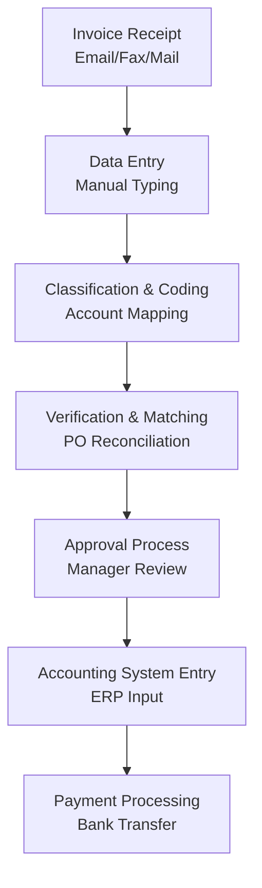
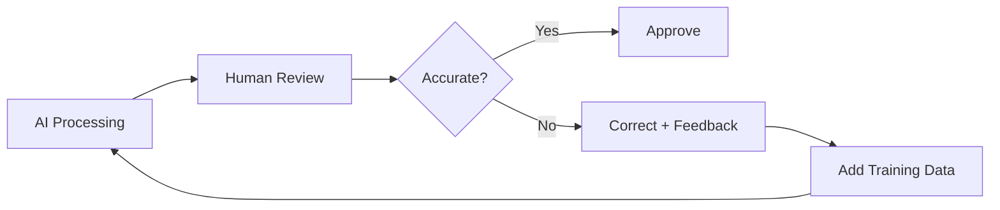
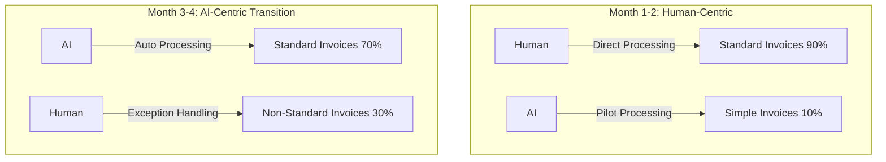
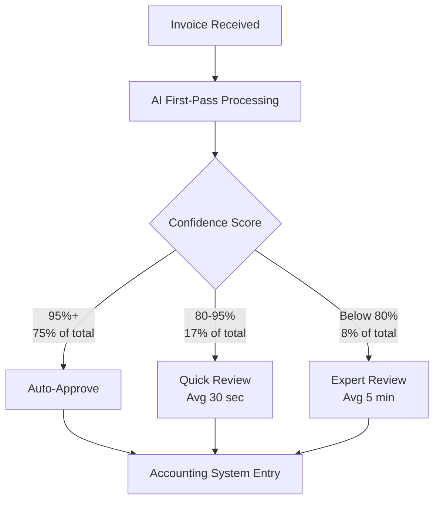

## Overview

"Adopt AI and cut costs by 97%."

Most engineering managers see headlines like this and immediately feel skeptical. I was no different. But when I analyzed the actual data from an accounting firm that operated AI agents for six months, the numbers themselves weren't lies. The journey to reach those numbers, however, was something no vendor demo ever showed.

In this article, I analyze six months of real data from a mid-sized accounting firm (approximately 50 employees) that deployed AI agents for invoice processing. Beyond cost reduction, I examine accuracy changes, the transformation of human roles, and the realistic challenges encountered during the adoption process.

## Pre-Adoption State — The Cost Structure of Manual Invoice Processing

### Existing Process

Invoice processing at accounting firms is more complex than you might think. It's not simply entering numbers — it involves the following steps:



### Baseline Cost Data

| Item | Value |
|------|-------|
| Monthly invoices processed | ~3,000 |
| Average processing time per invoice | 12 min |
| Average cost per invoice | $7.00 |
| Total monthly processing cost | $21,000 |
| Error rate | ~20% (requiring rework) |
| Rework cost | Additional $15 per invoice |

The key figure here is the <strong>20% error rate</strong>. This is not unusual for the industry. It includes everything from simple typos to account classification mistakes and missed PO matches.

## The 6-Month Adoption Journey — Month-by-Month Data Analysis

### Month 1: Pilot Launch and the First Shock

We applied the AI agent to approximately 300 invoices — about 10% of the total volume.

| Metric | Manual | AI | Difference |
|--------|--------|-----|-----------|
| Cost per invoice | $7.00 | $2.50 | -64% |
| Accuracy | 80% | 72% | <strong>-8%</strong> |
| Processing time | 12 min | 3 min | -75% |

<strong>First-month accuracy actually dropped.</strong> This is the part most AI adoption stories hide. The AI model couldn't adapt to the firm's unique invoice formats, vendor-specific patterns, and internal chart of accounts.

### Month 2: Training Data Refinement and Feedback Loop Construction



In month two, we built a feedback loop that channeled human reviewer corrections back into the AI model.

| Metric | Month 1 | Month 2 | Change |
|--------|---------|---------|--------|
| AI processing ratio | 10% | 25% | +15% |
| Cost per invoice | $2.50 | $1.80 | -28% |
| Accuracy | 72% | 81% | <strong>+9%</strong> |
| Human review time | 8 min/invoice | 5 min/invoice | -37% |

### Month 3-4: The Turning Point — Redefining Human and AI Roles

A critical shift occurred in month three. AI accuracy <strong>surpassed human-only processing accuracy (80%)</strong>.

| Metric | Month 3 | Month 4 |
|--------|---------|---------|
| AI processing ratio | 50% | 70% |
| Cost per invoice | $0.90 | $0.55 |
| Accuracy | 88% | 93% |
| Exception cases | 450 | 210 |

At this point, the human role fundamentally changed:

<strong>Before</strong>: Data entry operator → Process every invoice manually
<strong>After</strong>: Exception handling specialist → Handle only non-standard cases AI can't process



### Month 5-6: Stabilization and Final Numbers

| Metric | Month 5 | Month 6 | vs. Pre-Adoption |
|--------|---------|---------|-----------------|
| AI processing ratio | 85% | 92% | — |
| Cost per invoice | $0.30 | <strong>$0.20</strong> | <strong>-97%</strong> |
| Accuracy | 96% | <strong>98%</strong> | <strong>+18%p</strong> |
| Total monthly cost | $900 | $600 | -97% |
| Processing time | 45 sec | 30 sec | -96% |

## The Truth Behind the Numbers — Hidden Costs and Considerations

### Adoption Cost Analysis

The headline figure of "$7→$0.20 per invoice" doesn't include several costs:

| Item | Cost |
|------|------|
| AI platform license (annual) | $24,000 |
| Initial integration development (3 months) | $45,000 |
| Training data refinement labor | $18,000 |
| Employee retraining | $8,000 |
| <strong>Total initial investment</strong> | <strong>$95,000</strong> |

### ROI Calculation

```
Monthly savings: $21,000 - $600 - $2,000 (license) = $18,400
Payback period: $95,000 / $18,400 ≈ 5.2 months
Annual net savings: $18,400 × 12 - $95,000 = $125,800 (Year 1)
Year 2+ annual savings: $18,400 × 12 = $220,800
```

<strong>Investment recovered in 5 months.</strong> An attractive figure, but with one prerequisite: successful role transitions for existing employees without significant attrition during the adoption process.

## The Accuracy Improvement Mechanism — Why AI Became More Accurate Than Humans

### Human Errors vs. AI Errors

Human and AI error patterns are fundamentally different:

| Error Type | Human Frequency | AI Frequency |
|------------|----------------|-------------|
| Simple typing mistakes | High | Near zero |
| Account classification errors | Medium | Low (post-training) |
| PO matching omissions | High | Very low |
| Non-standard format handling | Low | <strong>High</strong> |
| Amount calculation errors | Medium | Near zero |
| Contextual judgment mistakes | Very low | <strong>Medium</strong> |

AI excels overwhelmingly at <strong>repetitive, pattern-based tasks</strong> but still requires humans for <strong>context-dependent, non-standard cases</strong>.

### The Composition of 98% Accuracy

The final 98% accuracy comes not from "AI alone" but from an <strong>AI + Human hybrid system</strong>:



## The Transformation of Human Roles — The Hardest Part

### Staff Composition Changes

| Role | Before | After | Change |
|------|--------|-------|--------|
| Data entry staff | 8 | 0 | -100% |
| Verification staff | 4 | 2 | -50% |
| AI ops/monitoring | 0 | 2 | New |
| Exception specialists | 0 | 3 | New |
| Client consulting | 3 | 8 | +167% |

Total headcount remained at 15. But the <strong>role composition changed completely</strong>. Staff who previously handled simple data entry transitioned to higher-value client consulting roles.

### Resistance and Resolution During Transition

Honestly, this process wasn't smooth:

1. <strong>Phase 1 — Denial (Month 1)</strong>: "AI is trying to take our jobs" was the prevailing sentiment.
2. <strong>Phase 2 — Experimentation (Month 2-3)</strong>: As humans corrected AI errors, staff began understanding AI's limitations.
3. <strong>Phase 3 — Collaboration (Month 4-5)</strong>: Staff realized they could focus on more meaningful work as AI handled routine tasks.
4. <strong>Phase 4 — Ownership (Month 6)</strong>: Employees began proactively suggesting AI improvements.

## Lessons as an Engineering Manager

### 1. Accuracy Always Drops First

Any AI system may perform worse than the existing system during initial deployment. I call this the <strong>"J-Curve Effect."</strong> Pre-briefing executives on this J-curve and securing agreement on a 3-month learning period is critical.

### 2. The Feedback Loop Is Everything

What improves AI model performance isn't the model itself — it's the <strong>quality of the feedback loop</strong>. Invest the most time in building a system where human reviewers accurately classify and feed back AI errors.

### 3. People Problems Are Harder Than Tech Problems

Technical implementation took 3 months. Organizational culture transformation wasn't complete even after 6 months. As an engineering manager, the most important role wasn't writing code — it was addressing team anxiety and presenting a vision for new roles.

### 4. Gradual Adoption Is the Only Right Answer

Incrementally increasing the AI processing ratio — 10% → 25% → 50% → 70% → 92% — was the key to success. Attempting a 100% cutover at once would have killed the project due to initial accuracy drops.

## Expansion Potential to Other Areas

After success with invoice processing, we're evaluating AI adoption for other accounting functions:

| Area | Automation Potential | Expected Cost Reduction | Difficulty |
|------|---------------------|------------------------|------------|
| Expense reporting | High | 85-90% | Low |
| Payroll processing | Medium | 60-70% | Medium |
| Tax filing | Low-Medium | 30-40% | High |
| Audit preparation | Medium | 50-60% | High |
| Financial reporting | Medium-High | 70-80% | Medium |

## Conclusion

AI transformation in accounting firms isn't a "magic button." The cost reduction from $7 to $0.20 is genuinely achievable, but the journey involves initial accuracy drops, employee resistance, feedback system construction, and role redefinition.

As an engineering manager, I want to emphasize three things:

1. <strong>Brace for the J-Curve</strong>: The first 3 months are an investment period.
2. <strong>Invest in People</strong>: Change management matters more than technology.
3. <strong>Let Data Speak</strong>: Transparently sharing monthly metrics builds trust.

The gap between "ideal" and "reality" in AI adoption definitely exists. But bridging that gap requires not a better AI model, but <strong>better processes and a better team</strong>.

## References

- [Gartner - AI in Finance and Accounting 2025](https://www.gartner.com/en/finance/topics/artificial-intelligence-in-finance)
- [McKinsey - The State of AI in 2025](https://www.mckinsey.com/capabilities/quantumblack/our-insights/the-state-of-ai)
- [ACCA - Digital Transformation in Accounting](https://www.accaglobal.com/gb/en/professional-insights/technology/digital-transformation.html)
- [IEEE - Intelligent Document Processing](https://ieeexplore.ieee.org/document/9782342)
