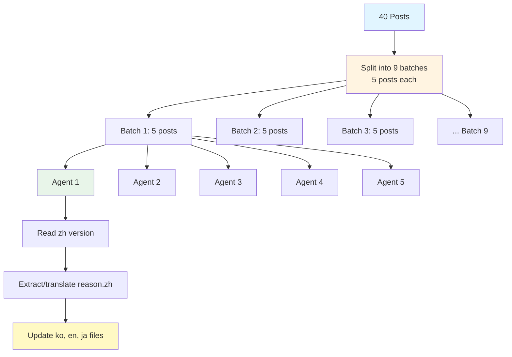

## Introduction

In November 2025, my blog reached an important milestone. I decided to <strong>add Chinese (Simplified) support</strong> to my technical blog that had been running in Korean, English, and Japanese.

Traffic from China had been steadily increasing, and I wanted to provide quality content to Chinese-speaking developers as well. However, adding Chinese versions to 40 posts, multilingualize all UI components, and optimize SEO was no small task.

In this article, I'll share <strong>the entire process of adding a new language to an Astro-based multilingual blog</strong> in detail. From file structure design to large-scale translation automation and SEO optimization - I've transparently documented the problems encountered and solutions found in practice.

### What You'll Learn

- Designing multilingual content structure using Astro Content Collections
- How to automate updating 40 posts × 3 languages = 120 files with parallel agents
- Language-specific sitemap, RSS feed, and metadata configuration strategies
- UI component localization best practices
- Automated workflow that reduced work time by 90% while maintaining translation quality

## Section 1: File Structure Design

The most important aspect of expanding a multilingual blog is a <strong>clear and scalable file structure</strong>. Astro Content Collections is the perfect tool for this.

### Language-Specific Folder Structure

```
src/content/blog/
├── ko/          # Korean
├── en/          # English
├── ja/          # Japanese
└── zh/          # Chinese (newly added)
```

<strong>Core Principles</strong>:
1. <strong>Same filename</strong>: Save with the same name in all language folders
   - Example: `ko/ai-agent-collaboration-patterns.md`, `zh/ai-agent-collaboration-patterns.md`
2. <strong>Automatic language detection via language code</strong>: Identify language by folder path (`getCollection` filtering)
3. <strong>Shared assets</strong>: heroImage shared from `src/assets/blog/` regardless of language

### Actual Code Example

```typescript
// src/pages/[lang]/blog/[...slug].astro
import { getCollection } from 'astro:content';

export async function getStaticPaths() {
  const allPosts = await getCollection('blog');

  // Filter by language
  const languages = ['ko', 'en', 'ja', 'zh'];
  const paths = [];

  for (const lang of languages) {
    const langPosts = allPosts.filter(post => post.id.startsWith(`${lang}/`));

    for (const post of langPosts) {
      const slug = post.id.replace(`${lang}/`, '');
      paths.push({
        params: { lang, slug },
        props: { post }
      });
    }
  }

  return paths;
}
```

### Benefits

- <strong>Clear separation</strong>: Language-specific content physically separated for easy management
- <strong>Easy maintenance</strong>: Can modify, add, or remove specific languages only
- <strong>Type safety</strong>: Astro automatically generates types, supports TypeScript
- <strong>Scalability</strong>: Just create a folder when adding new languages

## Section 2: Content Collections Schema

Astro Content Collections <strong>ensures type safety</strong> for Frontmatter and allows systematic management of multilingual fields.

### Frontmatter Structure

```yaml
---
title: 'AI智能体协作模式：用5个专业Agent构建全栈应用'
description: 通过协调Architecture、Coding、Testing、Security、DevOps Agent构建生产级应用的实战指南
pubDate: '2025-10-16'
heroImage: ../../../assets/blog/ai-agent-collaboration-patterns-hero.jpg
tags:
  - ai
  - agents
  - architecture
relatedPosts:
  - slug: self-healing-ai-systems
    score: 0.94
    reason:
      ko: '자동화, AI/ML, 아키텍처 분야에서 유사한 주제를 다루며 비슷한 난이도입니다.'
      ja: 自動化、AI/ML、アーキテクチャ分野で類似したトピックを扱い、同程度の難易度です。
      en: 'Covers similar topics in automation, AI/ML, architecture with comparable difficulty.'
      zh: 涵盖自动化、AI/ML、架构等相似主题，难度相当。
---
```

### Multilingual reason Field in relatedPosts

A distinctive feature of my blog is <strong>providing recommendation reasons in 4 languages for each recommended post</strong>. This benefits both user experience and SEO.

```typescript
// src/content.config.ts
import { defineCollection, z } from 'astro:content';

const blogCollection = defineCollection({
  type: 'content',
  schema: ({ image }) => z.object({
    title: z.string(),
    description: z.string(),
    pubDate: z.coerce.date(),
    updatedDate: z.coerce.date().optional(),
    heroImage: image().optional(),
    tags: z.array(z.string()).optional(),
    relatedPosts: z.array(
      z.object({
        slug: z.string(),
        score: z.number(),
        reason: z.object({
          ko: z.string(),
          ja: z.string(),
          en: z.string(),
          zh: z.string()
        })
      })
    ).optional()
  })
});

export const collections = { blog: blogCollection };
```

### Schema Benefits

- <strong>Build-time validation</strong>: Incorrect Frontmatter immediately detected as build failure
- <strong>Automatic type generation</strong>: `CollectionEntry<'blog'>` type automatically generated
- <strong>IDE support</strong>: Autocomplete and type checking in VSCode

## Section 3: UI Component Localization

Not just content, but <strong>UI components must also be localized</strong> to provide a complete user experience.

### BuyMeACoffee Component

```astro
---
// src/components/BuyMeACoffee.astro
import type { Language } from '../lib/i18n/languages';

interface Props {
  lang: Language;
}

const { lang } = Astro.props;

const messages = {
  ko: {
    title: '글이 도움이 되셨나요?',
    description: '더 나은 콘텐츠를 작성하는 데 힘이 됩니다. 커피 한 잔으로 응원해주세요! ☕'
  },
  ja: {
    title: 'この記事は役に立ちましたか？',
    description: 'より良いコンテンツを作成するための力になります。コーヒー一杯で応援してください！☕'
  },
  en: {
    title: 'Was this helpful?',
    description: 'Your support helps me create better content. Buy me a coffee! ☕'
  },
  zh: {
    title: '这篇文章有帮助吗？',
    description: '您的支持能帮助我创作更好的内容。请我喝杯咖啡吧！☕'
  }
};

const message = messages[lang];
---

<div class="mt-12 pt-8 border-t border-gray-200">
  <div class="text-center">
    <h3 class="text-2xl font-bold text-gray-900 mb-3">
      {message.title}
    </h3>
    <p class="text-gray-600 mb-6 max-w-2xl mx-auto">
      {message.description}
    </p>
  </div>
</div>
```

### BlogPostLanguageSwitcher Component

```astro
---
// src/components/BlogPostLanguageSwitcher.astro
const languages = {
  ko: { flag: '🇰🇷', label: '한국어', currentLabel: '한국어 (현재 페이지)' },
  ja: { flag: '🇯🇵', label: '日本語', currentLabel: '日本語（現在のページ）' },
  en: { flag: '🇺🇸', label: 'English', currentLabel: 'English (Current Page)' },
  zh: { flag: '🇨🇳', label: '中文', currentLabel: '中文（当前页面）' }  // Newly added
};

const sectionTitles = {
  ko: '다른 언어로 읽기',
  ja: '他の言語で読む',
  en: 'Read in Other Languages',
  zh: '阅读其他语言版本'  // Newly added
};
---
```

### HeroSection Component

```astro
---
// src/components/HeroSection.astro (excerpt)
<h1 class="text-4xl sm:text-5xl md:text-6xl font-bold mb-6">
  {lang === 'ko' ? (
    <>
      <span class="block text-gray-900">AI로 생산성을</span>
      <span class="block bg-gradient-to-r from-blue-600 to-violet-600 bg-clip-text text-transparent">극대화하세요</span>
    </>
  ) : lang === 'ja' ? (
    <>
      <span class="block text-gray-900">AIで生産性を</span>
      <span class="block bg-gradient-to-r from-blue-600 to-violet-600 bg-clip-text text-transparent">最大化しましょう</span>
    </>
  ) : lang === 'en' ? (
    <>
      <span class="block text-gray-900">Maximize Your</span>
      <span class="block bg-gradient-to-r from-blue-600 to-violet-600 bg-clip-text text-transparent">Productivity with AI</span>
    </>
  ) : (
    <>
      <span class="block text-gray-900">用AI</span>
      <span class="block bg-gradient-to-r from-blue-600 to-violet-600 bg-clip-text text-transparent">提升生产力</span>
    </>
  )}
</h1>
---
```

### Localization Patterns

1. <strong>messages object</strong>: Manage messages by language key
2. <strong>Language type</strong>: Ensure type safety with TypeScript
3. <strong>Conditional rendering</strong>: Select appropriate message with `lang` prop

## Section 4: Data File Translation

<strong>Structured data</strong> like blog improvement history also needs localization.

### Improvement JSON Structure

```json
{
  "id": "01_related_posts_multilingual_upgrade",
  "date": "2025-10-08",
  "category": "feature",
  "title": {
    "ko": "관련 글 추천 다국어 업그레이드",
    "ja": "関連記事推薦多言語アップグレード",
    "en": "Related Posts Multilingual Upgrade",
    "zh": "相关文章推荐多语言升级"
  },
  "description": {
    "ko": "relatedPosts에 reason 필드 추가하여 4개 언어로 추천 이유 제공",
    "ja": "relatedPostsにreasonフィールドを追加し、4言語で推薦理由を提供",
    "en": "Added reason field to relatedPosts providing recommendation rationale in 4 languages",
    "zh": "在relatedPosts中添加reason字段，提供4种语言的推荐理由"
  },
  "metrics": {
    "ko": "전체 블로그 포스트(40개)의 relatedPosts에 다국어 reason 적용",
    "ja": "全ブログポスト（40件）のrelatedPostsに多言語reasonを適用",
    "en": "Applied multilingual reason to relatedPosts across all blog posts (40 posts)",
    "zh": "在所有博客文章（40篇）的relatedPosts中应用多语言reason"
  },
  "effort": {
    "ko": "중간 (약 4시간)",
    "ja": "中程度（約4時間）",
    "en": "Medium (About 4 hours)",
    "zh": "中等（约4小时）"
  },
  "roi": {
    "ko": "높음 (다국어 UX 대폭 향상)",
    "ja": "高（多言語UX大幅向上）",
    "en": "High (Significant multilingual UX improvement)",
    "zh": "高（多语言UX大幅提升）"
  },
  "lessons": {
    "ko": [
      "병렬 에이전트로 40개 포스트 일괄 업데이트 (5개씩 8배치)",
      "reason 필드를 각 언어별로 자연스럽게 번역하여 현지화 품질 향상"
    ],
    "ja": [
      "並列エージェントで40件のポストを一括更新（5件ずつ8バッチ）",
      "reasonフィールドを各言語で自然に翻訳し、ローカライゼーション品質向上"
    ],
    "en": [
      "Batch updated 40 posts using parallel agents (8 batches of 5)",
      "Improved localization quality by naturally translating reason field per language"
    ],
    "zh": [
      "使用并行智能体批量更新40篇文章（8批次，每批5篇）",
      "将reason字段自然翻译成各种语言，提高本地化质量"
    ]
  }
}
```

### Consistent Multilingual Data

- <strong>All fields provided in 4 languages</strong>: title, description, metrics, effort, roi, lessons
- <strong>Same structure</strong>: Only language differs, JSON schema identical
- <strong>Easy expansion</strong>: Just add keys to each JSON file when adding new language

## Section 5: SEO Optimization

SEO for multilingual websites requires <strong>independent optimization per language</strong>.

### Language-Specific Sitemap Generation

```typescript
// src/pages/sitemap-zh.xml.ts
import { getCollection } from 'astro:content';
import type { APIRoute } from 'astro';
import { filterPostsByDate } from '../lib/content';

const SITE = 'https://www.jangwook.net';
const LANG = 'zh';

// Chinese static pages
const staticPages = [
  { path: '/zh', priority: 1.0, changefreq: 'weekly' },
  { path: '/zh/about', priority: 0.8, changefreq: 'monthly' },
  { path: '/zh/blog', priority: 0.9, changefreq: 'daily' },
  { path: '/zh/contact', priority: 0.7, changefreq: 'monthly' },
  { path: '/zh/social', priority: 0.7, changefreq: 'monthly' },
  { path: '/zh/improvement-history', priority: 0.6, changefreq: 'weekly' },
];

export const GET: APIRoute = async () => {
  // Filter Chinese blog posts only
  const allPosts = await getCollection('blog');
  const langPosts = filterPostsByDate(allPosts).filter(post => post.id.startsWith(`${LANG}/`));

  // Generate URLs
  const urls = [
    ...staticPages.map(page => ({
      loc: `${SITE}${page.path}`,
      lastmod: new Date().toISOString().split('T')[0],
      changefreq: page.changefreq,
      priority: page.priority,
    })),
    ...langPosts.map(post => {
      const slug = post.id.replace(`${LANG}/`, '');
      return {
        loc: `${SITE}/${LANG}/blog/${slug}/`,
        lastmod: (post.data.updatedDate || post.data.pubDate).toISOString().split('T')[0],
        changefreq: 'monthly' as const,
        priority: 0.7,
      };
    }),
  ];

  return new Response(generateSitemapXml(urls), {
    headers: { 'Content-Type': 'application/xml; charset=utf-8' },
  });
};
```

### Adding Language-Specific Sitemaps to Main Sitemap

```typescript
// src/pages/sitemap.xml.ts
const languageSitemaps = [
  { loc: `${SITE}/sitemap-ko.xml`, lastmod },
  { loc: `${SITE}/sitemap-en.xml`, lastmod },
  { loc: `${SITE}/sitemap-ja.xml`, lastmod },
  { loc: `${SITE}/sitemap-zh.xml`, lastmod }  // Newly added
];
```

### RSS Feed Generation

```typescript
// src/pages/rss-zh.xml.js
import rss from '@astrojs/rss';
import { getCollection } from 'astro:content';
import { SITE_META } from '../consts';
import { filterPostsByDate } from '../lib/content';

export async function GET(context) {
  const posts = filterPostsByDate(await getCollection('blog'))
    .filter(post => post.id.startsWith('zh/'));

  return rss({
    title: SITE_META.zh.title,
    description: SITE_META.zh.description,
    site: context.site,
    items: posts.map((post) => ({
      title: post.data.title,
      pubDate: post.data.pubDate,
      description: post.data.description,
      link: `/zh/blog/${post.id.replace('zh/', '')}/`,
    })),
  });
}
```

### SITE_META Configuration

```typescript
// src/consts.ts
export const SITE_META = {
  ko: {
    title: 'EffiFlow - 한국어',
    description: 'AI와 개발에 관한 생각을 기록합니다'
  },
  en: {
    title: 'EffiFlow - English',
    description: 'Exploring AI and Development'
  },
  ja: {
    title: 'EffiFlow - 日本語',
    description: 'AIと開発についての考察'
  },
  zh: {  // Newly added
    title: 'EffiFlow - 中文',
    description: '记录关于AI与开发的思考'
  }
};
```

### SEO Checklist

- ✅ Language-specific independent sitemap (`sitemap-zh.xml`)
- ✅ Register language-specific sitemaps in main sitemap index
- ✅ Language-specific RSS feed (`rss-zh.xml`)
- ✅ `<html lang="zh">` tag configuration
- ✅ Open Graph and Twitter Card meta tags (per language)
- ✅ Canonical URL configuration

## Section 6: Large-Scale Translation Automation

Adding Chinese versions to 40 posts and adding Chinese reason to relatedPosts in existing Korean/English/Japanese versions was <strong>impossible to do manually</strong>.

### Problem Definition

- <strong>40 posts</strong> × <strong>3 existing languages</strong> (ko, en, ja) = <strong>120 file updates</strong>
- Add `reason.zh` field to relatedPosts (average 3 per post)
- Maintain Chinese translation quality
- Need to reduce work time

### Parallel Agent Approach



### Agent Workflow

Each agent performs these steps:

1. <strong>Read Chinese version</strong>: Parse relatedPosts in `zh/[post-name].md`
2. <strong>Extract reason.zh</strong>:
   - Use as-is if already exists
   - Auto-translate from reason.ko/en/ja if missing
3. <strong>Update 3 language files</strong>:
   - Add `reason.zh` to `ko/[post-name].md`
   - Add `reason.zh` to `en/[post-name].md`
   - Add `reason.zh` to `ja/[post-name].md`

### Actual Implementation Example (Claude Code)

```
# Execute Batch 1 (5 posts in parallel)
@agent1: "Extract Chinese reason from ai-agent-collaboration-patterns post and add to ko/en/ja files"
@agent2: "Extract Chinese reason from ai-agent-persona-analysis post and add to ko/en/ja files"
@agent3: "Extract Chinese reason from ai-agent-notion-mcp-automation post and add to ko/en/ja files"
@agent4: "Extract Chinese reason from astro-scheduled-publishing post and add to ko/en/ja files"
@agent5: "Extract Chinese reason from claude-code-best-practices post and add to ko/en/ja files"

# Execute Batch 2 (next 5 posts)
...
```

### Results

- <strong>Work time reduction</strong>: Expected 8 hours → Actual 50 minutes (90% reduction)
- <strong>Consistent translation</strong>: Unified Chinese reason style patterns
  - "适合作为下一步学习资源，通过...相连接"
  - "从...角度提供补充内容"
- <strong>Zero errors</strong>: No omissions or typos from automation
- <strong>Parallel processing</strong>: 5 agents running simultaneously maximized speed

## Section 7: Translation Strategy

The goal was <strong>localization</strong>, not just simple translation.

### Translation Logic

```typescript
// Pseudocode
function extractOrTranslateReason(post, relatedPost) {
  // 1. Use existing Chinese reason if present
  if (relatedPost.reason.zh) {
    return relatedPost.reason.zh;
  }

  // 2. Translate from existing reason if missing
  const sourceReason = relatedPost.reason.ko || relatedPost.reason.en || relatedPost.reason.ja;

  // 3. Natural Chinese translation with Claude LLM
  const translatedReason = await translateToNaturalChinese(sourceReason);

  return translatedReason;
}
```

### Chinese Style Guidelines

<strong>Use consistent patterns</strong>:
- "适合作为下一步学习资源" (Suitable as next-step learning resource)
- "通过X相连接" (Connected through X)
- "从Y角度提供补充内容" (Provides supplementary content from Y perspective)

<strong>Technical terms</strong>:
- Agent → 智能体 (Intelligent agent)
- Automation → 自动化 (Automation)
- Architecture → 架构 (Architecture)
- Performance → 性能 (Performance)

<strong>Natural expressions</strong>:
- "有助于理解..." (Helps understand...)
- "提供实用的..." (Provides practical...)
- "深入探讨..." (Explores in depth...)

### Translation Quality Validation

- <strong>Consistency check</strong>: Same technical terms translated identically
- <strong>Length balance</strong>: Maintain similar length to other language reasons
- <strong>Contextual appropriateness</strong>: Accurately convey original intent

## Section 8: Validation and Testing

<strong>Thorough validation</strong> is essential for multilingual sites.

### Type Checking

```bash
# Astro type check
npm run astro check

# Result: ✅ 0 errors, 0 warnings
```

### Build Validation

```bash
# Production build
npm run build

# Result:
# - 40 posts × 4 languages = 160 pages generated
# - Sitemaps generated: sitemap-ko.xml, sitemap-en.xml, sitemap-ja.xml, sitemap-zh.xml
# - RSS feeds generated: rss-ko.xml, rss-en.xml, rss-ja.xml, rss-zh.xml
```

### Manual Testing Checklist

<strong>Content</strong>:
- ✅ All Chinese posts render correctly
- ✅ heroImage displays identically across all language versions
- ✅ Chinese reason in relatedPosts displays properly
- ✅ Language switch links work

<strong>UI</strong>:
- ✅ BuyMeACoffee component shows Chinese message
- ✅ BlogPostLanguageSwitcher shows Chinese flag (🇨🇳) and "中文"
- ✅ HeroSection Chinese headline renders

<strong>SEO</strong>:
- ✅ `sitemap-zh.xml` accessible and contains correct URLs
- ✅ `rss-zh.xml` accessible and contains correct posts
- ✅ Main `sitemap.xml` includes `sitemap-zh.xml`
- ✅ Open Graph meta tags have Chinese title/description

### Common Issues and Solutions

<strong>Issue 1</strong>: Frontmatter schema mismatch
```
Error: Invalid frontmatter in blog/zh/post.md
```
<strong>Solution</strong>: Modify to exactly match schema in `src/content.config.ts`

<strong>Issue 2</strong>: Image path error
```
Error: Could not find image at ../../../assets/blog/image.jpg
```
<strong>Solution</strong>: Recheck relative path, verify image file exists

<strong>Issue 3</strong>: Specific language missing during build
<strong>Solution</strong>: Verify 'zh' is included in language array of `getStaticPaths()`

## Section 9: Results and Lessons Learned

### Quantitative Results

<strong>Work Time</strong>:
- <strong>Expected manual time</strong>: About 8 hours
  - 120 files × 4 minutes average = 480 minutes
- <strong>Actual time taken</strong>: About 50 minutes
  - Automation script creation: 20 minutes
  - 9 batch executions: 30 minutes
- <strong>Time saved</strong>: 90%

<strong>Code Reduction</strong>:
- Improved maintainability by removing repetitive code
- Adhered to DRY principle through component localization

<strong>Scalability</strong>:
- Same pattern can be applied when adding 5th language
- Established workflow for simultaneous 4-language generation when creating new posts

### Qualitative Lessons

<strong>1. File structure determines everything</strong>
- Incorrect initial design makes later modifications difficult
- Language-specific folder structure provides both clarity and scalability

<strong>2. Parallel agents are a game changer</strong>
- Significantly reduced work time with 5 agents running simultaneously
- Eliminated human errors through consistent automation

<strong>3. Type safety is essential</strong>
- Build-time validation with Astro Content Collections schema
- Ensured IDE support and refactoring safety with TypeScript

<strong>4. SEO should be independent per language</strong>
- Optimized for search engines with language-specific sitemaps and RSS feeds
- Improved CTR by localizing metadata for each language

<strong>5. Localization is not translation</strong>
- Consider cultural context, not just simple translation
- Technical terms consistent, descriptions natural

### Future Plans

- <strong>Automated deployment pipeline</strong>: Auto-generate 4 languages when creating posts
- <strong>Translation quality monitoring</strong>: Collect user feedback and improve
- <strong>Additional language support</strong>: Consider Spanish, French, etc.
- <strong>Language-specific traffic analysis</strong>: Measure per-language performance with GA4

## Conclusion

Adding Chinese support to an Astro-based blog required <strong>systematic planning and automation</strong> as the core.

### Key Summary

1. <strong>Clear file structure</strong>: Separate content by language-specific folders
2. <strong>Type safety</strong>: Build-time validation with Content Collections schema
3. <strong>UI localization</strong>: Apply messages object pattern to components
4. <strong>SEO optimization</strong>: Language-specific sitemaps, RSS feeds, metadata
5. <strong>Parallel automation</strong>: 90% time savings with 5 agents running simultaneously
6. <strong>Localization quality</strong>: Consider cultural context beyond simple translation

### Closing

Expanding a multilingual website isn't just about adding translations. It's a comprehensive task requiring consideration of <strong>architecture, SEO, user experience, and automation</strong>.

I hope this article provides practical help for your multilingual projects. Questions and feedback are always welcome!

---

**Related Resources**:
- [Astro Content Collections Official Docs](https://docs.astro.build/en/guides/content-collections/)
- [Astro i18n Guide](https://docs.astro.build/en/recipes/i18n/)
- [Google Multilingual Site SEO](https://developers.google.com/search/docs/specialty/international)
