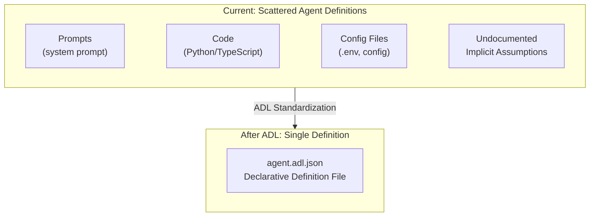
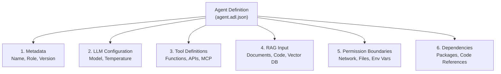
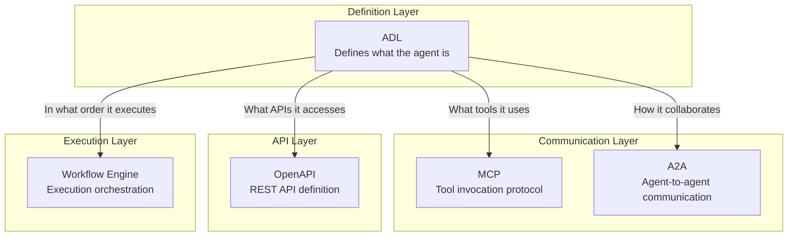
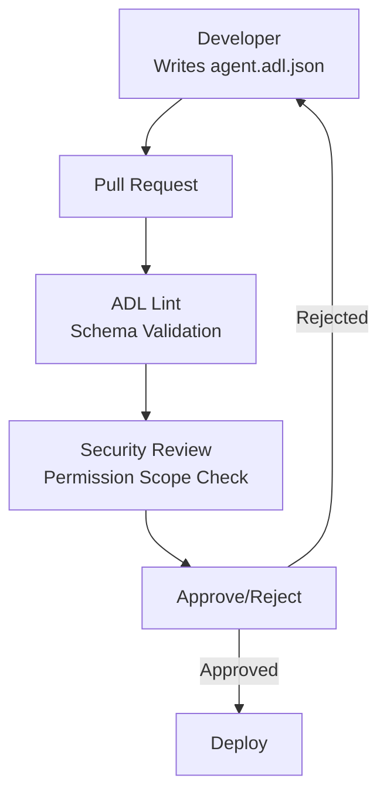
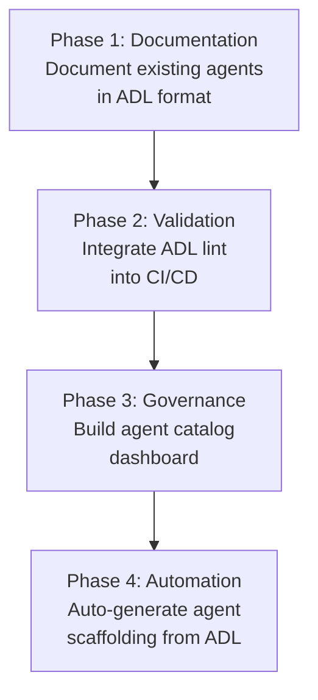

## Overview

The AI agent ecosystem is exploding in 2026, but one critical problem persists: <strong>agent definitions are scattered across code, prompts, and configuration files, making it impossible to understand exactly what an agent can do at a glance</strong>.

<strong>Agent Definition Language (ADL)</strong>, released by Next Moca under Apache 2.0 license, addresses this head-on. Just as OpenAPI (Swagger) declaratively defined "what an API does" in the API world, ADL is a vendor-neutral standard that declaratively defines "what an AI agent does."

This article breaks down ADL's core architecture, its relationship to existing standards (MCP, OpenAPI, A2A), and governance strategies that Engineering Managers and CTOs should prioritize.

## The Problems ADL Solves

Currently, most organizations manage AI agents in a fragmented state:



Specifically, ADL solves these problems:

- <strong>Lack of Visibility</strong>: Impossible to quickly understand what tools an agent accesses and what data it uses
- <strong>Governance Gaps</strong>: Security teams cannot pre-audit agent permissions
- <strong>Reproducibility Issues</strong>: Cannot track "which version was deployed with which configuration"
- <strong>Cross-team Communication Breakdown</strong>: Development, security, and compliance teams cannot discuss agents in a common language

## ADL's Core Architecture

ADL is JSON Schema-based and declaratively defines agents through six modules:



### 1. Agent Metadata

```json
{
  "name": "code-review-agent",
  "displayName": "Code Review Assistant",
  "description": "Agent for automated code review on pull requests",
  "role": "Code quality inspection and improvement suggestions",
  "version": "2.1.0",
  "owner": "platform-team@company.com",
  "created": "2026-01-15T09:00:00Z",
  "modified": "2026-02-28T14:30:00Z"
}
```

Through semantic versioning and owner information, you can immediately grasp <strong>who manages this agent and which version is running in production</strong>.

### 2. LLM Configuration

```json
{
  "llm": {
    "provider": "anthropic",
    "model": "claude-opus-4-6",
    "parameters": {
      "temperature": 0.3,
      "maxTokens": 4096
    }
  }
}
```

By explicitly declaring the LLM provider and model, you can track change history when swapping models and detect performance regressions.

### 3. Tool Definitions

```json
{
  "tools": [
    {
      "name": "github_pr_review",
      "description": "Retrieves changes from a GitHub PR and creates review comments",
      "invocationType": "mcp",
      "category": "Code Review",
      "parameters": [
        {
          "name": "pr_url",
          "type": "string",
          "description": "URL of the PR to review",
          "required": true
        },
        {
          "name": "review_depth",
          "type": "string",
          "description": "Review depth (quick|standard|deep)",
          "required": false
        }
      ],
      "returnType": "ReviewResult"
    }
  ]
}
```

By specifying each tool's invocation method (Python function, HTTP, MCP, etc.) and parameters, security teams can pre-review <strong>the complete list of external systems an agent can access</strong>.

### 4. Permission Boundaries

```json
{
  "permissions": {
    "networkAccess": {
      "allowed": true,
      "domainWhitelist": [
        "api.github.com",
        "api.anthropic.com"
      ]
    },
    "fileAccess": {
      "readPaths": ["/workspace/src/**"],
      "writePaths": ["/workspace/reviews/**"]
    },
    "environmentVariables": {
      "exposed": ["GITHUB_TOKEN", "ANTHROPIC_API_KEY"]
    },
    "sandbox": {
      "enabled": true,
      "constraints": ["no-internet-except-whitelist"]
    }
  }
}
```

This is ADL's most powerful feature. By defining network access, filesystem, and environment variable exposure scope through <strong>declarative specifications instead of code</strong>, automatic validation becomes possible in CI/CD pipelines.

## ADL and Existing Standards

ADL does not replace existing standards but rather complements them as a <strong>"definition layer"</strong>:



| Standard | Role | Relationship to ADL |
|----------|------|-------------------|
| <strong>OpenAPI</strong> | REST API definition | API tool specs that ADL references |
| <strong>MCP</strong> | Tool invocation protocol | ADL declares "which MCP servers it uses" |
| <strong>A2A</strong> | Agent-to-agent communication | ADL defines "which agents it collaborates with" |
| <strong>Workflow Engine</strong> | Execution order management | ADL handles static definition only; runtime is separate |

The key difference is that <strong>ADL is a static specification, not a runtime protocol</strong>. It provides the "blueprint" for an agent, while actual execution is handled by runtime protocols like MCP or A2A.

## From EM/CTO Perspective: ADL-Based Governance Strategy

### 1. Integrate ADL Validation into CI/CD Pipelines



Using ADL's JSON Schema, you can automatically validate before agent deployment:

- Whether the network whitelist complies with policy
- Whether file access scope adheres to least privilege principle
- Whether the LLM model is on an approved list
- Whether all required metadata (owner, version) are provided

### 2. Build an Agent Catalog

By managing ADL definitions of all agents in your organization in a central repository, you can automatically build an <strong>agent catalog</strong>:

```json
{
  "catalog": [
    {
      "name": "code-review-agent",
      "version": "2.1.0",
      "owner": "platform-team",
      "tools": ["github_pr_review", "jira_comment"],
      "llm": "claude-opus-4-6",
      "riskLevel": "medium"
    },
    {
      "name": "deployment-agent",
      "version": "1.0.3",
      "owner": "devops-team",
      "tools": ["kubectl_apply", "slack_notify"],
      "llm": "gpt-5.3-codex",
      "riskLevel": "high"
    }
  ]
}
```

This enables CTOs to see at a glance via dashboard: "How many agents are currently running in our organization, and what system access permissions does each have?"

### 3. Change History and Rollback

Since ADL files are version-controlled in Git:

- <strong>Change History</strong>: Diff shows "when this agent's permissions were expanded"
- <strong>Rollback</strong>: Recover instantly to a previous ADL definition if issues arise
- <strong>Audit Trail</strong>: Gather evidence for compliance requirements

## Real-World Scenario: Defining a Code Review Agent

A complete example of defining a code review agent with ADL in an actual organization:

```json
{
  "name": "code-review-agent",
  "displayName": "Code Review Agent",
  "description": "Automatically detects code quality issues, security vulnerabilities, and performance problems in pull requests",
  "role": "senior-code-reviewer",
  "version": "2.1.0",
  "owner": "platform-team@company.com",
  "llm": {
    "provider": "anthropic",
    "model": "claude-opus-4-6",
    "parameters": {
      "temperature": 0.2,
      "maxTokens": 8192
    }
  },
  "tools": [
    {
      "name": "github_pr_diff",
      "invocationType": "mcp",
      "category": "Code Review",
      "parameters": [
        {"name": "pr_number", "type": "integer", "required": true}
      ]
    },
    {
      "name": "sonarqube_scan",
      "invocationType": "http",
      "category": "Code Quality",
      "parameters": [
        {"name": "project_key", "type": "string", "required": true}
      ]
    }
  ],
  "rag": [
    {
      "name": "coding-standards",
      "type": "documents",
      "location": "s3://company-docs/coding-standards/",
      "description": "Company coding standards documentation"
    }
  ],
  "permissions": {
    "networkAccess": {
      "allowed": true,
      "domainWhitelist": [
        "api.github.com",
        "sonarqube.internal.company.com"
      ]
    },
    "fileAccess": {
      "readPaths": ["/workspace/**"],
      "writePaths": []
    },
    "sandbox": {"enabled": true}
  },
  "dependencies": {
    "packages": ["pygithub>=2.0", "requests>=2.31"]
  },
  "governance": {
    "created": "2026-01-15T09:00:00Z",
    "createdBy": "kim.jangwook@company.com",
    "modified": "2026-02-28T14:30:00Z",
    "modifiedBy": "kim.jangwook@company.com",
    "changeLog": "v2.1.0: Added SonarQube integration, expanded security scan coverage"
  }
}
```

## Adoption Roadmap

Since ADL is still in early stages, a phased adoption approach is realistic:



- <strong>Phase 1</strong> (1-2 weeks): Document currently running agents in ADL format
- <strong>Phase 2</strong> (2-4 weeks): Add JSON Schema validation to CI pipeline
- <strong>Phase 3</strong> (1-2 months): Build agent catalog and permission dashboard
- <strong>Phase 4</strong> (3-6 months): Auto-generate agent scaffolding from ADL definitions

## Conclusion

ADL adds an important layer of <strong>"declarative definition separate from code"</strong> to AI agent development. Just as OpenAPI standardized the REST API ecosystem, ADL has the potential to solve visibility, governance, and reproducibility problems in the agent ecosystem.

For Engineering Managers and CTOs particularly:

- <strong>Security Governance</strong>: Pre-audit agent permissions like code reviews
- <strong>Organizational Visibility</strong>: Enterprise-wide AI asset understanding through agent catalog
- <strong>Change Management</strong>: Git-based version control enables audit trails and rollback support

Though still in early stages, it's a good time to start paying attention to and considering pilot deployments of this Apache 2.0-licensed open source standard.

## References

- [ADL GitHub Repository (Next Moca)](https://github.com/nextmoca/adl)
- [ADL Official Blog — Next Moca](https://www.nextmoca.com/blogs/agent-definition-language-adl-the-open-source-standard-for-defining-ai-agents)
- [InfoQ — Next Moca Releases Agent Definition Language](https://www.infoq.com/news/2026/02/agent-definition-language/)
- [TechCrunch — Guide Labs Debuts Interpretable LLM](https://techcrunch.com/2026/02/23/guide-labs-debuts-a-new-kind-of-interpretable-llm/)
