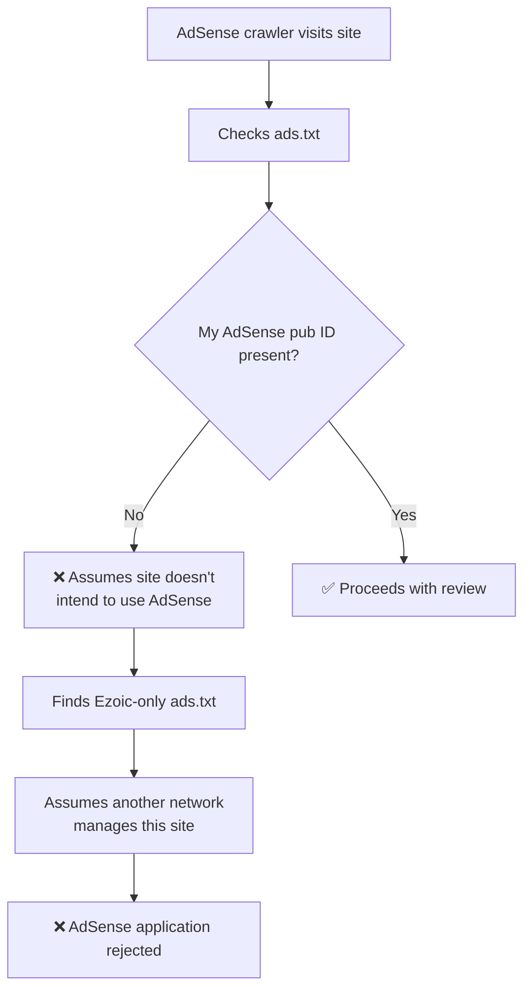
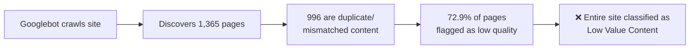
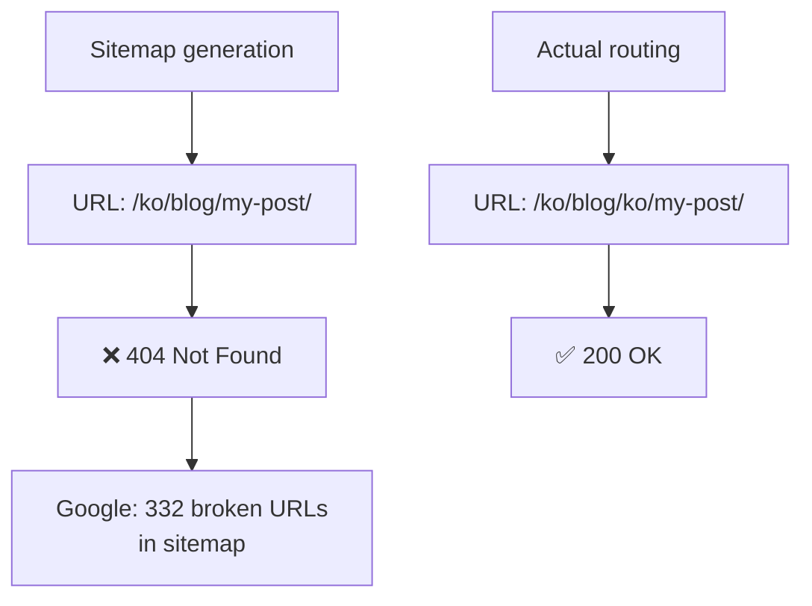
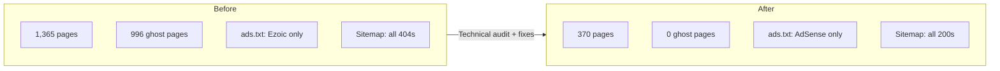

## Overview

Have you ever applied to Google AdSense only to be rejected for **"Low Value Content"**—again and again? That's exactly what happened to me. And this was on a blog with 83 posts in 4 languages (Korean, English, Japanese, Chinese), totaling over 316 technical articles.

The problem wasn't the content itself. **Technical defects in the site were making Google see it as a "low-quality site."** In this post, I'll share the 8 issues I discovered and fixed. I hope this serves as a practical guide for other developers facing the same challenge.

## Background: Why Was I Rejected?

This blog is a multilingual technical blog built with [Astro](https://astro.build).

- **Content**: 83 posts × 4 languages = 316+ technical articles
- **Required pages**: Privacy policy, terms of service, and contact page—all in place
- **Tech stack**: Astro SSG, Cloudflare Pages, Content Collections

On the surface, all the requirements for AdSense approval were met. But every application returned the same response:

> **"Low Value Content"** — Your site does not have enough useful content.

After conducting a full technical audit, I found that **3 critical technical defects**, not the content quality, were the root cause. I also discovered 5 additional issues.

## Critical Issue 1: Ezoic ads.txt Conflict (The Most Direct Cause)

### Discovery

When I checked the live site's `ads.txt`, my AdSense entry was missing. Instead, there were 80+ ad network entries managed by Ezoic.

```bash
# Check live ads.txt
curl https://jangwook.net/ads.txt | head -5
# → Only 80+ Ezoic-managed entries
# → My AdSense pub ID was nowhere to be found
```

### Root Cause

There was this line in the GitHub Actions `deploy.yml`:

```yaml
# deploy.yml (problematic code)
- name: Build
  run: |
    # ... build commands ...
    curl -L https://srv.adstxtmanager.com/19390/jangwook.net > public/ads.txt
```

On every build, Ezoic's `adstxtmanager` downloaded and **overwrote** the `ads.txt`. The local `public/ads.txt` had the correct Google AdSense entry, but it was completely replaced during deployment.

```
# Local public/ads.txt (correct content)
google.com, pub-7556938384772610, DIRECT, f08c47fec0942fa0

# Live site ads.txt (after deployment — overwritten by Ezoic)
# → 80+ ad network entries
# → pub-7556938384772610 not present!
```

**Additionally**, three Ezoic CMP/ad scripts were loading on every page via `BaseHead.astro`:

```astro
<!-- BaseHead.astro (problematic scripts) -->
<script src="https://the.gatekeeperconsent.com/cmp.min.js" data-cfasync="false"></script>
<script src="https://cdn.ezoic.net/ezoicplugin.js"></script>
<script src="https://www.ezojs.com/ezoic/sa.min.js"></script>
```

### How Google Sees This

From the AdSense crawler's perspective:



If AdSense doesn't find its pub ID in the site's `ads.txt`, it assumes the site either has **no intention to use AdSense or is already managed by another service**.

### Fix

1. Remove the Ezoic `ads.txt` download line from `deploy.yml`
2. Remove all 3 Ezoic scripts from `BaseHead.astro`
3. Keep only the correct AdSense entry in `public/ads.txt`

```yaml
# deploy.yml (fixed)
- name: Build
  run: |
    npm run build
    # curl line completely removed — uses local public/ads.txt as-is
```

```
# public/ads.txt (fixed)
google.com, pub-7556938384772610, DIRECT, f08c47fec0942fa0
```

## Critical Issue 2: URL Routing Bug Creates 996 Ghost Pages

### Discovery

Analyzing the build logs revealed **1,365 pages** being generated. With 83 posts × 4 languages = 332, the static page count was abnormally high.

### Root Cause

The issue was in `[...slug].astro`'s `getStaticPaths` function:

```typescript
// [...slug].astro (problematic code)
export async function getStaticPaths() {
  const posts = await getCollection("blog");
  const languages = ["ko", "en", "ja", "zh"];

  return languages.flatMap((lang) =>
    posts.map((post) => ({
      params: { slug: post.slug }, // post.slug = "ko/my-post-title"
      props: { post, lang },
    }))
  );
}
```

The problem: this code **maps every post to every language route**. Since `post.slug` already includes a language prefix (e.g., `ko/`, `en/`), mapping it across all 4 language routes created massive **cross-language URLs**.

```
# Valid URLs (332)
/ko/blog/ko/my-post/     ← Korean route, Korean content ✅
/en/blog/en/my-post/     ← English route, English content ✅

# Ghost URLs (996) — language mismatch
/en/blog/ko/my-post/     ← English route, Korean content ❌
/ja/blog/ko/my-post/     ← Japanese route, Korean content ❌
/zh/blog/en/my-post/     ← Chinese route, English content ❌
# ... 996 such combinations generated
```

### How Google Sees This



Google evaluates the overall content quality of a site. When **~73% of all pages are language-mismatched duplicates**, classifying the entire site as "low value content" is the expected outcome.

### Fix

Each post is now mapped only to its matching language route:

```typescript
// [...slug].astro (fixed)
export async function getStaticPaths() {
  const posts = await getCollection("blog");

  return posts.map((post) => ({
    params: { slug: post.slug }, // "ko/my-post-title" mapped to its language route only
    props: { post },
  }));
}
```

**Result**: Build pages reduced from **1,365 → 370** (995 ghost pages eliminated)

## Critical Issue 3: Sitemap-Wide 404s

### Discovery

After submitting the sitemap in Google Search Console, very few pages were being indexed. Manually visiting the sitemap URLs in a browser confirmed they **all returned 404**.

### Root Cause

A format mismatch between the sitemap generation logic and the actual routing:

```
# URLs in the sitemap
https://jangwook.net/ko/blog/my-post-title/

# Actual page URLs (double language prefix)
https://jangwook.net/ko/blog/ko/my-post-title/
```

The sitemap generated URLs as `/{lang}/blog/{slug}/`, but since `slug` already contained a language prefix like `ko/`, the actual URLs were `/{lang}/blog/{lang}/{slug}/`. **All 332 blog URLs in the sitemap returned 404.**



### Fix

Updated the sitemap generation logic to account for the language prefix in slugs:

```typescript
// Sitemap configuration (fixed)
// Since slug is already "ko/my-post" format, use it as-is
const url = `/${lang}/blog/${post.slug}/`;
// → /ko/blog/ko/my-post/ (matches actual path)
```

## Secondary Issue 4: Identical Machine Translation Structure

### Problem

**39%** of the 83 posts (~32 posts) had perfectly identical H2/H3 heading counts and code block counts across all 4 language versions. Google can interpret this as **automatically generated content through machine translation**.

### Fix

Rather than rewriting all content, the effective approach was explicitly telling Google **"these are official translations of the same content"**:

```html
<!-- Properly configured hreflang -->
<link rel="alternate" hreflang="ko" href="https://jangwook.net/ko/blog/ko/my-post/" />
<link rel="alternate" hreflang="en" href="https://jangwook.net/en/blog/en/my-post/" />
<link rel="alternate" hreflang="ja" href="https://jangwook.net/ja/blog/ja/my-post/" />
<link rel="alternate" hreflang="zh" href="https://jangwook.net/zh/blog/zh/my-post/" />
<link rel="alternate" hreflang="x-default" href="https://jangwook.net/en/blog/en/my-post/" />
```

Properly configured hreflang tags tell Google to treat each language page as an **independent translation**, avoiding duplicate content penalties.

## Secondary Issue 5: Contact Page Invisible to Crawlers

### Problem

The contact page consisted solely of a Google Form `<iframe>`. Since crawlers can't read iframe content, this page was **effectively empty**.

```html
<!-- Original contact page (empty to crawlers) -->
<iframe
  src="https://docs.google.com/forms/d/e/..."
  width="100%"
  height="800"
></iframe>
```

### Fix

Added structured, crawler-readable content:

```html
<!-- Fixed contact page -->
<section>
  <h1>Contact</h1>
  <p>I'm Jangwook Kim, the author of this technical blog. Feel free to reach out:</p>

  <h2>Email</h2>
  <a href="mailto:contact@jangwook.net">contact@jangwook.net</a>

  <h2>Social</h2>
  <ul>
    <li><a href="https://github.com/...">GitHub</a></li>
    <li><a href="https://twitter.com/...">Twitter</a></li>
  </ul>

  <h2>About This Blog</h2>
  <p>Technical content on AI automation, web development, and DevOps.</p>
</section>

<!-- Google Form maintained below -->
<iframe src="https://docs.google.com/forms/d/e/..." width="100%" height="800"></iframe>
```

## Secondary Issue 6: hreflang x-default Error

### Problem

Blog posts' `x-default` pointed to incorrect URLs. While English was set as the default language, the URL conversion didn't transform the language code within the blog path, resulting in **English URLs linking to Korean content**.

```html
<!-- Incorrect x-default -->
<link rel="alternate" hreflang="x-default"
  href="https://jangwook.net/en/blog/ko/my-post/" />
<!-- → English route but points to Korean content ❌ -->
```

### Fix

Updated the hreflang generation logic to also convert the language code inside the blog path:

```typescript
// hreflang URL generation (fixed)
function getAlternateUrl(currentUrl: string, targetLang: string): string {
  // Convert URL path language prefix
  let url = currentUrl.replace(/^\/(ko|en|ja|zh)\//, `/${targetLang}/`);
  // Also convert the language prefix inside the blog slug
  url = url.replace(/\/blog\/(ko|en|ja|zh)\//, `/blog/${targetLang}/`);
  return url;
}
```

## Secondary Issue 7: Self-Referential Meta-Analysis Posts

### Problem

Six blog operations reports (weekly analytics, monthly analytics, AdSense rejection analysis, etc.) existed on the site. These posts are **self-referential analysis of the blog itself**, offering no value to external visitors and qualifying as "self-referential low-value content."

### Fix

Applied `noindex` meta tags to exclude these posts from search engine indexing:

```html
<!-- noindex applied to meta-analysis posts -->
<meta name="robots" content="noindex, follow" />
```

This prevents Google from indexing these pages, excluding them from the site's overall content quality assessment. The `follow` directive is maintained to allow crawling via internal links.

## Secondary Issue 8: Other Technical Fixes

A summary of the remaining issues and their fixes.

### 8-1. No Custom 404 Page

A missing custom 404 page meant users saw blank pages or server default errors on invalid URLs.

```astro
---
// src/pages/404.astro — Multilingual 404 page
const lang = Astro.currentLocale || "en";
const messages = {
  ko: { title: "페이지를 찾을 수 없습니다", back: "홈으로 돌아가기" },
  en: { title: "Page Not Found", back: "Go back home" },
  ja: { title: "ページが見つかりません", back: "ホームに戻る" },
  zh: { title: "页面未找到", back: "返回首页" },
};
---
<h1>{messages[lang].title}</h1>
<a href={`/${lang}/`}>{messages[lang].back}</a>
```

### 8-2. og:type Not Differentiated

All pages had `og:type` set to `"website"`. Blog posts should use `"article"`.

```astro
<!-- Fixed -->
<meta property="og:type" content={isPost ? "article" : "website"} />
```

### 8-3. Sitemap Link Mismatch

The sitemap filename referenced in `robots.txt` differed from the actual file.

```
# robots.txt (before)
Sitemap: https://jangwook.net/sitemap-index.xml

# Actual file: /sitemap.xml

# robots.txt (after)
Sitemap: https://jangwook.net/sitemap.xml
```

### 8-4. Missing Chinese RSS hreflang

The Korean, English, and Japanese RSS feeds had proper hreflang, but Chinese (zh) was missing.

### 8-5. Cross-Language URL Blocking in robots.txt

Since cross-language URLs may have already been indexed before the fix, blocking rules were added to `robots.txt`:

```
# Added to robots.txt
Disallow: /en/blog/ko/
Disallow: /en/blog/ja/
Disallow: /en/blog/zh/
Disallow: /ko/blog/en/
Disallow: /ko/blog/ja/
Disallow: /ko/blog/zh/
Disallow: /ja/blog/ko/
Disallow: /ja/blog/en/
Disallow: /ja/blog/zh/
Disallow: /zh/blog/ko/
Disallow: /zh/blog/en/
Disallow: /zh/blog/ja/
```

## Before and After Comparison


Here are the results after applying all fixes:

| Item | Before | After |
|------|--------|-------|
| Build pages | 1,365 | 370 |
| Ghost pages | 996 | 0 |
| ads.txt status | 80+ Ezoic entries | 1 AdSense entry |
| Sitemap 404 URLs | 332 | 0 |
| hreflang x-default errors | All posts | 0 |
| Self-referential posts indexed | 6 | noindex applied |
| Low-quality content ratio | ~73% | ~0% |



## Checklist for Multilingual Blog Operators

Based on this experience, here's a technical checklist to review before applying for AdSense:

### ads.txt
- [ ] Have you checked the live site's `ads.txt` directly?
- [ ] Is there no script in your CI/CD pipeline overwriting `ads.txt`?
- [ ] Are there leftover scripts from previously used ad services?

### URL & Routing
- [ ] Does the built page count match expectations?
- [ ] Are cross-language URLs (e.g., `/en/blog/ko/...`) not being generated?
- [ ] Do all sitemap URLs return 200 OK?

### hreflang
- [ ] Are all pages configured with correct hreflang tags?
- [ ] Does `x-default` point to the correct language page?
- [ ] Are language codes within blog paths also properly converted?

### Content Quality
- [ ] Are self-referential posts (operational reports, etc.) marked with noindex?
- [ ] Is `og:type` set to `"article"` for blog posts?
- [ ] Does the contact page have crawler-readable text content?
- [ ] Does a custom 404 page exist?

## Conclusion

AdSense "Low Value Content" rejections are often **caused by technical defects, not content quality**. Multilingual sites are especially prone to these issues due to the complexity of URL routing, sitemaps, and hreflang configuration.

Key takeaways:

1. **Always check your ads.txt on the live site.** CI/CD pipelines can overwrite it silently.
2. **Monitor your build page count regularly.** If it's higher than expected, ghost pages may be generated.
3. **Actually visit your sitemap URLs.** Sitemap-to-routing mismatches are a common problem.
4. **View your site from Google's perspective.** What's obvious to a developer may look completely different to a crawler.

I hope this guide helps other developers facing the same challenge.

## References

- [Google AdSense Program Policies](https://support.google.com/adsense/answer/48182)
- [ads.txt Official Specification](https://iabtechlab.com/ads-txt/)
- [Google's Guide to Managing Multilingual Sites](https://developers.google.com/search/docs/specialty/international)
- [hreflang Implementation Guide](https://developers.google.com/search/docs/specialty/international/localized-versions)
- [Astro Internationalization (i18n) Docs](https://docs.astro.build/en/guides/internationalization/)
