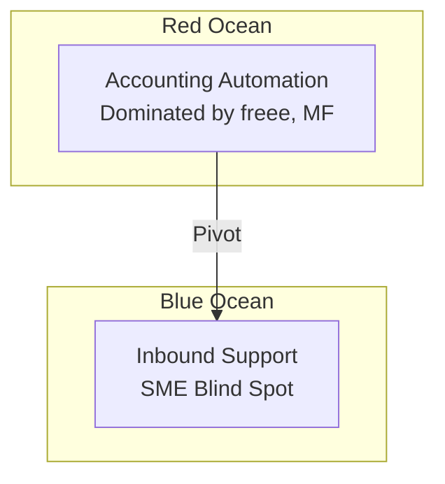
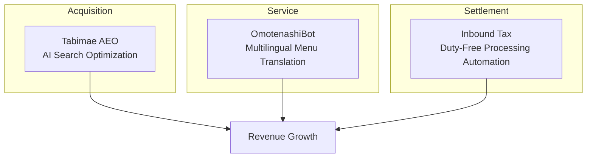
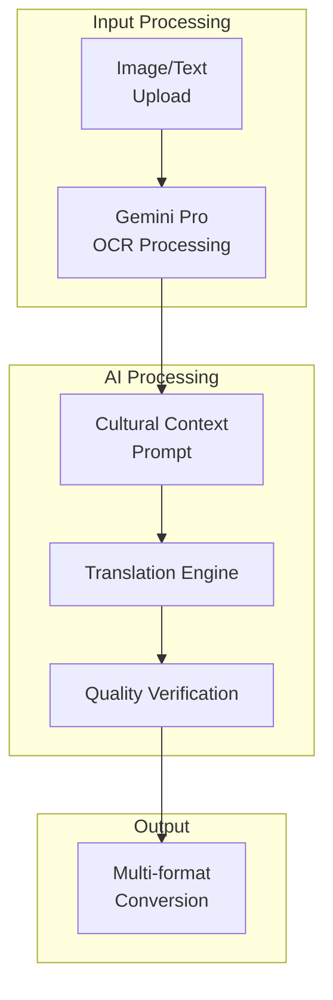

## The Beginning: A Dream of AI Efficiency Tools

In November 2025, I launched an AI-powered business efficiency SaaS called <strong>Agent Effi Flow</strong>. It started with a simple idea: "Let's automate accounting with receipt OCR."

The tech stack was solid:
- <strong>SvelteKit</strong> + <strong>Supabase</strong> + <strong>Vercel</strong>
- <strong>Google Gemini 2.5 Pro</strong>-based AI processing
- Credit-based payment system (Stripe integration)
- 5-language multilingual support

But one week after launch, I had to face a sobering reality.

---

## Facing Reality: The Red Ocean Wall

### The Truth About Japan's Accounting Market

While researching Japan's accounting automation market, I discovered a shocking truth:

| Service | Market Share | MAU | Features |
|---------|--------------|-----|----------|
| freee | 33% | 3.7M+ | One-click tax filing |
| Money Forward | 27% | 3M+ | Best financial integration |
| Yayoi | 22% | - | Tax accountant network |

<strong>Receipt OCR</strong> was already a <strong>basic feature</strong> for these giant players. Creating differentiation in this market as a solo developer seemed nearly impossible.

### Warning Signs

```
❌ Search visibility: Almost none
❌ Competitive advantage: Unclear
❌ Price competitiveness: Can't compete with freee's ¥1,980/month
❌ Trust: Zero brand recognition
```

I realized I couldn't continue like this.

---

## The Turning Point: Searching for Blue Ocean

### Japan's Paradoxical Opportunity

Japan is the world's 3rd largest economy, but its digital competitiveness ranks at the bottom of OECD countries. I found opportunity in this <strong>digital paradox</strong>.



### The 30 Million Inbound Era

In 2024, the number of foreign visitors to Japan exceeded <strong>36 million</strong>. However:

- <strong>72%</strong> of small businesses struggle with foreign language support
- Most menu translation services <strong>ignore cultural context</strong>
- Frequent mistakes like translating "ホルモン" as "Hormone"

This was exactly the problem I could solve.

---

## A New Vision: AI Manager Protecting Your Store

### 3 Pillar Strategy



Supporting the consistent customer journey of <strong>Acquisition → Service → Settlement</strong> with AI is the new vision.

### Core Values

| Keyword | Meaning | Service Implementation |
|---------|---------|----------------------|
| <strong>安心 (Anshin)</strong> | Peace of mind | Automatic cultural error detection |
| <strong>おもてなし</strong> | Heartfelt hospitality | Context-aware translation |
| <strong>売上 (Uriage)</strong> | Business growth | AI search exposure optimization |

---

## OmotenashiBot: The First Fruit

### Service Overview

On December 3, 2025, I officially launched <strong>OmotenashiBot</strong>.

> "Flawless multilingual service"

Upload a menu photo and receive culturally-aware translations in <strong>13 languages</strong>.

### Key Features

#### 1. Cultural Context Translation

Not simple literal translation, but translations that understand each culture's food traditions:

```
❌ Before: ホルモン → "Hormone" (Hormone?)
✅ OmotenashiBot: ホルモン → "Beef Offal BBQ"

❌ Before: ガス入りの水 → "Gas water" (Gas water?)
✅ OmotenashiBot: ガス入りの水 → "Sparkling water"
```

#### 2. Industry-Specific Presets

Translation optimization reflecting each industry's characteristics:

- <strong>Izakaya</strong>: Snack culture, drinking etiquette
- <strong>Yakiniku</strong>: Cut explanations, doneness guides
- <strong>Sushi</strong>: Seasonal fish, omakase concept
- <strong>Ramen</strong>: Noodle thickness, broth richness terms

#### 3. Automatic Allergen Detection

```
⚠️ Detected: 小麦粉 (flour) - Wheat flour
⚠️ Detected: えび (shrimp) - Shrimp
⚠️ Detected: 卵 (egg) - Egg
```

#### 4. Multiple Output Formats

- <strong>Text</strong>: For simple copy-paste
- <strong>Markdown</strong>: For documentation
- <strong>CSV</strong>: For Excel editing
- <strong>Image</strong>: For actual menu design

---

## Technical Implementation: Prompt Architecture

### System Structure



### Prompt Design Principles

The core of OmotenashiBot is <strong>prompts that understand cultural context</strong>.

#### Language-Specific Cultural Guidelines

I defined cultural characteristics for each target language:

```typescript
// Example: English guidelines
{
  language: 'en',
  cultural_notes: [
    'Avoid literal translations of Japanese onomatopoeia',
    'Include cooking method descriptions for unfamiliar dishes',
    'Add texture/flavor hints for adventurous items'
  ]
}
```

#### Mistranslation Prevention Table

Pre-defined common mistranslation patterns:

| Japanese | Wrong Translation | Correct Translation |
|----------|-------------------|---------------------|
| ホルモン | Hormone | Beef/Pork Offal |
| もつ | Motsu | Offal/Giblets |
| ガス入り | Gas in | Sparkling |
| 並 | Normal | Regular size |

#### Severity-Based Verification

Translation results are verified at three levels:

```typescript
type Severity = 'high' | 'medium' | 'low';

// high: Allergen, religious taboo-related errors
// medium: Meaning distortion, inappropriate expressions
// low: Style, nuance improvement suggestions
```

### Credit System

```typescript
const CREDIT_COSTS = {
  base: 10,        // Basic text processing
  image_output: 30 // Additional for image generation
};
```

I set reasonable prices that remain affordable for small businesses.

---

## Accounting OCR: Strategic Pause

The existing accounting OCR feature has been <strong>temporarily paused</strong>.

### Reasons

1. <strong>Red ocean avoidance</strong>: Abandoning direct competition with freee and Money Forward
2. <strong>Resource focus</strong>: Concentrating development on inbound-specific features
3. <strong>Rebranding exploration</strong>: Planning renewal to better serve small businesses (timeline TBD)

### Future Plans

Accounting OCR will be reborn not as simple receipt recognition, but as <strong>inbound revenue-specific</strong> functionality:

- Automatic duty-free/taxable classification
- Duty-Free, Tax-Free keyword detection
- Yayoi, freee CSV format support

---

## Lessons Learned

### 1. Market Selection is More Important Than Technology

Even great technology struggles to shine in a red ocean. Finding a <strong>market with less competition</strong> is a survival strategy for solo developers.

### 2. Go Deep Into Your Niche

"A service for everyone" is far less valuable than "solving specific problems for specific customers."

### 3. Pivot is Not Failure

Changing direction is not giving up. It's a <strong>strategic decision</strong> to accept market feedback and find better opportunities.

### 4. Cultural Context is Differentiation

There are many AI translation services, but few that understand <strong>cultural context</strong>. This is OmotenashiBot's core competitive advantage.

---

## Next Steps

### Phase 3 (January〜February 2025)

- <strong>Tabimae AEO</strong>: AI search engine optimized promotional content generation
- <strong>OmotenashiBot Enhancement</strong>: Batch processing, service scripts

### 2026 Duty-Free System Changes Response

In line with the 2026 changes to duty-free processing methods, I plan to further strengthen the duty-free receipt OCR feature for small businesses serving inbound customers with tax-free transactions.

---

## Conclusion

The accounting OCR service that was struggling in a red ocean has discovered new possibilities in the blue ocean of inbound tourism.

<strong>OmotenashiBot</strong> is the first fruit of this journey. Under the vision of "AI Manager Protecting Your Store," I will continue developing services that help Japanese small businesses welcome customers from around the world.

---

<strong>Try the Service</strong>: [Agent Effi Flow](https://agent-effi-flow.jangwook.net/)

Feel free to reach out with feedback or questions. I'd love to build better services together.
