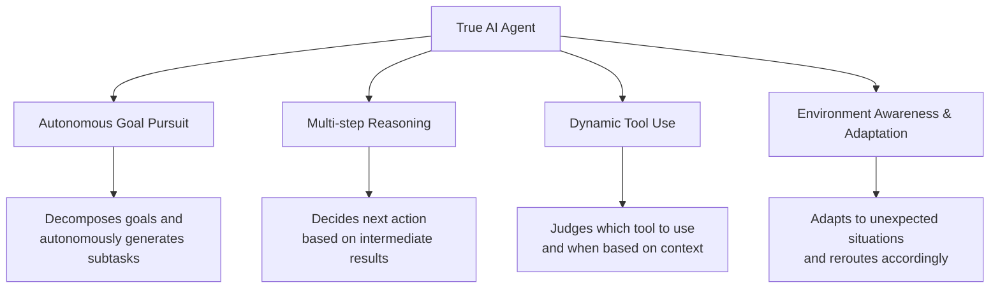
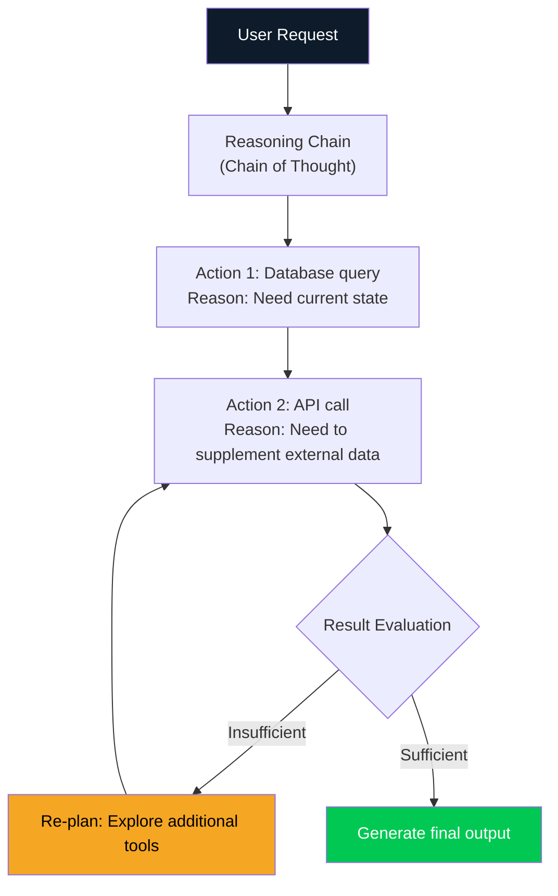
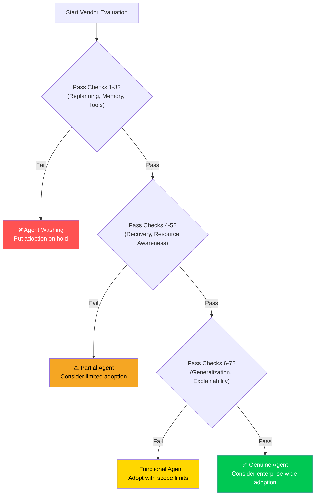

As of March 2026, the phrase "AI agent" appears in the marketing materials of virtually every IT vendor. Gartner predicts that 40% of enterprise applications will embed AI agents by the end of 2026. But a sober examination reveals a sobering reality: of the thousands of "AI agent" vendors, only <strong>approximately 130 are building genuinely agentic systems</strong>.

What are the rest? Simple automation, if-then rule engines, or LLM API wrappers with an "AI Agent" label slapped on top. This phenomenon is called <strong>Agent Washing</strong>. Just as greenwashing dresses up non-environmental products as eco-friendly, agent washing packages basic automation as intelligent agency.

As an Engineering Manager, avoiding this trap goes beyond making a sound technical decision — it's about <strong>protecting your team's time, budget, and credibility</strong>. This post presents a battle-tested 7-point checklist to help you detect agent washing in the wild.

## What Is Agent Washing?

To understand agent washing, you first need to know what a <strong>genuine AI agent</strong> looks like.

A true AI agent possesses four core characteristics:



By contrast, agent washing typically exhibits these red flags:

- Executes pre-defined scripts or flowcharts
- Has branching logic but <strong>never generates new plans</strong>
- Immediately escalates to humans on failure (no autonomous recovery)
- Uses LLMs, but only for simple text generation

## The 7-Point Detection Checklist

### ✅ Check 1: The "Goal Re-planning" Test

<strong>Question:</strong> What happens when an unexpected obstacle arises mid-execution?

A genuine agent <strong>autonomously generates alternative routes</strong> when it encounters obstacles. An agent-washed product returns an error like "Scenario A failed. Please contact support."

**Practical Test**: During a demo, deliberately enter an unusual or malformed input. Watch whether the system attempts a new approach or simply throws an error.

```python
# Genuine agent response
# Obstacle encountered → autonomous re-planning

async def handle_obstacle(self, obstacle: Exception):
    # Agent generates alternatives on its own
    alternative_plans = await self.llm.generate_alternatives(
        original_goal=self.current_goal,
        obstacle=str(obstacle),
        context=self.memory.get_context()
    )
    return await self.execute_best_plan(alternative_plans)

# Agent-washed response
# Obstacle encountered → error returned

def handle_obstacle(self, error):
    raise AgentError(f"Predefined flow failed: {error}")
    # or simply returns None
```

### ✅ Check 2: The "Context Memory" Test

<strong>Question:</strong> How much do the results of previous interactions influence subsequent actions?

A genuine agent leverages <strong>episodic memory</strong> to incorporate past failures and successes into present decisions. Agent washing treats each request independently, or at best pastes in the previous conversation transcript.

**Practical Test**: Request the same task twice. In the second request, mention a specific shortcoming of the first result. Check whether the agent modifies its approach in response.

### ✅ Check 3: The "Tool Selection Flexibility" Test

<strong>Question:</strong> How does the system respond when the set of available tools changes?

A genuine agent <strong>determines at runtime which tool is optimal</strong> for the current situation. An agent-washed product has the tool execution order hardcoded and breaks if a tool is unavailable.

```python
# Genuine agent: dynamic tool selection

class GenuineAgent:
    async def select_tool(self, task: str, available_tools: list) -> Tool:
        # Dynamically select the best tool based on task and context
        tool_analysis = await self.llm.analyze_tools(
            task=task,
            tools=[t.description for t in available_tools],
            history=self.memory.recent_actions
        )
        return available_tools[tool_analysis.best_tool_index]

# Agent washing: hardcoded tool sequence

class WashedAgent:
    TOOL_SEQUENCE = ["search", "summarize", "format"]  # immutable

    def execute(self, task):
        for tool_name in self.TOOL_SEQUENCE:
            result = self.tools[tool_name].run(task)  # fixed order
        return result
```

### ✅ Check 4: The "Failure Recovery" Test

<strong>Question:</strong> If a subtask fails, does the entire task halt?

A genuine agent <strong>continues toward the overall goal even under partial failure</strong>, routing around or retrying failed components. An agent-washed product halts the entire pipeline when any step fails.

**Practical Test**: Temporarily disable an API endpoint and observe how the system responds.

### ✅ Check 5: The "Budget/Time Awareness" Test

<strong>Question:</strong> When resource constraints are in place, does the system recognize trade-offs?

A genuine agent adjusts its strategy to <strong>produce the best result within given constraints</strong> — time, tokens, API costs. An agent-washed product runs the same way regardless of resource limitations.

```python
# Genuine agent: resource awareness

async def run_with_budget(self, task, token_budget=10000):
    estimated_cost = await self.estimate_cost(task)

    if estimated_cost > token_budget:
        # Adjust strategy when over budget
        simplified_plan = await self.create_simplified_plan(
            task, max_tokens=token_budget * 0.8
        )
        return await self.execute(simplified_plan)
    return await self.execute_full_plan(task)
```

### ✅ Check 6: The "New Domain Generalization" Test

<strong>Question:</strong> Can the system handle task types not seen in its training data?

A genuine agent uses <strong>transfer learning</strong> to handle novel domain tasks by leveraging existing knowledge. An agent-washed product is specialized automation built for specific use cases only.

**Practical Test**: Request an edge case the vendor didn't showcase in their demo. "That use case is not currently supported" is a clear agent-washing signal.

### ✅ Check 7: The "Explainable Reasoning" Test

<strong>Question:</strong> Can the system explain why it chose a particular action?

A genuine agent provides <strong>transparent traces of its decision-making process</strong>. An agent-washed product operates as a black box or returns only pre-written explanations.



## Questions EMs Should Ask in Vendor Meetings

Based on the 7-point checklist, here are key questions you can ask directly in vendor evaluations:

| Question | Genuine Agent Response Pattern | Agent Washing Response Pattern |
|----------|-------------------------------|-------------------------------|
| "What if you receive unstructured input?" | "We generate a new plan" | "We convert it to our defined format" |
| "What is your failure rate?" | Specific numbers + recovery method | "Highly reliable" (no numbers) |
| "How does the system learn and improve?" | RLHF, GRPO, specific mechanisms | "We update it regularly" |
| "Can I see the reasoning process?" | Detailed trace available | "We only provide the output" |
| "What if we add a new tool?" | "It automatically learns how to use it" | "Our dev team handles the integration" |

## The Real Cost of Agent Washing

Failing to detect agent washing costs far more than a bad procurement decision.

**1. Opportunity cost**: You waste budget and time that could have gone toward genuine agentic AI.

**2. Organizational trust erosion**: Accumulated "AI project failures" make teams skeptical of genuine AI initiatives in the future.

**3. Technical debt**: If you architect your systems believing simple automation is a full agent, you'll face a complete redesign when switching to a real agent later.

**4. Competitive disadvantage**: While competitors with true agentic AI achieve 20–40% operating cost reductions, organizations running agent-washed products miss those gains entirely.

## The Practical Evaluation Framework

Use this decision framework when evaluating new AI agent solutions:



## The Reality of the 2026 Agent Market

According to current enterprise AI adoption surveys (March 2026):

- 57.3% of organizations have agents running in production
- Yet among those, <strong>fewer than 20% are running truly autonomous agents</strong>
- The remaining 80% are automated workflows, LLM-enhanced chatbots, or rule-based systems

This gap is exactly why agent washing thrives. "Having an agent" and "having a genuine agentic AI" are two entirely different claims.

## Conclusion: The Art of Healthy Skepticism

Detecting agent washing is a technical skill, but more fundamentally it's a habit of <strong>asking the right questions</strong>.

When a vendor confidently presents their "AI agent," your job as an EM is to run through the 7-point checklist. Most genuine agentic AI systems will welcome these questions and provide specific, concrete answers. Agent-washed products will respond with vague answers, topic changes, or "that's on our roadmap."

As the wave of enterprise AI adoption surges in 2026, the ability to distinguish genuine from fake becomes a core EM competency. Finding those 130 true agents among the thousands — that is the challenge 2026 places before every Engineering Manager.

## References

- [AI Journey Report 2026: Generative to Agentic - ResearchAndMarkets](https://www.globenewswire.com/news-release/2026/03/12/3254690/28124/en/AI-Journey-Report-2026-Generative-to-Agentic-Understand-How-Agentic-AI-Can-Help-LLM-Vendors-Achieve-Profitability-and-Identify-the-Likely-Winners-from-the-First-Phase-of-the-AI-Inv.html)
- [State of Agent Engineering 2026 - LangChain](https://www.langchain.com/state-of-agent-engineering)
- [5 Key Trends Shaping Agentic Development in 2026 - The New Stack](https://thenewstack.io/5-key-trends-shaping-agentic-development-in-2026/)
- [Unlocking the value of multi-agent systems in 2026 - Computer Weekly](https://www.computerweekly.com/opinion/Unlocking-the-value-of-multi-agent-systems-in-2026)
- [2026 enterprise AI predictions - InformationWeek](https://www.informationweek.com/machine-learning-ai/2026-enterprise-ai-predictions-fragmentation-commodification-and-the-agent-push-facing-cios)
