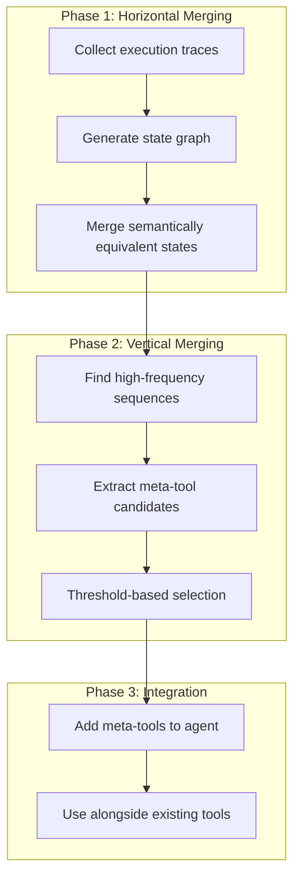
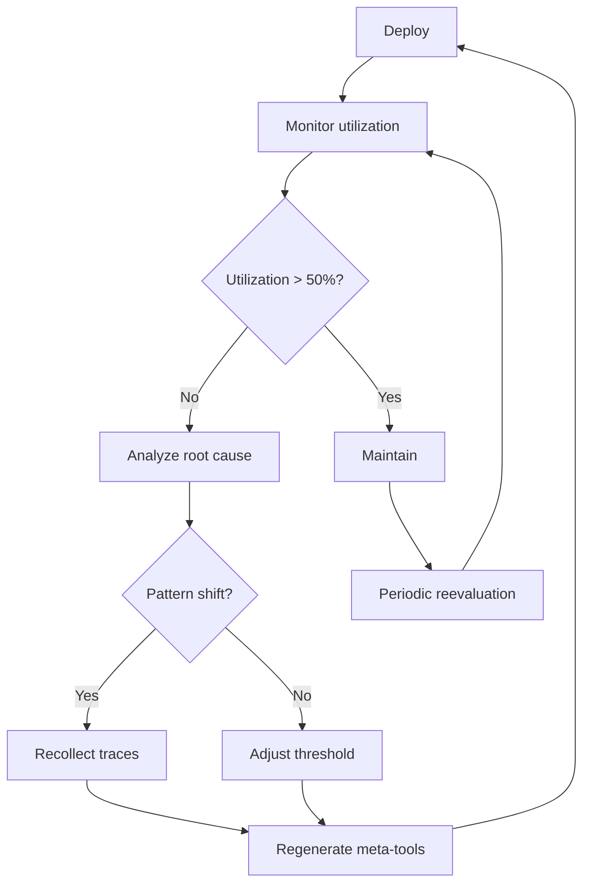

## Overview

Deploying AI agent systems to production reveals unexpected costs and latencies. Agents invoke the LLM on every step to reason about the next action. Even repetitive patterns like login, search, and form submission go through complete LLM reasoning each time.

A paper titled <strong>"Optimizing Agentic Workflows using Meta-tools"</strong> published on arXiv in January 2026 offers a practical solution to this problem. The core idea is straightforward: analyze the agent's execution logs to identify recurring tool call patterns, then compile them into <strong>meta-tools</strong>—deterministic composite tools.

This article analyzes how the AWO (Agent Workflow Optimization) framework works and explores how engineering teams can leverage it from a practical perspective.

## Why Agentic Workflow Optimization Matters

Most AI agent systems today follow the <strong>ReAct (Reasoning + Acting)</strong> pattern. When an agent receives a user request, the LLM reasons, calls tools, observes results, and repeats the reasoning loop.

The problem lies in the inefficiencies this creates:

- <strong>Unnecessary reasoning</strong>: Tasks like login or search that follow the same pattern every time still go through LLM reasoning
- <strong>Cumulative costs</strong>: Each LLM call costs a few cents, which adds up significantly at scale
- <strong>Increased latency</strong>: Redundant LLM calls lengthen response times
- <strong>Hallucination risk</strong>: More LLM calls increase the probability of incorrect decisions

Real benchmarks show that agents take vastly different execution paths for identical tasks. Sometimes a task that could be completed in three steps takes ten or more.

## AWO Framework: Three-Stage Optimization Pipeline

AWO automatically extracts meta-tools by analyzing execution traces from agents. It consists of three main phases.



### Phase 1: Horizontal Merging

The first stage consolidates multiple execution traces into a single state graph. Each execution is represented as a sequence of tool calls:

```
E_i = (Tool_1, Tool_2, ..., Tool_n)
```

The key is recognizing <strong>semantically equivalent states</strong>. For example:

- Read-only operations produce the same result regardless of order (commutativity)
- User IDs or session tokens are normalized and treated identically
- Recurring authentication flows are condensed into a single state

Domain experts define the merging rules in this process. Complete automation has limitations, but the rules themselves are reusable.

### Phase 2: Vertical Merging

From the merged graph, <strong>high-frequency sequential patterns</strong> are extracted using a greedy algorithm:

```python
# AWO meta-tool extraction algorithm (simplified)
def extract_meta_tools(graph, threshold_T):
    meta_tools = []
    while True:
        # Find edge pairs with weight above threshold
        pairs = find_high_weight_pairs(graph, threshold_T)
        if not pairs:
            break

        # Select the pair with highest weight
        best_pair = max(pairs, key=lambda p: p.weight)
        candidate = [best_pair.start, best_pair.end]

        # Expand with successor nodes if their weight is sufficiently high
        current = best_pair.end
        while child := select_high_freq_child(current, threshold_T):
            candidate.append(child)
            current = child

        meta_tools.append(candidate)
        graph = compress(graph, candidate)

    return meta_tools
```

The selection criterion is clear: the weight of edge `w(n_y, n_z)` must exceed half the sum of all outgoing edge weights from that node. This means a pattern becomes a meta-tool only when it occurs <strong>overwhelmingly often</strong>.

### Phase 3: Meta-Tool Integration

Extracted meta-tools are added to the agent's tool set. They don't replace existing tools but work <strong>alongside</strong> them. The agent can choose to use meta-tools or individual tools depending on the situation.

## Experimental Results: Performance by Benchmark

### VisualWebArena (Web Agent Benchmark)

Testing 910 tasks across three web environments: Reddit, Classifieds, and Shopping.

| Metric | Reddit | Classifieds | Shopping |
|--------|--------|-------------|----------|
| LLM call reduction | 5.6% | 8.3% | 10.2% |
| Cost reduction | 5.7% | 8.5% | 10.2% |
| Success rate change | +2.1%p | +4.2%p | +1.8%p |
| Meta-tools generated | 2 | 2 | 2 |

The Shopping category showed the largest gains because search and review-writing patterns were most consistent.

<strong>Example meta-tools generated</strong>:

```
# Shopping meta-tool: search
search [query]
  = type(search_box_id, query) → click(search_submit_id)

# Shopping meta-tool: leave_review
leave_review [rating, title, review]
  = click(review_tab)
  → scroll_down()
  → set_rating(rating)
  → fill(title_field, title)
  → fill(review_field, review)
  → click(post_button)
```

### AppWorld (Multi-App Agent Benchmark)

Testing 168 tasks across nine application environments.

| Metric | GPT 5.1 | Claude 4.5 |
|--------|---------|------------|
| LLM call reduction | 11.9% | 7.2% |
| Cost reduction | 15.0% | 4.2% |
| Meta-tool utilization rate | 98.2% | 39.3% |
| Meta-tools generated | 5 | 5 |

Interestingly, GPT 5.1 utilized meta-tools at 98.2% while Claude 4.5 only at 39.3%. This reveals that <strong>tool adoption propensity varies by model</strong>.

## Practical Implementation Guide: Roadmap for Engineering Teams

### Stage 1: Execution Trace Collection

Implementing AWO requires systematically collecting agent execution logs.

```python
# Example: Collecting agent execution traces
import json
from datetime import datetime

class TraceCollector:
    def __init__(self):
        self.traces = []
        self.current_trace = []

    def log_tool_call(self, tool_name: str, params: dict, result: dict):
        self.current_trace.append({
            "tool": tool_name,
            "params": self._normalize_params(params),
            "timestamp": datetime.now().isoformat(),
            "success": result.get("success", True)
        })

    def _normalize_params(self, params: dict) -> dict:
        """Normalize user IDs and similar values to facilitate pattern discovery"""
        normalized = {}
        for k, v in params.items():
            if k in ["user_id", "session_token"]:
                normalized[k] = "<NORMALIZED>"
            else:
                normalized[k] = v
        return normalized

    def end_trace(self):
        if self.current_trace:
            self.traces.append(self.current_trace)
            self.current_trace = []

    def export(self, path: str):
        with open(path, 'w') as f:
            json.dump(self.traces, f, indent=2)
```

### Stage 2: Pattern Analysis and Meta-Tool Candidate Identification

Find repetitive patterns in collected traces. In practice, a <strong>semi-automated approach</strong> is more effective than full automation:

```python
from collections import Counter

def find_frequent_sequences(traces, min_length=2, min_freq=5):
    """Find frequent tool call sequences"""
    sequences = Counter()

    for trace in traces:
        tool_names = [step["tool"] for step in trace]
        # Extract sequences using n-gram approach
        for length in range(min_length, min(len(tool_names), 6)):
            for i in range(len(tool_names) - length + 1):
                seq = tuple(tool_names[i:i + length])
                sequences[seq] += 1

    # Filter by frequency
    return {
        seq: count
        for seq, count in sequences.most_common()
        if count >= min_freq
    }
```

### Stage 3: Implement and Deploy Meta-Tools

Implement identified patterns as deterministic functions:

```python
# Example: Meta-tool implementation for auto-login and search
class MetaTool:
    def __init__(self, name: str, steps: list):
        self.name = name
        self.steps = steps

    async def execute(self, agent_context, **params):
        """Execute deterministically without LLM reasoning"""
        results = []
        for step in self.steps:
            tool_name = step["tool"]
            tool_params = self._resolve_params(step["params"], params)
            result = await agent_context.call_tool(tool_name, tool_params)
            results.append(result)

            if not result.get("success"):
                # Return control to agent on failure
                return {"success": False, "partial_results": results}

        return {"success": True, "results": results}

    def _resolve_params(self, template: dict, actual: dict) -> dict:
        """Substitute template parameters with actual values"""
        resolved = {}
        for k, v in template.items():
            if isinstance(v, str) and v.startswith("$"):
                resolved[k] = actual.get(v[1:], v)
            else:
                resolved[k] = v
        return resolved

# Usage example
auto_login_search = MetaTool(
    name="auto_login_and_search",
    steps=[
        {"tool": "get_credentials", "params": {"service": "$service"}},
        {"tool": "login", "params": {"username": "$username", "password": "$password"}},
        {"tool": "search", "params": {"query": "$query"}}
    ]
)
```

### Stage 4: Monitoring and Iterative Improvement

After deploying meta-tools, continuously monitor utilization rates and effectiveness:



## EM/VPoE Perspective: Adoption Considerations

### Cost-Benefit Analysis

AWO's ROI is proportional to agent usage scale:

- <strong>Small scale</strong> (fewer than 100 requests per day): Implementation costs outweigh benefits
- <strong>Mid scale</strong> (1,000〜10,000 requests per day): 5〜15% cost savings becomes meaningful
- <strong>Large scale</strong> (10,000+ requests per day): Essential optimization strategy

### Team Capability Requirements

Capabilities needed for AWO adoption:

- <strong>Domain expertise</strong>: Understanding of the business domain to define horizontal merging rules
- <strong>Log infrastructure</strong>: Pipeline to systematically collect agent execution traces
- <strong>Test environment</strong>: Benchmarks to validate meta-tool accuracy

### Important Caveats

- Horizontal merging rules require <strong>manual definition</strong>. Full automation attempts plateaued in performance
- Meta-tool utilization rates vary significantly by model (GPT 98% vs. Claude 39%)
- When task distribution changes, meta-tools must be <strong>regenerated</strong>

## Comparison with Other Optimization Approaches

| Approach | Method | Difference from AWO |
|----------|--------|---------------------|
| LLMCompiler | Parallel DAG execution | Runtime optimization vs. AWO's pre-deployment optimization |
| ReAct | Alternating reasoning and acting | Doesn't eliminate redundant reasoning |
| Tree of Thought | Multiple reasoning paths | Exploration vs. AWO's integration |
| AVATAR | Contrastive learning-based | Requires training, while AWO uses only execution analysis |

AWO's strength is its <strong>non-invasive integration with existing systems</strong>. You only add tools without modifying the agent's core logic.

## Conclusion

The AWO framework is a practical approach to reducing operational costs of AI agent systems. The core principle is simple: "Execute patterns that agents don't need to reason about deterministically."

If your team operates AI agents in production, we recommend starting with execution trace collection. As data accumulates, patterns suitable for meta-tools become naturally apparent.

## References

- [Optimizing Agentic Workflows using Meta-tools (arXiv:2601.22037)](https://arxiv.org/abs/2601.22037)
- [A Practical Guide for Production-Grade Agentic AI Workflows (arXiv:2512.08769)](https://arxiv.org/abs/2512.08769)
- [How Agentic AI Will Reshape Engineering Workflows in 2026 (CIO)](https://www.cio.com/article/4134741/how-agentic-ai-will-reshape-engineering-workflows-in-2026.html)
- [7 Agentic AI Trends to Watch in 2026 (MachineLearningMastery)](https://machinelearningmastery.com/7-agentic-ai-trends-to-watch-in-2026/)
