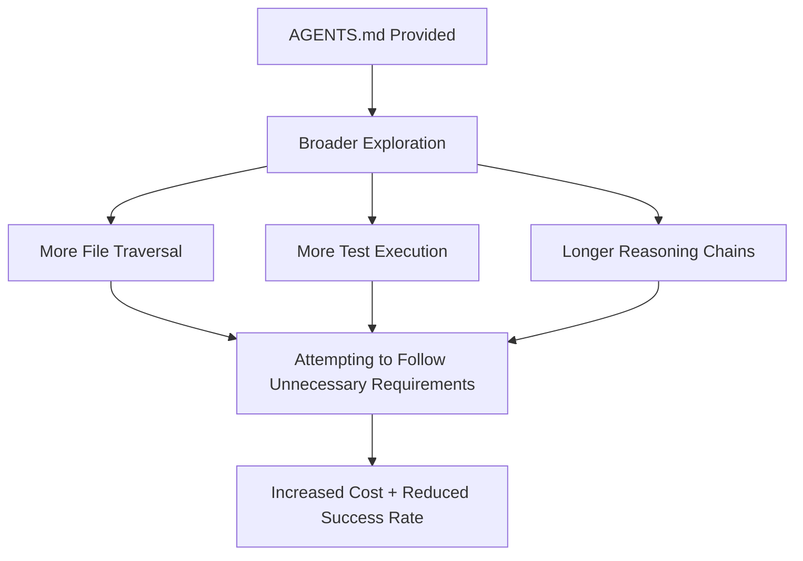

## Overview

As coding agents like Cursor, Claude Code, and Codex continue to spread, the practice of placing <strong>AGENTS.md</strong> (or CLAUDE.md, CURSOR.md) files in repositories to provide project context to agents has rapidly gained traction. Currently, over 60,000 repositories on GitHub alone include such files.

But does this file <strong>actually</strong> improve agent task success rates? A research team from ETH Zürich has published the <strong>first empirical answer</strong> to this question.

> 📄 Paper: [Evaluating AGENTS.md: Are Repository-Level Context Files Helpful for Coding Agents?](https://arxiv.org/abs/2602.11988) (arXiv 2602.11988, February 2026)

## Key Findings: Results That Defy Expectations

### LLM-Generated Context Files Actually Reduce Success Rates

The research team evaluated coding agents in three settings:

1. <strong>No context file</strong> (baseline)
2. <strong>LLM-generated context file</strong> (agent developer recommended approach)
3. <strong>Developer-written context file</strong>

```
┌─────────────────────────────────────────────┐
│     Average Success Rate Change by Setting   │
├─────────────────────────────────────────────┤
│  No context (baseline)      : ████████ base  │
│  LLM-generated context      : ██████▌  -3%   │
│  Developer-written context  : ████████▌ +4%   │
└─────────────────────────────────────────────┘
```

Key numbers at a glance:

- <strong>LLM-generated files</strong>: Average success rate <strong>decreased by 3%</strong>
- <strong>Developer-written files</strong>: Average success rate <strong>increased by 4%</strong> (marginal improvement)
- <strong>Inference cost</strong>: <strong>Increased by over 20%</strong> in both cases

### Why Did This Happen?

The research team conducted a detailed analysis of agent behavior patterns:



Agents tended to <strong>faithfully follow</strong> the instructions in context files. The problem was that many of those instructions were <strong>unnecessary requirements</strong> for the given task. Directives like following style guides and using specific test patterns actually made tasks more complex.

## AGENTbench: A New Benchmark

The research team built a new benchmark called <strong>AGENTbench</strong> for this evaluation.

| Item | Details |
|------|---------|
| Instances | 138 |
| Target Repositories | 12 (repos where developers actively use context files) |
| Task Types | Bug fixes + Feature additions |
| Complementary Benchmark | SWE-bench Lite (for popular repositories) |

Existing SWE-bench focused on well-known large repositories that didn't include AGENTS.md. AGENTbench is the first benchmark to collect tasks from <strong>repositories that actually use context files</strong>.

## Practical Implications: How Should You Use AGENTS.md?

### ❌ What NOT to Do

- Let LLMs <strong>auto-generate</strong> AGENTS.md via `/init` commands
- Cram all project rules, style guides, and architecture descriptions into one file
- Provide extensive context expecting the agent to "read it all"

### ✅ What TO Do

The research team's recommendation is clear: <strong>"Describe only minimal requirements"</strong>

Principles for effective AGENTS.md:

1. Specify only <strong>build/test commands</strong> (e.g., `npm test`, `pytest`)
2. Document only <strong>project-specific tooling</strong>
3. Keep style guides and architecture descriptions in <strong>separate documents</strong>
4. Include only information <strong>directly needed</strong> for the agent's task

```markdown
# Good AGENTS.md Example

## Build
npm install && npm run build

## Test
npm test              # All tests
npm test -- --grep "pattern"  # Specific tests

## Lint
npm run lint          # Required before commit
```

```markdown
# Bad AGENTS.md Example (Excessive requirements)

## Architecture
This project follows clean architecture...
(Verbose explanation, 200 lines)

## Coding Style
All functions must include JSDoc comments...
Variable names must use camelCase...
(Detailed rules, 100 lines)

## Commit Rules
Follow Conventional Commits...
```

## Developer Community Response

The paper received 58 points on Hacker News and sparked active discussion. Key reactions include:

- <strong>"Intuitively correct results"</strong>: Experiential agreement that excessive instructions confuse agents
- <strong>"Context window waste"</strong>: Concerns that long AGENTS.md files displace actual code context
- <strong>"Minimal is best"</strong>: Shared practical experience that build/test commands alone are sufficient

## Limitations and Future Outlook

This study has several limitations:

- <strong>Python-centric</strong>: AGENTbench only covers Python projects
- <strong>Niche repositories</strong>: Repositories using context files are relatively small-scale
- <strong>Static evaluation</strong>: Whether context files have cumulative effects in repeated tasks is untested

Future research directions include:

1. <strong>Adaptive context</strong>: Dynamically providing only necessary information based on task type
2. <strong>Structured context</strong>: Using machine-parseable formats instead of free text
3. <strong>Multi-language expansion</strong>: Verifying effectiveness beyond Python

## Conclusion

AGENTS.md is becoming a de facto standard in the coding agent ecosystem, but this paper has <strong>challenged the assumption that "more is better"</strong>.

The core message is simple:

> <strong>Keep context files minimal, focused on build and test commands.</strong>

Auto-generating via `/init` as recommended by agent developers may actually backfire at this point. Writing them manually with only essential information is the most effective strategy.

## References

- [Original Paper (arXiv)](https://arxiv.org/abs/2602.11988)
- [AGENTbench GitHub Repository](https://github.com/eth-sri/agentbench)
- [AGENTS.md Official Site](https://agents.md)
- [Hacker News Discussion](https://news.ycombinator.com/item?id=43062692)
