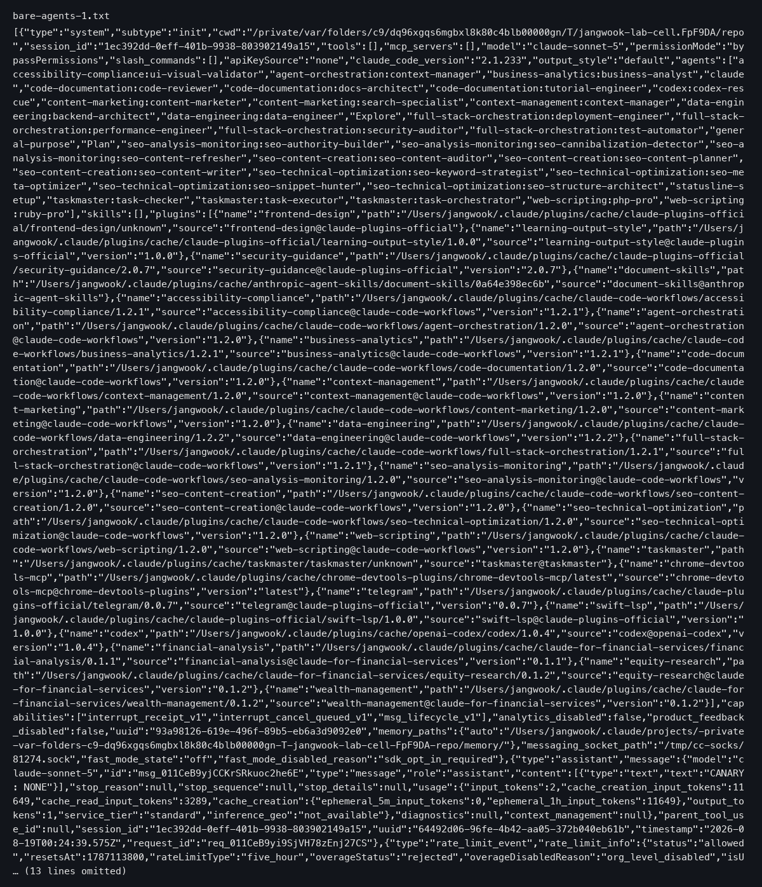
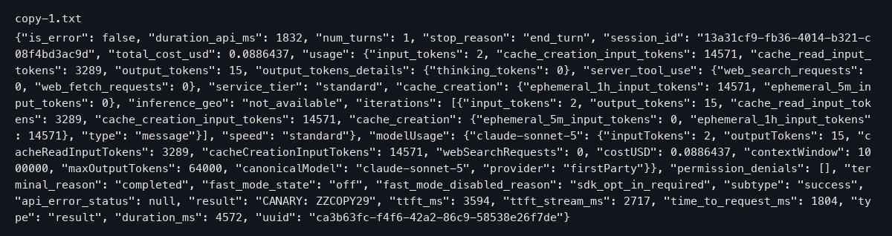
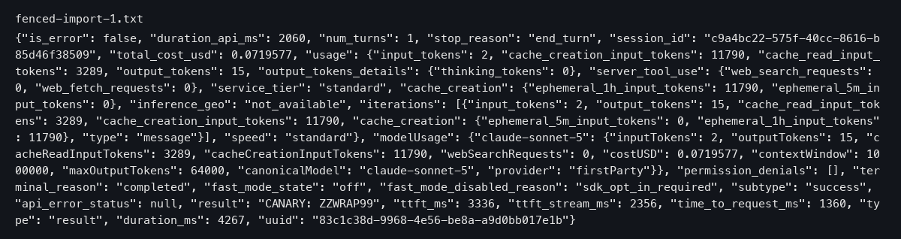
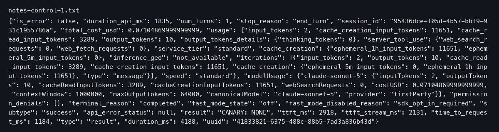

## AGENTS.md alone does not reach Claude Code

Say you run a small shop. You write a notice with your staff's house rules and pin it somewhere in the back room. The staff never see it, because they only check one specific board by the front door.

That is roughly what happens between two files. AGENTS.md is a file where a team writes the rules and context that AI coding helpers should follow. Claude Code is one such helper, a program where you type instructions in plain language and it works on code with you. Claude Code has its own notice board, called CLAUDE.md. The official docs say it plainly: "Claude Code reads `CLAUDE.md`, not `AGENTS.md`."

So if your team already has an AGENTS.md and you just leave it there, Claude Code never reads it. Nothing crashes. There is no error. The rules are simply written down somewhere nobody looks. In our test, we placed a marker inside an AGENTS.md (a word the helper could only know by reading it) and asked it to report the marker. With no connection between the files, it found the marker 0 times out of 3 tries. The cost of each session stayed at the baseline level, meaning the document never entered its reading at all.

The part that affects you: having the file is not the same as the helper reading it. Someone has to physically connect the two.

## Three official ways to attach the document

Claude Code's docs list three official ways to get the notice onto the right board. Each method works a little differently, so here is what you actually do.

1. **The @import line.** At the top of CLAUDE.md, you write a single line, `@AGENTS.md`. This tells the helper: "when you start, also read that file." You are pointing the helper at another file instead of putting the content in the file it reads. The docs describe it as: "CLAUDE.md files can import additional files using `@path/to/import` syntax. Imported files are expanded and loaded into context at launch alongside the CLAUDE.md that references them."

2. **The symbolic link.** This is a pointer file that pretends to be the real file. You make CLAUDE.md a pointer that opens AGENTS.md. The helper opens CLAUDE.md and finds itself reading AGENTS.md. It is like hanging the recipe card itself on the board hook, instead of copying it.

3. **The copy.** You duplicate AGENTS.md and save the duplicate as CLAUDE.md. Same content, second file. Like hand-copying the recipe card. Simple, but now you maintain two cards: change one, and the other goes stale.

All three are documented. The question we wanted to answer: do they behave the same once running?

## What the test measured: all three arrived, at nearly the same cost

We ran the same check for each method, 3 times per method, and watched two things. First, did the marker get through, did the helper actually read the document? Second, what each session cost, measured in tokens. Tokens are the small units a language model reads and writes, and they are what you get billed for.

The result: all three methods delivered the document 3 out of 3 times. And the cost difference between the three was 122 tokens at most. That number means little on its own. One full copy of the document bills about 2,920 tokens. The gap between the best and worst of the three methods was 122 tokens, roughly 4% of one document copy. In money terms, the difference between the three routes is a rounding error.

One detail worth knowing: the @import line did not bill the document twice. Reading it through the pointer cost essentially the same as having a plain copy, only about 116 tokens more, which covers the wrapper CLAUDE.md itself, not the imported document.

So what changes on your end is simple: you do not need to agonize over which method is "faster" or "cheaper." They are the same for practical purposes. Choose by convenience, not performance.

## One wrapped line kills the whole load

Here is where the test found something genuinely dangerous. Suppose you write documentation and want to show an example, "don't type this literally, but a line would look like this." A natural way to mark "this is just an example" is to wrap it in a code fence: three backtick characters before and after the line, the same marks used to set off code in ordinary notes.

We wrapped the line `@AGENTS.md` in such a fence, as an example. The result: the marker was found 0 out of 3 times. The document did not load at all. The session cost dropped to almost the no-connection baseline, only 141 tokens above it, which is about the size of the fence marks themselves.

Read that again. The fence did not merely make that one line "an example." It silently disconnected the entire document. Six characters of decoration decided whether a whole file's worth of rules existed. And nothing looks broken: the file is still there, the line is still there, the helper just never reads any of it.

This is not a bug we discovered against the docs; it is documented behavior. The official docs state: "Import parsing skips Markdown code spans and fenced code blocks. To mention a path in your CLAUDE.md without importing it, wrap it in backticks: writing `@README` keeps the text literal, while @README outside backticks imports the file." The parser reads the file at startup and deliberately skips anything inside code fences. Our token measurements confirm this rule operates at the loading step, not just on screen.

One last point: a line "written down" and a line "actually read" are different things. One innocent formatting choice can switch a whole document off.

## Which method to pick is decided by your situation

Since the three methods cost the same, the choice comes down to your circumstances, like choosing between taping a note, hanging the card, or copying it.

- **If your team uses only Claude Code** and has no need for a shared AGENTS.md with other tools, the copy is fine and easiest to understand.
- **If you use AGENTS.md with several tools** (it is a shared format that other coding helpers also read), the copy forces you to maintain two documents. Pick a method that keeps one source of truth: the @import line or the symbolic link.
- **On Windows**, the docs are explicit: "On Windows, creating a symlink requires Administrator privileges or Developer Mode, so use the `@AGENTS.md` import instead." If getting admin rights is a hassle on your machine, the @import line is the low-friction route. It also lets you add Claude-only notes below the import line, which a plain link cannot do.

The upshot: performance cannot decide this for you, because there is no performance difference to find. Your operating constraints do.

## What this article could not verify

Each method was tested only 3 times, so rare flukes would not show up. Also, the same run contained an unexplained wobble of exactly 109 tokens in 4 of 6 cells. It is small, but unexplained.

We also tested on macOS only, so we did not measure the Windows symlink permission problem ourselves; the docs' advice on that stands unverified by us. Next, it would be worth re-running with more repetitions and on Windows.

One condition would make this article's judgment wrong. Repeat the test. If any of the three methods fails to reach the document in all 3 tries (say it hits only 1/3 or 2/3), or a gap of about 2,920 tokens appears between methods, then the claim that the three wirings are equal is false.

So, the two lines that matter. If you want out, do nothing. You don't use multiple coding tools together and you don't need Claude-only settings. Just leave your file as it is. But make sure no path in your config is ever wrapped in a code fence. If you want in, pick one of the three methods today. Use the @import line if you're on Windows or want to append Claude-only notes. Otherwise use the link or the copy. And whenever you mention a path in the config, keep it unwrapped.

## References

1. [Manage Claude's memory (CLAUDE.md) / Claude Code Docs](https://code.claude.com/docs/en/memory) — Anthropic (code.claude.com)
2. [AGENTS.md](https://agents.md/) — agents.md