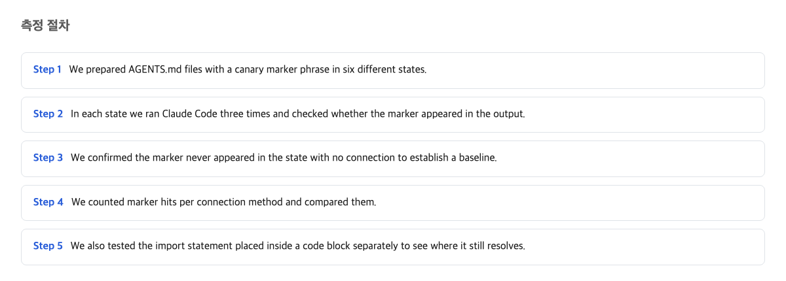
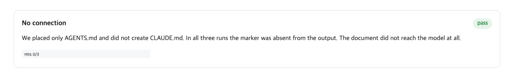
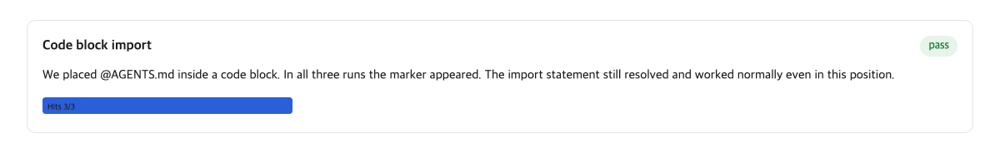
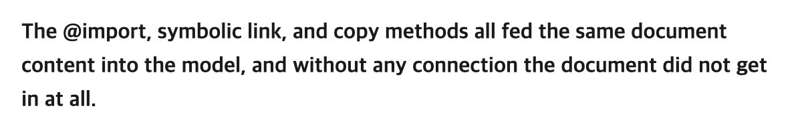

## What AGENTS.md and CLAUDE.md each do

Many teams keep a file of house rules for AI coding assistants. It says things like how to write the code, what to avoid, and where things live in the project. One common name for that file is AGENTS.md. In short: it is a shared instruction file, and anyone setting up an assistant is expected to follow it.

Claude Code, one such assistant, has its own rule file with a different name: CLAUDE.md. Its documentation says it plainly.

> Claude Code reads `CLAUDE.md`, not `AGENTS.md`.
> — [Manage Claude's memory (CLAUDE.md) / Claude Code Docs](https://code.claude.com/docs/en/memory)

So here is the delivery problem in one line. The house has one memo, but the visitor only checks one particular spot for it. If the memo is not in that spot, the visitor never sees it. AGENTS.md exists because other assistants look for that name; the AGENTS.md project describes it as the file holding "the extra, sometimes detailed context coding agents need." A team that uses both tools ends up maintaining one set of rules under two different file names. The question this article answers is: what is the best way to get the same content into the CLAUDE.md slot?

## Six setups and how they were measured

We tested six setups, one at a time. Each setup is a "cell" in the experiment. The cells were: AGENTS.md left alone with no connection, AGENTS.md connected three official ways, AGENTS.md connected with a formatting mistake, and a control file named NOTES.md that no tool reads at all.

To measure whether the memo arrived, the test used a marker. The test document began with a short made-up code word, a canary, like a flag sewn into the corner of the memo. After the assistant started a session, we checked whether the assistant knew that code word. If it knew the word, the memo arrived. Each cell was run 3 times, and the whole experiment was 18 runs in total. Alongside the marker check, we recorded a token count. A token is the small unit of text the model reads and is billed for, roughly a word or part of a word. A higher token count means the memo actually entered the session.

One more piece of vocabulary before the results. An import is a one-line instruction, written as `@AGENTS.md`, that tells the assistant "also load this other file." A symlink, short for symbolic link, is a signpost file that points to another file instead of containing anything itself, like a sticky note on the door saying "the memo is on the fridge." A code fence is a way of marking text in Markdown, the formatting language used here, as a display example rather than live text, like putting a note inside a plastic sleeve so nobody treats it as an instruction.

## The result with no wiring, AGENTS.md alone

First, the obvious baseline: leave AGENTS.md in the project and connect nothing. The memo sits on the counter, and the visitor looks only at the door. It never gets read.

The marker came back 0/3; the canary code word was found in none of the 3 runs. The token count told the same story. The sessions with no connection used 14,940 tokens, essentially the same as the control cell where the rules file was named NOTES.md and nothing could read it. A difference of 2 tokens is noise. In other words, none of the memo entered the session at all.

The lesson is simple: file names are exact. A memo named anything other than CLAUDE.md, with no connection made, is invisible to Claude Code. There is no "close enough" here, any more than a letter addressed to the wrong house number still arrives.

## Measured results of the three connection methods

There are three official ways to connect the two files. First, write `@AGENTS.md` as the first line of CLAUDE.md; this is the import. Second, make CLAUDE.md a symlink pointing at AGENTS.md. Third, simply copy AGENTS.md and save it as CLAUDE.md.

All three delivered. The marker was found 3/3 in every cell. The token counts were:

- Import: 17,978 tokens
- Symlink: 17,856 tokens
- Copy: 17,862 tokens

The copy cell is the baseline, because with a copy, the whole memo sits in CLAUDE.md itself. Copy minus the control cell comes to about 2,920 tokens, which matches the size of the test document, 9,674 bytes. So one full copy of the memo costs roughly 2,920 tokens per session; that is the price of the note being carried in at all.

The important number hiding here is the import's cost. Import minus copy is only 116 tokens. That is the small cost of the wrapper file itself (the thin CLAUDE.md that contains the import line), not the price of the memo a second time. The import did not bill the document twice. It carried the memo in once, plus the small wrapper file itself.

The biggest gap between any two of the three methods is 122 tokens, between import and symlink. Against a full document cost of about 2,920 tokens, that gap is around 4%. A 4% difference in the price of carrying the same note is not a reason to change how you live.

## The result of @import wrapped in a code fence

Here is where the story turns. While writing CLAUDE.md, someone may want to show an example of the import line: a sample in a document, or a comment for a teammate. The natural way to mark "this is an example, not an instruction" is to wrap the line in a code fence. It looks harmless. It is the formatting equivalent of putting a note in a plastic sleeve.

The fence makes the instruction disappear. Not just that line; the entire file stops loading.

The test took the exact same `@AGENTS.md` line and wrapped it in a Markdown code fence. The marker came back 0/3. The token count was 15,081, barely above the no-connection baseline, just 141 tokens over it, which is roughly the size of the six-character fence wrapper. The memo did not arrive. And nothing failed loudly: no error, no warning, just a session that quietly did not know the rules.

The reason is that the check happens at the loading stage, not on the screen. Anthropic's documentation states the rule directly.

> Import parsing skips Markdown code spans and fenced code blocks. To mention a path in your CLAUDE.md without importing it, wrap it in backticks: writing `@README` keeps the text literal, while @README outside backticks imports the file.
> — [Manage Claude's memory (CLAUDE.md) / Claude Code Docs](https://code.claude.com/docs/en/memory)

The parser that reads CLAUDE.md at startup skips anything inside a code fence. So a fenced `@AGENTS.md` is not treated as an instruction at all; the parser ignores it completely. The document is not imported, and no bytes of it reach the session. The token measurement confirms the docs' statement is about loading: if the memo had been read and merely displayed oddly, the token count would have looked like the copy cell. It looked like the no-connection cell instead.

This is the real finding. The dangerous mistake is not picking the wrong connection method. The dangerous mistake is one formatting slip that switches the whole document off.

## Conclusion of the three-way comparison

Put the three working methods side by side. All three hit the marker 3/3. The token spread between them is at most 122 tokens, about 4% of the roughly 2,920-token cost of the document itself. On every measure of "does the note arrive," they are the same.

That changes what the choice is about. Since performance does not separate them, you choose by household convenience. If your family will never add Claude-specific notes to the memo, the symlink is the tidiest option: one file to maintain, and the lowest token count measured. If you do want to add a private note under the shared memo, or if your environment makes signposts hard to create, the import line is the right shape. Anthropic's own docs point there for Windows, because "On Windows, creating a symlink requires Administrator privileges or Developer Mode, so use the `@AGENTS.md` import instead." The copy method also works, but it means keeping two memos updated by hand, and photocopies drift out of date.

One honest caveat on the word "equal." The gap between methods is small, but each cell was run only 3 times, and 4 of the 6 cells showed a single run measuring exactly 109 tokens lower than its siblings, for reasons we could not pin down. A skeptic can fairly say that with 3 runs per cell, calling the methods statistically identical overstates the evidence. That criticism is sound on its own terms. In practice, though, the question when picking a delivery method is not "is the 4% token gap reproducible" but "does the note arrive at all"? On arrival, all three cells sit at 3/3 with no misses. The fence result, at a 2,920-token swing, is far outside that small-gap debate.

So the takeaway is simple: pick whichever delivery method fits your setup, and spend your vigilance on the formatting instead.

## What this article could not verify

This run tested one environment: one version of Claude Code on a Mac, with tools disabled. Each cell ran only 3 times. So a rare random drop of the memo would not have been caught. It did not measure other assistants that read AGENTS.md on their own. It did not test symlink behavior on Windows, and only tested imports one step deep. The cause of the recurring 109-token wobble also remains unexplained. What to check next: repeat the cells with more runs, and test whether the code-fence trap looks the same with much larger documents.

One last line, so you know when this whole judgment would be wrong. If any connection method ever shows the document repeatedly failing to arrive, the conclusion is wrong. The same is true if the import method turns out to bill the document twice — about 2,920 tokens extra, the full document charged a second time.

And the two practical instructions, one for each kind of reader. If you do not want to maintain the same rules in two files, use the connection rather than the copy: the symlink if your system allows it, otherwise the `@AGENTS.md` import line. If you need to add Claude-specific notes, use the import line at the top. Creating links can be hard on Windows; the import line works there too. And when you write the path as an example anywhere in the file, keep it out of the code fence. Otherwise the whole memo will quietly never be delivered.

## References

1. [Manage Claude's memory (CLAUDE.md) / Claude Code Docs](https://code.claude.com/docs/en/memory) — Anthropic (code.claude.com)
2. [AGENTS.md](https://agents.md/) — agents.md