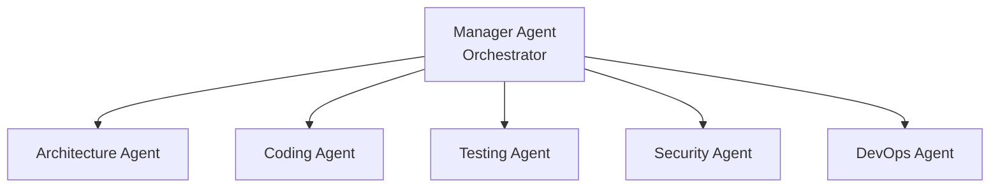
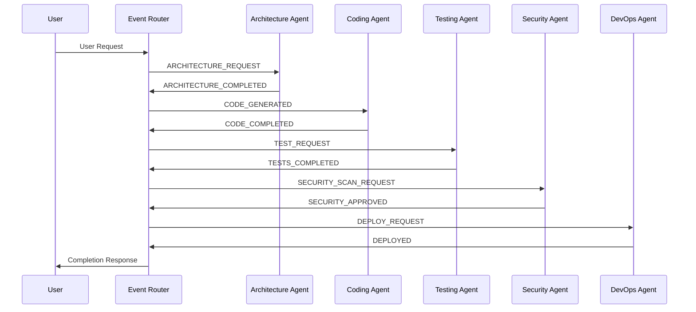
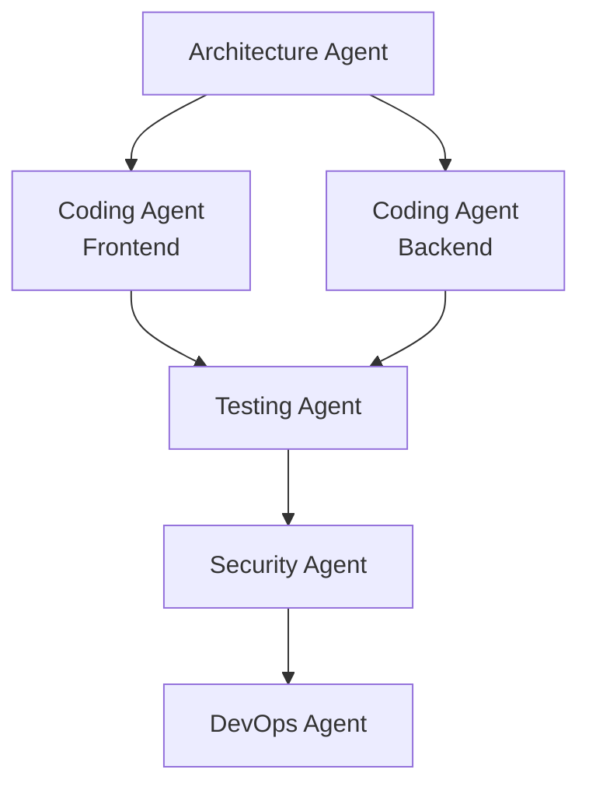
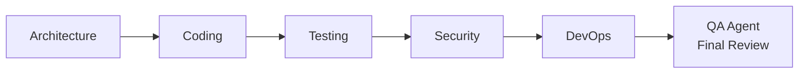

## The Multi-Agent Era Has Arrived

In 2025, AI development reached a new turning point. We've evolved from single AI agents handling all tasks to <strong>multi-agent systems where specialized agents collaborate</strong>.

One developer orchestrating five specialized agents to build a full-stack application—this is today's reality.

### Why Multi-Agent?

<strong>Limitations of Single Agents</strong>:
- Context window constraints (one AI can't remember everything)
- Lack of expertise (can't be proficient in all domains)
- No parallel processing (can only perform one task at a time)

<strong>Strengths of Multi-Agent Systems</strong>:
- <strong>Division of Labor & Specialization</strong>: Each agent focuses on specific areas
- <strong>Parallel Execution</strong>: Multiple tasks processed simultaneously
- <strong>Scalability</strong>: Functionality expands by adding new agents
- <strong>Resilience</strong>: One agent's failure doesn't affect the entire system

In practice, Toyota saved <strong>over 10,000 hours annually</strong> with multi-agent systems, while an e-commerce API project achieved <strong>70% bug reduction and 75% faster refactoring</strong>.

## Architecture of 5 Specialized Agents

The ideal agent configuration for full-stack application development:

### 1. Architecture Agent

<strong>Role</strong>: System design and structural decisions

<strong>Core Responsibilities</strong>:
- System architecture design (microservices, monolithic, serverless, etc.)
- Database schema design
- Technology stack selection
- Component interface definition
- Scalability and performance considerations

<strong>Output Example</strong>:
````markdown
## System Architecture

### Technology Stack
- Frontend: React 18 + TypeScript
- Backend: Node.js (Express) + TypeScript
- Database: PostgreSQL 15 + Redis (caching)
- Infrastructure: AWS (ECS Fargate, RDS, ElastiCache)

### Component Structure
```
frontend/
├── components/       # React components
├── hooks/           # Custom hooks
├── services/        # API clients
└── store/           # State management (Zustand)

backend/
├── domain/          # Business logic
├── application/     # Use cases
├── infrastructure/  # DB, external APIs
└── presentation/    # REST controllers
```

### Database Schema
```sql
CREATE TABLE users (
  id UUID PRIMARY KEY,
  email VARCHAR(255) UNIQUE NOT NULL,
  created_at TIMESTAMP DEFAULT NOW()
);

CREATE TABLE posts (
  id UUID PRIMARY KEY,
  user_id UUID REFERENCES users(id),
  title VARCHAR(255) NOT NULL,
  content TEXT,
  published_at TIMESTAMP
);
```
````

### 2. Coding Agent

<strong>Role</strong>: Code implementation and generation

<strong>Core Responsibilities</strong>:
- Implement Architecture Agent's designs into actual code
- Write business logic
- Implement API endpoints
- Develop frontend components
- Code review and refactoring

<strong>Real-World Results</strong>:
- <strong>35% reduction in implementation time</strong> (professional developer study)
- <strong>27% decrease in defect rates</strong>

<strong>Implementation Example</strong>:
```typescript
// Architecture Agent Design → Coding Agent Implementation

// domain/user.entity.ts
export class User {
  constructor(
    public readonly id: string,
    public readonly email: string,
    public readonly createdAt: Date
  ) {}

  static create(email: string): User {
    return new User(
      crypto.randomUUID(),
      email,
      new Date()
    );
  }
}

// application/user.service.ts
export class UserService {
  constructor(private userRepository: UserRepository) {}

  async createUser(email: string): Promise<User> {
    const existingUser = await this.userRepository.findByEmail(email);
    if (existingUser) {
      throw new Error('User already exists');
    }

    const user = User.create(email);
    await this.userRepository.save(user);
    return user;
  }
}

// presentation/user.controller.ts
export class UserController {
  constructor(private userService: UserService) {}

  async create(req: Request, res: Response) {
    try {
      const { email } = req.body;
      const userId = req.user!.id; // Injected by auth middleware

      const user = await this.userService.createUser(email);
      res.status(201).json(user);
    } catch (error) {
      res.status(400).json({ error: error.message });
    }
  }
}
```

### 3. Testing Agent

<strong>Role</strong>: Automated test creation and quality assurance

<strong>Core Responsibilities</strong>:
- Generate unit tests
- Write integration tests
- Implement E2E test scenarios
- Analyze test coverage
- Detect and report bugs

<strong>Test Example</strong>:
```typescript
// user.service.test.ts
describe('UserService', () => {
  let userService: UserService;
  let mockRepository: jest.Mocked<UserRepository>;

  beforeEach(() => {
    mockRepository = {
      findByEmail: jest.fn(),
      save: jest.fn(),
    } as any;
    userService = new UserService(mockRepository);
  });

  describe('createUser', () => {
    it('should create a new user successfully', async () => {
      const email = 'test@example.com';
      mockRepository.findByEmail.mockResolvedValue(null);
      mockRepository.save.mockResolvedValue(undefined);

      const user = await userService.createUser(email);

      expect(user.email).toBe(email);
      expect(mockRepository.save).toHaveBeenCalledWith(
        expect.objectContaining({ email })
      );
    });

    it('should throw error if user already exists', async () => {
      const email = 'existing@example.com';
      const existingUser = User.create(email);
      mockRepository.findByEmail.mockResolvedValue(existingUser);

      await expect(userService.createUser(email)).rejects.toThrow(
        'User already exists'
      );
    });

    it('should generate valid UUID for user ID', async () => {
      mockRepository.findByEmail.mockResolvedValue(null);
      const user = await userService.createUser('test@example.com');

      expect(user.id).toMatch(
        /^[0-9a-f]{8}-[0-9a-f]{4}-4[0-9a-f]{3}-[89ab][0-9a-f]{3}-[0-9a-f]{12}$/i
      );
    });
  });
});

// Integration test
describe('User API Integration', () => {
  it('POST /users should create user and return 201', async () => {
    const response = await request(app)
      .post('/users')
      .send({ email: 'integration@test.com' })
      .expect(201);

    expect(response.body).toMatchObject({
      email: 'integration@test.com',
      id: expect.any(String),
      createdAt: expect.any(String)
    });
  });
});
```

### 4. Security Agent

<strong>Role</strong>: Security vulnerability detection and defense

<strong>Core Responsibilities</strong>:
- Code security scanning
- Vulnerability detection (SQL injection, XSS, CSRF, etc.)
- Compliance verification (GDPR, HIPAA)
- Security recommendations
- Threat analysis and mitigation strategies

<strong>Security Checklist Example</strong>:
````markdown
## Security Checklist

### Input Validation
- [x] Validate all user inputs (Joi/Zod schemas)
- [x] Prevent SQL injection (parameterized queries)
- [x] Prevent XSS (input sanitization)
- [x] Validate file uploads (MIME types, size limits)

### Authentication & Authorization
- [x] Password hashing (bcrypt, cost factor 12)
- [x] JWT token expiration (access 15min, refresh 7days)
- [x] Rate limiting (100 requests per 15 minutes per IP)
- [x] Force HTTPS (production)

### Data Protection
- [x] Manage secrets via environment variables
- [x] Database encryption (at-rest, in-transit)
- [x] CORS whitelist configuration
- [x] Prevent sensitive information logging

### Compliance
- [x] GDPR: User data deletion API
- [x] Log retention policy (90 days)
- [x] Privacy policy update
````

<strong>Vulnerability Report Example</strong>:
```typescript
// ❌ Vulnerability detected by Security Agent
app.get('/user/:id', (req, res) => {
  const query = `SELECT * FROM users WHERE id = '${req.params.id}'`;
  // SQL Injection risk!
  db.query(query, (err, result) => {
    res.json(result);
  });
});

// ✅ Fix suggested by Security Agent
app.get('/user/:id', async (req, res) => {
  const { id } = req.params;

  // Input validation
  const schema = Joi.object({
    id: Joi.string().uuid().required()
  });
  const { error } = schema.validate({ id });
  if (error) {
    return res.status(400).json({ error: 'Invalid user ID' });
  }

  // Parameterized query
  const result = await db.query(
    'SELECT * FROM users WHERE id = $1',
    [id]
  );
  res.json(result.rows[0]);
});
```

### 5. DevOps Agent

<strong>Role</strong>: CI/CD, deployment, and monitoring

<strong>Core Responsibilities</strong>:
- CI/CD pipeline configuration
- Infrastructure provisioning (Terraform, CloudFormation)
- Containerization (Docker, Kubernetes)
- Monitoring and alerting setup
- Performance optimization

<strong>Real-World Results</strong>: Chemical industry case achieved <strong>30% reduction in quality failures</strong>

<strong>CI/CD Pipeline Example</strong>:
```yaml
# .github/workflows/deploy.yml
name: Deploy to Production

on:
  push:
    branches: [main]

jobs:
  test:
    runs-on: ubuntu-latest
    steps:
      - uses: actions/checkout@v3
      - name: Run Tests
        run: |
          npm ci
          npm test -- --coverage
          # Run tests generated by Testing Agent

  security:
    runs-on: ubuntu-latest
    steps:
      - uses: actions/checkout@v3
      - name: Security Scan
        run: |
          npm audit
          # Security checks defined by Security Agent
          npx snyk test

  build:
    needs: [test, security]
    runs-on: ubuntu-latest
    steps:
      - uses: actions/checkout@v3
      - name: Build Docker Image
        run: |
          docker build -t myapp:${{ github.sha }} .
          docker push myapp:${{ github.sha }}

  deploy:
    needs: build
    runs-on: ubuntu-latest
    steps:
      - name: Deploy to ECS
        run: |
          aws ecs update-service \
            --cluster production \
            --service myapp \
            --force-new-deployment

      - name: Health Check
        run: |
          # Health check defined by DevOps Agent
          for i in {1..30}; do
            if curl -f https://api.example.com/health; then
              echo "Deployment successful"
              exit 0
            fi
            sleep 10
          done
          echo "Deployment failed"
          exit 1
```

## Agent Orchestration Patterns

### 1. Hierarchical Orchestration

<strong>Structure</strong>: Manager agent coordinates 5 specialized agents



<strong>Advantages</strong>:
- Clear command structure
- Centralized progress tracking
- Easy debugging

<strong>Best For</strong>:
- Tasks with clear decomposition
- Need for centralized monitoring
- Teams preferring structured workflows

<strong>Implementation</strong> (using LangGraph):
```python
from langgraph.graph import StateGraph, END

# Define state
class AppState(TypedDict):
    requirements: str
    architecture: dict
    code: dict
    tests: dict
    security_report: dict
    deployment_config: dict

# Create graph
workflow = StateGraph(AppState)

# Add nodes (each node = agent)
workflow.add_node("architect", architecture_agent)
workflow.add_node("coder", coding_agent)
workflow.add_node("tester", testing_agent)
workflow.add_node("security", security_agent)
workflow.add_node("devops", devops_agent)

# Add edges (task flow)
workflow.add_edge("architect", "coder")
workflow.add_edge("coder", "tester")
workflow.add_edge("tester", "security")
workflow.add_edge("security", "devops")
workflow.add_edge("devops", END)

# Set entry point
workflow.set_entry_point("architect")

# Execute
app = workflow.compile()
result = app.invoke({
    "requirements": "Build a REST API for user management"
})
```

### 2. Event-Driven Architecture

<strong>Structure</strong>: Asynchronous event streaming between agents

<strong>Advantages</strong>:
- Service decoupling (agents only know event router)
- Fault isolation (one agent failure doesn't cascade)
- Scalable coordination
- Real-time processing

<strong>Event Flow Example</strong>:


<strong>Redis Streams Implementation</strong>:
```typescript
import Redis from 'ioredis';

const redis = new Redis();

// Architecture Agent: Publish event
async function publishArchitectureComplete(architecture: any) {
  await redis.xadd(
    'agent-events',
    '*',
    'type', 'ARCHITECTURE_COMPLETED',
    'data', JSON.stringify(architecture),
    'timestamp', Date.now().toString()
  );
}

// Coding Agent: Subscribe to events
async function listenForArchitecture() {
  const consumer = redis.duplicate();

  // Create consumer group
  await consumer.xgroup(
    'CREATE', 'agent-events', 'coding-group', '0', 'MKSTREAM'
  ).catch(() => {}); // Ignore if already exists

  while (true) {
    const events = await consumer.xreadgroup(
      'GROUP', 'coding-group', 'coder-1',
      'BLOCK', 5000,
      'STREAMS', 'agent-events', '>'
    );

    if (!events) continue;

    for (const [stream, messages] of events) {
      for (const [id, fields] of messages) {
        const event = parseEvent(fields);

        if (event.type === 'ARCHITECTURE_COMPLETED') {
          await generateCode(event.data);
          await redis.xack('agent-events', 'coding-group', id);
        }
      }
    }
  }
}
```

### 3. Graph-Based Orchestration

<strong>Structure</strong>: DAG (Directed Acyclic Graph) for dependency expression

<strong>Advantages</strong>:
- Visual workflow representation
- Parallel task execution
- Clear dependency management

<strong>Parallel Execution Example</strong>:


## Inter-Agent Communication Protocols

### Model Context Protocol (MCP)

<strong>Developer</strong>: Anthropic (2024 open-source), officially adopted by OpenAI (March 2025)

<strong>Purpose</strong>: Vertical communication between agent ↔ tools/memory

<strong>Features</strong>:
- JSON-RPC client-server interface
- Secure context injection
- Structured tool invocation
- Resource management
- Access control enforcement

<strong>Usage Example</strong>:
```json
// MCP Request: Coding Agent → Database Tool
{
  "jsonrpc": "2.0",
  "id": 1,
  "method": "tools/call",
  "params": {
    "name": "database_query",
    "arguments": {
      "query": "SELECT * FROM users WHERE id = $1",
      "params": ["user-123"]
    }
  }
}

// MCP Response
{
  "jsonrpc": "2.0",
  "id": 1,
  "result": {
    "content": [
      {
        "type": "text",
        "text": "{\"id\": \"user-123\", \"email\": \"test@example.com\"}"
      }
    ]
  }
}
```

<strong>Global Adoption</strong>: As of 2025, <strong>78% of global organizations use MCP or A2A protocols</strong>

### Agent-to-Agent Protocol (A2A)

<strong>Purpose</strong>: Horizontal communication between agents

<strong>Difference</strong>:
- MCP: When agents access tools or memory
- A2A: When agents communicate directly with each other

<strong>A2A Message Example</strong>:
```json
// Architecture Agent → Coding Agent
{
  "from": "architecture-agent",
  "to": "coding-agent",
  "type": "TASK_ASSIGNMENT",
  "payload": {
    "task_id": "impl-user-api",
    "architecture": {
      "pattern": "clean-architecture",
      "layers": ["domain", "application", "infrastructure", "presentation"],
      "database": "postgresql"
    },
    "deadline": "2025-10-17T10:00:00Z"
  },
  "metadata": {
    "priority": "high",
    "confidence_score": 0.95
  }
}

// Coding Agent → Architecture Agent (completion notification)
{
  "from": "coding-agent",
  "to": "architecture-agent",
  "type": "TASK_COMPLETED",
  "payload": {
    "task_id": "impl-user-api",
    "files_created": [
      "src/domain/user.entity.ts",
      "src/application/user.service.ts",
      "src/infrastructure/user.repository.ts",
      "src/presentation/user.controller.ts"
    ],
    "status": "success"
  }
}
```

## Error Handling and Resilience

### 1. Fallback Strategy

<strong>3-Level Fallback</strong>:
```typescript
async function executeWithFallback(task: Task) {
  try {
    // Level 1: Primary LLM (GPT-4)
    return await primaryAgent.execute(task);
  } catch (error) {
    console.warn('Primary agent failed, trying fallback');

    try {
      // Level 2: Alternative LLM (Claude)
      return await fallbackAgent.execute(task);
    } catch (fallbackError) {
      // Level 3: Human-in-the-Loop
      return await escalateToHuman(task, [error, fallbackError]);
    }
  }
}
```

### 2. Canary Deployment

<strong>Agent Deployment Strategy</strong>:
```yaml
# Canary deployment: 5% → 50% → 100%
deployment:
  strategy: canary
  steps:
    - percentage: 5
      duration: 1h
      metrics:
        - error_rate < 1%
        - response_time < 200ms

    - percentage: 50
      duration: 2h
      metrics:
        - error_rate < 0.5%
        - user_satisfaction > 4.5/5

    - percentage: 100
      # Full rollout only if all metrics pass
```

### 3. Circuit Breaker Pattern

<strong>Prevent Failure Cascade Between Agents</strong>:
```typescript
class CircuitBreaker {
  private failureCount = 0;
  private lastFailureTime: number | null = null;
  private state: 'CLOSED' | 'OPEN' | 'HALF_OPEN' = 'CLOSED';

  async call(agent: Agent, task: Task) {
    if (this.state === 'OPEN') {
      if (Date.now() - this.lastFailureTime! > 60000) {
        // Retry after 1 minute
        this.state = 'HALF_OPEN';
      } else {
        throw new Error('Circuit breaker is OPEN');
      }
    }

    try {
      const result = await agent.execute(task);
      this.onSuccess();
      return result;
    } catch (error) {
      this.onFailure();
      throw error;
    }
  }

  private onSuccess() {
    this.failureCount = 0;
    this.state = 'CLOSED';
  }

  private onFailure() {
    this.failureCount++;
    this.lastFailureTime = Date.now();

    if (this.failureCount >= 5) {
      this.state = 'OPEN';
      console.error('Circuit breaker opened after 5 failures');
    }
  }
}
```

## Best Practices

### 1. Agent Responsibility Separation

<strong>Principle</strong>: Each agent focuses on a single domain

````markdown
✅ Good Example:
- Architecture Agent: System design only
- Coding Agent: Code implementation only
- Testing Agent: Testing only

❌ Bad Example:
- All-in-One Agent: Design + Coding + Testing + Deployment all together
````

<strong>Benefits</strong>:
- Reduced complexity
- Easier debugging
- Prevents context window overload
- More robust systems

### 2. Add QA Stage

<strong>Final Review Stage</strong>:


<strong>QA Agent Responsibilities</strong>:
- Review all agent outputs
- Verify consistency
- Confirm quality criteria are met
- Request rework from relevant agents if issues found

### 3. Human-in-the-Loop Integration

<strong>When Should Humans Intervene?</strong>

| Situation | HITL Needed? | Reason |
|-----------|-------------|---------|
| Simple CRUD API implementation | ❌ | Fully automatable |
| Complex business logic decisions | ✅ | Domain expert judgment required |
| Security vulnerability fixes | ✅ | Critical security decisions |
| General test creation | ❌ | Automatable |
| Production deployment approval | ✅ | Final review needed |
| Infrastructure changes | ✅ | Cost and impact considerations |

<strong>Implementation Example</strong>:
```typescript
async function deployToProduction(deployment: Deployment) {
  // DevOps Agent creates deployment plan
  const plan = await devopsAgent.createDeploymentPlan(deployment);

  // Request human approval
  const approval = await requestHumanApproval({
    title: 'Production Deployment Approval',
    plan: plan,
    estimatedDowntime: '0 minutes',
    risks: ['Database migration', 'Config changes'],
    rollbackPlan: plan.rollbackStrategy
  });

  if (!approval.approved) {
    throw new Error(`Deployment rejected: ${approval.reason}`);
  }

  // Proceed with deployment after approval
  return await devopsAgent.execute(plan);
}
```

### 4. Observability

<strong>5 Essential Observability Areas</strong> (Microsoft Azure recommendations):

1. <strong>Comprehensive Logging</strong>:
```typescript
class AgentLogger {
  log(agent: string, event: string, data: any) {
    console.log(JSON.stringify({
      timestamp: new Date().toISOString(),
      agent: agent,
      event: event,
      data: data,
      trace_id: getTraceId()
    }));
  }
}

// Usage
logger.log('coding-agent', 'task-started', {
  task_id: 'impl-user-api',
  estimated_duration: '5m'
});
```

2. <strong>Performance Metrics</strong>:
```typescript
const metrics = {
  agent_execution_time: new Histogram({
    name: 'agent_execution_seconds',
    help: 'Agent execution time',
    labelNames: ['agent_name', 'task_type']
  }),

  agent_errors: new Counter({
    name: 'agent_errors_total',
    help: 'Total agent errors',
    labelNames: ['agent_name', 'error_type']
  })
};

// Usage
const timer = metrics.agent_execution_time.startTimer({
  agent_name: 'coding-agent',
  task_type: 'generate-code'
});

try {
  await codingAgent.execute(task);
} catch (error) {
  metrics.agent_errors.inc({
    agent_name: 'coding-agent',
    error_type: error.constructor.name
  });
} finally {
  timer();
}
```

3. <strong>Quality and Safety Standards Verification</strong>
4. <strong>Compliance Monitoring</strong>
5. <strong>User Experience Optimization</strong>

## Future Outlook

### 2025: "The Year of Agentic AI"

Industry leader consensus: <strong>2025 is the year of agentic AI</strong>

<strong>Key Trends</strong>:

1. <strong>Trillion-Dollar Market Opportunity</strong>
   - AI software development stack: Trillion-dollar market
   - 30 million developers worldwide using AI coding assistants
   - Productivity gains creating trillions in global GDP value

2. <strong>From Prototype to Production</strong>
   - 2023-2024: Generative AI (GPT, image generation)
   - 2025+: Autonomous agentic systems (real work automation)

3. <strong>Protocol Standardization</strong>
   - <strong>78% of global organizations</strong> use MCP or A2A protocols
   - Industry-wide interoperability

4. <strong>Sovereign AI</strong>
   - Data sovereignty and geopolitical resilience
   - Compliance and auditability for autonomous agents
   - Critical infrastructure deployment

5. <strong>Self-Healing Systems</strong>
   - Autonomous error detection and recovery
   - Adaptive system resilience
   - Problem-solving without human intervention

### Redefining the Developer Role

<strong>Before (Traditional Development)</strong>:
- Code writing 70% + Design 20% + Testing 10%

<strong>After (Agent Orchestration)</strong>:
- Requirements definition 30% + Agent management 40% + Verification 20% + Optimization 10%

<strong>Core Skills Transformation</strong>:

| Traditional Skill | Importance | New Core Skill |
|------------------|-----------|----------------|
| Coding speed | ↓↓ | Requirements clarification |
| Syntax knowledge | ↓ | System architecture |
| Debugging | → | Agent prompt engineering |
| Algorithms | → | Multi-agent orchestration |
| Code review | ↓ | Agent output validation |

## Getting Started

### Week 1: Framework Selection and Learning

```bash
# Install LangGraph (recommended: production systems)
pip install langgraph langchain-openai

# Or CrewAI (recommended: rapid prototyping)
pip install crewai langchain-openai

# Set environment variables
export OPENAI_API_KEY="your-api-key"
```

<strong>Learning Resources</strong>:
- [LangGraph Official Tutorial](https://blog.langchain.com/langgraph-multi-agent-workflows/)
- [CrewAI GitHub](https://github.com/crewAIInc/crewAI)

### Week 2: Small-Scale Project Implementation

<strong>Recommended Starting Project</strong>:
- Simple REST API (2-3 endpoints)
- Use only Architecture Agent + Coding Agent
- Manual testing and deployment

### Week 3: Expand to Full Pipeline

<strong>Integrate All 5 Agents</strong>:
- Add Testing Agent → Automated tests
- Add Security Agent → Security scanning
- Add DevOps Agent → CI/CD pipeline

### After 1 Month: Production Deployment

<strong>Measure Results</strong>:
- Development speed improvement rate
- Bug reduction rate
- Test coverage
- Team satisfaction

## Conclusion

Multi-agent systems are no longer the future. They are <strong>a reality you can apply right now</strong>.

<strong>Key Takeaways</strong>:
1. <strong>5 Specialized Agents</strong>: Architecture, Coding, Testing, Security, DevOps
2. <strong>Orchestration Patterns</strong>: Hierarchical, Event-Driven, Graph-Based
3. <strong>Communication Protocols</strong>: MCP (tool access), A2A (agent-to-agent)
4. <strong>Resilience</strong>: Fallback, Circuit Breaker, Canary deployment
5. <strong>Best Practices</strong>: Responsibility separation, QA stage, HITL, observability

<strong>Real-World Results</strong>:
- Toyota: <strong>10,000 hours saved annually</strong>
- E-commerce API: <strong>70% bug reduction, 75% faster refactoring</strong>
- Professional developers: <strong>35% faster implementation, 27% fewer defects</strong>

A new era has arrived where you can orchestrate 5 AI agents to build full-stack applications, even as a solo developer.

## References

### Official Documentation
- [LangGraph Multi-Agent Workflows](https://blog.langchain.com/langgraph-multi-agent-workflows/)
- [Microsoft Agent Framework](https://azure.microsoft.com/en-us/blog/introducing-microsoft-agent-framework/)
- [AWS Multi-Agent Orchestration](https://aws.amazon.com/solutions/guidance/multi-agent-orchestration-on-aws/)

### Framework Comparisons
- [LangGraph vs AutoGen vs CrewAI Comparison](https://www.datagrom.com/data-science-machine-learning-ai-blog/langgraph-vs-autogen-vs-crewai-comparison-agentic-ai-frameworks)
- [Nuvi: AI Agent Framework Comparison](https://www.nuvi.dev/blog/ai-agent-framework-comparison-langgraph-crewai-openai-swarm)

### Real-World Case Studies
- [Google Cloud: 101 Gen AI Use Cases](https://cloud.google.com/transform/101-real-world-generative-ai-use-cases-from-industry-leaders)
- [McKinsey: Seizing the Agentic AI Advantage](https://www.mckinsey.com/capabilities/quantumblack/our-insights/seizing-the-agentic-ai-advantage)

### Academic Papers
- [AgentOrchestra: Hierarchical Multi-Agent Framework](https://arxiv.org/html/2506.12508v1)
- [Survey of Agent Interoperability Protocols](https://arxiv.org/html/2505.02279v1)
- [Multi-Agent Collaboration Mechanisms](https://arxiv.org/html/2501.06322v1)

---

<strong>Next Article</strong>: [Self-Healing AI Systems: Building Agents That Automatically Fix Bugs Without Human Intervention](/en/blog/en/self-healing-ai-systems) will cover implementation methods for Self-Healing Systems, one of the core trends of 2025, with practical code examples.
