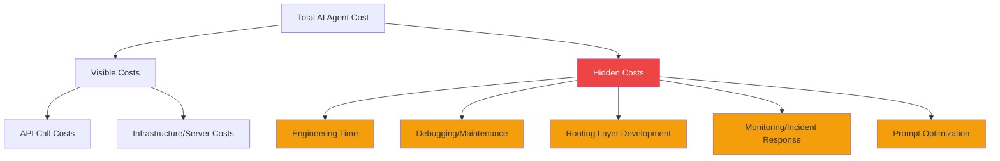
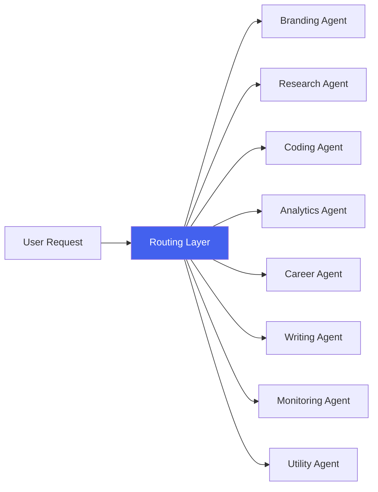
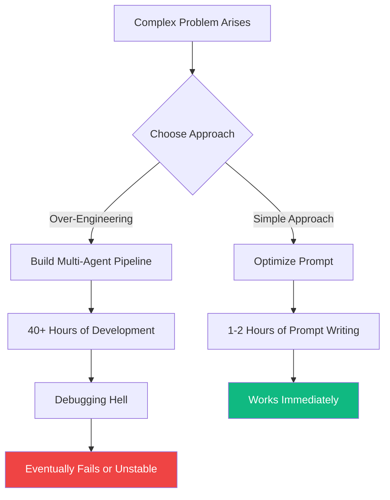

## AI Agents Are Not Magic

Expectations for AI agents are exploding. Stories about "letting agents handle things to cut labor costs" are everywhere. But speaking as someone who actually runs 8 AI agents in production, **reality is far more nuanced**.

In this article, I'll analyze the real operational costs of AI agents with data and share honest experiences from the perspective that "AI agents aren't magic—they're tradeoffs."

## The Shocking Data: AI Moderation vs Human Moderation

A recent English-language analysis has been making waves. It calculated the cost structure of autonomous moderation using AI agents, and the results are surprising:

| Item | AI Agent Moderation | Human Moderator |
|------|-------------------|-----------------|
| **Monthly Cost** | $1,350 – $2,250 | ~$1,200 |
| **24/7 Operation** | ✅ Possible | ❌ Requires shifts |
| **Judgment Consistency** | High (prompt-dependent) | Variable |
| **Context Understanding** | Limited | High |
| **Initial Setup Cost** | High | Low |

The key takeaway: **API call costs alone can exceed human moderator salaries**. When you need 24/7 autonomous operation, high-volume processing, and complex decision-making, costs climb even higher.

## The Reality of Running 8 AI Agents: Cost Structure Dissection

I currently operate 8 AI agents in production. Each handles specialized roles: branding, research, coding, analytics, and more. Here's the cost structure I've experienced firsthand.

### 1. API Costs: The Tip of the Iceberg

```
Monthly API Cost Breakdown (Example)
├── Claude API (primary model)     : ~$150-300/mo
├── GPT-4 API (secondary model)    : ~$50-100/mo
├── Image generation API           : ~$20-50/mo
├── Search/scraping API            : ~$30-60/mo
└── Other (embeddings, TTS, etc.)  : ~$20-40/mo
────────────────────────────────────
Total                              : ~$270-550/mo
```

Looking at API costs alone, you might think "that's cheap!" But this is just the tip of the iceberg.

### 2. Hidden Costs: Where the Real Money Goes



The real cost structure looks like this:

| Cost Item | Monthly Estimate | Notes |
|-----------|-----------------|-------|
| API Costs | $270-550 | Scales with usage |
| Infrastructure (servers, DB) | $50-100 | Fixed costs |
| Engineering Time | **$500-2,000+** | Largest cost |
| Incident Response/Debugging | $200-500 | Unpredictable |
| **Total** | **$1,020-3,150+** | |

**Engineering time is overwhelmingly the largest cost.** Miss this, and your cost calculations are completely off.

## The Routing Layer: The Biggest Challenge

The most difficult and expensive part of running 8 AI agents is the **routing layer**.



Problems the routing layer must solve:

- **Intent Classification**: Which agent should handle this user request?
- **Context Passing**: How do agents share state with each other?
- **Error Handling**: How do you recover when an agent fails?
- **Cost Optimization**: How do you mix expensive and cheap models effectively?

The time spent building and stabilizing this routing layer exceeds all other costs combined.

## The Over-Engineering Trap: 40 Hours vs 1 Prompt

The most painful lesson from AI agent development:

> **Spent 40 hours building a complex agent pipeline that failed. Solved it with a single well-crafted prompt.**

This isn't just my experience. It's a pattern repeatedly reported in AI agent communities:



### Over-Engineering Checklist

If you see these signs, step back:

- ✅ You're designing 3+ levels of "agents calling agents" chains
- ✅ You're creating inter-agent communication protocols
- ✅ You're using an LLM for a problem that a simple if-else could solve
- ✅ You're designing architecture before testing with a single prompt

**Rule of Thumb**: Try a single prompt first. Only split into agents when that fails.

## So When Are AI Agents Actually Useful?

Looking at costs alone, you might conclude "just hire a person." But there are areas where AI agents have clear advantages:

| AI Agents Excel | Humans Excel |
|----------------|-------------|
| 24/7 uninterrupted processing | Complex contextual judgment |
| High-volume repetitive tasks | Creative/emotional decisions |
| Fast response time is critical | Stakeholder persuasion |
| Consistent criteria application | Exception handling |
| Personal productivity scaling (solo teams) | Team collaboration/communication |

AI agents are overwhelmingly effective for **scaling personal productivity as a solo developer or small team**. My 8 agents serve exactly this purpose—the key mindset is not "replacing humans" but "expanding what one person can accomplish."

## Practical Cost Optimization Tips

Cost optimization strategies from running 8 agents:

### 1. Model Tiering Strategy

```
Model allocation by task complexity:
├── High complexity (10%): Claude Opus / GPT-4 → Architecture decisions, complex analysis
├── Medium complexity (30%): Claude Sonnet / GPT-4o → Code generation, documentation
└── Low complexity (60%): Claude Haiku / GPT-4o-mini → Classification, summarization, formatting
```

This strategy alone can reduce API costs by **40-60%**.

### 2. Caching and Batch Processing

- Cache results for identical prompt patterns
- Batch non-real-time tasks together
- Always cache embedding results (recomputation is expensive)

### 3. Minimize Failure Costs

- Always implement timeout and retry logic
- Pre-validate with cheaper models before expensive model calls
- Design graceful degradation for agent failures

## Conclusion: Recognize the Tradeoffs

AI agents aren't magic. They're **engineering tools with clear tradeoffs**.

Key lessons:

1. **API costs are only part of the total cost.** You must include engineering time, maintenance, and incident response.
2. **The routing layer is the biggest technical challenge.** The real difficulty in multi-agent systems isn't individual agents—it's orchestration.
3. **Beware over-engineering.** A single well-crafted prompt can beat 40 hours of complex pipeline work.
4. **Use them for the right purpose.** Excellent for personal productivity scaling, but may cost more than humans for simple labor replacement.

For those considering AI agent adoption: **Start with a small prompt and only scale to agents when needed.** That's the most valuable lesson from running 8 agents.

## References

- [AI Content Moderation Cost Analysis](https://www.getrevue.co/) — AI moderation cost $1,350-2,250/month analysis
- [Anthropic Claude API Pricing](https://www.anthropic.com/pricing) — Claude model pricing
- [OpenAI API Pricing](https://openai.com/pricing) — GPT model pricing
- [Building Effective Agents - Anthropic](https://docs.anthropic.com/en/docs/build-with-claude/agents) — Agent design pattern guide
