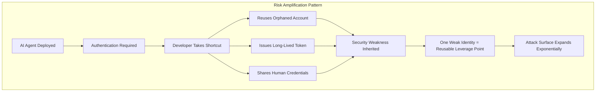

## The Rise of an Invisible Threat

As of March 2026, approximately 70% of enterprises are already running AI agents in production. Customer support bots, code review agents, data pipeline automation, security monitoring agents — they're operating 24/7 inside your infrastructure.

But how many enterprises actually know **where these agents are, what they're doing, and whose permissions they're operating under** in real time?

According to a joint survey by Strata Identity and the Cloud Security Alliance (CSA) covering 285 IT and security professionals, <strong>nearly 80% of respondents cannot track their AI agents' real-time behavior</strong>. This is the "Identity Dark Matter" problem — and it's becoming the fastest-growing enterprise security challenge of 2026.

## What Is Identity Dark Matter?

Like dark matter in the universe, identity dark matter is **risk that exists but cannot be seen**. Traditional IAM (Identity and Access Management) systems were designed around the human lifecycle: employees join, access is provisioned, they leave, access is revoked. But AI agents don't go through HR. They don't have start dates, exit interviews, or offboarding checklists.

Agents become invisible through several common patterns:

- <strong>Direct use of API keys or service accounts</strong>: Non-human entities authenticating with human tokens
- <strong>Hardcoded credentials in pipelines</strong>: Agent credentials embedded in CI/CD workflows, Lambda functions, or containers
- <strong>Shadow AI</strong>: Agents built by dev teams without IT approval or visibility
- <strong>Inherited permissions</strong>: An employee leaves, but their service account lives on, still powering an agent

In all these cases, the agent exists **completely outside the IAM system's line of sight**.

## The Governance Gap in Numbers

The CSA survey data paints a stark picture:

```
AI Agent Identity Management Reality (2026)
────────────────────────────────────────────────────
Security leaders "highly confident" their IAM
can manage agent identities effectively          → 18%
                    (82% express moderate to no confidence)

Authentication methods in use
  Static API keys                                → 44%
  Username / password combinations               → 43%
  Shared service accounts                        → 35%

Visibility
  Can trace agent actions to a human sponsor     → 28%
  Maintain real-time active agent inventory      → 21%
  Can determine agent behavior in real time      → ~20%

Governance
  Have formal enterprise-wide agent ID strategy  → 23%
  Rely on informal practices                     → 37%
  Confident passing compliance audits            → <50%
────────────────────────────────────────────────────
```

The most alarming number here is **21%** — fewer than one in five enterprises maintains a real-time inventory of their active agents. Most organizations don't even know how many agents are running in their environment right now.

## How Risk Compounds

AI agents naturally gravitate toward whatever path offers **least resistance**. In practice, this means they tend to exploit existing security weaknesses in your infrastructure — not maliciously, but because that's the path that works.



As reported by The Hacker News in March 2026, one real-world case involved an agent exploiting a retired employee's orphaned account because it was the path that "just worked." That single account became a **shared shortcut for multiple agents** — meaning a single breach could cascade across an entire agent fleet.

## 5 Steps EMs and CTOs Can Take Right Now

### Step 1: Build an Agent Inventory

Ask your team today: "How many AI agents are currently running in our environment?" Most teams won't have a precise answer. An inventory is where visibility begins.

```bash
# Find AI agent-related service accounts in Kubernetes
kubectl get serviceaccounts --all-namespaces | grep -i "agent\|bot\|ai\|llm\|claude\|gpt"

# Find AI agent-related IAM roles in AWS
aws iam list-roles --query 'Roles[?contains(RoleName, `agent`) || contains(RoleName, `bot`)]'
```

### Step 2: Assign a Human Sponsor to Every Agent

Every agent needs an **accountable human owner**. The goal is to shift from "the agent did it" to "the agent acted under [person's] ownership." Make ownership explicit and documented.

Example inventory record:

```
Agent Name:      code-review-agent-prod
Purpose:         Automated PR code review
Human Sponsor:   Engineering Manager
Permissions:     GitHub Read, Jira Write
Last Audited:    2026-03-01
Next Audit Due:  2026-06-01
```

### Step 3: Replace Static Credentials with Dynamic Tokens

Static API keys — used by 44% of organizations — are the most dangerous authentication method. A key that never expires creates permanent risk if compromised.

Recommended migration paths:

- <strong>AWS</strong>: IAM Roles + temporary credentials (STS AssumeRole)
- <strong>GCP</strong>: Workload Identity Federation + short-lived tokens
- <strong>Azure</strong>: Managed Identity
- <strong>Universal</strong>: HashiCorp Vault Dynamic Secrets

### Step 4: Apply the Principle of Least Privilege to Agents

Giving agents broad permissions "just in case" is a common mistake. Restrict agent access to only what's required for their specific function.

```yaml
# Bad: Overly broad permissions
agent-permissions:
  - s3:*
  - rds:*
  - lambda:*

# Good: Minimum necessary permissions
agent-permissions:
  - s3:GetObject
  - s3:PutObject
  resources:
    - "arn:aws:s3:::blog-assets/*"
  condition:
    time-based: "09:00-18:00 JST"
```

### Step 5: Build Agent Action Audit Logs

If you can't trace what an agent did, you can't investigate incidents. Log all agent actions and tie them back to their human sponsor.

```python
# Agent action audit log structure
audit_log = {
    "timestamp": "2026-03-14T10:30:00Z",
    "agent_id": "code-review-agent-001",
    "human_sponsor": "em@company.com",
    "action": "github.create_review_comment",
    "resource": "github.com/org/repo/pull/123",
    "decision_context": {
        "policy_version": "v2.1",
        "risk_score": 0.12,
        "approved": True
    }
}
```

## Where Microsoft and CyberArk Are Heading

In January 2026, Microsoft Security Blog named AI agent identity management as the #1 priority in its "Four Priorities for AI-Powered Identity and Network Access Security in 2026" report. CyberArk identifies Non-Human Identity (NHI) management as the fastest-growing category in enterprise identity security investment for 2026.

There's also a positive signal: **40% of CSA survey respondents are increasing identity and security budgets specifically for AI agent risks**. Organizations that recognize the problem are moving quickly.

## Practical Takeaways for Engineering Managers

From an EM's perspective, this isn't a problem you can simply hand off to the security team. If you're leading teams that deploy AI agents, here are three principles to embed in your team culture:

<strong>1. "Agents are team members"</strong>: Apply the same onboarding process to new agents that you'd apply to new hires. Document the agent's purpose, permissions, sponsor, and audit schedule before it goes to production.

<strong>2. Regular agent audits</strong>: Once a quarter, review your team's full agent inventory. Decommission agents that are no longer needed — and revoke their credentials immediately.

<strong>3. Identity debt in the sprint backlog</strong>: Just as you track technical debt, track identity debt: static keys, excessive permissions, stale tokens. Add remediation tasks to sprint backlogs.

## Conclusion: What You Can't See Can Hurt You

"The agents are handling themselves fine" is the most dangerous assumption in modern enterprise security. As AI agent adoption continues to outpace governance maturity, <strong>identity dark matter is becoming 2026's fastest-expanding enterprise security threat</strong>.

The gap between 70% of enterprises running agents and only 23% having formal governance strategies — that's the space that Engineering Managers and CTOs need to close right now.

Deploying agents is important. But ensuring those agents operate as **visible, accountable entities** is just as critical. An agent without an identity is like someone walking alone in the dark — no one knows there's a problem until something goes wrong.

---

*Sources: [AI Agents: The Next Wave Identity Dark Matter](https://thehackernews.com/2026/03/ai-agents-next-wave-identity-dark.html) (The Hacker News, March 2026), [The AI Agent Identity Crisis](https://www.strata.io/blog/agentic-identity/the-ai-agent-identity-crisis-new-research-reveals-a-governance-gap/) (Strata Identity / CSA Survey, 2026), [AI Agents and Identity Risks](https://www.cyberark.com/resources/blog/ai-agents-and-identity-risks-how-security-will-shift-in-2026) (CyberArk, January 2026)*
