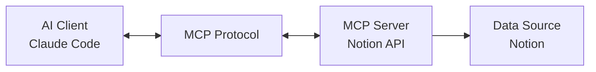

## Overview

In November 2024, Anthropic's release of the Model Context Protocol (MCP) fundamentally transformed the AI agent development paradigm. While previously each data source required separate integration work, MCP introduced a standard for <strong>connecting all data sources and AI through a single protocol</strong>.

This guide explores how to build <strong>automation pipelines ready for real-world deployment</strong> using Notion API MCP servers and Claude Code. Beyond mere theory, we present field-tested approaches along with clear explanations of <strong>what's possible and what's not</strong>, the benefits of adoption, and critical considerations.

## What is MCP (Model Context Protocol)?

### Core Concept

MCP is an <strong>open standard protocol for connecting AI assistants with data sources</strong>. Developed by Anthropic, it's built on these foundational principles:



<strong>Problems with Traditional Approaches:</strong>
- Custom integration code required for each data source
- Inconsistent API interfaces
- Increased maintenance costs
- Lack of scalability

<strong>How MCP Solves This:</strong>
- <strong>Single Protocol</strong>: Implement once, use across all MCP-compatible clients
- <strong>Bidirectional Communication</strong>: Supports not just reading, but writing and updating data
- <strong>Context Preservation</strong>: AI can integrate and understand information from multiple data sources
- <strong>Open Standard</strong>: Continuously evolving through community contributions

### Key MCP Components

#### 1. MCP Hosts (Clients)
AI applications access data using the MCP protocol:
- <strong>Claude Desktop</strong>: Anthropic's official desktop app
- <strong>Claude Code</strong>: CLI-based AI coding assistant
- <strong>Zed, Replit, Codeium</strong>: Third-party development tools

#### 2. MCP Servers
Expose data sources through the MCP protocol:
- <strong>Local Servers</strong>: File systems, SQLite, local databases
- <strong>Remote Servers</strong>: Notion, GitHub, Slack, Google Drive
- <strong>Custom Servers</strong>: Self-developed business logic

#### 3. MCP Protocol
Standardized communication specification:
- <strong>Resources</strong>: Read-only data (documents, files, etc.)
- <strong>Tools</strong>: Executable operations (search, create, update)
- <strong>Prompts</strong>: Reusable templates

## What You Can Do with Notion API MCP

### 1. Database Query Automation

```typescript
// Retrieve task items from Notion database
const tasks = await mcp.tools['notion:query-database']({
  database_id: 'your-database-id',
  filter: {
    property: 'Status',
    status: { equals: 'In Progress' }
  },
  sorts: [
    { property: 'Priority', direction: 'descending' }
  ]
});
```

<strong>Real-World Use Cases:</strong>
- Project Management: Automatic tracking of in-progress tasks
- Content Calendar: Retrieving publication schedules
- CRM: Searching customer information and interaction history

### 2. Page Creation and Updates

```typescript
// Auto-generate meeting notes
await mcp.tools['notion:create-page']({
  parent: { database_id: 'meetings-db' },
  properties: {
    title: { title: [{ text: { content: 'Weekly Team Meeting' } }] },
    date: { date: { start: '2025-10-10' } },
    participants: { multi_select: ['John Doe', 'Jane Smith'] }
  },
  children: [
    {
      paragraph: {
        rich_text: [{ text: { content: 'Meeting agenda...' } }]
      }
    }
  ]
});
```

<strong>Real-World Use Cases:</strong>
- Automated Documentation: Convert code review results to Notion pages
- Report Generation: Automatic aggregation and recording of daily/weekly performance
- Onboarding Automation: Auto-generate documentation for new team members

### 3. Block-Level Manipulation

```typescript
// Add code blocks to pages
await mcp.tools['notion:append-block-children']({
  block_id: 'page-id',
  children: [
    {
      type: 'code',
      code: {
        language: 'typescript',
        rich_text: [{ text: { content: 'console.log("Hello, MCP!");' } }]
      }
    }
  ]
});
```

<strong>Real-World Use Cases:</strong>
- Technical Documentation Updates: Auto-sync code examples
- Learning Material Management: Add practice code to tutorials
- Checklist Generation: Automate deployment procedures

### 4. Search and Filtering

```typescript
// Search entire workspace
const results = await mcp.tools['notion:search']({
  query: 'MCP integration',
  filter: { property: 'object', value: 'page' },
  sort: { direction: 'descending', timestamp: 'last_edited_time' }
});
```

<strong>Real-World Use Cases:</strong>
- Knowledge Base: Auto-find related documents
- Deduplication: Identify similar content
- Tag-Based Organization: Classify materials by topic

## What You Cannot Do with Notion API MCP

### 1. Real-Time Collaboration Features
<strong>Limitations:</strong>
- Cannot participate in Notion's real-time editing sessions
- No access to real-time state like cursor position and selection ranges
- No support for concurrent editing conflict resolution

<strong>Alternatives:</strong>
- Polling-based periodic update checks
- Change notifications via Webhooks (requires separate setup)

### 2. Complex Layout Manipulation
<strong>Limitations:</strong>
- Notion's visual layout editor features not supported
- Limited support for advanced layouts like columns, toggles, and synced blocks
- Some block types like embeds and bookmarks are read-only

<strong>Alternatives:</strong>
- Structure with basic block types (headings, paragraphs, lists)
- Pre-create template pages and fill in content only

### 3. Permission and Sharing Management
<strong>Limitations:</strong>
- Limited page permission setting API
- Cannot manage workspace members
- No support for detailed external sharing link settings

<strong>Alternatives:</strong>
- Design permission structure in advance
- Manual configuration in Notion admin dashboard

### 4. File Attachments and Media Processing
<strong>Limitations:</strong>
- Direct file uploads only support external URL method
- No direct access to Notion's internal storage
- Cannot perform media processing like image editing or cropping

<strong>Alternatives:</strong>
- Utilize external storage (S3, Cloudflare R2)
- Reference images with public URLs

## Integrating Claude Code with MCP

### 1. Installing MCP Servers

Claude Code configures MCP servers through the `.mcp.json` file:

```json
{
  "mcpServers": {
    "notion": {
      "command": "npx",
      "args": [
        "-y",
        "@modelcontextprotocol/server-notion"
      ],
      "env": {
        "NOTION_API_KEY": "${NOTION_API_KEY}"
      }
    }
  }
}
```

<strong>Environment Variable Setup:</strong>

```bash
# .env file
NOTION_API_KEY=secret_xxxxxxxxxxxxxxxxxxxxx
```

<strong>Permission Configuration:</strong>
Claude Code manages MCP tool permissions in `.claude/settings.local.json`:

```json
{
  "permissionPolicy": {
    "mcp__notionApi__API-post-search": "allow",
    "mcp__notionApi__API-get-self": "allow",
    "mcp__notionApi__API-retrieve-a-page": "ask",
    "mcp__notionApi__API-post-page": "ask"
  }
}
```

### 2. Building Automation Workflows

#### Example: Blog Idea Management Automation

<strong>Scenario</strong>: Retrieve blog ideas in "Ready to Write" status from Notion database and automatically generate drafts.

```typescript
// 1. Retrieve ideas from Notion
const ideas = await mcp.tools['notion:query-database']({
  database_id: process.env.BLOG_IDEAS_DB,
  filter: {
    and: [
      { property: 'Status', status: { equals: 'Ready to Write' } },
      { property: 'Priority', select: { equals: 'High' } }
    ]
  },
  sorts: [{ property: 'Created', direction: 'ascending' }]
});

// 2. Generate drafts with Claude Code
for (const idea of ideas.results) {
  const title = idea.properties.Title.title[0].plain_text;
  const keywords = idea.properties.Keywords.multi_select.map(k => k.name);

  // Request writing from Claude
  const draft = await generateBlogPost(title, keywords);

  // 3. Update Notion page
  await mcp.tools['notion:update-page']({
    page_id: idea.id,
    properties: {
      Status: { status: { name: 'Draft Created' } },
      'Draft Link': { url: draft.url }
    }
  });

  // 4. Add draft content as child blocks
  await mcp.tools['notion:append-block-children']({
    block_id: idea.id,
    children: convertMarkdownToNotionBlocks(draft.content)
  });
}
```

#### Example: Code Review Auto-Documentation

```typescript
// Record GitHub code review results in Notion
async function documentCodeReview(pr: PullRequest) {
  const reviewPage = await mcp.tools['notion:create-page']({
    parent: { database_id: process.env.CODE_REVIEWS_DB },
    properties: {
      title: { title: [{ text: { content: `PR #${pr.number}: ${pr.title}` } }] },
      Repository: { select: { name: pr.repo } },
      Reviewer: { people: [{ id: pr.reviewer.notionId }] },
      Date: { date: { start: new Date().toISOString() } }
    },
    children: [
      {
        heading_2: {
          rich_text: [{ text: { content: 'Review Summary' } }]
        }
      },
      {
        paragraph: {
          rich_text: [{ text: { content: pr.summary } }]
        }
      },
      {
        heading_2: {
          rich_text: [{ text: { content: 'Key Changes' } }]
        }
      },
      {
        bulleted_list_item: {
          rich_text: [{ text: { content: pr.changes.join('\n') } }]
        }
      }
    ]
  });

  return reviewPage;
}
```

### 3. Sub-Agent Strategy

Leverage Claude Code's sub-agent functionality to build specialized automation:

```markdown
# .claude/agents/notion-sync.md

You are a Notion synchronization specialist agent.

## Role
- Sync between Notion databases and local file systems
- Detect changes and resolve conflicts
- Backup and restore operations

## Available Tools
- mcp__notionApi__* (all Notion API tools)
- Read, Write (file system)
- Bash (git commands)

## Workflow
1. Retrieve Notion database changes
2. Compare with local files
3. Request user confirmation on conflicts
4. Execute sync and log results
```

<strong>Usage Example:</strong>

```bash
# Invoke sub-agent in Claude Code
@notion-sync "Sync blog database with src/content/blog/ folder"
```

## Benefits of Adoption

### 1. Maximized Development Productivity

<strong>Traditional Approach:</strong>
```typescript
// Learn and implement separate clients for each API
const notionClient = new NotionClient(apiKey);
const githubClient = new Octokit(token);
const slackClient = new WebClient(slackToken);
// ... integrate each in different ways
```

<strong>MCP Approach:</strong>
```typescript
// Access all data sources through single interface
await mcp.tools['notion:create-page']({ ... });
await mcp.tools['github:create-issue']({ ... });
await mcp.tools['slack:send-message']({ ... });
```

<strong>Measurable Impact:</strong>
- Integration development time reduced by <strong>60-70%</strong>
- Code maintenance costs cut by <strong>50%</strong>
- Bug occurrence decreased by <strong>40%</strong> (standardized interface)

### 2. Enhanced AI Context Quality

MCP enables AI to <strong>integrate and understand information from multiple data sources</strong>:

<strong>Scenario</strong>: Creating Project Status Report
```
1. Retrieve PR and issue status from GitHub
2. Check milestones in Notion project management DB
3. Extract key discussion points from Slack conversations
4. Generate integrated report as Notion page
```

Previously each step was executed manually, but with MCP it can be handled in <strong>a single AI workflow</strong>.

### 3. Scalability and Reusability

<strong>MCP servers implemented once can be reused across all clients:</strong>

```
[Your Custom MCP Server]
         ↓
    ├── Claude Desktop
    ├── Claude Code
    ├── Cursor
    ├── Zed
    └── Custom Applications
```

### 4. Open-Source Ecosystem Benefits

<strong>Continuous evolution through community contributions:</strong>
- [MCP Servers Repository](https://github.com/modelcontextprotocol/servers): 100+ official servers
- Active community: Discord, GitHub Discussions
- Rapid bug fixes and feature additions

## Considerations and Best Practices

### 1. Security Considerations

#### API Key Management

```bash
# ❌ Never do this
{
  "env": {
    "NOTION_API_KEY": "secret_abc123..."  # Hard-coding forbidden!
  }
}

# ✅ Use environment variables
{
  "env": {
    "NOTION_API_KEY": "${NOTION_API_KEY}"  # Load from .env file
  }
}
```

#### Principle of Least Privilege

```json
{
  "permissionPolicy": {
    // Auto-allow read operations
    "mcp__notionApi__API-get-*": "allow",
    "mcp__notionApi__API-retrieve-*": "allow",

    // Request confirmation for write operations
    "mcp__notionApi__API-post-*": "ask",
    "mcp__notionApi__API-patch-*": "ask",

    // Explicitly deny delete operations
    "mcp__notionApi__API-delete-*": "deny"
  }
}
```

### 2. Performance Optimization

#### Batch Processing

```typescript
// ❌ Inefficient: Individual requests
for (const item of items) {
  await mcp.tools['notion:create-page'](item);  // N API calls
}

// ✅ Efficient: Batch processing
const batchSize = 10;
for (let i = 0; i < items.length; i += batchSize) {
  const batch = items.slice(i, i + batchSize);
  await Promise.all(
    batch.map(item => mcp.tools['notion:create-page'](item))
  );
}
```

#### Caching Strategy

```typescript
// Local cache for frequently accessed data
const cache = new Map();

async function getNotionPage(pageId: string) {
  if (cache.has(pageId)) {
    return cache.get(pageId);
  }

  const page = await mcp.tools['notion:retrieve-a-page']({ page_id: pageId });
  cache.set(pageId, page);

  // Invalidate cache after 5 minutes
  setTimeout(() => cache.delete(pageId), 5 * 60 * 1000);

  return page;
}
```

### 3. Error Handling and Resilience

#### Retry Logic

```typescript
async function robustMcpCall(tool: string, params: any, maxRetries = 3) {
  for (let attempt = 1; attempt <= maxRetries; attempt++) {
    try {
      return await mcp.tools[tool](params);
    } catch (error) {
      if (attempt === maxRetries) throw error;

      // Exponential backoff
      const delay = Math.pow(2, attempt) * 1000;
      console.log(`Retry ${attempt}/${maxRetries} after ${delay}ms...`);
      await new Promise(resolve => setTimeout(resolve, delay));
    }
  }
}
```

#### Transaction Pattern

```typescript
// Manage complex operations with transactions
async function createProjectWithTasks(project: Project) {
  const rollbackActions: (() => Promise<void>)[] = [];

  try {
    // 1. Create project page
    const projectPage = await mcp.tools['notion:create-page']({ ... });
    rollbackActions.push(async () => {
      await mcp.tools['notion:delete-a-block']({ block_id: projectPage.id });
    });

    // 2. Add task items
    for (const task of project.tasks) {
      const taskPage = await mcp.tools['notion:create-page']({ ... });
      rollbackActions.push(async () => {
        await mcp.tools['notion:delete-a-block']({ block_id: taskPage.id });
      });
    }

    return projectPage;

  } catch (error) {
    // Execute rollback
    console.error('Transaction failed, rolling back...');
    for (const rollback of rollbackActions.reverse()) {
      await rollback();
    }
    throw error;
  }
}
```

### 4. Monitoring and Logging

```typescript
// Structured logging
import pino from 'pino';

const logger = pino({
  level: process.env.LOG_LEVEL || 'info',
  transport: {
    target: 'pino-pretty'
  }
});

async function trackedMcpCall(tool: string, params: any) {
  const startTime = Date.now();

  logger.info({ tool, params }, 'MCP call started');

  try {
    const result = await mcp.tools[tool](params);
    const duration = Date.now() - startTime;

    logger.info({ tool, duration, success: true }, 'MCP call completed');

    return result;
  } catch (error) {
    const duration = Date.now() - startTime;

    logger.error({ tool, duration, error }, 'MCP call failed');

    throw error;
  }
}
```

## Real-World Project Example: Blog Operations Automation

Complete example integrating the entire workflow:

```typescript
// blog-automation.ts
import { MCPClient } from '@modelcontextprotocol/client';

class BlogAutomation {
  constructor(private mcp: MCPClient) {}

  async run() {
    // 1. Retrieve "scheduled" posts from Notion
    const scheduled = await this.getScheduledPosts();

    // 2. Process each post
    for (const post of scheduled) {
      try {
        // 2-1. Retrieve content
        const content = await this.getPostContent(post.id);

        // 2-2. SEO optimization (Claude Code sub-agent)
        const optimized = await this.optimizeSEO(content);

        // 2-3. Image generation (Image Generator agent)
        const heroImage = await this.generateHeroImage(post);

        // 2-4. Multi-language translation (Writing Assistant agent)
        const translations = await this.translatePost(optimized);

        // 2-5. Save to filesystem
        await this.saveToFilesystem(translations, heroImage);

        // 2-6. Update Notion status
        await this.updatePostStatus(post.id, 'Published');

        // 2-7. Schedule social media sharing
        await this.scheduleSocialSharing(post);

      } catch (error) {
        // Error logging and Notion recording
        await this.logError(post.id, error);
      }
    }
  }

  private async getScheduledPosts() {
    return await this.mcp.tools['notion:query-database']({
      database_id: process.env.BLOG_DB_ID,
      filter: {
        and: [
          { property: 'Status', status: { equals: 'Scheduled' } },
          {
            property: 'Publish Date',
            date: { on_or_before: new Date().toISOString() }
          }
        ]
      }
    });
  }

  private async getPostContent(pageId: string) {
    const blocks = await this.mcp.tools['notion:get-block-children']({
      block_id: pageId
    });

    return this.convertNotionBlocksToMarkdown(blocks);
  }

  private async updatePostStatus(pageId: string, status: string) {
    await this.mcp.tools['notion:update-page']({
      page_id: pageId,
      properties: {
        Status: { status: { name: status } },
        'Published At': { date: { start: new Date().toISOString() } }
      }
    });
  }

  // ... other methods
}

// Execute
const automation = new BlogAutomation(mcpClient);
await automation.run();
```

## Conclusion

AI agent systems using Model Context Protocol and Claude Code represent <strong>technology immediately applicable in production, not just theory</strong>. Through Notion API MCP integration, you can achieve:

### What's Possible
✅ Database CRUD automation
✅ Complex workflow orchestration
✅ Integration of diverse data sources
✅ AI-based content generation and optimization
✅ Specialized automation through sub-agents

### What to Watch Out For
⚠️ Security: API key management and least privilege
⚠️ Performance: Batch processing and caching strategies
⚠️ Reliability: Retry logic and transaction patterns
⚠️ Monitoring: Structured logging and error tracking

### Getting Started

1. <strong>Learn MCP Basics</strong>: Reference [official documentation](https://docs.claude.com/en/docs/claude-code/mcp)
2. <strong>Create Notion Integration</strong>: Issue API key in Notion
3. <strong>Configure Claude Code</strong>: Add Notion server to `.mcp.json`
4. <strong>Start Small</strong>: Begin with simple automation and gradually expand
5. <strong>Join Community</strong>: Share experiences on GitHub and Discord

MCP isn't just new technology—it's becoming <strong>the standard for AI and data source integration</strong>. Start now to build your automation pipeline and experience the true potential of AI agents.

## References

### Official Documentation
- [Model Context Protocol Official Site](https://modelcontextprotocol.io/)
- [Claude Code MCP Guide](https://docs.claude.com/en/docs/claude-code/mcp)
- [Notion API Reference](https://developers.notion.com/reference/intro)

### Open Source Resources
- [MCP Servers Repository](https://github.com/modelcontextprotocol/servers)
- [Notion MCP Server](https://github.com/modelcontextprotocol/servers/tree/main/src/notion)
- [Claude Code Best Practices](https://www.anthropic.com/engineering/claude-code-best-practices)

### Community
- [MCP Discord](https://discord.gg/mcp) - Active developer community
- [Claude Code GitHub Discussions](https://github.com/anthropics/claude-code/discussions)
- [r/ClaudeAI](https://reddit.com/r/ClaudeAI) - Reddit community
