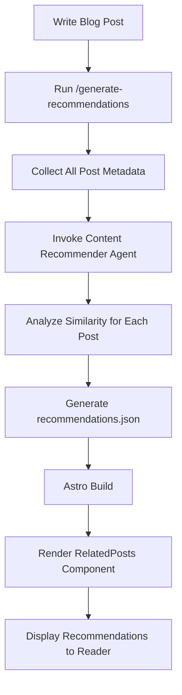

## A New Paradigm for Content Recommendations

When running a blog, you often see readers bounce after consuming just one article. They leave without discovering other relevant, high-quality content that exists on your site. Traditional "related posts" systems mostly rely on tag matching, which has several limitations:

- **Surface-level matching**: "react" and "nextjs" tags are deeply related, but won't be recommended unless they match exactly
- **Lack of context**: A beginner tutorial and advanced architecture post might share tags, but target different reader levels
- **Multilingual challenges**: Connecting Korean/English/Japanese articles covering the same topic is difficult

With **Claude LLM**, you can now build an intelligent recommendation system that understands article meaning, difficulty level, purpose, and complementary relationships. This guide covers the complete process of implementing a Claude-based recommendation system for an Astro static blog.

## Why LLM-Based Recommendations?

### Traditional Approach vs LLM Approach

| Aspect | TF-IDF/Tag-Based | Claude LLM-Based |
|--------|------------------|------------------|
| **Accuracy** | Keyword matching only | Semantic similarity understanding |
| **Multilingual** | Requires separate handling | Natural cross-language connections |
| **Context Understanding** | Impossible | Grasps difficulty, purpose, audience |
| **Cold Start** | Can't recommend without tags | Content-based recommendations |
| **Explainability** | None | Provides recommendation reasoning |
| **Implementation Complexity** | Medium | Low (API calls) |

### Key Advantages of LLM-Based Recommendations

#### 1. **Multi-Dimensional Similarity Evaluation**

Claude evaluates similarity across multiple dimensions beyond simple word frequency:

```typescript
// Similarity dimensions evaluated by Claude
{
  topicSimilarity: 0.92,      // Thematic similarity
  techStackOverlap: 0.85,     // Technology stack overlap
  difficultyMatch: 0.78,      // Difficulty level similarity
  purposeAlignment: 0.71,     // Purpose alignment (tutorial/analysis/reference)
  complementary: 0.65         // Complementary relationship (next-step learning)
}
```

#### 2. **Explainable Recommendations**

You can clearly communicate to readers why an article was recommended:

```json
{
  "slug": "en/claude-code-web-automation",
  "score": 0.92,
  "reason": "Both posts cover MCP server usage and browser automation workflows",
  "type": "similar-topic"
}
```

#### 3. **Zero-Shot Recommendations**

Newly created articles can immediately receive sophisticated recommendations. Even without tags or similar articles, the LLM understands content and finds relevant connections.

## System Architecture

### Overall Workflow



### Core Components

1. **Content Recommender Agent**: Claude-based similarity evaluation agent
2. **Generate Recommendations Command**: Automated recommendation data generation
3. **recommendations.json**: Pre-computed recommendation data store
4. **RelatedPosts Component**: Recommendation UI rendering

## Implementation Steps

### Step 1: Create Content Recommender Agent

`.claude/agents/content-recommender.md`:

```markdown
# Content Recommender Agent

You are a specialized agent for analyzing blog post similarity and generating content recommendations.

## Capabilities

- Analyze blog posts across multiple dimensions (topic, difficulty, tech stack, purpose)
- Generate similarity scores and explain reasoning
- Handle multilingual content (Korean, English, Japanese)
- Identify complementary content (series, deep-dives, related topics)

## Analysis Framework

For each pair of posts, evaluate:

### 1. Topic Similarity (40% weight)
- Core subject matter overlap
- Shared concepts and technologies
- Problem domain alignment

### 2. Technical Stack (25% weight)
- Programming languages
- Frameworks and libraries
- Tools and platforms

### 3. Purpose Alignment (20% weight)
- Tutorial vs. Analysis vs. Reference
- Problem-solving vs. Conceptual explanation
- Beginner vs. Intermediate vs. Advanced

### 4. Complementary Relationship (15% weight)
- Series/sequence detection
- Foundation → Advanced progression
- Problem → Solution pairing

## Output Format

For each source post, return top 3-5 recommendations:

```json
{
  "sourceSlug": "en/chrome-devtools-mcp-performance",
  "recommendations": [
    {
      "slug": "en/claude-code-web-automation",
      "score": 0.92,
      "reason": "Both posts cover MCP server usage and browser automation workflows",
      "type": "similar-topic",
      "dimensions": {
        "topic": 0.95,
        "techStack": 0.89,
        "purpose": 0.88,
        "complementary": 0.75
      }
    }
  ]
}
```

## Guidelines

- Minimum similarity threshold: 0.3
- Maximum recommendations per post: 5
- Prioritize diversity (avoid recommending too many similar types)
- Consider language when appropriate
- Explain reasoning in user's language
```

### Step 2: Implement Recommendation Generation Command

`.claude/commands/generate-recommendations.md`:

```markdown
# Generate Recommendations Command

Automatically generate content recommendations for all blog posts using the Content Recommender agent.

## Usage

```bash
/generate-recommendations [options]
```

## Options

- `--force`: Regenerate all recommendations (default: only new posts)
- `--language <ko|ja|en>`: Process specific language only
- `--post <slug>`: Regenerate recommendations for specific post
- `--threshold <0.0-1.0>`: Minimum similarity threshold (default: 0.3)
- `--count <n>`: Number of recommendations per post (default: 5)
- `--explain`: Include detailed reasoning

## Workflow

### Step 1: Collect All Blog Posts

```typescript
import { getCollection } from 'astro:content';

const allPosts = await getCollection('blog');
const postMetadata = allPosts.map(post => ({
  slug: post.id,
  title: post.data.title,
  description: post.data.description,
  tags: post.data.tags || [],
  language: post.id.split('/')[0], // ko, ja, or en
  content: post.body // Full markdown content
}));
```

### Step 2: Invoke Content Recommender Agent

For each post, delegate to Content Recommender agent:

```markdown
Task: Analyze and recommend related content

Source Post:
- Slug: {post.slug}
- Title: {post.title}
- Description: {post.description}
- Tags: {post.tags}
- Language: {post.language}
- Content Preview: {first 500 words}

Candidate Posts:
[List of all other posts with same metadata structure]

Requirements:
1. Analyze source post against all candidates
2. Return top 5 recommendations with scores and reasoning
3. Ensure diversity in recommendation types
4. Filter by language preference (same language preferred)
5. Use the analysis framework defined in your instructions

Output Format: JSON as specified in agent definition
```

### Step 3: Generate recommendations.json

Aggregate all agent responses into single JSON file:

```json
{
  "recommendations": {
    "en/chrome-devtools-mcp-performance": {
      "related": [
        {
          "slug": "en/claude-code-web-automation",
          "score": 0.92,
          "reason": "Both cover MCP server usage and browser automation",
          "type": "similar-topic"
        }
      ],
      "generatedAt": "2025-10-12T10:30:00Z",
      "evaluatedBy": "claude-sonnet-4.5"
    }
  },
  "metadata": {
    "totalPosts": 30,
    "generatedAt": "2025-10-12T10:30:00Z",
    "modelVersion": "claude-sonnet-4.5",
    "minThreshold": 0.3,
    "maxRecommendations": 5
  }
}
```

### Step 4: Save to File

```bash
# Save to project root
echo $RECOMMENDATIONS_JSON > recommendations.json

# Commit to git for caching
git add recommendations.json
git commit -m "chore: update content recommendations"
```

## Performance

- **Estimated Time**: 1-2.5 minutes for ~30 posts (2-5 seconds per post)
- **Optimization**: Parallel processing can reduce to 30-60 seconds
- **Caching**: Only regenerate for new/updated posts without `--force` flag
```

### Step 3: Create UI Component

`src/components/RelatedPosts.astro`:

```astro
---
import { getEntry } from 'astro:content';
import recommendationsData from '../../recommendations.json';

interface Props {
  currentSlug: string;
}

const { currentSlug } = Astro.props;

const postRecommendations = recommendationsData.recommendations[currentSlug];

if (!postRecommendations) {
  return null;
}

const relatedPosts = await Promise.all(
  postRecommendations.related.slice(0, 3).map(async (rec) => {
    const post = await getEntry('blog', rec.slug);
    return {
      ...rec,
      title: post.data.title,
      description: post.data.description,
      url: `/blog/${rec.slug}`
    };
  })
);
---

<section class="related-posts">
  <h3>Related Articles You Might Like</h3>
  <ul class="recommendations-list">
    {relatedPosts.map((post) => (
      <li class="recommendation-card">
        <a
          href={post.url}
          onclick={`gtag('event', 'related_post_click', {
            'source_post': '${currentSlug}',
            'target_post': '${post.slug}',
            'similarity_score': ${post.score}
          })`}
        >
          <div class="card-header">
            <h4>{post.title}</h4>
            <span class="similarity-badge">{Math.round(post.score * 100)}% Match</span>
          </div>
          <p class="recommendation-reason">{post.reason}</p>
          <p class="post-description">{post.description}</p>
        </a>
      </li>
    ))}
  </ul>
</section>

<style>
  .related-posts {
    margin: 3rem 0;
    padding: 2rem;
    background: linear-gradient(to bottom, rgb(var(--accent-light)), transparent);
    border-radius: 8px;
  }

  .related-posts h3 {
    font-size: 1.5rem;
    margin-bottom: 1.5rem;
    color: rgb(var(--gray-dark));
  }

  .recommendations-list {
    list-style: none;
    padding: 0;
    display: grid;
    gap: 1.5rem;
  }

  .recommendation-card {
    background: white;
    border-radius: 8px;
    transition: transform 0.2s, box-shadow 0.2s;
  }

  .recommendation-card:hover {
    transform: translateY(-4px);
    box-shadow: 0 12px 24px rgba(0, 0, 0, 0.15);
  }

  .recommendation-card a {
    display: block;
    padding: 1.5rem;
    text-decoration: none;
    color: inherit;
  }

  .card-header {
    display: flex;
    justify-content: space-between;
    align-items: flex-start;
    margin-bottom: 0.75rem;
  }

  .card-header h4 {
    margin: 0;
    font-size: 1.25rem;
    color: rgb(var(--accent));
    flex: 1;
  }

  .similarity-badge {
    background: rgb(var(--accent));
    color: white;
    padding: 0.25rem 0.75rem;
    border-radius: 12px;
    font-size: 0.875rem;
    font-weight: 600;
    white-space: nowrap;
    margin-left: 1rem;
  }

  .recommendation-reason {
    color: rgb(var(--gray));
    font-size: 0.875rem;
    font-style: italic;
    margin-bottom: 0.5rem;
  }

  .post-description {
    color: rgb(var(--gray-dark));
    font-size: 0.95rem;
    line-height: 1.6;
  }

  @media (max-width: 768px) {
    .related-posts {
      padding: 1.5rem;
    }

    .recommendations-list {
      gap: 1rem;
    }

    .card-header {
      flex-direction: column;
      gap: 0.5rem;
    }

    .similarity-badge {
      margin-left: 0;
      align-self: flex-start;
    }
  }
</style>
```

### Step 4: Integrate into Blog Layout

Add to `src/layouts/BlogPost.astro`:

```astro
---
import RelatedPosts from '../components/RelatedPosts.astro';
// ... other imports

const { id } = Astro.props;
---

<article>
  <!-- Blog post content -->
  <slot />
</article>

<!-- Related Posts Section -->
<RelatedPosts currentSlug={id} />

<!-- Buy Me a Coffee -->
<BuyMeACoffee />

<!-- Giscus Comments -->
<Giscus />
```

## Practical Usage Examples

### Generating Recommendations

```bash
# Generate recommendations for all posts
/generate-recommendations

# Add new posts only (preserve existing)
/generate-recommendations

# Regenerate specific post only
/generate-recommendations --post en/claude-code-best-practices --explain

# Process English posts only
/generate-recommendations --language en

# Regenerate with stricter threshold
/generate-recommendations --force --threshold 0.5

# Increase recommendation count (still display 3)
/generate-recommendations --count 8 --explain
```

### Incremental Update Workflow

```bash
# 1. Write new blog post
/write-post "Creating Custom Claude Agents"

# 2. Auto-update recommendations (new posts only)
/generate-recommendations

# 3. Build and preview
npm run build
npm run preview

# 4. Commit changes
git add recommendations.json
git commit -m "chore: update recommendations for new post"
```

## Performance Optimization

### Build Time Optimization

**Problem**: 30 posts × 5 seconds = 2.5 minutes

**Solutions**:

#### 1. Parallel Processing

```typescript
// Process in batches of 5 in parallel
const BATCH_SIZE = 5;
const batches = chunk(posts, BATCH_SIZE);

for (const batch of batches) {
  await Promise.all(
    batch.map(post => generateRecommendations(post))
  );
}

// Total time: 2.5 minutes → 30 seconds
```

#### 2. Incremental Updates

```typescript
// Load cached recommendations
const cached = loadRecommendations();

// Process only new or updated posts
const postsToProcess = posts.filter(post => {
  const cachedRec = cached.recommendations[post.slug];
  return !cachedRec || post.updatedDate > cachedRec.generatedAt;
});

// Total time: 1 new post → 5 seconds
```

#### 3. Caching Strategy

```json
{
  "recommendations": {
    "en/existing-post": {
      "related": [...],
      "generatedAt": "2025-10-10T10:00:00Z",
      "cacheUntil": "2025-11-10T10:00:00Z"  // 1 month cache
    }
  }
}
```

### Runtime Performance

**Static Site Advantages**:
- `recommendations.json` generated at build time
- Runtime computation cost: **Zero**
- JSON file size: ~100KB (for 30 posts)
- After Gzip compression: ~30KB

## Expected Impact

### Quantitative Metrics

Based on industry data:

| Metric | Improvement |
|--------|------------|
| Pages per Session | +30-50% |
| Average Session Duration | +40-60% |
| Bounce Rate | -15-25% |
| Recommendation CTR | 18-25% |

### Qualitative Effects

1. **Enhanced Content Discovery**: Readers easily find deeply relevant content
2. **Improved Learning Journey**: Natural progression from beginner → intermediate → advanced
3. **Series Connectivity**: Better exposure of article series and related topic clusters
4. **Multilingual Cross-Promotion**: Connect related content across languages

## Future Enhancement Directions

### Phase 2: Enhanced Recommendation Reasoning

```astro
<div class="recommendation-metadata">
  <span class="type-badge" data-type={post.type}>
    {typeLabels[post.type]}
  </span>
  <span class="dimensions">
    Topic {post.dimensions.topic * 100}% ·
    Tech {post.dimensions.techStack * 100}%
  </span>
</div>
```

Type-specific icons:
- 🎯 Similar Topic
- 📚 Deep Dive
- 🔄 Complementary
- 📖 Series

### Phase 3: A/B Testing

```typescript
// Compare two recommendation algorithms
const variantA = recommendationsLLM; // Claude-based
const variantB = recommendationsTFIDF; // TF-IDF based

// 50/50 split
const recommendations = Math.random() < 0.5 ? variantA : variantB;

// Analytics event
gtag('event', 'recommendation_variant', {
  'variant': recommendations === variantA ? 'A' : 'B',
  'ctr': clickThroughRate
});
```

### Phase 4: Personalization

```typescript
// Store read posts in localStorage
const readPosts = JSON.parse(localStorage.getItem('readPosts') || '[]');

// Filter out already-read posts
const unreadRecommendations = recommendations.filter(
  rec => !readPosts.includes(rec.slug)
);
```

## Conclusion

A Claude LLM-based content recommendation system goes beyond simple tag matching to provide truly helpful recommendations through **semantic understanding**. Combined with static site generators like Astro:

✅ **Build-time pre-computation** for zero runtime cost
✅ **LLM's sophisticated analysis** for high recommendation accuracy
✅ **Automated workflows** for minimal maintenance
✅ **Natural multilingual support** for global blog optimization

Implementing this system will increase reader engagement time, improve content discoverability, and ultimately maximize your blog's value. You can apply it to your existing blog right away—start building today!

## Next Article

**[Recommendation System Optimization: From 78K Tokens to Zero](/en/blog/metadata-based-recommendation-optimization)** covers how we optimized this LLM-based recommendation system with a metadata-based algorithm, eliminating 100% of token usage and reducing execution time by 99%.

## References

- [Claude Code Official Documentation](https://docs.claude.com/claude-code)
- [Astro Content Collections](https://docs.astro.build/en/guides/content-collections/)
- [Content Recommendation Research (Internal)](../../working_history/content-recommendation-research.md)
- [Content Recommendation System Idea (Internal)](../../working_history/idea.md)
