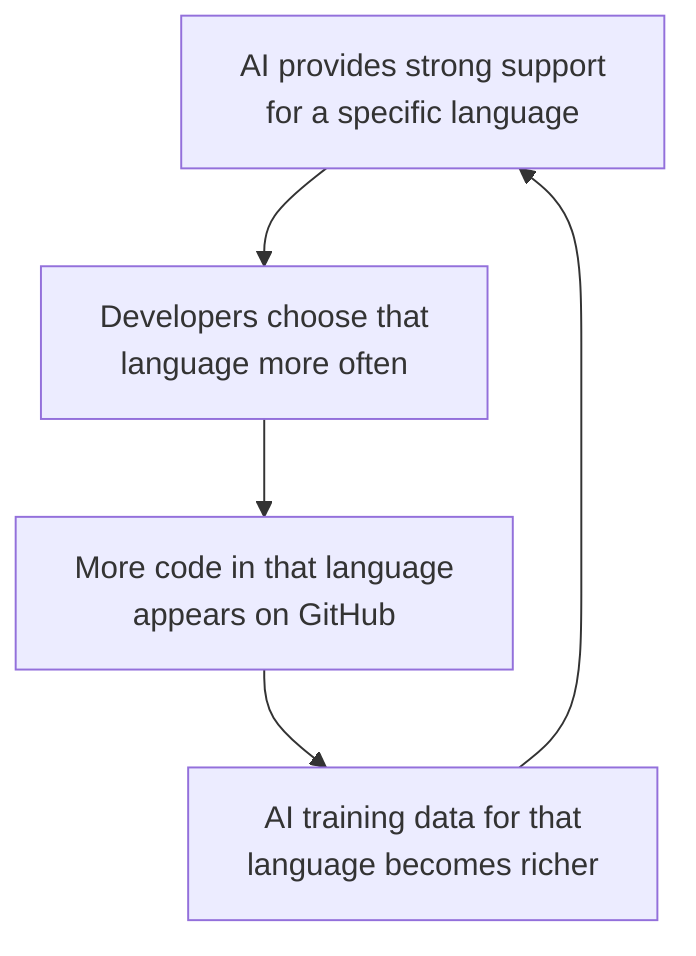
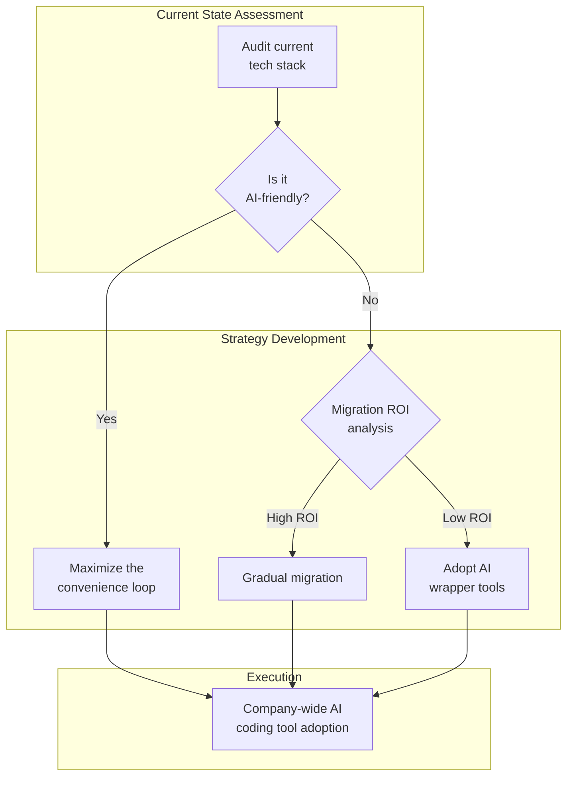

## Overview

Data now shows that AI coding assistants are not merely "tools that help you write code faster" — they are <strong>actively changing which languages developers choose</strong>. According to GitHub's Octoverse 2025 report, TypeScript <strong>surged 66% year-over-year</strong> to become the most-used language on GitHub. GitHub Developer Advocate Andrea Griffiths coined the term <strong>"Convenience Loop"</strong> to describe this phenomenon.

In this article, we analyze the mechanics of the convenience loop and explore the structural shifts that Engineering Managers and CTOs should consider when making tech stack decisions.

## What Is a Convenience Loop?

### A Self-Reinforcing Feedback Mechanism

A Convenience Loop follows this cyclical structure:



When AI coding tools make a particular technology frictionless to use, developers flock to it. This generates more training data, which makes the AI more accurate for that technology — forming a <strong>self-reinforcing cycle</strong>.

### Why TypeScript Surged 66%

TypeScript became the biggest beneficiary of this loop because <strong>its static type system is structurally well-suited to how LLMs operate</strong>.

<strong>Academic research data</strong>: A 2025 study found that <strong>94% of compilation errors in LLM-generated code were type-check failures</strong>. This means static typing acts as a "safety guardrail" that catches AI mistakes before they reach production.

```typescript
// TypeScript: AI sees types and immediately suggests only valid operations
function processUser(user: { name: string; age: number }) {
  // AI knows user.name is a string and accurately suggests .toUpperCase()
  // AI only suggests numeric operations for user.age
  return `${user.name.toUpperCase()} (age ${user.age + 1})`;
}

// JavaScript: AI has to guess runtime types
function processUser(user) {
  // No guarantee that user.name is a string or user.age is a number
  // AI suggestions may cause runtime errors
  return `${user.name.toUpperCase()} (age ${user.age + 1})`;
}
```

<strong>The key difference</strong>: When you declare `x: string`, the AI immediately excludes all operations that don't work on strings. Without types, the AI has to guess "this is probably a string," and when that guess is wrong, it leads to runtime errors.

### The Accelerating Effect of Framework Ecosystems

TypeScript's surge is not solely driven by the language itself. Major frameworks like <strong>Next.js, Astro, and Remix</strong> have adopted TypeScript as their default, creating a synergy effect:

- <strong>Next.js 15+</strong>: `create-next-app` generates TypeScript projects by default
- <strong>Astro 5+</strong>: Content Collections use TypeScript-based schema validation
- <strong>Remix/React Router 7</strong>: Type-safe routing as a core feature

A <strong>multi-layered convenience loop</strong> is forming: frameworks adopt TypeScript by default, which improves AI code generation quality, which drives more developer adoption.

## The AI Compatibility Gap Across Languages

### AI-Friendly vs. AI-Unfriendly Languages

| Language | AI Code Generation Quality | Primary Reason |
|----------|---------------------------|----------------|
| <strong>Python</strong> | Very high | Dominant training data from education/ML |
| <strong>TypeScript</strong> | Very high | Static types + rich ecosystem |
| <strong>Go</strong> | High | Simple syntax + explicit error handling |
| <strong>Rust</strong> | Medium | Strong types, but complex ownership rules |
| <strong>C++</strong> | Low | Complex syntax, high pattern diversity relative to training data |
| <strong>Perl</strong> | Very low | Insufficient training data, ambiguous syntax |

<strong>Notable pattern</strong>: As developers migrate toward languages that AI tools support well, the learning curve for poorly supported languages grows steeper. If a new developer can barely get AI assistance when learning C++, they are far more likely to choose Python or TypeScript instead.

### The Numbers from GitHub Data

- <strong>TypeScript</strong>: 2.636 million monthly active contributors (ranked #1)
- <strong>Python</strong>: Still leading in AI/ML research at 25.87%
- <strong>Public LLM SDK repos</strong>: Over 1.1 million already using LLM SDKs

These numbers demonstrate that <strong>AI tool compatibility has shifted from a "nice to have" to a critical variable in language selection</strong>.

## EM/CTO Perspective: Shifts in Tech Stack Strategy

### 1. Rethinking Hiring Strategy

The AI convenience loop also impacts the hiring market:

- <strong>TypeScript/Python developer pools are growing the fastest</strong>: New developers start with languages that pair well with AI
- <strong>Legacy language specialists are becoming scarce</strong>: Languages like Perl and COBOL see declining new entrants due to weak AI support
- <strong>AI proficiency is the new skill benchmark</strong>: The question shifts from language expertise to "Can you work productively with AI tools?"

### 2. Technical Debt Response Strategy



<strong>Practical guidelines</strong>:

- <strong>Python/TypeScript-centric stacks</strong>: Aggressively leverage AI coding tools to maximize productivity
- <strong>Java/C# stacks</strong>: Capitalize on static typing benefits, but verify AI tool coverage
- <strong>Dynamic-typed legacy (PHP, Ruby)</strong>: Consider adding TypeScript type definitions or planning a gradual migration
- <strong>Systems languages (C/C++)</strong>: AI support is limited — consider developing a roadmap for transitioning to Rust

### 3. Evolving Developer Productivity Metrics

You need to add <strong>AI utilization efficiency</strong> to your existing productivity metrics:

- <strong>AI suggestion acceptance rate</strong>: How effectively is the team leveraging AI code suggestions?
- <strong>Type coverage</strong>: The percentage of the codebase with explicit type annotations (directly impacts AI performance)
- <strong>AI-induced bug rate</strong>: Track defects originating from AI-generated code
- <strong>Per-language AI ROI</strong>: Which languages and frameworks yield the highest productivity gains relative to AI tool investment?

## Risks of the Convenience Loop

### The Diversity Problem

The self-reinforcing nature of the convenience loop is both a strength and a risk:

- <strong>Higher barriers for new languages</strong>: Emerging languages with insufficient AI training data struggle to attract developers
- <strong>Paradigm bias</strong>: Concern about homogenization toward code patterns that AI generates well
- <strong>Undervaluation of innovative approaches</strong>: AI's preference for "conventional" solutions may crowd out unconventional approaches

### Security Considerations

The finding that <strong>94% of LLM-generated code errors are type-check failures</strong> underscores the importance of type systems, but it also signals that <strong>AI-generated code quality is still far from perfect</strong>. Even in languages with robust type systems, security vulnerability reviews remain essential.

## Conclusion: A New Axis for Technology Decisions

The AI convenience loop has added <strong>an entirely new dimension</strong> to programming language selection. Where performance, ecosystem, and team capabilities were once the primary criteria, <strong>"compatibility with AI tools"</strong> has become a variable that can no longer be ignored.

<strong>Key takeaways for Engineering Managers and CTOs</strong>:

1. <strong>Include AI compatibility as a formal criterion in tech stack decisions</strong>
2. Languages with static type systems hold a structural advantage in the AI era
3. Maximize the benefits of the convenience loop, but <strong>monitor diversity loss and security risks</strong>
4. Consider <strong>incorporating AI utilization efficiency into your productivity KPIs</strong>

TypeScript's 66% surge is just the beginning. As AI coding tools continue to mature, the convenience loop's influence will only grow stronger — and organizations that understand and harness it will lead in developer productivity.

## References

- [GitHub Data Shows AI Tools Creating "Convenience Loops" That Reshape Developer Language Choices — InfoQ](https://www.infoq.com/news/2026/03/ai-reshapes-language-choice/)
- [Octoverse: AI leads TypeScript to #1 — GitHub Blog](https://github.blog/news-insights/octoverse/octoverse-a-new-developer-joins-github-every-second-as-ai-leads-typescript-to-1/)
- [Is AI Impacting Which Programming Language Projects Use? — Slashdot](https://developers.slashdot.org/story/26/02/23/0732245/is-ai-impacting-which-programming-language-projects-use)
- [Generative coding: Breakthrough Technologies 2026 — MIT Technology Review](https://www.technologyreview.com/2026/01/12/1130027/generative-coding-ai-software-2026-breakthrough-technology/)
