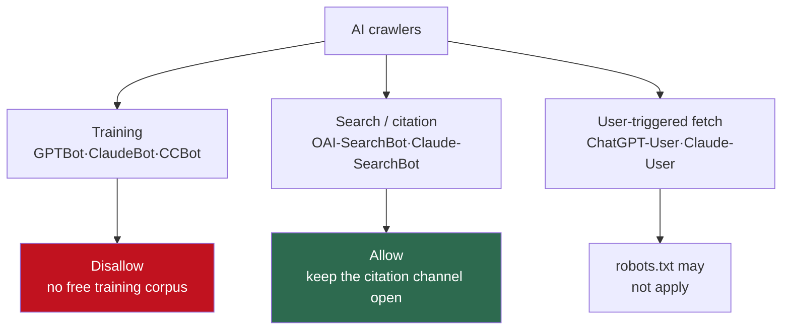

A lot of sites drop `User-agent: GPTBot` / `Disallow: /` into robots.txt and consider the AI question settled. It's half true. GPTBot is the crawler OpenAI uses for <strong>model training</strong>. But OpenAI runs more than one crawler, and if you block another one alongside it, you quietly slam the door on ChatGPT search citing your pages too. Leave everything wide open, on the other hand, and your content gets vacuumed straight into training corpora.

So "block AI or allow it" is not one switch. A 2026 robots.txt has to treat at least three kinds of bots differently. I didn't want to take that on faith from documentation, so I actually wrote the robots.txt and ran it through a standard parser to check whether the rules did what I meant. Along the way I found one line where the standard parser disagrees with real Googlebot. Here's the walk-through, in order.

## AI crawlers aren't one species: training, search, user-fetch

Start by splitting crawlers by purpose. Even bots from the same company do completely different jobs. OpenAI's own docs ([Overview of OpenAI Crawlers](https://developers.openai.com/api/docs/bots)) break their bots down like this:

- <strong>GPTBot</strong> (`GPTBot/1.3`): for model <strong>training</strong>. Blocking it signals "don't use my content to train."
- <strong>OAI-SearchBot</strong> (`OAI-SearchBot/1.3`): gathers pages that ChatGPT's <strong>search</strong> feature may cite when it builds an answer. Block it and you vanish from ChatGPT search answers.
- <strong>ChatGPT-User</strong> (`ChatGPT-User/1.0`): fetches a page when a user explicitly asks ChatGPT to read a URL. The docs state that because these are user-triggered, "robots.txt rules may not apply."

Anthropic splits its bots the same way in its [official help center](https://support.claude.com/en/articles/8896518-does-anthropic-crawl-data-from-the-web-and-how-can-site-owners-block-the-crawler): `ClaudeBot` (training), `Claude-User` (user-initiated fetch), `Claude-SearchBot` (search indexing). The older `anthropic-ai` and `Claude-Web` are deprecated, so if that's all you block, you're shooting at nothing.

Here's the first real judgment call. <strong>Don't treat training bots and search bots as one lump.</strong> The moment you `Disallow` GPTBot, OAI-SearchBot, ClaudeBot, and Claude-SearchBot all together in an "I hate AI" reflex, you succeed at blocking training but also close the only channel by which your site gets cited in ChatGPT and Claude search answers. For a publisher who wants traffic, that's a loss.

The three layers and the default strategy in one picture:



## The default 2026 publisher strategy: block training, allow citation

So the default I recommend is clear. <strong>Refuse training, allow search and citation.</strong> Don't hand your content over as a free training corpus, but keep open the path where an AI answer cites you and a reader clicks through. Translated into robots.txt, it looks like this:

```text
# --- AI training crawlers: keep content out of model training ---
User-agent: GPTBot
Disallow: /

User-agent: ClaudeBot
Disallow: /

User-agent: CCBot
Disallow: /

# Google-Extended is not a crawler; it's a token that controls training-data usage.
User-agent: Google-Extended
Disallow: /

# --- Search / citation crawlers: allow so ChatGPT & Claude search can cite you ---
User-agent: OAI-SearchBot
Allow: /

User-agent: Claude-SearchBot
Allow: /

User-agent: PerplexityBot
Allow: /

# --- General search crawlers ---
User-agent: Googlebot
Allow: /
Disallow: /admin/

User-agent: *
Disallow: /admin/
Disallow: /drafts/

Sitemap: https://example.com/sitemap.xml
```

`CCBot` is the Common Crawl bot, and since a lot of open datasets use it as a training source, it belongs in the block list if you want to refuse training. The table below sums up the strategy at a glance.

| Crawler | Owner | Purpose | In this strategy |
|---------|-------|---------|------------------|
| GPTBot | OpenAI | Model training | Block |
| OAI-SearchBot | OpenAI | ChatGPT search citations | Allow |
| ChatGPT-User | OpenAI | User-triggered fetch | robots.txt may not apply (official) |
| ClaudeBot | Anthropic | Model training | Block |
| Claude-SearchBot | Anthropic | Search indexing | Allow |
| Google-Extended | Google | Training-data-usage token | Block (mind the trap below) |
| Googlebot | Google | General search (incl. AI Overviews) | Allow |
| CCBot | Common Crawl | Training-corpus collection | Block |
| PerplexityBot | Perplexity | Answer-engine citation | Allow |

This is the default for a site that <strong>wants</strong> citation traffic, of course. If you run paid content or a community archive where you don't even want citation, blocking the search bots too is the right call. There isn't one universal answer. That said, for most blogs and docs sites, "refuse training + allow citation" is a reasonable starting point.

What a crawler actually reads once it arrives is a separate layer. I covered that in the post on [emitting LocalBusiness structured data server-side](/en/blog/en/localbusiness-structured-data-server-side-vs-js-2026). If robots.txt is "who do I let in," markup is "what do I show the bot once it's in."

## I verified it: do the rules actually fire the way I meant?

The hard part of robots.txt isn't writing it, it's <strong>confirming it does what you intended</strong>. This is a file where a single typo can void the whole ruleset. So I saved the robots.txt above to a temp directory and asked Python's standard-library `urllib.robotparser`, bot by bot, whether it could fetch a given path. It's a standard parser with no install step, so the run reproduces easily.

```python
import urllib.robotparser as rp

p = rp.RobotFileParser()
p.parse(open("robots.txt").read().splitlines())

cases = [
    ("GPTBot",           "/blog/my-article"),
    ("OAI-SearchBot",    "/blog/my-article"),
    ("ClaudeBot",        "/blog/my-article"),
    ("Claude-SearchBot", "/blog/my-article"),
    ("Google-Extended",  "/blog/my-article"),
    ("Googlebot",        "/blog/my-article"),
]
for ua, path in cases:
    print(ua, path, p.can_fetch(ua, path))
```

The run came back like this:

```text
user-agent         path                 allowed?  note
----------------------------------------------------------------------
GPTBot             /blog/my-article     False     training crawler (OpenAI)
OAI-SearchBot      /blog/my-article     True      search/citation crawler (OpenAI)
ClaudeBot          /blog/my-article     False     training crawler (Anthropic)
Claude-SearchBot   /blog/my-article     True      search crawler (Anthropic)
Google-Extended    /blog/my-article     False     Google training token
Googlebot          /blog/my-article     True      general search (incl. AI Overviews)
Googlebot          /admin/secret        True      general search - sensitive path
PerplexityBot      /blog/my-article     True      Perplexity search
CCBot              /blog/my-article     False     Common Crawl (training source)
SomeRandomBot      /drafts/wip          False     other bot - drafts
```

Just as intended. The training bots (GPTBot, ClaudeBot, Google-Extended, CCBot) all come back `False` (blocked); the search bots (OAI-SearchBot, Claude-SearchBot, PerplexityBot) come back `True` (allowed). An unknown `SomeRandomBot` gets caught by the `Disallow: /drafts/` rule under `User-agent: *`. User-agent matching is case-insensitive, so `GPTBot` and `gptbot` hit the same rule, which matches real crawler behavior.

That much was clean. But one line caught my eye.

## Where the standard parser disagreed with real Googlebot

Look at `Googlebot /admin/secret → True` in the log. I clearly put `Disallow: /admin/` in the Googlebot group. Yet the standard parser called `/admin/secret` <strong>allowed</strong>. At first I assumed a typo of mine and re-read it several times.

The cause was a difference in how rule precedence is resolved. My Googlebot group looks like this:

```text
User-agent: Googlebot
Allow: /
Disallow: /admin/
```

Python's standard parser satisfied `Allow: /` first and let it through. But <strong>real Googlebot's rule is different.</strong> Per Google's docs, when Allow and Disallow conflict, <strong>the longer (more specific) path wins.</strong> For `/admin/secret`, `Allow: /` is length 1 and `Disallow: /admin/` is length 7, so real Googlebot applies the longer `Disallow: /admin/` and <strong>blocks</strong> it.

So for the same robots.txt, the standard parser says "allowed" and actual Googlebot says "blocked." The mismatch looks trivial but it's dangerous in practice. You test your robots.txt with some local script or library, see "passes," and relax. But if that parser doesn't implement Google's longest-match rule, the real crawler may block or open a path you didn't expect.

My conclusion: <strong>always verify robots.txt against the rules the crawler actually uses.</strong> For Google that's Search Console's robots.txt tester; for OpenAI, the per-bot behavior in the official docs. Don't wave it through on one generic parser. The single line I turned up today is the evidence. (This "the tool passed it, so it must be fine" trap shows up in accessibility too. It's exactly the same illusion as [a Lighthouse 100 not meaning WCAG compliance](/en/blog/en/a11y-lighthouse-audit-fix-2026).)

## The Google-Extended trap: it does not stop AI Overviews

This is why the table said "Google-Extended: Block (mind the trap)." Many developers add `User-agent: Google-Extended` / `Disallow: /` and relax, thinking "now Google's AI won't use my content." Half true again.

Per Google's docs ([AI Features and Your Website](https://developers.google.com/search/docs/appearance/ai-features)), Google-Extended is <strong>not a crawler</strong>; it's a token that controls whether already-crawled content gets <strong>used to train</strong> Gemini and related generative products. The content is still crawled by Googlebot. And the crucial part: <strong>blocking Google-Extended does not remove you from AI Overviews.</strong> AI Overviews aren't drawn from a separate training set — they pull answers from Google Search's live index.

So how do you opt out of AI Overviews only? There's no clean way. The `nosnippet` meta tag can keep you out of AI Overview citations, but it <strong>also kills your regular search snippets.</strong> You'd have to accept no description text under your result in Search. In effect, "stay in normal Search but drop out of AI Overviews only" has no tidy method right now. That's not my guess; it's a structural limit you can confirm in Google's own docs.

What a developer needs here is accurate expectations. A Google-Extended `Disallow` does "don't use this for Gemini training," not "remove me from all of Google's AI features." Blur those two and you'll drop a line into robots.txt and mistake an undone job for a done one.

## Is llms.txt worth adding right now: an honest status check

Which leads to the obvious question: "So what about the much-hyped `llms.txt`?" Short answer: no harm in adding it, but don't expect results.

llms.txt is a proposed markdown file where a site points LLMs to "here are the key docs." The idea isn't bad. The problem is that <strong>as of 2026 no major AI provider actually uses it</strong>. Google's John Mueller and Gary Illyes have publicly said the Search team does not use llms.txt, and Mueller went as far as comparing it to the discredited keywords meta tag. None of OpenAI, Anthropic, Meta, or Mistral has confirmed using llms.txt as a signal in production answers.

The numbers are chilly too (the following are <strong>third-party figures, not official</strong>). One industry analysis reported that a large share of sites with an llms.txt received almost no actual AI-bot visits, and another monitoring effort watching some 500 million AI-bot visits found only a tiny handful of requests aimed directly at llms.txt. The files pile up; the bots reading them don't.

My position: llms.txt is <strong>insurance right now, not a lottery ticket</strong>. It costs almost nothing to generate and there's some point in hedging against the standard taking hold, so add it if you like. But "I added llms.txt, so AI search will surely find me" is a groundless expectation. That time is better spent on the per-bot robots.txt controls above and on your structured data, where the measured payoff is far bigger.

## So, what to do today: a checklist

To sum up, an AI-era robots.txt isn't "block or allow" — it's "how do I treat each bot." Things to check right now:

1. <strong>Did you split bots by purpose?</strong> Make sure you're not bundling training (GPTBot, ClaudeBot, Google-Extended, CCBot) and search (OAI-SearchBot, Claude-SearchBot, PerplexityBot) under the same rule.
2. <strong>Are you relying on deprecated tokens?</strong> If you only block `anthropic-ai` and `Claude-Web`, Anthropic's current bots aren't blocked. Update to `ClaudeBot`.
3. <strong>Are you over-trusting Google-Extended?</strong> It goes as far as refusing Gemini training, not excluding you from AI Overviews. Set your expectations exactly.
4. <strong>Did you verify against real crawler rules?</strong> Don't trust a generic parser's "pass"; check Google with the Search Console robots.txt tester, including the longest-match rule.
5. <strong>Know that user-triggered bots like ChatGPT-User and Claude-User may not honor robots.txt.</strong> That's user behavior, not policy, so it's outside your control.

robots.txt is a voluntary convention, not a legal wall. Polite bots obey it; malicious crawlers ignore it. Try to block by IP and you can even stop a bot from reading robots.txt at all, which backfires. So think of it less as an impenetrable barrier and more as an explicit statement of intent. Used with that limit in mind, it's the most standard way to tell the bots exactly what you want: refuse training, allow citation.

---

If you want structured data emitted reliably server-side, or want a check on whether your existing site's robots.txt, structured markup, and GEO setup actually behave the way you intended, I take on consulting and implementation work personally. Feel free to reach out through the contact link on my profile.
