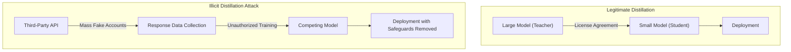
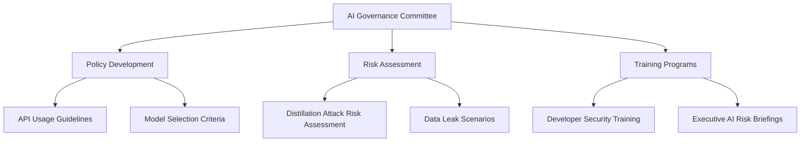

## 16 Million Requests, 24,000 Fake Accounts — What Happened

In February 2026, Anthropic disclosed a massive <strong>distillation attack</strong> targeting its Claude model. Three Chinese AI companies — DeepSeek, Moonshot AI, and MiniMax — used approximately 24,000 fraudulent accounts and commercial proxy services to generate over <strong>16 million conversations</strong> with Claude, then leveraged that data to train their own models.

Each company targeted different capabilities:

- <strong>DeepSeek</strong>: Reasoning ability, rubric-based scoring, censorship bypass queries (150,000+ conversations)
- <strong>Moonshot AI</strong>: Agentic reasoning, tool use, coding, computer vision (3.4 million+ conversations)
- <strong>MiniMax</strong>: Agentic coding and tool use capabilities (13 million+ conversations)

Anthropic stated it was able to attribute each campaign to specific AI labs through IP address correlation, request metadata, and infrastructure indicators.

## What Is a Distillation Attack

<strong>Model distillation</strong> is originally a legitimate machine learning technique. It trains a smaller model (student) using the outputs of a larger model (teacher) and is widely used under proper licensing agreements.

The problem arises when this is done <strong>without authorization</strong>:



The core risk of illicit distillation is the <strong>loss of safeguards</strong>. Harmful content filtering, bias prevention mechanisms, and other safety features built into the original model are stripped away during the distillation process, allowing dangerous capabilities to proliferate without protective measures.

## Threat Analysis from an EM/CTO Perspective

### Impact on Enterprise AI Governance

This incident is not simply a dispute between companies. It carries important implications for every organization using AI APIs:

<strong>1. Security Risks of API Usage Data</strong>

Organizations must recognize that data transmitted through AI APIs — prompts, context, and business logic — can be exposed externally. There is also the possibility that distillation attackers could intercept traffic through similar proxy networks.

<strong>2. Evolving Security Evaluation Criteria for Vendor Selection</strong>

When selecting an AI vendor, you need to evaluate not just performance and cost, but also their <strong>distillation attack defense capabilities</strong>:

- Whether behavioral classifiers are implemented
- Anomalous usage pattern detection systems
- Account verification and authentication strength
- Sophistication of rate limiting

<strong>3. Provenance Risk of Open-Source Models</strong>

When models created through illicit distillation are released as open source, organizations that use them may be indirectly implicated in IP infringement. Verifying model <strong>provenance</strong> has become critical.

### National Security Concerns

Anthropic warned about the risk of illicitly distilled models being deployed in military, intelligence, and surveillance systems. Frontier AI models with safeguards removed could be weaponized for offensive cyber operations, disinformation campaigns, and mass surveillance.

## Practical Enterprise Defense Strategies

### Phase 1: Revisit AI API Usage Policies

```yaml
# AI API Governance Checklist
security_policy:
  - Establish a classification framework before sending sensitive data to AI APIs
  - Build PII/confidential data masking pipelines
  - Operate API call logging and audit systems

vendor_management:
  - Evaluate AI vendors' distillation attack defense capabilities
  - Review data usage clauses in Terms of Service
  - Conduct regular vendor security audits

model_provenance_management:
  - Verify training data sources of open-source models in use
  - Review model licenses and IP policies
  - Include AI models in SBOM (Software Bill of Materials)
```

### Phase 2: Build Technical Defense Systems

Technical approaches drawn from Anthropic's disclosed defense strategies:

<strong>Behavior-Based Detection</strong>

Traditional firewalls, DLP, and network monitoring cannot detect threats at the ML-API layer. A new monitoring perspective is required:

- <strong>Usage pattern anomaly detection</strong>: Large-scale systematic queries, unusual time-of-day usage, repetitive patterns
- <strong>Account cluster analysis</strong>: Detecting groups of accounts with shared IP ranges and similar query patterns
- <strong>Fingerprinting</strong>: Embedding detectable watermarks in model outputs

### Phase 3: Strengthen Organizational AI Literacy



## Industry-Wide Response

Since this incident, the following movements have emerged across the AI industry:

<strong>1. Strengthened Cross-Industry Collaboration</strong>

Anthropic, together with OpenAI, is calling for an industry-wide response to distillation attacks. Individual company defenses are insufficient — coordination between AI companies, cloud providers, and policymakers is necessary.

<strong>2. Microsoft's Open-Weight Model Backdoor Scanner</strong>

Microsoft has developed a scanner to detect backdoors in open-weight AI models. This can be used to identify malicious functionality embedded in distilled models.

<strong>3. Evolving Regulatory Frameworks</strong>

Alongside the U.S. debate on AI chip export controls, discussions around regulatory protection of AI model IP have also intensified.

## Key Takeaways for Practitioners

| Area | Action | Priority |
|------|--------|----------|
| API Security | Classify and mask sensitive data | Immediate |
| Vendor Management | Add distillation defense evaluation | Within 1 month |
| Model Management | Verify open-source model provenance | Quarterly |
| Organization | Establish AI governance committee | Within 3 months |
| Training | Developer AI security training | Biannually |
| Monitoring | API usage anomaly detection system | Within 6 months |

## Conclusion — "Trust but Verify"

AI model distillation attacks are shaking the foundation of trust in the AI industry. What we can do as EMs and CTOs is clear:

1. <strong>Reassess the security policies of the AI APIs you use</strong>
2. <strong>Verify the provenance of open-source models</strong>
3. <strong>Establish AI governance frameworks within your organization</strong>

The democratization of AI technology is something to welcome, but it must not come through the unauthorized extraction of others' intellectual property. The principle of "Trust but verify" remains just as valid in the age of AI.

## References

- [Anthropic Official Announcement: Detecting and Preventing Distillation Attacks](https://www.anthropic.com/news/detecting-and-preventing-distillation-attacks)
- [CNBC: Anthropic accuses DeepSeek, Moonshot and MiniMax of distillation attacks on Claude](https://www.cnbc.com/2026/02/24/anthropic-openai-china-firms-distillation-deepseek.html)
- [TechCrunch: Anthropic accuses Chinese AI labs of mining Claude](https://techcrunch.com/2026/02/23/anthropic-accuses-chinese-ai-labs-of-mining-claude-as-us-debates-ai-chip-exports/)
- [The Hacker News: Anthropic Says Chinese AI Firms Used 16 Million Claude Queries](https://thehackernews.com/2026/02/anthropic-says-chinese-ai-firms-used-16.html)
- [Google GTIG: AI Threat Tracker — Distillation and Adversarial AI Use](https://cloud.google.com/blog/topics/threat-intelligence/distillation-experimentation-integration-ai-adversarial-use)
