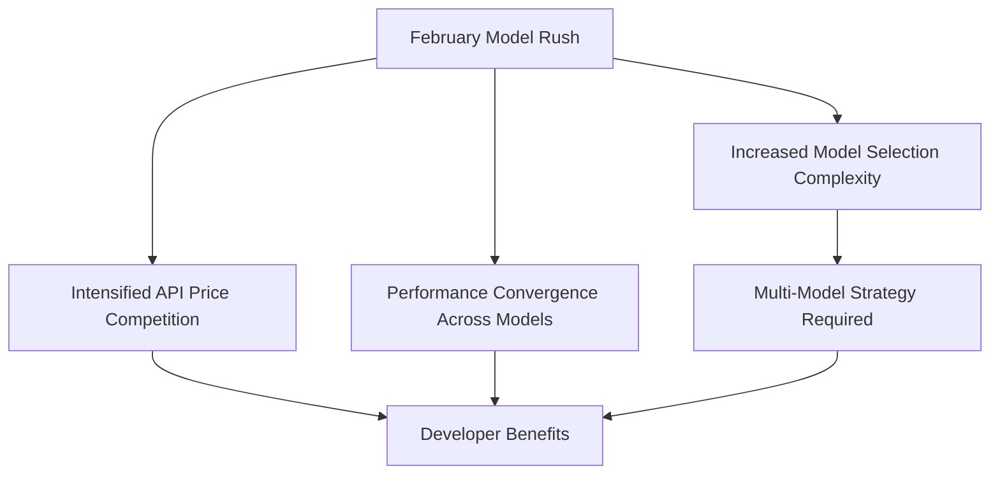

In February 2026, something unprecedented is happening in the AI industry. News that <strong>seven major AI models are scheduled for release in the same month</strong> has sent the industry into what can only be described as a "Model Rush."

## February Release Schedule

According to [Mark's (@mark_k) post on X](https://x.com/mark_k/status/2020822166984372373), the following seven models are expected to launch in February 2026:

| Model | Developer | Notes |
|-------|-----------|-------|
| <strong>Gemini 3 Pro GA</strong> | Google DeepMind | General Availability release of Gemini 3 Pro |
| <strong>Sonnet 5</strong> | Anthropic | Next version of the Claude Sonnet series |
| <strong>GPT-5.3</strong> | OpenAI | Minor update to the GPT-5 series |
| <strong>Qwen 3.5</strong> | Alibaba Cloud | Leading open-source contender |
| <strong>GLM 5</strong> | Zhipu AI | Next-gen model from Chinese AI startup |
| <strong>Deepseek v4</strong> | DeepSeek | New version of the reasoning-focused model |
| <strong>Grok 4.20</strong> | xAI | Latest model from Elon Musk's xAI |

## Why Are They All Converging on February?

### 1. The Post-CES Announcement Window

February sits between CES and MWC, making it a prime time for companies to unveil their technology roadmaps. In 2026, with AI competition at fever pitch, each company is racing to establish market position ahead of rivals.

### 2. Open Source vs Closed Source — Full-Scale Showdown

What makes this rush particularly noteworthy is that <strong>open-source models (Qwen 3.5, DeepSeek v4) and closed-source models (Gemini, Sonnet, GPT) are clashing simultaneously</strong>. Since the second half of 2025, open-source model performance has improved dramatically, forcing closed-source players to accelerate their update cycles.

### 3. The Rise of Chinese AI Companies

With GLM 5 (Zhipu AI), DeepSeek v4, and Qwen 3.5, <strong>three Chinese-developed models</strong> are in the mix. This demonstrates that the US-China AI competition is now playing out at the model level in earnest.

## Key Highlights for Each Model

### Gemini 3 Pro GA — Google's Full Counterattack

Gemini 3 Pro already attracted attention during preview for its multimodal capabilities and long context window. The GA launch will be defined by API stability and pricing competitiveness.

### Sonnet 5 — Anthropic's Balance Strategy

Within the Claude series, Sonnet occupies the sweet spot between performance and cost. The key question is where Sonnet 5 will differentiate — coding, analysis, or creative tasks.

### GPT-5.3 — OpenAI's Incremental Evolution

OpenAI continues its strategy of iterative updates following the GPT-5 launch. Improvements in reasoning ability and function calling accuracy are expected in 5.3.

### Qwen 3.5 — Setting New Open-Source Standards

Alibaba Cloud's Qwen maintains the fastest update cycle among open-source LLMs. Version 3.5 is expected to bring major improvements in multilingual performance and coding capability.

### GLM 5 — Zhipu AI's Global Ambition

The GLM series has built a strong position in China, and GLM 5 is expected to mark Zhipu AI's serious push into the global market.

### DeepSeek v4 — The Reasoning Powerhouse

DeepSeek has made its name as a reasoning-specialized model. Version 4 is likely to set new records on math, coding, and logical reasoning benchmarks.

### Grok 4.20 — xAI's Independent Path

xAI's Grok has differentiated itself through real-time information access and a distinctive conversational style. Version 4.20 is expected to focus on enterprise API capabilities.

## Impact on Developers

### 1. Benefiting from API Price Wars

With seven models competing simultaneously, API prices are set to drop further. Open-source models with self-hosting options offer particularly significant cost savings.

### 2. Multi-Model Strategies Become Essential

The era of depending on a single model is over. <strong>Model routing</strong> strategies — selecting the optimal model for each task type — are becoming increasingly critical.

### 3. Real-World Evaluation Over Benchmarks

As the number of models grows, benchmark scores alone become insufficient for decision-making. Building <strong>custom evaluation (eval) pipelines</strong> tailored to your specific use cases is now essential.

## Looking Ahead

The February 2026 model rush signals that AI industry competition has entered a new phase. As absolute performance gaps between models narrow, <strong>pricing, speed, specialization, and ecosystem</strong> will become the defining criteria for model selection.

As developers, our path forward is clear: design architectures that avoid lock-in to any single model, and build infrastructure that can flexibly adapt to the rapidly evolving model ecosystem.

## References

- [Mark (@mark_k) — February 2026 AI Model Release Schedule](https://x.com/mark_k/status/2020822166984372373)
