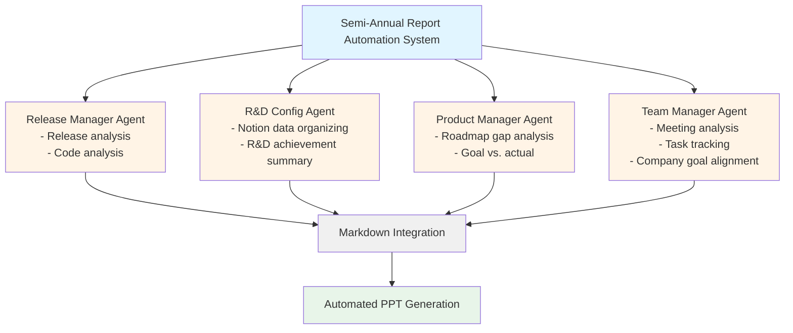

## Introduction: The 60-Hour Burden

As a team leader, I'm required to present semi-annual performance reports to the entire company twice a year. This means synthesizing everything—release history, R&D achievements, roadmap vs. actual delivery, team communication status—into a PowerPoint presentation and delivering it effectively.

**The traditional process consumed over 60 hours**:
- Release analysis: 4-5 hours
- R&D documentation: 20-30 hours
- Roadmap review: 4-5 hours
- Meeting minutes analysis: 8-10 hours
- Company goal alignment: 2-3 hours
- PPT creation: 20-30 hours
- Review and improvements: 6-11 hours
- Presentation practice: 5-10 hours

However, after implementing AI and automation tools, **we've reduced this to approximately 10 hours**. This article shares the practical process of achieving this transformative change.

## Benefits Achieved

Through AI automation system implementation, we achieved the following benefits:

### 1. Time Reduction: 60 Hours → 10 Hours
It's not just about working faster. By having AI handle repetitive and tedious data collection, we could focus on crafting core messages and effective storytelling.

### 2. Prevention of Data Omission
Manual organization inevitably leads to missing some releases or meeting details. AI agents systematically collect all data from the specified period without gaps.

### 3. Elimination of Unnecessary Content
Previously, we'd include everything "just in case," leading to 50-60 slide presentations. With AI judging importance and filtering core content, we could focus solely on messages that matter to executives.

### 4. Effective Storytelling Structure
AI automatically organizes collected data into a logical structure: "Overview → Performance-Focused Review → Issue Identification." This foundation enables compelling storytelling.

## Original Process Analysis

Let's first examine the inefficient traditional process in detail.

### 1. Release Notes and Code Analysis (4-5 hours)
Manually extracting deployed features by digging through Git history and release notes. When commit messages are unclear or release notes insufficient, we had to open the code directly to verify.

### 2. R&D Documentation (20-30 hours)
Organizing research and development activities (new technology evaluation, POCs, performance optimization, etc.) conducted within the team. This meant finding and integrating Notion documents written by each engineer, Slack conversations, and code comments. **The most time-consuming step**.

### 3. Development Roadmap Review (4-5 hours)
Comparing the development plan established at year-start with actual achievements. Gap analysis is key: "Why was Feature A completed but Feature B delayed?"

### 4. Meeting Minutes Analysis (8-10 hours)
Reading through weekly team meetings, bi-weekly business-side meetings, etc., to extract key issues and decisions. At least 20-30 meeting records need review per half-year.

### 5. Company/Department Goal Alignment (2-3 hours)
Organizing how our team's achievements align with company-wide goals. Referencing CEO presentation materials and departmental OKR documents.

### 6. PPT Creation (20-30 hours)
Building stories from all collected materials, designing slides, and creating graphs and tables. **The second most time-consuming step**.

### 7. Review and Improvements (6-11 hours)
Getting feedback from colleagues or supervisors and incorporating changes. Typically requires 2-3 iterations.

### 8. Presentation Practice (5-10 hours)
Writing scripts to fit the presentation time (usually 10-15 minutes), checking flow, and actually practicing delivery.

## AI and Productivity Tool Adoption

Before full-scale automation, we first introduced AI and productivity tools into daily operations.

### 1. Automated Meeting Notes with Notion AI
Leveraging [Notion AI's meeting notes feature](https://www.notion.so/help/guides/using-notions-meeting-notes-feature) to convert voice to text in real-time during meetings and generate summaries.

**Benefits**:
- Zero time spent on post-meeting note writing
- No missing meeting content
- Structured, searchable data for future reference

### 2. Automated Documentation with Notion API MCP
Using [Notion API MCP (Model Context Protocol)](https://modelcontextprotocol.io/introduction) to automatically extract documentation from the codebase and organize it in Notion.

**Automated Items**:
- Development progress status
- Problems encountered and solutions
- Technical research findings
- Specifications and API documentation

**Implementation Example**:
```typescript
// Automatically convert code comments to Notion pages via Notion API MCP
// Code with specific tags automatically becomes documentation
/**
 * @notion-doc
 * @category: Infrastructure
 * @title: Redis Caching Strategy
 *
 * Implementation of API response caching using Redis.
 * TTL setting: 5 minutes
 * Cache key pattern: api:{endpoint}:{params}
 */
export class CacheService {
  // ...
}
```

### 3. AI Code Review and Infrastructure Troubleshooting
Actively using various AI tools like Claude Code, ChatGPT, and Gemini for code review and infrastructure problem-solving.

**Benefits**:
- Reduced code review time
- Faster error log analysis
- Quick resolution of infrastructure configuration issues

## AI Agent-Based Automation System

Now for the core: the semi-annual report generation automation system. Four specialized AI agents work in parallel, each handling their domain.

### Overall Architecture



### 1. Release Manager Agent

**Role**: Analyze Git history and release notes to automatically compile all deployment records for the half-year period

**Input Data**:
- Git commit history (specific date range)
- GitHub/GitLab Release Notes
- JIRA/Linear ticket information

**Output Format**:
```markdown
# Release Summary (2024-04 ~ 2024-09)

## Major Feature Releases
- [2024-04-15] User Notification System v2.0
  - Real-time push notification implementation
  - Notification customization feature

- [2024-06-20] Payment System Enhancement
  - KakaoPay integration
  - Recurring payment functionality

## Bug Fixes and Improvements
- [2024-05-03] Login speed improved by 40%
- [2024-07-12] Memory leak issue resolved

## Statistics
- Total deployments: 23
- Major features: 8
- Bug fixes: 47
```

**Implementation Tip**:
Use Claude Code's MCP to directly access Git API, or periodically collect release data via GitHub Actions and store in Notion.

### 2. R&D Configuration Agent

**Role**: Automatically categorize and summarize research and development materials created in Notion

**Input Data**:
- Notion pages (filtered from specific databases)
- Technical research documents
- POC result reports
- Performance measurement data

**Output Format**:
```markdown
# Research & Development Activity Summary

## New Technology Adoption
### GraphQL Adoption Review (2024-04 ~ 2024-05)
- **Purpose**: Improve network efficiency vs. REST API
- **Result**: POC completed, phased implementation planned for some services
- **Time Invested**: 120 hours
- **Key Learning**: Importance of schema-first design

## Performance Optimization
### Database Query Optimization (2024-06)
- **Problem**: Specific API response time exceeding 3 seconds
- **Solution**: Added indexes and eliminated N+1 queries
- **Achievement**: Response time reduced to 300ms (90% improvement)
- **Time Invested**: 40 hours

## Statistics
- Research themes: 5
- Total time invested: 280 hours
- Actually implemented: 3
```

**Implementation Tip**:
Filter pages for specific periods via Notion API, and have AI summarize core content of each page. Auto-categorize using tags or properties.

### 3. Product Manager Agent

**Role**: Analyze actual achievement vs. roadmap and identify gaps between goals and reality

**Input Data**:
- Year-start product roadmap (Excel/Notion/JIRA)
- Release Manager's release data
- R&D Agent's research and development data

**Output Format**:
```markdown
# Roadmap Achievement Analysis

## Plan vs. Actual
### Completed Features (80% Achievement)
✅ User Notification System v2.0 (Planned: Q2, Completed: Q2)
✅ Payment System Enhancement (Planned: Q2, Completed: Q2)
✅ Admin Dashboard v3 (Planned: Q3, Completed: Q3)

### Delayed Features (20%)
⚠️ Multi-language Support (Planned: Q3, Expected: Q4)
- **Delay Reason**: Translation resource shortage, external vendor contract delay
- **Mitigation**: Q4 priority elevation

## Gap Analysis
### Work Added Outside Original Plan
- KakaoPay integration (urgently added per business request)
- Database migration (unavoidable due to performance issues)

## Impact Analysis
Additional work caused 1-month delay in multi-language support.
```

**Implementation Tip**:
Product Manager Agent receives output from Release Manager and R&D Agent as input, comparing with roadmap Excel. Use Claude's structured output to generate gap analysis results in JSON format.

### 4. Team Manager Agent

**Role**: Analyze AI meeting notes to organize task progress and company goal alignment

**Input Data**:
- Notion AI meeting notes (all meetings during half-year)
- Company-wide OKR documents
- Departmental goal documents

**Output Format**:
```markdown
# Team Communication and Goal Alignment

## Key Meeting Theme Analysis
### 1. Business-Side Collaboration (10 meetings)
- **Main Agenda**: New feature prioritization, bug issue response
- **Decisions**: KakaoPay integration urgently added (CEO approval)

### 2. Internal Team Meetings (24 meetings)
- **Main Agenda**: Tech stack improvements, code review process enhancement
- **Action Item Completion Rate**: 85% (34/40 items)

## Contribution to Company Goals
### 2024 Company Goal: "User Experience Innovation"
- **Our Team's Contribution**:
  - Notification system revamp increased user revisit rate by 15%
  - Payment process simplification improved conversion rate by 8%

### Department Goal: "20% Development Productivity Improvement"
- **Our Team's Achievement**:
  - AI tool adoption reduced code review time by 30%
  - CI/CD improvements doubled deployment frequency
```

**Implementation Tip**:
Since Notion AI meeting notes are already structured, write simple scripts to extract specific keywords (action items, decisions, issues, etc.). Have AI match with company goal documents to auto-calculate contribution.

## Automated PPT Generation Process

Once the four agents complete their work, all materials are saved as Markdown files. Now the Product Manager Agent generates the final PPT.

### Step 1: Generate Structured Markdown

Instruct the Product Manager Agent as follows:

```
Using these materials, generate slide-by-slide markdown in the structure:
[Overview → Performance-Focused Review → Issue Identification]:

- release_summary.md
- rnd_summary.md
- roadmap_gap_analysis.md
- team_communication.md

Each section should follow these principles:
1. Only 1-2 core messages per slide
2. Concise expression that executives can grasp in 3 seconds
3. Backed by numbers and data
4. Leverage visuals (graphs, tables) actively
```

**Output Example**:
```markdown
# Slide 1: Overview
## 2024 H1 Development Team Achievement Summary
- ✅ 8 major features released (100% vs. plan)
- ✅ 280 hours R&D investment, 3 technologies applied
- ⚠️ Multi-language support delayed 1 month (Q4 completion planned)

---

# Slide 2: Release Achievements
## User Experience Improvement-Focused Development
| Feature | Release Date | Business Impact |
|---------|-------------|-----------------|
| Notification System v2.0 | 2024-04 | +15% revisit rate |
| Payment System Enhancement | 2024-06 | +8% conversion rate |
| Admin Dashboard v3 | 2024-09 | +25% operational efficiency |

---

# Slide 3: R&D Activities
## Technical Debt Resolution and Future Preparation
- **GraphQL Adoption**: API efficiency improvement, phased Q4 rollout
- **DB Query Optimization**: 90% response time improvement (3s → 300ms)
- **CI/CD Enhancement**: 2x deployment frequency, fewer incidents
```

### Step 2: AI Review and Improvements

Attach the draft to Claude, Gemini, and ChatGPT respectively for review:

```
The attached markdown is a draft for semi-annual executive reporting PPT.
Please suggest improvements from these perspectives:

1. Is the message clear? (Executive perspective)
2. Is the logical flow natural?
3. Is there unnecessary or duplicate content?
4. Are numbers and data presented persuasively?
5. Is there content that would benefit from visual representation?
```

**AI Feedback Examples**:
- **Claude**: "The business impact in Slide 2 is well quantified. However, Slide 3's R&D activities may be difficult for non-technical executives to understand due to technical jargon. 'User wait time reduced to 1/10' is more intuitive than '90% performance improvement'."
- **Gemini**: "Mentioning delayed features in Overview is good, but including solutions would be more positive."
- **ChatGPT**: "Adding a graph to Slide 3 would be beneficial. Example: R&D time investment vs. business impact correlation"

### Step 3: Manual Review and Corrections

Using AI feedback as reference, directly fix incorrect parts or contextual errors. Always verify sensitive numbers and business data.

### Step 4: PowerPoint Generation

Use Claude Code's "Create File" feature to convert Markdown to PowerPoint:

```
Generate a PowerPoint file (.pptx) based on the revised markdown.

Requirements:
- Template: Use company standard template (template.pptx)
- Font: Nanum Gothic, Title 28pt, Body 18pt
- Colors: Company brand colors (#1E40AF main, #F59E0B accent)
- Tables and graphs prioritize readability
- Animations: Minimal (fade-in only)
```

Alternatively, use Python library (`python-pptx`) for programmatic generation:

```python
from pptx import Presentation
from pptx.util import Inches, Pt

prs = Presentation('template.pptx')

# Add slide
slide_layout = prs.slide_layouts[1]  # Title and Content
slide = prs.slides.add_slide(slide_layout)

# Add title
title = slide.shapes.title
title.text = "2024 H1 Development Team Achievement Summary"

# Add content
content = slide.placeholders[1]
tf = content.text_frame
tf.text = "✅ 8 major features released (100% vs. plan)"
# ...

prs.save('presentation.pptx')
```

### Step 5: Presentation Script Generation

Finally, have AI write a 10-minute presentation script:

```
Write a script for presenting the attached PPT in 10 minutes.

- Audience: Executives (CEO, CFO, department heads)
- Tone: Confident yet humble
- Structure: Introduction (1 min) → Main (7 min) → Conclusion (2 min)
- Detail what to say for each slide
- Include anticipated questions and answers
```

**Output Example**:
```markdown
## Slide 1: Introduction (30 seconds)
"Good morning, I'm John Doe, Development Team Leader. Today I'll share
our team's H1 2024 achievements and H2 plans."

(Pointing to slide)
"At a glance, we released all 8 planned major features and invested
280 hours in R&D for new technology adoption."

## Slide 2: Release Achievements (2 minutes)
"First, our release achievements. H1 2024 focused on three core features
aligned with the company goal of 'User Experience Innovation'."

(Pointing to table)
"Notably, the Notification System v2.0 released in April increased user
revisit rate by 15%, and June's Payment System Enhancement improved
conversion rate by 8%..."

## Anticipated Questions
Q: "Why was multi-language support delayed?"
A: "External vendor contract took longer than expected, and resources
were diverted when KakaoPay integration was urgently added. However,
we've set it as top priority for H2, with guaranteed Q4 completion."
```

## Final Results and Benefits

### Time Investment Comparison

| Stage | Manual (Original) | AI Automation | Reduction |
|-------|------------------|---------------|-----------|
| Data Collection | 18-23 hours | 2 hours | **90%** |
| Material Organization | 20-30 hours | 1 hour | **96%** |
| PPT Creation | 20-30 hours | 4 hours | **85%** |
| Review & Improvements | 6-11 hours | 2 hours | **75%** |
| Presentation Practice | 5-10 hours | 1 hour | **87%** |
| **Total** | **60+ hours** | **~10 hours** | **83%** |

### Qualitative Benefits

**1. Improved Job Satisfaction**
Freed from repetitive data collection tasks, we could focus on creative storytelling.

**2. Enhanced Credibility**
Thanks to AI's systematic data organization, we receive fewer questions like "Is this number correct?"

**3. Reusable System Construction**
The agent system built once can continue to be used in the next half-year, next year. Improvements are also easy.

**4. Team-Wide Productivity Boost**
As the entire team utilizes the infrastructure built (Notion AI meeting notes, automated documentation), efficiency in other work has also improved.

## Implementation Considerations

### 1. Data Quality is Key
"Garbage in, garbage out." AI depends entirely on input data quality. If Notion documents are inadequate or Git commit messages unclear, AI cannot organize properly.

**Solution**: Establish documentation and commit message writing standards within the team.

### 2. AI Requires Verification
Content generated by AI must be reviewed by humans. Numbers, dates, and causal relationships in particular can be incorrect.

**Solution**: Never skip Step 3 (manual review).

### 3. Initial Construction Costs
Building the agent system initially requires trial and error. The first semi-annual report might actually take longer.

**Solution**: Invest from a long-term perspective. From the second time onward, 10 hours is truly sufficient.

### 4. Security and Sensitive Information
When inputting company internal data to AI, security policies must be followed.

**Solution**: Use on-premise LLMs (e.g., Llama, GPT-4 Azure Enterprise), or mask sensitive information.

## Scalability

This system can be utilized beyond semi-annual reports:

- **Monthly Team Reports**: Adjust agent input period to 1 month
- **Project Retrospectives**: Filter only specific project timeline and data
- **Annual Performance Reviews**: Synthesize year's data for individual/team evaluation materials
- **External Presentations**: Convert to conference or recruitment presentation materials

## Conclusion: AI is a Tool, Process is Key

The core of AI automation isn't the technology itself but **process design**.
- What data is needed?
- In what order should it be organized?
- What is the form of the final deliverable?

After answering these questions first, AI should be utilized as a "tool" to execute that process.

Reducing 60 hours to 10 wasn't about using a "fast tool"—it was about **systematizing repetitive work**. AI is simply the best means to implement that system.

If your work also has repetitive, time-consuming tasks, I recommend trying AI automation. The first attempt is challenging, but once the system is built, the effects exceed imagination.

---

**Next Article Preview**: [AI Agent System Construction Practical Guide: Creating Automation Pipelines with Notion API MCP and Claude Code](/en/blog/en/ai-agent-notion-mcp-automation)

If you have questions or want to know more, please leave a comment!
