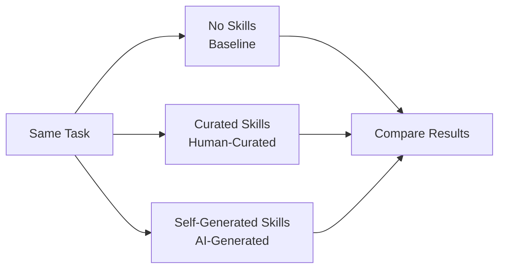
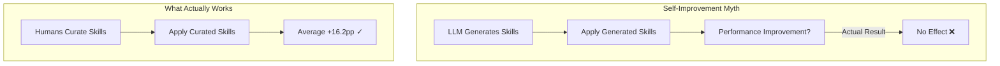

## Overview

"AI that makes itself better" — self-play and self-improvement paradigms are among the most compelling narratives in the AI industry. But a new study, <strong>SkillsBench</strong> (arXiv:2602.12670), directly challenges this myth.

Across 11 domains, 86 tasks, 7 agent-model configurations, and <strong>7,308 trajectories</strong>, the large-scale experiment found:

- Human-curated skills: average <strong>+16.2pp</strong> performance improvement
- AI self-generated skills: <strong>zero benefit (0pp)</strong>

In other words, <strong>LLMs cannot reliably author the procedural knowledge they benefit from consuming</strong>.

## What Are Agent Skills?

<strong>Agent Skills</strong> as defined in the research are structured packages of procedural knowledge injected at inference time into LLM agents.

```
Skills Package Structure
├── SKILL.md          # Procedural guide (workflows, SOPs)
├── scripts/          # Executable scripts
├── templates/        # Code templates
└── examples/         # Reference examples
```

Key differences from existing approaches:

| Type | System Prompt | RAG | Few-shot | <strong>Skills</strong> |
|------|--------------|-----|----------|---------|
| Structured | ✗ | ✗ | ✗ | <strong>✓</strong> |
| Procedural | △ | ✗ | ✗ | <strong>✓</strong> |
| Executable Resources | ✗ | ✗ | ✗ | <strong>✓</strong> |
| Portable | ✗ | △ | △ | <strong>✓</strong> |

Modern agent tools like Claude Code's `CLAUDE.md`, Gemini CLI, and Codex CLI have adopted this Skills concept.

## Experimental Design: 3-Condition Comparison

SkillsBench evaluates identical tasks under three conditions:



<strong>Experimental scale:</strong>
- 11 domains (software engineering, data analysis, healthcare, etc.)
- 86 tasks (selected from 322 candidates by 105 contributors)
- 7 agent-model configurations (Claude Code, Gemini CLI, Codex CLI)
- <strong>7,308 trajectories</strong> (exhaustive evaluation)

All evaluations use deterministic verifiers for pass/fail judgment, eliminating LLM-as-judge bias.

## Key Finding 1: Curated Skills Are Effective

Human-curated skills showed an average <strong>+16.2pp</strong> performance improvement. However, domain variance is extreme:

| Domain | Performance Gain |
|--------|-----------------|
| Healthcare | <strong>+51.9pp</strong> |
| Data Analysis | High improvement |
| Software Engineering | <strong>+4.5pp</strong> |
| Some tasks (16/84) | <strong>Negative</strong> |

Notably, <strong>16 out of 84 tasks showed performance degradation</strong> with skills. Skills are not a silver bullet.

## Key Finding 2: Self-Generated Skills Are Useless

This is the most shocking result of the study.

When LLMs were asked to "write skills for yourself to better perform this task," then used those skills:

> <strong>"Self-generated Skills provide no benefit on average, showing that models cannot reliably author the procedural knowledge they benefit from consuming."</strong>

The average effect of self-generated skills was <strong>0pp</strong>. In some cases, they were actively harmful.



This is a powerful counterargument to <strong>self-play/self-improvement universalism</strong>. Models are proficient at <strong>consuming</strong> externally provided procedural knowledge but lack the ability to <strong>produce</strong> useful procedural knowledge.

## Key Finding 3: Less Is More

Another important discovery concerns skill size:

> <strong>Focused skills with 2–3 modules outperform comprehensive documentation</strong>

Small, focused skill packages boost performance more than extensive manuals. This likely relates to LLMs' context window utilization efficiency.

Additionally, <strong>smaller models + skills ≈ larger models (without skills)</strong>. A small model armed with proper skills can match the baseline performance of a larger model.

## Practical Implications

The message for practitioners using AI agents is clear:

<strong>1. Reconsider Skill Auto-Generation Pipelines</strong>

The approach of "AI generates and improves its own skills" is currently ineffective. Human expert curation remains essential.

<strong>2. Keep Skills Small and Focused</strong>

Core skills with 2–3 modules are more effective than massive documentation. Writing a concise `CLAUDE.md` focused on key workflows beats hundreds of lines.

<strong>3. Recognize Domain-Specific Variance</strong>

The gap between healthcare (+51.9pp) and software engineering (+4.5pp) is over 10x. Skills have diminishing returns in domains where models already excel.

<strong>4. Acknowledge That Skills Can Be Harmful</strong>

Skills degraded performance in 16 out of 84 tasks. Bad skills are worse than no skills at all.

## Technical Analysis: Why Self-Generation Fails

While the paper doesn't provide direct causal analysis, we can infer structural reasons:

<strong>Metacognition limitations</strong>: LLMs cannot accurately assess "what they don't know." They lack the ability to diagnose which procedural knowledge they need.

<strong>General knowledge vs. procedural knowledge</strong>: LLM pre-training data is biased toward declarative knowledge. They learn "what" better than "how-to."

<strong>Unverifiability</strong>: Models have no way to verify the quality of their self-generated skills. Curated skills undergo validation by human experts.

## Conclusion

SkillsBench is the first systematic benchmark for AI agent skills, <strong>presenting cold data against the attractive narrative of "AI self-improvement."</strong>

The core message is simple:

- ✅ Human-created skills are effective (+16.2pp)
- ❌ AI-created skills have no effect (0pp)
- ✅ Small, focused skills outperform extensive documentation
- ✅ Small model + good skills ≈ large model

The dream of self-improvement is compelling, but current LLMs have not yet reached that level. <strong>Human domain expertise and curation remain irreplaceable</strong>.

## References

- [SkillsBench: Benchmarking How Well Agent Skills Work Across Diverse Tasks](https://arxiv.org/abs/2602.12670) — Xiangyi Li et al., 2026
- [Anthropic Claude Code Skills Documentation](https://docs.anthropic.com/en/docs/agents-and-tools/claude-code/skills)
- [Harbor Framework](https://github.com/harbor-ai/harbor) — Agent benchmark framework
