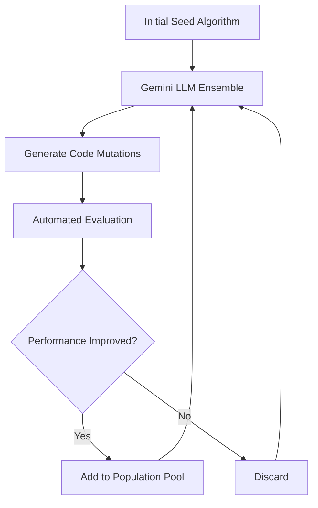
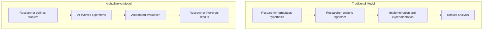
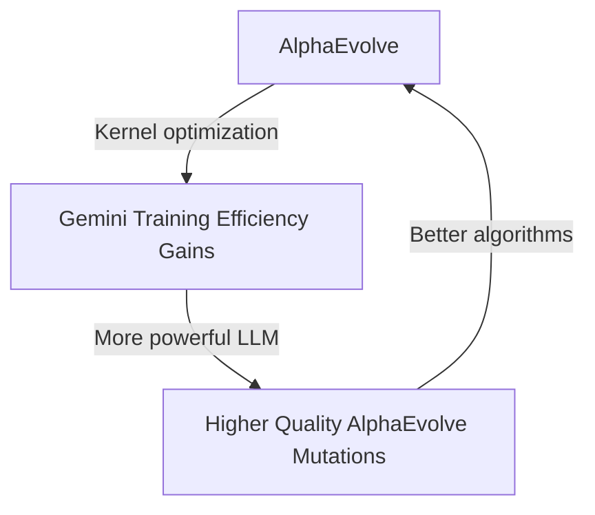

## Introduction

On March 10, 2026, the Google DeepMind team published a paper on arXiv titled "Reinforced Generation of Combinatorial Structures: Ramsey Numbers," quietly establishing a meaningful milestone. <strong>A single meta-algorithm called AlphaEvolve simultaneously improved the lower bounds for five classical Ramsey numbers</strong>. Some of these records had stood for 20 years.

AI writing code, fixing bugs, and reviewing pull requests has already become routine. But AI <strong>discovering new solutions to problems that mathematicians could not solve for decades</strong> is an entirely different story. This article examines how AlphaEvolve works, what the Ramsey number breakthroughs mean, and what implications this carries for engineering organizations.

## What Are Ramsey Numbers?

Ramsey theory is a branch of combinatorics built on the principle that "within any sufficiently large structure, a regular substructure must inevitably appear."

<strong>The Ramsey number R(s, t)</strong> is the smallest integer n satisfying the following condition:

> Given n people at a gathering, there must exist either a group of s people who all know each other, or a group of t people who are all strangers to one another.

In graph theory terms, it is the smallest n such that any red/blue two-coloring of the edges of the complete graph on n vertices must contain either a red complete subgraph K_s or a blue complete subgraph K_t.

Computing the exact values of Ramsey numbers is known as <strong>one of the hardest problems in combinatorics</strong>. The legendary mathematician Paul Erdos once said:

> "If aliens threatened to destroy Earth unless we told them R(5,5), we should marshal all our computers and mathematicians to find the answer. But if they asked for R(6,6), we should launch an attack against the aliens instead."

## What AlphaEvolve Achieved

AlphaEvolve improved the lower bounds for five Ramsey numbers:

| Ramsey Number | Previous Lower Bound | New Lower Bound | Record Duration |
|---------------|---------------------|-----------------|-----------------|
| R(3, 13) | 60 | <strong>61</strong> | 11 years |
| R(3, 18) | 99 | <strong>100</strong> | 20 years |
| R(4, 13) | 138 | <strong>139</strong> | 11 years |
| R(4, 14) | 147 | <strong>148</strong> | 11 years |
| R(4, 15) | 158 | <strong>159</strong> | 6 years |

While each improvement may appear to be just a single increment, progress of this magnitude in Ramsey number research is <strong>exceptionally rare for a single paper</strong>. Previously, improving even one Ramsey number lower bound required years of dedicated research.

Even more noteworthy is that AlphaEvolve successfully recovered the known lower bounds for all Ramsey numbers with established exact values, demonstrating the system's reliability.

## How AlphaEvolve Works

AlphaEvolve is an <strong>evolutionary coding agent</strong> developed by Google DeepMind. The core idea is "rather than solving the problem directly, evolve an algorithm that solves it."

### Step 1: Initialization

Define the problem specification, evaluation logic, and a seed program (initial algorithm). The seed program is basic code that can solve the problem, even if not optimally.

### Step 2: Mutation

A Gemini model ensemble analyzes the current code and generates mutated versions:

- <strong>Gemini Flash</strong>: Rapidly explores diverse ideas (breadth of search)
- <strong>Gemini Pro</strong>: Delivers high-quality improvements through deep analysis (depth of search)

This ensemble approach is critical. While Flash explores a wide solution space, Pro creates breakthroughs.

### Step 3: Evolution

An evolutionary algorithm selects promising mutations from the population pool and combines them to serve as starting points for the next generation.

### Step 4: Evaluation and Iteration

Automated evaluation metrics quantitatively measure the accuracy and quality of each candidate program. Results are fed back to the LLM to generate improved solutions in the next round.

As this loop repeats recursively, a simple seed program <strong>evolves into a state-of-the-art algorithm</strong>.

## What the Meta-Algorithm Approach Reveals

The most surprising finding from this Ramsey number research was that when the team analyzed the algorithms AlphaEvolve independently invented, they discovered it had <strong>rediscovered techniques that human mathematicians had previously developed by hand</strong>.

Specifically:

- <strong>Paley graph</strong>-based approaches
- <strong>Quadratic residue graph</strong> constructions
- Other algebraic graph theory techniques

The AI did not "learn" these mathematical constructions; it <strong>independently rediscovered</strong> them through the evolutionary search process. This demonstrates that AlphaEvolve's meta-algorithm approach can capture fundamental mathematical structures beyond simple pattern matching.

## How AlphaEvolve Differs from Existing AI Research Tools

AI had contributed to scientific research before AlphaEvolve, but there are important differences in approach:

| System | Approach | Characteristic |
|--------|----------|----------------|
| AlphaFold | Protein structure prediction | Domain-specific model |
| GPT-5.2 | Theoretical physics reasoning | Leverages large model reasoning |
| AlphaEvolve | Automated algorithm discovery | <strong>Domain-agnostic meta-algorithm</strong> |

AlphaEvolve's key differentiator is its <strong>generality</strong>. Beyond Ramsey numbers:

- Optimized matrix multiplication kernels by 23% during Gemini training, reducing total training time by 1%
- Improved the best known solutions on approximately 20% of over 50 open math problems
- Applied to various combinatorics problems including the kissing number problem

The fact that <strong>a single system is delivering results across mathematics, optimization, and engineering</strong> is what makes this remarkable.

## Key Takeaways for CTOs and Engineering Managers

### 1. The Shifting AI R&D Pipeline

The AlphaEvolve case demonstrates that AI is <strong>evolving from "tool" to "research partner"</strong>. This signals structural changes in how R&D organizations operate:

The researcher's role is shifting from "algorithm designer" to <strong>"problem definer + results interpreter"</strong>.

### 2. Engineering Optimization Opportunities

AlphaEvolve is already being used for production optimization within Google:

- <strong>Matrix multiplication kernel optimization</strong>: 23% improvement in Gemini training speed
- <strong>Data center scheduling</strong>: Improved resource allocation algorithms
- <strong>Compiler optimization</strong>: Automated code optimization search

Areas where engineering teams can apply this today:

- Automated optimization of performance-critical algorithms
- Evolutionary improvement of A/B testing strategies
- Infrastructure cost optimization through algorithm search

### 3. The "AI Improving AI" Feedback Loop

The structure where AlphaEvolve improves Gemini's training efficiency and the improved Gemini in turn boosts AlphaEvolve's performance represents an early form of a <strong>self-reinforcing loop</strong>:

As this loop accelerates, the pace of AI capability advancement could increase nonlinearly. As a CTO, it is important to monitor this trend and design similar automated optimization pipelines for your own systems.

### 4. Rethinking Talent Strategy

As AI becomes increasingly capable at algorithm design and optimization, the center of gravity for required engineering competencies is shifting:

- <strong>Problem definition skills</strong>: The ability to ask the right questions
- <strong>Evaluation design skills</strong>: Designing metrics to validate AI-generated results
- <strong>Results interpretation skills</strong>: Domain knowledge to understand the significance of AI-discovered solutions
- <strong>AI system orchestration</strong>: The ability to coordinate multiple AI agents

## Looking Ahead

AlphaEvolve's Ramsey number breakthroughs are just the beginning. As of 2026, AI's impact on scientific research is accelerating:

- <strong>May 2025</strong>: AlphaEvolve initial release (matrix multiplication optimization)
- <strong>December 2025</strong>: AlphaEvolve becomes available as a Google Cloud service
- <strong>March 2026</strong>: Five Ramsey number bounds improved simultaneously

With AlphaEvolve now accessible through Google Cloud, the door is open not only for large enterprises but also for startups and research institutions to leverage this tool.

## Conclusion

AlphaEvolve's Ramsey number breakthroughs are not merely a mathematical achievement. They mark a milestone in the trend of <strong>AI taking on an increasingly deeper role in human intellectual endeavors</strong>.

As engineering leaders, here is what we need to prepare for:

1. Cultivate <strong>problem definition capabilities</strong> as a core organizational competency
2. Integrate <strong>automated evaluation pipelines</strong> into your technology stack
3. Foster an organizational culture that positions AI not as a "tool" but as a <strong>"research and optimization partner"</strong>
4. Experimentally adopt <strong>evolutionary approaches</strong> in your engineering processes

AI that writes code has already become commonplace. Now we are entering the era of <strong>AI that invents algorithms</strong>.

## References

- [Reinforced Generation of Combinatorial Structures: Ramsey Numbers (arXiv)](https://arxiv.org/abs/2603.09172)
- [AlphaEvolve: A Gemini-powered coding agent for designing advanced algorithms (Google DeepMind)](https://deepmind.google/blog/alphaevolve-a-gemini-powered-coding-agent-for-designing-advanced-algorithms/)
- [AI as a research partner: Advancing theoretical computer science with AlphaEvolve (Google Research)](https://research.google/blog/ai-as-a-research-partner-advancing-theoretical-computer-science-with-alphaevolve/)
- [AlphaEvolve on Google Cloud](https://cloud.google.com/blog/products/ai-machine-learning/alphaevolve-on-google-cloud)
