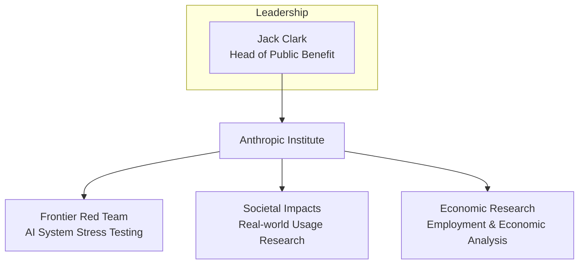
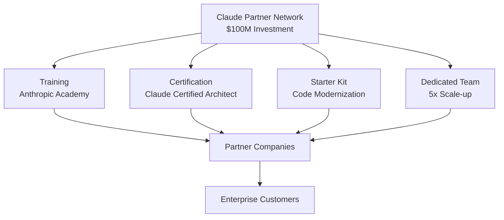

On March 11 and 12, 2026, Anthropic made back-to-back major announcements. The first was the establishment of the <strong>Anthropic Institute</strong>, a research organization studying AI's societal impact. The second was a <strong>$100 million Claude Partner Network</strong> investment to build an enterprise partner ecosystem.

These two announcements are not simply new program launches. They are a clear signal that Anthropic is transitioning from a "model company" to an "AI platform ecosystem company." Let's analyze what this means from the perspective of a CTO or VPoE.

## Anthropic Institute — Why an AI Research Institute Is Necessary

### Unifying Three Teams

The Anthropic Institute consolidates three previously separate research teams into a single organization.



The <strong>Frontier Red Team</strong> stress-tests the extreme capabilities of AI systems. A notable recent project used Claude to autonomously discover 22 CVEs (security vulnerabilities) in the Firefox codebase. Beyond simply finding vulnerabilities, the team tested whether AI could autonomously exploit them as well.

The <strong>Societal Impacts</strong> team conducts field research on how AI is being used in the real world. The <strong>Economic Research</strong> team tracks AI's effects on the labor market and the macroeconomy.

### Why a Model Company Builds a Research Institute

As AI model performance has improved dramatically, the need for model developers themselves to study "what impact this technology has on society" has grown. The establishment of the Anthropic Institute carries three messages.

1. <strong>Preemptive regulatory strategy</strong>: The intent is to participate in policy discussions using in-house research data before external regulation arrives. In fact, Anthropic plans to open a Public Policy team office in Washington, D.C. this spring.

2. <strong>Building enterprise trust</strong>: It sends a signal to large enterprise customers that "we don't just sell models — we take responsibility for the impact those models have."

3. <strong>Talent acquisition</strong>: Bringing together not just machine learning engineers but economists, social scientists, and cybersecurity experts into one organization represents competitive advantage in the AI safety talent market.

## Claude Partner Network — A $100M Ecosystem Investment

### Program Structure

If Anthropic Institute is about "research," the Claude Partner Network is about "execution." This $100 million investment focuses on building a partner ecosystem to accelerate enterprise AI adoption.



<strong>Target partners</strong> include management consulting firms, SI (systems integration) companies, and AI professional services firms. The structure is similar to AWS or Azure partner programs, but the differentiator is that it is directly operated by an AI model vendor.

### Claude Certified Architect — The First Technical Certification from an AI Vendor

The most noteworthy part of this announcement is the <strong>Claude Certified Architect, Foundations</strong> certification program. This is a technical exam for solution architects who design production applications using Claude.

Just as AWS Solutions Architect and Google Cloud Professional Architect certifications exist, AI platform vendors are now building their own certification frameworks. Additional certifications for sales, architects, and developers are scheduled for release in the second half of 2026.

The implications are clear:

- <strong>Structural shift in the talent market</strong>: "Claude expert" becomes a distinct career track
- <strong>Organizational competency proof</strong>: Partners now have an official channel to demonstrate expertise to customers
- <strong>Deeper vendor lock-in</strong>: A certification ecosystem is the most powerful tool for raising switching costs

### Code Modernization Starter Kit

Another key element is the <strong>Code Modernization Starter Kit</strong>. It provides partner companies with a standardized starting point for legacy codebase migration and technical debt resolution.

Anthropic itself has stated that this is the "highest-demand enterprise workload." The assessment is that Claude's agentic coding capability translates most directly into customer outcomes in this area.

## Three Signals Every CTO Should Read

### Signal 1: Changing Criteria for Evaluating AI Vendors

From 2024〜2025, AI vendor evaluations were mostly focused on benchmark performance. The dominant criteria were questions like "What's the SWE-bench score?" and "Is it number one on coding benchmarks?"

Starting in 2026, different questions need to be asked:

| Past Questions | 2026 Questions |
|---|---|
| Model performance benchmarks | Partner ecosystem scale and maturity |
| API pricing | Adoption support infrastructure (training, certification, dedicated teams) |
| Context window size | Regulatory response and safety research investment |
| Inference speed | Legacy modernization tools and starter kits |

Vendor model performance is converging. Differentiation comes from the ecosystem.

### Signal 2: Safety Research Becomes a Sales Tool

The Anthropic Institute's Frontier Red Team discovering CVEs in Firefox is a genuine research achievement, but it is simultaneously a powerful enterprise sales message: "Our model can find security vulnerabilities in your codebase."

This demonstrates that AI safety research can be a revenue-contributing asset rather than a mere cost center. CTOs should re-evaluate vendor safety investments not as "ethical decoration" but as "evidence of technical capability."

### Signal 3: The Dawn of the AI Certification Ecosystem

Just as AWS certifications structurally transformed the cloud talent market, AI vendor certifications have the potential to produce the same effect. The difference is speed. While it took 5〜7 years for the cloud certification ecosystem to mature, AI certifications can spread much faster on top of an already proven model.

For engineering leaders, this carries two implications:

1. <strong>Team member growth paths</strong>: Claude Certified Architect can become a career milestone for team members
2. <strong>Hiring criteria</strong>: Before long, "Claude certification holder" will appear as a preferred qualification in job postings

## Competitive Positioning

Anthropic is not the only company pursuing an ecosystem strategy. Let's compare recent moves from the three major AI vendors.

| Area | Anthropic | OpenAI | Google |
|---|---|---|---|
| Research Organization | Anthropic Institute | — | DeepMind (existing) |
| Partner Program | Claude Partner Network ($100M) | Frontier Program | Google Cloud AI Partner |
| Security Strategy | Frontier Red Team (internal) | Promptfoo acquisition (external) | Project Zero (existing) |
| Protocol Standard | MCP (Linux Foundation) | Open Responses API | A2A Protocol |
| Certification Program | Claude Certified Architect | — | Google Cloud AI Certification |

<strong>Anthropic</strong> is running a dual-track strategy of "safety + ecosystem."
<strong>OpenAI</strong> is pursuing a strategy of absorbing security as a product feature through the Promptfoo acquisition.
<strong>Google</strong> is pursuing a strategy of layering AI on top of its existing cloud partner ecosystem.

## Practical Steps: What Engineering Teams Should Do Now

### 1. Review Claude Certified Architect Readiness

Recommend that 1〜2 solution architects or tech leads on your team pursue early certification.

```bash
# Access Anthropic Academy (after partner registration)
# Review training materials on the Partner Portal
# Prepare for the Claude Certified Architect, Foundations exam
```

### 2. Consider Joining the Partner Network

Membership is free. Joining provides access to:
- Anthropic Academy training materials
- Sales resources and co-marketing documents
- Dedicated Applied AI engineer support
- Code Modernization Starter Kit

### 3. Update Your Vendor Evaluation Framework

```yaml
# AI Vendor Evaluation Framework (2026 Update)
model_performance:
  weight: 0.25
ecosystem_maturity:
  weight: 0.30
safety_and_governance:
  weight: 0.20
cost_and_scalability:
  weight: 0.15
developer_experience:
  weight: 0.10
```

### 4. Launch a Code Modernization Pilot

For projects with legacy codebases, start a small-scale pilot using the Code Modernization Starter Kit.

## Closing Thoughts

Anthropic's announcements are the clearest signal yet that the AI industry is shifting from "model performance competition" to "ecosystem maturity competition." Just as AWS dominated the cloud market through its certification, partner, and training ecosystem, the same dynamics are beginning to play out in the AI market.

CTOs and VPoEs need to take three actions now:

1. Expand AI vendor evaluation criteria from "model performance" to "ecosystem maturity"
2. Establish an AI certification roadmap for your team
3. Decide whether to pursue early participation in partner programs

In an era where technological differentiation is converging, true competitive advantage comes from the ecosystem.

## References

- [Introducing The Anthropic Institute](https://www.anthropic.com/news/the-anthropic-institute)
- [Anthropic invests $100 million into the Claude Partner Network](https://www.anthropic.com/news/claude-partner-network)
- [Anthropic forms institute to study long-term AI risks](https://www.helpnetsecurity.com/2026/03/11/anthropic-institute-ai-challenges/)
- [Anthropic launches partner network with $100m investment](https://www.investing.com/news/economy-news/anthropic-launches-partner-network-with-100m-investment-93CH-4557957)
