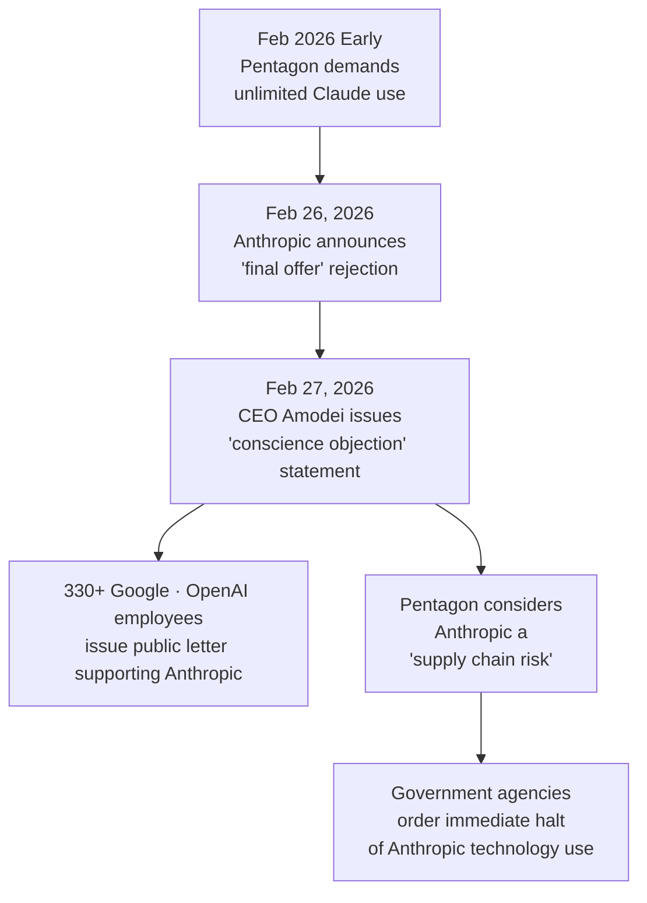
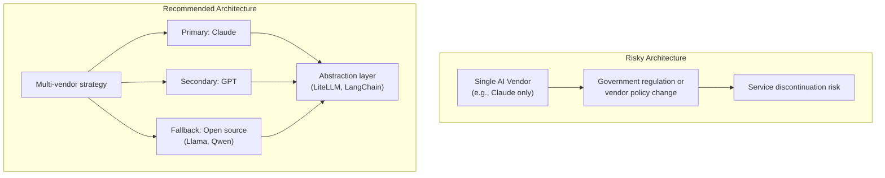
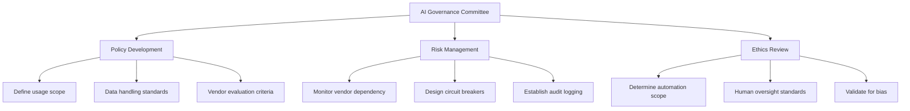
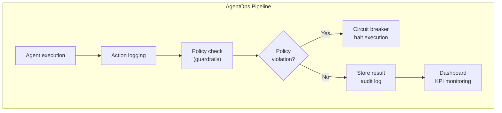

## Overview

On February 27, 2026, a pivotal event shook the tech industry. Anthropic CEO Dario Amodei officially refused the U.S. Department of Defense (Pentagon) demands for unlimited military use of Claude AI. This incident is not merely a corporate-government dispute. It starkly reveals <strong>a new challenge that every CTO and VPoE of organizations adopting AI will inevitably face: "AI governance."</strong>

This post analyzes the core issues and presents a practical guide for technical leaders on how to establish AI vendor strategy and governance frameworks.

## The Incident: What Happened

### Timeline



### Identifying the Key Issues

The Pentagon's demands were essentially twofold.

<strong>1. Unrestricted use of Claude for mass surveillance</strong> targeting U.S. citizens

<strong>2. Integration of Claude into fully autonomous weapons systems</strong> without human intervention

Anthropic designated these two areas as "non-negotiable lines" and refused both demands. CEO Amodei stated in his official statement:

> On both of these matters, I cannot in good conscience accept them.

### Industry Response

Notably, over 330 employees from Google and OpenAI publicly supported Anthropic. Jeff Dean, a senior scientist at Google DeepMind, also expressed opposition to mass surveillance. This demonstrates that the entire AI industry is establishing ethical baselines regarding military applications of AI.

## Five Lessons CTOs/VPoEs Must Learn from This Crisis

### 1. AI Vendors Can Become Unavailable Overnight

The Pentagon designated Anthropic as a "supply chain risk," preventing defense-related companies (Boeing, Lockheed Martin, etc.) from using Anthropic technology. Furthermore, it ordered all government agencies to halt their use of Anthropic technology.

<strong>Takeaway:</strong> If your organization is deeply dependent on a specific AI vendor, you must prepare for scenarios where that vendor becomes unavailable due to political or regulatory pressures.



### 2. AI Governance Has Become Mandatory, Not Optional

According to Deloitte's 2026 Tech Trends report, only <strong>17% of enterprises</strong> have formal AI governance frameworks, yet these organizations show significantly higher success rates in scaling agent deployments.

<strong>AI Governance Framework CTOs Must Establish:</strong>



### 3. "AI Vendor Ethics" Has Become a Business Risk

Anthropic's case demonstrates how an AI vendor's ethical decisions can directly impact customers' business. Conversely, selecting vendors with weaker ethical standards creates reputational risk.

<strong>Key evaluation items when assessing vendors:</strong>

| Evaluation Criteria | Question | Importance |
|------------------|----------|------------|
| Ethics Policy | Does the vendor have a clear Acceptable Use Policy for AI? | High |
| Government Relations | How does the vendor respond to government pressure? | High |
| Data Sovereignty | Under which jurisdiction's control is your data stored? | High |
| Open Source Alternative | Can you switch to open source if the vendor is blocked? | Medium |
| SLA Guarantee | Is there service protection against political risk? | Medium |

### 4. Multi-Vendor + Abstraction Layer Is a Survival Strategy

As of 2026, a practical architecture strategy enterprises must consider when selecting AI vendors.

```typescript
// AI Vendor Abstraction Layer Example
interface AIProvider {
  name: string;
  chat(messages: Message[]): Promise<Response>;
  isAvailable(): Promise<boolean>;
}

class AIGateway {
  private providers: AIProvider[];
  private primary: AIProvider;

  async chat(messages: Message[]): Promise<Response> {
    // Try primary vendor first
    if (await this.primary.isAvailable()) {
      return this.primary.chat(messages);
    }
    // Fallback chain
    for (const provider of this.providers) {
      if (await provider.isAvailable()) {
        console.warn(
          `Primary unavailable, falling back to ${provider.name}`
        );
        return provider.chat(messages);
      }
    }
    throw new Error('All AI providers unavailable');
  }
}
```

<strong>Core principle:</strong> Design prompts and tool definitions independently of vendors, making only the API call layer replaceable. Leveraging standard protocols like MCP (Model Context Protocol) can significantly reduce vendor switching costs.

### 5. Invest in AgentOps and Observability

As the Anthropic-Pentagon crisis demonstrates, the ability to track <strong>what your AI system is doing</strong> has transcended technical requirements and become a <strong>legal and ethical mandate.</strong>



<strong>Minimum observability items you must build:</strong>

| Component | Description | Tool Examples |
|-----------|-------------|----------------|
| Execution Tracing | What tools the agent used and in what sequence | LangSmith, Braintrust |
| Cost Monitoring | Token usage, API call costs | Helicone, OpenMeter |
| Policy Compliance | Detect and block guardrail violations | Guardrails AI, NeMo |
| Audit Logs | Immutable records of all inputs and outputs | In-house build or Langfuse |

## Practical Checklist: Three Things You Can Start Monday

<strong>Step 1: AI Vendor Dependency Audit (1 week)</strong>

Catalog all AI services currently in use in your organization and evaluate the business impact if each service becomes unavailable.

<strong>Step 2: Establish Multi-Vendor Migration Plan (2–4 weeks)</strong>

Design a Primary/Secondary/Fallback architecture and evaluate abstraction layer adoption. Tools like LiteLLM or LangChain are good starting points for quick implementation.

<strong>Step 3: Draft AI Governance Framework (1 month)</strong>

Define AI usage policies together with executive leadership. At minimum, you must document three elements: "automation scope," "human oversight criteria," and "data handling principles."

## Conclusion

The Anthropic vs Pentagon crisis vividly demonstrated that AI technology transcends pure technical tools and encompasses <strong>political, ethical, and legal complexity.</strong>

As CTOs/VPoEs, our responsibilities are clear:

1. Move away from single-vendor dependency and establish a multi-vendor strategy
2. Internalize AI governance frameworks into organizational culture
3. Design observability and audit systems from the ground up

In 2026, when AI has become central to business operations, <strong>"managing AI safely" has become equally critical as "using AI effectively"</strong> for technical leaders.

## References

- [Anthropic CEO refuses Pentagon demands - Fortune](https://fortune.com/2026/02/27/dario-amodei-says-he-cannot-in-good-conscience-bow-to-pentagons-demands-over-ai-use-in-military/)
- [Anthropic rejects Pentagon's final offer - Axios](https://www.axios.com/2026/02/26/anthropic-rejects-pentagon-ai-terms)
- [Google & OpenAI employees support Anthropic - TechCrunch](https://techcrunch.com/2026/02/27/employees-at-google-and-openai-support-anthropics-pentagon-stand-in-open-letter/)
- [Deloitte Agentic AI Strategy Report 2026](https://www.deloitte.com/us/en/insights/topics/technology-management/tech-trends/2026/agentic-ai-strategy.html)
- [Best Practices for AI Agent Implementations 2026](https://onereach.ai/blog/best-practices-for-ai-agent-implementations/)
