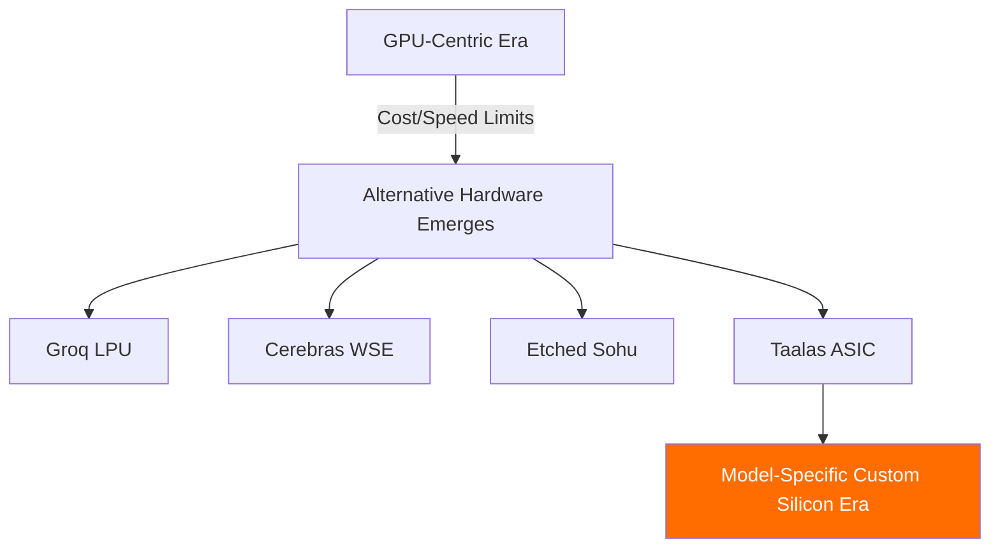

## Overview

AI inference cost and speed have long depended on GPU hardware. Now startup <strong>Taalas</strong> has achieved <strong>16,000 tok/s on Llama 3.1 8B</strong> using custom ASIC chips — and they're offering it for free. The announcement garnered 77 points and 70+ comments on Reddit's r/LocalLLaMA.

Achieving this speed without GPUs signals a paradigm shift in AI inference infrastructure.

## What Is Taalas and Their ASIC Inference Chip?

### The Limitations of GPU Inference

Current LLM inference relies heavily on NVIDIA GPUs (A100, H100, etc.). The problems are clear:

- <strong>High cost</strong>: A single H100 costs over $30,000
- <strong>High power consumption</strong>: GPU clusters consume hundreds of kilowatts
- <strong>Complex infrastructure</strong>: Requires liquid cooling, HBM stacks, high-speed I/O
- <strong>Inefficiency of general-purpose design</strong>: GPUs were designed for graphics processing

### Taalas's Approach: Total Specialization

Founded 2.5 years ago, Taalas developed a platform for creating <strong>model-specific custom silicon</strong>. Their three core principles:

1. <strong>Total Specialization</strong>: Produce optimal silicon for each individual AI model
2. <strong>Merged Storage and Computation</strong>: Unify memory and compute on a single chip at DRAM-level density
3. <strong>Radical Simplification</strong>: No HBM, advanced packaging, 3D stacking, or liquid cooling needed

They claim the process takes just <strong>two months</strong> from model receipt to hardware realization.

## Performance Comparison: GPU vs ASIC

| Metric | GPU (H100) | Taalas ASIC |
|--------|-----------|-------------|
| Llama 3.1 8B Speed | ~1,500-2,000 tok/s | <strong>16,000+ tok/s</strong> |
| Speed Multiplier | 1x | <strong>~10x</strong> |
| Power Efficiency | Low (700W/chip) | High (significantly reduced) |
| Cooling Method | Liquid cooling required | Air cooling possible |
| Infrastructure Complexity | High | Low |

A <strong>~10x speed improvement</strong> over conventional GPUs, with dramatically simpler infrastructure.

## The Trend Away from GPU Dependency

This movement isn't unique to Taalas. GPU alternatives are emerging rapidly in the AI inference hardware market:

- <strong>Groq</strong>: Ultra-fast inference with LPU (Language Processing Unit)
- <strong>Cerebras</strong>: Wafer-scale chips for large model processing
- <strong>Etched</strong>: Transformer-specific ASIC development
- <strong>Taalas</strong>: Model-specific custom ASICs

Taalas CEO Ljubisa Bajic draws an analogy to the transition from ENIAC to transistors, emphasizing that AI must evolve to become <strong>"easy to build, fast, and cheap."</strong>

## The Inference Cost Revolution

### Current Cost Structure

Most LLM inference costs come from hardware and power:

- GPU hardware: 40-50%
- Power and cooling: 20-30%
- Network/storage: 10-15%
- Personnel/operations: 10-15%

### How ASICs Will Transform Costs

As ASIC-specific chips become mainstream:

- <strong>Dramatic hardware cost reduction</strong>: No HBM or advanced packaging needed
- <strong>Plummeting power costs</strong>: 10x+ efficiency improvement
- <strong>Infrastructure simplification</strong>: Reduced data center complexity
- <strong>Cost per token drops to 1/10 or less</strong>

This means price disruption for current per-API-call pricing models. When inference approaches near-zero cost, AI adoption will expand explosively.

## Limitations and Caveats

There are important caveats at this stage:

- <strong>Model limitation</strong>: Currently supports only Llama 3.1 8B (a small model)
- <strong>Lack of flexibility</strong>: Model changes require new chips
- <strong>Unproven at scale</strong>: Large-scale commercialization still needs time
- <strong>No large model support</strong>: 70B, 405B models are still on the roadmap

The Reddit community was divided between "8B is too small" and "it's sufficient as a proof of concept."

## Try It Yourself

Taalas currently offers two free options:

1. <strong>Chatbot demo</strong>: Experience 16,000 tok/s speed firsthand at [ChatJimmy](https://chatjimmy.ai/)
2. <strong>Inference API</strong>: Apply for free access via the [API request form](https://taalas.com/api-request-form)

As Reddit users noted, the sheer speed is an experience worth trying.

## Conclusion

Taalas's ASIC inference chip is a significant milestone showing the future of AI inference hardware. While currently limited to an 8B model, if this technology scales to larger models, it could <strong>fundamentally transform GPU-dependent AI infrastructure</strong>.

Key takeaways:

- <strong>10x+ inference speed</strong> compared to GPUs
- <strong>Dramatic reduction</strong> in power, cooling, and infrastructure costs
- A <strong>new paradigm</strong> of model-specific custom silicon
- The potential for <strong>fundamental changes</strong> in inference cost structures

For AI to become truly ubiquitous, inference infrastructure must be democratized first. ASIC-specific chips mark the beginning of that journey.

## References

- [Taalas Official Blog: The Path to Ubiquitous AI](https://taalas.com/the-path-to-ubiquitous-ai/)
- [Reddit r/LocalLLaMA Discussion](https://www.reddit.com/r/LocalLLaMA/comments/1r9e27i/free_asic_llama_31_8b_inference_at_16000_toks_no/)
- [ChatJimmy Chatbot Demo](https://chatjimmy.ai/)
