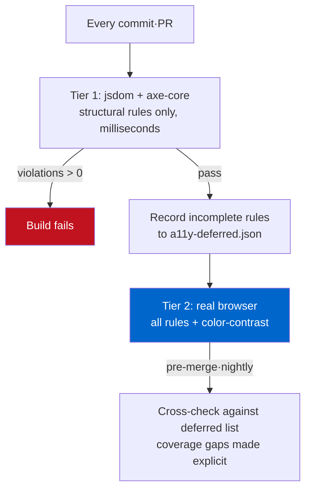

I ran the same HTML through axe-core twice and got two different verdicts. One run called `color-contrast` `incomplete`; the other flagged it as a hard failure at `2.4:1`. I hadn't touched a single character of the markup. The only thing that changed was the runtime.

This looks like a footnote, but it's the exact landmine teams step on when they wire accessibility checks into CI. Bolt `axe-core` onto Jest or Vitest and you get accessibility testing at unit-test speed, no browser required. Tempting. The catch is that the price of that convenience is a specific rule that **silently falls out** of coverage, and most people trust the green check without knowing it happened. Today I reproduced it in a sandbox, dug into why, and worked out how the pipeline has to be shaped so the hole never opens.

## Four violations that keep showing up in AI-generated components

A lot of components get generated by tooling these days. Mine included. But when you inspect that generated markup through an accessibility lens, the same mistakes land in the same spots over and over: icon-only buttons, images with no alt, links with no text, a document with no `lang`. It all looks fine on screen, so a human eye never catches it.

I built a "booking widget" to test with. It's exactly the shape a generator would spit out.

```html
<!DOCTYPE html>
<html>
<head><title>Booking widget</title></head>
<body>
  <div class="card">
    <h3>Reserve a table</h3>
    
    <p class="muted">Popular near you. Book in seconds.</p>

    <input type="text" placeholder="Your name">
    <input type="email" placeholder="Email">

    <button class="icon-btn">
      <svg viewBox="0 0 24 24"><path d="M12 2v20M2 12h20" stroke="black"/></svg>
    </button>
    <a href="/help">
      <svg viewBox="0 0 24 24"><circle cx="12" cy="12" r="10"/></svg>
    </a>
  </div>
</body>
</html>
```

To your eyes it's an ordinary card: two inputs, an icon button, a help link. Through a screen reader it becomes something else. The button announces only as "button" with no clue what it does. The link has no destination text. The inputs lose their only hint the moment focus lands and the `placeholder` vanishes. A placeholder is not a label. That's not a matter of taste, it's a W3C-defined violation.

## Running axe-core without a browser

Start with the CI-friendly side. With just `axe-core` and `jsdom` you can run accessibility checks inside Node without launching a browser, dropping them straight into your unit tests.

```javascript
import { readFileSync } from 'node:fs';
import { JSDOM } from 'jsdom';
import axe from 'axe-core';

async function auditFile(path) {
  const html = readFileSync(path, 'utf8');
  const dom = new JSDOM(html, { runScripts: 'dangerously', pretendToBeVisual: true });
  const { window } = dom;
  window.eval(axe.source); // inject axe into this window
  return window.axe.run(window.document, {
    resultTypes: ['violations', 'incomplete'],
    runOnly: { type: 'tag', values: ['wcag2a', 'wcag2aa', 'wcag21a', 'wcag21aa'] },
  });
}
```

The trick is `window.eval(axe.source)`. The `axe-core` package ships the whole library as a string on `axe.source`. Inject it into the `window` jsdom builds and you can call `axe.run()` inside it just like a real browser would. I scoped `runOnly` to WCAG 2.1 A/AA tags, the baseline most teams treat as their compliance target.

Here's the actual output from running the before page. Nothing dressed up.


```text
===== BEFORE (AI-generated markup) =====
violations: 4 | incomplete: 1 | passes: 7
  [critical] button-name (1)   — Buttons must have discernible text
  [serious]  html-has-lang (1) — <html> element must have a lang attribute
  [critical] image-alt (1)     — Images must have alternative text
  [serious]  link-name (1)     — Links must have discernible text
  incomplete:
     ~ color-contrast (1)      — Elements must meet minimum contrast ratio
```

Four structural violations, caught precisely. `button-name` says the icon button has no accessible name; `link-name` says the link has no text; `image-alt` and `html-has-lang` are what they sound like. None of this needed a browser. These rules can be judged from markup structure alone, and that's the real value of the jsdom approach. You can block regressions like this on every `git push` in a few milliseconds.

I ran the fixed after page through the same code. The icon button got an `aria-label`, the SVGs got `aria-hidden="true"`, the image got an `alt`, the inputs got real `<label for>` elements.

```text
===== AFTER (fixed) =====
violations: 0 | incomplete: 1 | passes: 19
  incomplete:
     ~ color-contrast (1)      — Elements must meet minimum contrast ratio
```

Zero violations, nineteen passes. Clean. But that one `color-contrast` line still sitting in `incomplete` bugs me. In both the before and the after run, this rule alone never returned a verdict. That's the trap.

## Why only color-contrast lands in incomplete

`incomplete` is not a pass. It doesn't mean "no violation," it means **"cannot be checked in this environment."** It's axe-core signaling that it gave up on the verdict.

The reason lives in what jsdom fundamentally is. jsdom builds a DOM tree but does no layout and no rendering. It doesn't compute where an element paints, in what color, or what background sits behind it. And contrast judgment needs exactly that: the foreground and background colors that actually get painted. axe-core's contrast check internally uses `document.createRange()` and `getClientRects()` to find the region text really occupies, and jsdom doesn't implement those APIs. The limitation is recorded verbatim in [issue #595](https://github.com/dequelabs/axe-core/issues/595) on Deque's axe-core repo, and the popular [jest-axe](https://github.com/nickcolley/jest-axe) disables the `color-contrast` rule by default precisely because of it.

So here's the shape of it. In jsdom, contrast checking doesn't "pass," it doesn't exist. And teams new to axe-core often skip reading `incomplete` entirely, or drop it from `resultTypes` altogether. The moment they do, one of the most commonly failed WCAG criteria vanishes from test coverage.

So I ran the same before page again, this time in a real browser engine (headless Chromium), scoped to the contrast rule only.

```javascript
// runs inside a real browser page context
const r = await window.axe.run(document, {
  runOnly: { type: 'rule', values: ['color-contrast'] }
});
```

The result was a clear violation.

```json
{
  "id": "color-contrast",
  "impact": "serious",
  "message": "Element has insufficient color contrast of 2.4
              (foreground #a7a7a7, background #ffffff, 16px).
              Expected contrast ratio of 4.5:1"
}
```

`2.4:1`. W3C's [WCAG 2.1 SC 1.4.3 Contrast (Minimum)](https://www.w3.org/WAI/WCAG21/Understanding/contrast-minimum.html) requires at least `4.5:1` for body text (`3:1` for large text). That pale grey helper line at `#a7a7a7` sat at roughly half the requirement. The very element jsdom waved through as "can't tell," the browser caught in one shot. After I darkened the color to `#595959`, contrast cleared `7:1` and the browser reported zero violations too.

Same axe-core, same markup, different runtime. The verdict splits. This trap, where the moment of rendering decides what an automated tool can see, isn't unique to accessibility. Whether you [render structured data server-side or inject it with client JS](/en/blog/en/localbusiness-structured-data-server-side-vs-js-2026/) decides whether a crawler reads the schema or misses it entirely, and that is the exact same structure. That single picture is the whole point of today's post.

## So the pipeline runs in two tiers

The wrong lesson here would be "then never use jsdom, always launch a browser." Browser startup is slow, and spinning up Chromium for every unit test makes CI crawl. I split the roles instead.

<strong>Tier one — jsdom plus axe-core (the fast gate).</strong> Runs on every commit and every PR as a unit test. It blocks structural violations judged from markup alone: `button-name`, `image-alt`, `link-name`, `label`, `html-has-lang`. It's a matter of milliseconds, so there's no cost. Drop it right next to your component snapshot tests.

<strong>Tier two — a real browser (the full rule set).</strong> Playwright or Puppeteer renders the page, then runs every rule including `color-contrast`. An adapter like `@axe-core/playwright` keeps the wiring short. This tier doesn't need to run on every commit; pointing it at your key pages before merge or in a nightly pipeline is plenty.

There's one device you must add where the tiers meet: **log the rules that came back `incomplete` in tier one, and cross-check that tier two actually covers them.** That makes "which rules jsdom couldn't judge" explicit in the pipeline. Without it, `incomplete` stays a log line nobody reads and the coverage hole stays open.

The gate logic can be this simple.

```javascript
const results = await runAxeInJsdom(html);
if (results.violations.length > 0) {
  console.error('structural a11y violations:', results.violations.map(v => v.id));
  process.exit(1); // tier-one gate: fail the build here
}
// don't fail on incomplete, but hand it off as tier two's must-cover list
const deferred = results.incomplete.map(v => v.id);
writeFileSync('a11y-deferred.json', JSON.stringify(deferred));
```

The idea itself isn't new. I used the same principle in [the campaign that turned SEO audits into a standing build gate](/en/blog/en/multilingual-blog-technical-audit-campaign-2026/): don't leave a fix to human discipline, pin it in the pipeline. Accessibility is exactly the same. An audit should be a loop, not an event.

The two-tier structure in one picture:



## What survives even after the tools go green

Honestly, passing both tiers still doesn't guarantee the page is accessible. That's not an axe-core limitation, it's a limit on automated checking as a whole.

There's a well-known set of things axe-core can't catch. Can you reach and operate every button and link with the keyboard alone? Does `Tab` order match the visual and logical order? When a modal opens, does focus get trapped inside it and return to where it was on close? Does the flow read sensibly start to finish through a screen reader? None of these can be judged by static markup analysis. In fact, on [the page I pushed to a Lighthouse accessibility score of 100](/en/blog/en/a11y-lighthouse-audit-fix-2026/), a fake button that was just a `div` with an `onclick` scored full marks and still couldn't be pressed by keyboard.

So I treat automated tools as a floor, not a ceiling. The violations axe-core catches are the lower bound that must be zero, the ones nobody should have to spend time confirming by hand. Pin that floor with CI and spend the freed-up time on keyboard walkthroughs and screen-reader read-alongs. The moment you believe the tool does all of it, the half the tool can't see ships straight to production.

## A checklist you can apply today

- If you've bolted `axe-core` onto unit tests, always include `'incomplete'` in `resultTypes` and actually read the list. If `color-contrast` is in there, that's not a pass, it's unchecked.
- Scope the jsdom stage explicitly to structural rules (`button-name`, `image-alt`, `link-name`, `label`, `html-has-lang`). Don't mistake rules that need rendering, like contrast or focus visibility, for having passed there.
- Promote contrast checking to a real browser stage, without exception. Playwright/Puppeteer plus an `@axe-core/*` adapter keeps the wiring short.
- Icon buttons get `aria-label`, decorative SVGs get `aria-hidden="true"`, inputs get a real `<label for>` rather than a `placeholder`. Those three alone erase most of the common violations in generated markup.
- After the automated gate goes green, operate the screen once with the keyboard only. A green check from the tool is the start, not the finish.

Accessibility isn't about fixing something once, it's about stopping the regression. It starts with not skipping past `incomplete`.

---

I take on consulting and commission work around emitting structured data reliably server-side, and auditing an existing site's accessibility and search readiness on measured evidence, then pinning it behind a gate. If you've hit a wall building a similar pipeline, the contact details on my [profile](/en/about/) are open.
