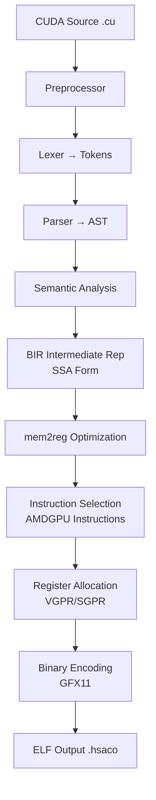

## Overview

In the world of GPU computing, NVIDIA's CUDA is the de facto standard. But this also means <strong>vendor lock-in</strong> — code written in CUDA could only run on NVIDIA GPUs.

<strong>BarraCUDA</strong> is an open-source compiler born to break down this wall. It takes `.cu` files and compiles them directly to AMD RDNA 3 (GFX11) machine code. Written in 15,000 lines of C99 with zero LLVM dependency, no HIP translation layer required.

## BarraCUDA's Architecture

BarraCUDA's compilation pipeline follows traditional compiler structure while directly targeting AMD GPUs.



Key characteristics include:

- <strong>Zero LLVM dependency</strong>: ~1,700 lines of hand-written instruction selection logic
- <strong>SSA-based IR</strong>: Uses its own intermediate representation called BIR (BarraCUDA IR)
- <strong>Full preprocessor</strong>: Supports `#include`, `#define`, macros, conditional compilation
- <strong>Verified encoding</strong>: All instruction encodings validated against `llvm-objdump`

## Supported CUDA Features

BarraCUDA already supports a substantial set of CUDA features:

### Core Language Features

- `__global__`, `__device__`, `__host__` function qualifiers
- `threadIdx`, `blockIdx`, `blockDim`, `gridDim` builtins
- Structs, enums, typedefs, namespaces
- Pointers, arrays, pointer arithmetic
- All C control flow: if/else, for, while, switch/case, goto
- Basic template instantiation

### CUDA-Specific Features

- <strong>`__shared__` memory</strong>: Allocated from LDS, properly tracked
- <strong>`__syncthreads()`</strong>: Translates to `s_barrier`
- <strong>Atomic operations</strong>: `atomicAdd`, `atomicSub`, `atomicMin`, `atomicMax`, etc.
- <strong>Warp intrinsics</strong>: `__shfl_sync`, `__shfl_up_sync`, `__shfl_down_sync`
- <strong>Vector types</strong>: `float2`, `float3`, `float4` with `.x/.y/.z/.w` access
- <strong>Half precision</strong>: `__half`, `__float2half()`, `__half2float()`
- <strong>Cooperative Groups</strong>: `this_thread_block()` with `.sync()`, `.thread_rank()`

## Usage

Building is remarkably simple:

```bash
# Build — just need a C99 compiler
make

# Compile to AMD GPU binary
./barracuda --amdgpu-bin kernel.cu -o kernel.hsaco

# Dump IR (for debugging)
./barracuda --ir kernel.cu

# Output AST
./barracuda --ast kernel.cu
```

## What GPU Democratization Means

BarraCUDA's emergence goes beyond a technical achievement — it signals structural change in the GPU ecosystem.

### Challenging NVIDIA's Monopoly

CUDA's position in the current GPU computing market is absolute. The vast majority of AI/ML workloads are CUDA-based, making them impossible to run without NVIDIA GPUs. BarraCUDA cracks this structure.

### Expanding AMD GPU Potential

AMD's ROCm/HIP ecosystem is growing, but friction still exists when converting existing CUDA code. BarraCUDA minimizes this friction by <strong>compiling directly without code conversion</strong>.

### The Power of Open Source

The fact that a CUDA compiler was implemented in 15,000 lines of C99 demonstrates the capability of the open-source community. It garnered 66 points on Hacker News, drawing attention from the developer community.

## Current Limitations and Outlook

Being in its early stages, there are naturally some limitations:

- <strong>GFX11 (RDNA 3) only</strong>: Currently supports only AMD's latest architecture
- <strong>No runtime included</strong>: Host APIs like `cudaMalloc`, `cudaMemcpy` need separate implementation
- <strong>Limited optimization</strong>: Not yet at nvcc-level optimization
- <strong>Tenstorrent support in progress</strong>: Plans to expand beyond AMD architectures

However, the project's direction is clear: increase CUDA code portability and give developers freedom to choose their GPUs.

## Conclusion

BarraCUDA is a project that offers a glimpse into the future of GPU computing. As an open-source alternative to NVIDIA's CUDA monopoly, it demonstrates the possibility of <strong>running CUDA code on AMD GPUs without any code changes</strong>.

With AI/ML workloads growing explosively, GPU choice diversity is crucial for cost reduction and supply chain stability. If projects like BarraCUDA mature, the competitive landscape of the GPU ecosystem will become much healthier.

## References

- [BarraCUDA GitHub Repository](https://github.com/Zaneham/BarraCUDA)
- [Hacker News Discussion](https://news.ycombinator.com/item?id=barracuda)
- [AMD ROCm Official Documentation](https://rocm.docs.amd.com/)
- [NVIDIA CUDA Official Documentation](https://developer.nvidia.com/cuda-zone)
