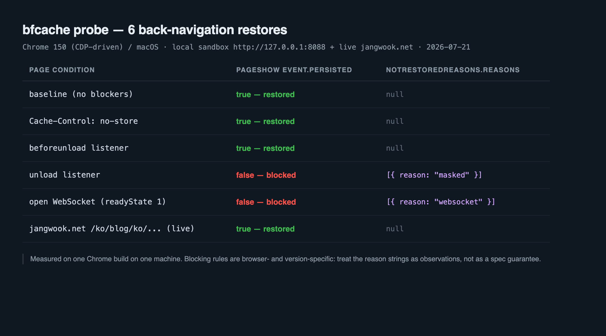

A page with a `beforeunload` listener came back from memory. A page with an `unload` listener did not. That's the whole difference: one identifier.

I keep finding codebases that treat those two as the same thing, filed together under "cleanup on leave." So I built six pages, each carrying exactly one candidate blocker, and drove a real back navigation through each. Here's what the browser handed back.

## The navigation that never touches the network

Back/forward cache keeps a page alive instead of tearing it down when you navigate away. DOM, JavaScript heap, scroll position, all frozen in memory. Press back and the browser thaws the snapshot. The official framing on web.dev: "Instead of destroying a page when the user navigates away, we postpone destruction and pause JS execution." The payoff: "Loading the previous page is essentially instant, because the entire page can be restored from memory, without having to go to the network at all."

That last clause carries the weight. A normal back navigation with a warm HTTP cache still reparses the document, re-executes scripts, recalculates layout. A bfcache restore skips all of it. Nothing is recomputed, so no fresh LCP and no fresh layout shift.

Why bother? Because search-result pogosticking is a real pattern, especially on phones. Read a page, back out, try the next result. If every one of those round trips is a full load, your users experience a slow site no matter how fast your first paint is. And unlike most performance work, this one isn't about writing better code. It's about <strong>removing things that disqualify code you already shipped</strong>, which makes the effort-to-payoff ratio unusually good.

Let me lower expectations first. bfcache is not a ranking factor. Nobody, Google included, guarantees you anything in search results for fixing it. This is a navigation-feel problem for real humans.

The good news is that you never have to guess. Two APIs answer the question directly:

- `event.persisted` on the `pageshow` event. `true` means the page came out of bfcache.
- `PerformanceNavigationTiming.notRestoredReasons`, which carries the reasons when the page was <strong>not</strong> restored. Per Chrome's docs, "The `notRestoredReasons` API has shipped from Chrome 123 and is being rolled out gradually."

## Six pages, one variable each

Mixed variables produce uninterpretable results, so every route below is identical except for its single blocker. Same markup, same instrumentation script.

```js
// server.mjs — one route per condition
const page = (title, body, extraHead = '') => `<!doctype html>
<html lang="en"><head><meta charset="utf-8"><title>${title}</title>${extraHead}</head>
<body><h1>${title}</h1>${body}
<script>
window.addEventListener('pageshow', (e) => {
  const nav = performance.getEntriesByType('navigation')[0];
  window.__bfcache = {
    persisted: e.persisted,
    nrr: nav && nav.notRestoredReasons
      ? JSON.parse(JSON.stringify(nav.notRestoredReasons))
      : null,
  };
});
</script></body></html>`;

const routes = {
  '/clean':        () => ({ headers: {}, html: page('clean', '<p>no blockers</p>') }),
  '/nostore':      () => ({ headers: { 'Cache-Control': 'no-store' }, html: page('nostore', '') }),
  '/unload':       () => ({ headers: {}, html: page('unload', '',
                      '<script>window.addEventListener("unload", function(){});</script>') }),
  '/beforeunload': () => ({ headers: {}, html: page('beforeunload', '',
                      '<script>window.addEventListener("beforeunload", function(e){});</script>') }),
  '/websocket':    () => ({ headers: {}, html: page('websocket', '',
                      '<script>window.__ws = new WebSocket("ws://127.0.0.1:8099");</script>') }),
  '/next':         () => ({ headers: {}, html: page('next', '<p>second page</p>') }),
};
```

The `JSON.parse(JSON.stringify(...))` round trip isn't decoration. `notRestoredReasons` doesn't hand you a plain object, and logging it directly gets you `[object Object]`. That cost me the first run.

Each probe follows the same four steps. Open the target page, navigate to `/next`, go back through history, read `window.__bfcache` on the restored page. Chrome 150 on macOS, driven over the DevTools protocol rather than by hand. The last probe swaps the sandbox for a page on this live blog.

## Two blocked, four restored

| Page condition | `event.persisted` | `notRestoredReasons.reasons` |
| --- | --- | --- |
| no blockers | `true` (restored) | `null` |
| `Cache-Control: no-store` | `true` (restored) | `null` |
| `beforeunload` listener | `true` (restored) | `null` |
| `unload` listener | `false` (blocked) | `[{ reason: "masked" }]` |
| open WebSocket | `false` (blocked) | `[{ reason: "websocket" }]` |
| live blog article | `true` (restored) | `null` |



The `unload` result is the expected one, and the official guidance doesn't hedge about it. "Never use the `unload` event. Ever!" With the mechanism spelled out right after: "On desktop, Chrome and Firefox have chosen to make pages ineligible for bfcache if they add an `unload` listener."

Note what my handler contained: nothing. An empty function body still disqualified the page. The browser checks whether a listener is <strong>registered</strong>, not whether it does anything. That's worth knowing before you go hunting, because a `grep` that only looks for suspicious-looking teardown code will miss the dead ones.

`beforeunload`, meanwhile, sailed through. If your team files both under one mental category, that category needs splitting. Where you genuinely need teardown, use `pagehide`, which as the docs put it "fires in all cases where the `unload` event fires, and it also fires when a page is put in the bfcache."

## "masked" is not an answer

Now for the API's practical ceiling. The WebSocket page returned a usable string, `"websocket"`. The `unload` page returned `"masked"` — on a document containing zero iframes.

Chrome's documentation explains the value like this: "For all the cross-origin iframes, we report `null` for the `reasons` value for the frame, and the top-level frame will shows a reason of `"masked"`." Reasonable as a privacy measure. But read the sentence that follows: "`"masked"` may also be used for user agent-specific reasons so may not always indicate an issue in an iframe."

My run was exactly that case. Single document, no frames, cause unambiguously the `unload` listener, and the field still refused to name it.

So here's the position I've landed on. <strong>Treat `notRestoredReasons` as a tool that tells you which URLs are failing, not why.</strong> Collect it from real users, rank templates by block rate, then reproduce the worst offender locally with the DevTools Back/forward cache panel to find the actual cause. Teams that expect field data to work as a diagnosis will stall the first time `"masked"` shows up in ninety percent of their rows. That's not a flaw to complain about, it's the grain of the tool.

## `no-store` stopped being a death sentence

The result I didn't expect: the `Cache-Control: no-store` page restored. That contradicts a rule most of us internalized years ago, and web.dev records the old behavior plainly. With `no-store` present, "browsers have chosen not to store the page in bfcache."

The same article carries the sequel, though: "There is work underway to change this behavior for Chrome in a privacy-preserving manner." That work has landed. Chrome's own page on enabling bfcache for `Cache-Control: no-store` documents the rollout reaching 100% of users across March and April 2025. My probe just confirms it in the field.

The conditions matter here, so let me copy them across carefully. Per Chrome's official description, a `no-store` page may enter bfcache, but <strong>Chrome evicts it when cookies or other authorization state change</strong>, specifically so that a logged-out user can't reach a logged-in view by pressing back. Certain API usage still makes `no-store` pages ineligible outright. And if such a page issues a fetch or XHR whose response also carries `no-store`, that evicts the page too, since the response may contain sensitive data.

The practical read: using `no-store` as your bfcache opt-out no longer rests on much. That doesn't mean sensitive pages now sit exposed in memory, either. Responsibility moved from a header string to a sharper signal, the change in authentication state. I won't push the conclusion harder than that, since it's browser behavior and it moved once already. But if you have code built on "we send `no-store`, so we're obviously not cached," go measure it again this week.

Worth naming the other axis while we're here. `Cache-Control` decides whether a cache may store a response at all, while the validators (ETag and `Last-Modified`) decide what a revalidation costs once it has one. I measured how a single deploy wipes every one of those validators in [your last deploy reset every cache validator](/en/blog/en/etag-deploy-invalidation-conditional-requests-2026/).

## An open connection blocks, WebSocket code doesn't

> **[Update 2026-07-22]** Per a web.dev announcement in June 2026 ("New to the web platform in June 2026"), browser behavior may have shifted so that a page with an active WebSocket connection can now enter bfcache. The measurement in the section below was taken on Chrome 150, before that announcement, so I plan to rerun the same probe and update the result. Until then, read this section's WebSocket-blocking conclusion as reflecting the older behavior.
>
> **[Update 2026-07-24 · re-measured]** I re-ran the same probe across three Chrome 150 environments (automation build, stable headless, and a flag attempt). The open WebSocket was blocked with `reason: "websocket"` all three times, and only the control restored. So this section's conclusion still holds **in my automation/headless measurement environment**. The announcement is true, though, and seeded real-user environments have likely already flipped to restoring. Why the announcement and my measurement diverged (staged rollout, fresh profile, headless) and how a CI gate misreads it are written up in the [WebSocket bfcache re-measurement post](/en/blog/en/websocket-bfcache-eligibility-remeasure/).

I got the WebSocket probe wrong the first time. The initial version pointed at `ws://127.0.0.1:8099` with nothing listening on that port. Result: `persisted: true`. Not blocked at all.

Obvious in hindsight. The handshake failed instantly, so by the time I pressed back, the page held no open connection. I started a real WebSocket server, logged `readyState` before navigating away to confirm it was `1` (OPEN), and reran. That produced `persisted: false` with `reasons: [{ reason: "websocket" }]`.

The mistake turned out to be the most useful part of the day. What the browser inspects is the set of <strong>connections open at navigation time</strong>, not whether the word `WebSocket` appears in your bundle. The same logic covers the rest of the connection-shaped blockers. The official list is open IndexedDB connections, in-flight `fetch()` or XHR, and open WebSocket or WebRTC connections, with a consistent recommendation: close them during `pagehide` or `freeze`.

Nobody is asking you to drop real-time features. Scope the connection's lifetime to the page's visibility instead.

```js
let socket;

function connect() {
  socket = new WebSocket('wss://example.com/live');
}

connect();

// Close on the way out — pagehide, not unload.
window.addEventListener('pagehide', () => {
  if (socket && socket.readyState === WebSocket.OPEN) {
    socket.close();
  }
});

// Reconnect and refresh whatever went stale while frozen.
window.addEventListener('pageshow', (event) => {
  if (event.persisted) {
    connect();
    refreshStaleUI();
  }
});
```

Don't skip that `event.persisted` branch. A restored page shows the exact frame the user walked away from. Cart quantities, stock counts, notification badges, session timers: anything that decays needs refetching right there. Otherwise you've traded correctness for speed, which is a bad trade dressed up as a performance win.

`window.opener` belongs in the same family. The docs are blunt: "A page with a non-null `window.opener` reference can't safely be put into bfcache." Most of us add `rel="noopener"` for security reasons; it happens to protect eligibility too.

## Collecting reasons from the field

Local probes reproduce well but cover almost nothing. Real browsers, real extensions, real network conditions produce blockers you'll never stage. Drop this in to start collecting which URLs lose the restore.

```js
window.addEventListener('pageshow', (event) => {
  const nav = performance.getEntriesByType('navigation')[0];

  // Restored from bfcache — count it as a hit.
  if (event.persisted) {
    navigator.sendBeacon('/rum/bfcache', JSON.stringify({ hit: true, url: location.pathname }));
    return;
  }

  // Only back/forward navigations that failed to restore.
  if (nav && nav.type === 'back_forward' && nav.notRestoredReasons) {
    const nrr = JSON.parse(JSON.stringify(nav.notRestoredReasons));
    navigator.sendBeacon('/rum/bfcache', JSON.stringify({
      hit: false,
      url: nrr.url,
      reasons: (nrr.reasons || []).map((r) => r.reason),
      frames: (nrr.children || []).length,
    }));
  }
});
```

If most of the `reasons` values come back `"masked"`, the data is still doing its job. Its value lives in the URL distribution, not the strings.

One more trap when you read the numbers. Right after the live blog page restored, its navigation entry still reported `type: "navigate"`, `duration: 1315.2`, `transferSize: 22218`. Those are the <strong>original load's</strong> figures. A bfcache restore doesn't create a new navigation entry, so `nav.duration` will never tell you how fast the restore was. Judge restores by `event.persisted` and nothing else.

The last step is the one that makes the fix survive future commits: automate it. The shape is the same as [wiring JSON-LD validation into CI as a build gate](/en/blog/en/validate-structured-data-ci-jsonld-2026/). Six probes of open-navigate-back-read translate cleanly into a headless browser script you run against your key templates on every deploy. And where [measuring `content-visibility` render cost](/en/blog/en/content-visibility-auto-render-cost-measure-2026/) dealt with the first paint, this work covers every navigation after it.

## What to change this week

Two of six probes failed. One died to a single registered listener, the other to a single open socket. The other four passed, including the one everybody still assumes is disqualified.

In the order I'd actually do them:

- <strong>Audit and delete every `unload` listener.</strong> Empty bodies block too. Search third-party snippets, not just your own code, and grep for `onunload` alongside `addEventListener('unload'`.
- <strong>Move teardown to `pagehide`.</strong> It fires everywhere `unload` fires, plus on entry to bfcache. Leave `beforeunload` alone; confirmation dialogs are not the problem.
- <strong>Close WebSocket, WebRTC and IndexedDB connections in `pagehide`.</strong> The test is what's open when the user leaves, not what's in the bundle.
- <strong>Add an `event.persisted === true` branch to `pageshow`.</strong> Reconnect, then refetch anything that goes stale. Without it you ship a fast, wrong screen.
- <strong>Put `rel="noopener"` on outbound links.</strong> A non-null `window.opener` disqualifies the page.
- <strong>Re-measure anything built on `no-store` assumptions.</strong> Chrome changed this in 2025, with eviction on cookie and auth changes as the guardrail.
- <strong>Instrument the field, but read the URLs.</strong> Reasons get masked. Block-rate-by-template is the signal you're after.

The honest boundary: six probes, one machine, one Chrome build. Safari and Firefox draw their eligibility lines differently, and `notRestoredReasons` is a Chromium API to begin with. Don't read these strings as a spec guarantee. The procedure is cheap enough to rerun, though, so point it at the browsers your users actually have and get your own numbers.

---

Whether your site's back navigations really restore from cache, and which templates quietly lose eligibility, is a measurable question rather than a matter of taste. I take on this kind of work personally: measuring the current state, fixing what the measurement exposes, then leaving behind a CI gate so the fix doesn't silently regress twenty commits later. If that's useful to you, [get in touch](/en/contact/).
