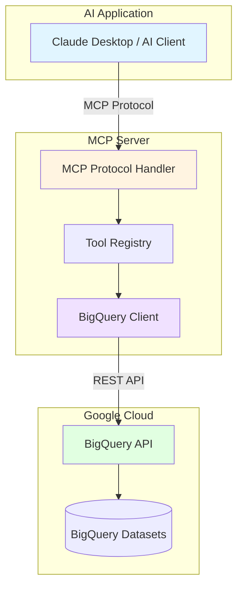

## Introduction

The Model Context Protocol (MCP) is an emerging standard for connecting AI assistants to external data sources and tools. When working with large-scale data warehouses like Google BigQuery, AI agents need controlled, secure access to query and analyze data. This article demonstrates how to build an MCP server that integrates with BigQuery while implementing dataset prefix filtering for multi-tenant environments.

### Why Dataset Prefix Filtering?

In enterprise BigQuery environments, datasets are often organized with prefixes to separate different teams, projects, or environments:

- `prod_analytics_*` — Production analytics datasets
- `dev_analytics_*` — Development datasets
- `team_marketing_*` — Marketing team datasets

Dataset prefix filtering allows you to create focused MCP servers that only expose relevant datasets to specific AI agents, improving security and reducing cognitive load.

## MCP Server Architecture

The Model Context Protocol defines a client-server architecture where AI applications (clients) connect to MCP servers that provide access to external resources and tools.



### Core Components

1. <strong>MCP Protocol Handler</strong>: Manages communication between the AI client and server
2. <strong>Tool Registry</strong>: Defines available tools (list_datasets, get_schema, execute_query)
3. <strong>BigQuery Client</strong>: Handles authentication and API calls
4. <strong>Prefix Filter</strong>: Restricts dataset access based on configured patterns

## BigQuery Client Integration

### Authentication Setup

BigQuery authentication uses Google Cloud service accounts or Application Default Credentials (ADC).

````typescript
import { BigQuery } from '@google-cloud/bigquery';

interface BigQueryConfig {
  projectId: string;
  keyFilename?: string; // Path to service account JSON
  datasetPrefix?: string; // Optional prefix filter
}

class BigQueryMCPClient {
  private client: BigQuery;
  private datasetPrefix: string;

  constructor(config: BigQueryConfig) {
    this.client = new BigQuery({
      projectId: config.projectId,
      keyFilename: config.keyFilename,
    });

    this.datasetPrefix = config.datasetPrefix || '';
  }

  // Filter datasets by prefix
  private matchesPrefix(datasetId: string): boolean {
    if (!this.datasetPrefix) return true;
    return datasetId.startsWith(this.datasetPrefix);
  }
}
````

### Basic BigQuery Operations

````typescript
async listDatasets(): Promise<string[]> {
  const [datasets] = await this.client.getDatasets();

  return datasets
    .map(dataset => dataset.id!)
    .filter(id => this.matchesPrefix(id))
    .sort();
}

async getTableSchema(datasetId: string, tableId: string) {
  // Verify dataset matches prefix
  if (!this.matchesPrefix(datasetId)) {
    throw new Error(`Access denied: dataset ${datasetId} does not match prefix ${this.datasetPrefix}`);
  }

  const dataset = this.client.dataset(datasetId);
  const table = dataset.table(tableId);
  const [metadata] = await table.getMetadata();

  return metadata.schema;
}
````

## Dataset Prefix Filtering Implementation

### Configuration-Based Filtering

The prefix filter should be configurable through environment variables or configuration files:

````typescript
// .env configuration
BIGQUERY_PROJECT_ID=my-gcp-project
BIGQUERY_DATASET_PREFIX=prod_analytics_
BIGQUERY_KEY_FILE=/path/to/service-account.json
````

````typescript
import dotenv from 'dotenv';

dotenv.config();

const config: BigQueryConfig = {
  projectId: process.env.BIGQUERY_PROJECT_ID!,
  keyFilename: process.env.BIGQUERY_KEY_FILE,
  datasetPrefix: process.env.BIGQUERY_DATASET_PREFIX,
};

const bqClient = new BigQueryMCPClient(config);
````

### Wildcard Pattern Support

For more flexible filtering, implement wildcard pattern matching:

````typescript
import minimatch from 'minimatch';

class BigQueryMCPClient {
  private datasetPattern: string;

  constructor(config: BigQueryConfig) {
    // Support patterns like "prod_*", "*_analytics", etc.
    this.datasetPattern = config.datasetPrefix || '*';
  }

  private matchesPrefix(datasetId: string): boolean {
    return minimatch(datasetId, this.datasetPattern);
  }
}
````

## MCP Tool Design

### Tool Definitions

MCP tools are defined using JSON Schema to specify inputs and outputs:

````typescript
import { Server } from '@modelcontextprotocol/sdk/server/index.js';
import { StdioServerTransport } from '@modelcontextprotocol/sdk/server/stdio.js';
import {
  CallToolRequestSchema,
  ListToolsRequestSchema,
} from '@modelcontextprotocol/sdk/types.js';

const server = new Server(
  {
    name: 'bigquery-mcp-server',
    version: '1.0.0',
  },
  {
    capabilities: {
      tools: {},
    },
  }
);

// Register tool handlers
server.setRequestHandler(ListToolsRequestSchema, async () => {
  return {
    tools: [
      {
        name: 'list_datasets',
        description: `List all BigQuery datasets matching prefix: ${config.datasetPrefix || 'all'}`,
        inputSchema: {
          type: 'object',
          properties: {},
        },
      },
      {
        name: 'list_tables',
        description: 'List all tables in a specific dataset',
        inputSchema: {
          type: 'object',
          properties: {
            datasetId: {
              type: 'string',
              description: 'The BigQuery dataset ID',
            },
          },
          required: ['datasetId'],
        },
      },
      {
        name: 'get_schema',
        description: 'Get the schema of a specific table',
        inputSchema: {
          type: 'object',
          properties: {
            datasetId: {
              type: 'string',
              description: 'The BigQuery dataset ID',
            },
            tableId: {
              type: 'string',
              description: 'The table ID',
            },
          },
          required: ['datasetId', 'tableId'],
        },
      },
      {
        name: 'execute_query',
        description: 'Execute a SQL query on BigQuery (read-only)',
        inputSchema: {
          type: 'object',
          properties: {
            query: {
              type: 'string',
              description: 'The SQL query to execute',
            },
            maxResults: {
              type: 'number',
              description: 'Maximum number of results to return (default: 100)',
              default: 100,
            },
          },
          required: ['query'],
        },
      },
    ],
  };
});
````

### Tool Implementation

````typescript
server.setRequestHandler(CallToolRequestSchema, async (request) => {
  const { name, arguments: args } = request.params;

  try {
    switch (name) {
      case 'list_datasets': {
        const datasets = await bqClient.listDatasets();
        return {
          content: [
            {
              type: 'text',
              text: JSON.stringify(datasets, null, 2),
            },
          ],
        };
      }

      case 'list_tables': {
        const { datasetId } = args as { datasetId: string };
        const tables = await bqClient.listTables(datasetId);
        return {
          content: [
            {
              type: 'text',
              text: JSON.stringify(tables, null, 2),
            },
          ],
        };
      }

      case 'get_schema': {
        const { datasetId, tableId } = args as {
          datasetId: string;
          tableId: string;
        };
        const schema = await bqClient.getTableSchema(datasetId, tableId);
        return {
          content: [
            {
              type: 'text',
              text: JSON.stringify(schema, null, 2),
            },
          ],
        };
      }

      case 'execute_query': {
        const { query, maxResults = 100 } = args as {
          query: string;
          maxResults?: number;
        };
        const results = await bqClient.executeQuery(query, maxResults);
        return {
          content: [
            {
              type: 'text',
              text: JSON.stringify(results, null, 2),
            },
          ],
        };
      }

      default:
        throw new Error(`Unknown tool: ${name}`);
    }
  } catch (error) {
    return {
      content: [
        {
          type: 'text',
          text: `Error: ${error instanceof Error ? error.message : String(error)}`,
        },
      ],
      isError: true,
    };
  }
});
````

## Complete Implementation

### Full BigQuery Client Class

````typescript
import { BigQuery } from '@google-cloud/bigquery';
import minimatch from 'minimatch';

export interface BigQueryConfig {
  projectId: string;
  keyFilename?: string;
  datasetPrefix?: string;
}

export class BigQueryMCPClient {
  private client: BigQuery;
  private datasetPattern: string;
  private projectId: string;

  constructor(config: BigQueryConfig) {
    this.client = new BigQuery({
      projectId: config.projectId,
      keyFilename: config.keyFilename,
    });
    this.projectId = config.projectId;
    this.datasetPattern = config.datasetPrefix || '*';
  }

  private matchesPrefix(datasetId: string): boolean {
    return minimatch(datasetId, this.datasetPattern);
  }

  private validateDatasetAccess(datasetId: string): void {
    if (!this.matchesPrefix(datasetId)) {
      throw new Error(
        `Access denied: dataset "${datasetId}" does not match pattern "${this.datasetPattern}"`
      );
    }
  }

  async listDatasets(): Promise<string[]> {
    const [datasets] = await this.client.getDatasets();
    return datasets
      .map(dataset => dataset.id!)
      .filter(id => this.matchesPrefix(id))
      .sort();
  }

  async listTables(datasetId: string): Promise<string[]> {
    this.validateDatasetAccess(datasetId);

    const dataset = this.client.dataset(datasetId);
    const [tables] = await dataset.getTables();

    return tables.map(table => table.id!).sort();
  }

  async getTableSchema(datasetId: string, tableId: string) {
    this.validateDatasetAccess(datasetId);

    const dataset = this.client.dataset(datasetId);
    const table = dataset.table(tableId);
    const [metadata] = await table.getMetadata();

    return {
      datasetId,
      tableId,
      schema: metadata.schema,
      numRows: metadata.numRows,
      numBytes: metadata.numBytes,
      creationTime: metadata.creationTime,
      lastModifiedTime: metadata.lastModifiedTime,
    };
  }

  async executeQuery(query: string, maxResults: number = 100) {
    // Validate that query only accesses allowed datasets
    const datasetPattern = /FROM\s+`?([a-zA-Z0-9_]+)\.([a-zA-Z0-9_]+)`?/gi;
    const matches = [...query.matchAll(datasetPattern)];

    for (const match of matches) {
      const datasetId = match[1];
      this.validateDatasetAccess(datasetId);
    }

    // Execute query with read-only check
    if (/\b(INSERT|UPDATE|DELETE|CREATE|DROP|ALTER|TRUNCATE)\b/i.test(query)) {
      throw new Error('Only SELECT queries are allowed');
    }

    const [job] = await this.client.createQueryJob({
      query,
      maxResults,
    });

    const [rows] = await job.getQueryResults();

    return {
      rows,
      totalRows: rows.length,
      query,
    };
  }
}
````

### Server Entry Point

````typescript
import { Server } from '@modelcontextprotocol/sdk/server/index.js';
import { StdioServerTransport } from '@modelcontextprotocol/sdk/server/stdio.js';
import dotenv from 'dotenv';
import { BigQueryMCPClient, BigQueryConfig } from './bigquery-client.js';

dotenv.config();

// Initialize BigQuery client
const config: BigQueryConfig = {
  projectId: process.env.BIGQUERY_PROJECT_ID!,
  keyFilename: process.env.BIGQUERY_KEY_FILE,
  datasetPrefix: process.env.BIGQUERY_DATASET_PREFIX,
};

const bqClient = new BigQueryMCPClient(config);

// Create MCP server
const server = new Server(
  {
    name: 'bigquery-mcp-server',
    version: '1.0.0',
  },
  {
    capabilities: {
      tools: {},
    },
  }
);

// Register handlers (as shown in previous sections)
// ... (tool registration code here)

// Start server
async function main() {
  const transport = new StdioServerTransport();
  await server.connect(transport);

  console.error('BigQuery MCP Server running on stdio');
  console.error(`Dataset prefix filter: ${config.datasetPrefix || 'none (all datasets)'}`);
}

main().catch(console.error);
````

## Security and Optimization

### Security Best Practices

1. <strong>Read-Only Access</strong>: Enforce SELECT-only queries

````typescript
function validateReadOnlyQuery(query: string): void {
  const writeOperations = [
    'INSERT', 'UPDATE', 'DELETE', 'CREATE', 'DROP',
    'ALTER', 'TRUNCATE', 'MERGE', 'REPLACE'
  ];

  const upperQuery = query.toUpperCase();
  for (const operation of writeOperations) {
    if (new RegExp(`\\b${operation}\\b`).test(upperQuery)) {
      throw new Error(`Operation ${operation} is not allowed`);
    }
  }
}
````

2. <strong>Query Result Limits</strong>: Prevent resource exhaustion

````typescript
const MAX_QUERY_RESULTS = 10000;
const DEFAULT_QUERY_RESULTS = 100;

async executeQuery(query: string, maxResults?: number) {
  const limit = Math.min(
    maxResults || DEFAULT_QUERY_RESULTS,
    MAX_QUERY_RESULTS
  );

  // ... execute with limit
}
````

3. <strong>Dataset Validation</strong>: Strict prefix matching

````typescript
private validateDatasetAccess(datasetId: string): void {
  if (!this.matchesPrefix(datasetId)) {
    throw new Error(
      `Access denied: dataset "${datasetId}" does not match pattern "${this.datasetPattern}"`
    );
  }
}
````

4. <strong>Service Account Permissions</strong>: Principle of least privilege

```json
{
  "role": "roles/bigquery.dataViewer",
  "members": ["serviceAccount:mcp-server@project.iam.gserviceaccount.com"],
  "condition": {
    "expression": "resource.name.startsWith('projects/PROJECT_ID/datasets/prod_analytics_')"
  }
}
```

### Performance Optimization

1. <strong>Connection Pooling</strong>: Reuse BigQuery client instances

````typescript
// Singleton pattern for BigQuery client
let clientInstance: BigQueryMCPClient | null = null;

export function getBigQueryClient(config: BigQueryConfig): BigQueryMCPClient {
  if (!clientInstance) {
    clientInstance = new BigQueryMCPClient(config);
  }
  return clientInstance;
}
````

2. <strong>Query Caching</strong>: Cache frequently accessed schemas

````typescript
import NodeCache from 'node-cache';

class BigQueryMCPClient {
  private schemaCache: NodeCache;

  constructor(config: BigQueryConfig) {
    // Cache schemas for 5 minutes
    this.schemaCache = new NodeCache({ stdTTL: 300 });
  }

  async getTableSchema(datasetId: string, tableId: string) {
    const cacheKey = `${datasetId}.${tableId}`;
    const cached = this.schemaCache.get(cacheKey);

    if (cached) return cached;

    const schema = await this.fetchTableSchema(datasetId, tableId);
    this.schemaCache.set(cacheKey, schema);

    return schema;
  }
}
````

3. <strong>Async Operations</strong>: Non-blocking I/O

````typescript
async listAllMetadata(datasetIds: string[]) {
  // Parallel execution
  const results = await Promise.all(
    datasetIds.map(id => this.listTables(id))
  );

  return results.flat();
}
````

### Error Handling

````typescript
class BigQueryError extends Error {
  constructor(
    message: string,
    public code: string,
    public originalError?: Error
  ) {
    super(message);
    this.name = 'BigQueryError';
  }
}

async executeQuery(query: string, maxResults: number = 100) {
  try {
    // ... query execution
  } catch (error) {
    if (error instanceof Error) {
      throw new BigQueryError(
        `Query execution failed: ${error.message}`,
        'QUERY_EXECUTION_ERROR',
        error
      );
    }
    throw error;
  }
}
````

## Running and Testing

### Build Configuration

````json
{
  "name": "bigquery-mcp-server",
  "version": "1.0.0",
  "type": "module",
  "bin": {
    "bigquery-mcp-server": "./build/index.js"
  },
  "scripts": {
    "build": "tsc",
    "dev": "tsc --watch",
    "start": "node build/index.js"
  },
  "dependencies": {
    "@google-cloud/bigquery": "^7.0.0",
    "@modelcontextprotocol/sdk": "^0.5.0",
    "dotenv": "^16.0.0",
    "minimatch": "^9.0.0",
    "node-cache": "^5.1.0"
  },
  "devDependencies": {
    "@types/node": "^20.0.0",
    "typescript": "^5.0.0"
  }
}
````

### TypeScript Configuration

````json
{
  "compilerOptions": {
    "target": "ES2022",
    "module": "Node16",
    "moduleResolution": "Node16",
    "outDir": "./build",
    "rootDir": "./src",
    "strict": true,
    "esModuleInterop": true,
    "skipLibCheck": true,
    "declaration": true
  },
  "include": ["src/**/*"],
  "exclude": ["node_modules", "build"]
}
````

### MCP Client Configuration

Add to Claude Desktop configuration (`claude_desktop_config.json`):

````json
{
  "mcpServers": {
    "bigquery": {
      "command": "node",
      "args": ["/path/to/bigquery-mcp-server/build/index.js"],
      "env": {
        "BIGQUERY_PROJECT_ID": "my-gcp-project",
        "BIGQUERY_DATASET_PREFIX": "prod_analytics_*",
        "BIGQUERY_KEY_FILE": "/path/to/service-account.json"
      }
    }
  }
}
````

### Testing the Server

````bash
# Build the project
npm run build

# Test with sample queries
node build/index.js

# In Claude Desktop, try:
# "List all BigQuery datasets"
# "Show me the schema for table prod_analytics_web.events"
# "Query the top 10 users by page views from prod_analytics_web.events"
````

### Example Usage in Claude

```
User: "What datasets are available in BigQuery?"

Claude: [Uses list_datasets tool]
Available datasets:
- prod_analytics_web
- prod_analytics_mobile
- prod_analytics_backend

User: "Show me the schema of the events table in prod_analytics_web"

Claude: [Uses get_schema tool with datasetId="prod_analytics_web", tableId="events"]
Schema for prod_analytics_web.events:
- event_timestamp: TIMESTAMP
- user_id: STRING
- event_name: STRING
- event_params: RECORD (repeated)
...
```

## Conclusion

Building an MCP server for BigQuery with dataset prefix filtering provides several key benefits:

1. <strong>Secure Access Control</strong>: Limit AI agents to specific datasets through prefix patterns
2. <strong>Multi-Tenant Support</strong>: Run multiple MCP servers with different prefix filters
3. <strong>Simplified Context</strong>: AI agents only see relevant datasets, improving response quality
4. <strong>Audit Trail</strong>: All queries go through a controlled interface with logging capabilities

### Next Steps

To extend this implementation:

1. <strong>Advanced Filtering</strong>: Add table-level filtering, not just dataset-level
2. <strong>Query Templates</strong>: Pre-define common query patterns as MCP tools
3. <strong>Cost Monitoring</strong>: Track BigQuery query costs and implement budgets
4. <strong>Metadata Enrichment</strong>: Add business glossary and data lineage information
5. <strong>Multi-Project Support</strong>: Access datasets across multiple GCP projects

### Production Considerations

Before deploying to production:

- Implement comprehensive logging and monitoring
- Set up alerting for errors and resource limits
- Use IAM conditions for fine-grained access control
- Regularly rotate service account keys
- Document approved query patterns and use cases

## References

- [Model Context Protocol Specification](https://modelcontextprotocol.io/docs)
- [Google BigQuery Node.js Client](https://cloud.google.com/bigquery/docs/reference/libraries)
- [BigQuery IAM Permissions](https://cloud.google.com/bigquery/docs/access-control)
- [MCP TypeScript SDK](https://github.com/modelcontextprotocol/typescript-sdk)
- [BigQuery Best Practices](https://cloud.google.com/bigquery/docs/best-practices)

---

<strong>About the Author</strong>: This guide is based on practical experience building MCP servers for enterprise data platforms. The complete source code is available as a reference implementation for developers looking to integrate BigQuery with AI assistants through the Model Context Protocol.
