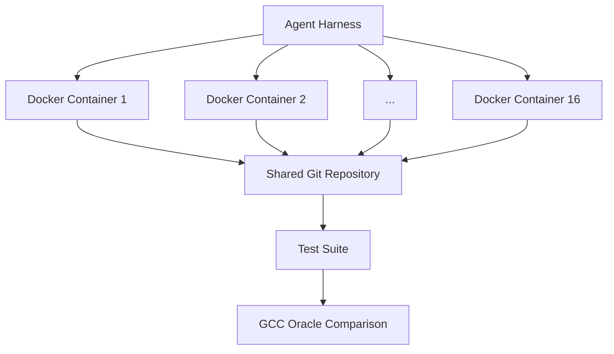

## Overview

Anthropic's <strong>CCC (Claude's C Compiler)</strong>, released on February 5, 2026, is an impressive project that simultaneously demonstrates both the potential and limitations of AI-built compilers. Built entirely by Claude Opus 4.6 in Rust, this C compiler can <strong>build Linux 6.9 on x86, ARM, and RISC-V</strong>.

Nearly 2,000 Claude Code sessions, $20,000 in API costs, and 100,000 lines of code — that's everything it took for AI to create a "working compiler."

## What Is CCC?

CCC was developed using an <strong>agent teams</strong> approach designed by Nicholas Carlini from Anthropic's Safeguards team. The core idea is simple:

> 16 Claude instances work in parallel on a shared codebase without active human intervention to build a complete compiler.

### Architecture



Each agent runs in an independent Docker container and creates "lock files" in the `current_tasks/` directory to prevent work conflicts. When one agent locks `parse_if_statement.txt`, others pick different tasks like `codegen_function_definition.txt`.

### The Agent Loop

Each agent's execution loop is remarkably simple:

```bash
#!/bin/bash
while true; do
  COMMIT=$(git rev-parse --short=6 HEAD)
  LOGFILE="agent_logs/agent_${COMMIT}.log"
  claude --dangerously-skip-permissions \
    -p "$(cat AGENT_PROMPT.md)" \
    --model claude-opus-X-Y &> "$LOGFILE"
done
```

## CCC's Achievements

### Successfully Compiled Projects

| Project | Status |
|---------|--------|
| Linux 6.9 Kernel (x86, ARM, RISC-V) | ✅ Boots successfully |
| QEMU | ✅ |
| FFmpeg | ✅ |
| SQLite | ✅ |
| PostgreSQL | ✅ |
| Redis | ✅ |
| Doom | ✅ Runs |

### Test Suite Results

- <strong>GCC torture test suite</strong>: 99% pass rate
- <strong>Major compiler test suites</strong>: 99% pass rate

## CCC vs GCC — A Realistic Comparison

GCC is a production compiler with over 40 years of history. Comparing it with CCC shows <strong>where AI stands today</strong>.

### Performance

> "Even with all optimizations enabled, CCC outputs less efficient code than GCC with all optimizations disabled (-O0)."

This is CCC's biggest weakness. In <strong>code optimization</strong> — the core value proposition of a compiler — it still falls far behind GCC.

### Feature Gap

| Feature | GCC | CCC |
|---------|-----|-----|
| Own assembler/linker | ✅ | ❌ (uses GCC's) |
| 16-bit x86 | ✅ | ❌ (delegates to GCC) |
| Builds all projects | ✅ | ❌ (some only) |
| Code optimization | Dozens of passes | Basic SSA IR |
| Architecture support | Dozens | 3 (x86, ARM, RISC-V) |

### But Here's What Matters

GCC was built by thousands of developers over 40 years. CCC was <strong>built by AI in 2 weeks for $20,000</strong>.

## 80% Quality at Lightning Speed — The Essence of AI Coding

The true significance of the CCC project isn't "it beat GCC." It lies in these facts:

### 1. From Zero to Working Compiler

A human compiler developer would need <strong>months to years</strong> to build a 100,000-line Rust compiler. AI did it in 2 weeks. It's not perfect, but <strong>it works</strong>.

### 2. The Power of Parallelism

Running 16 agents in parallel isn't just about speed. Each agent takes on a <strong>specialized role</strong>:

- Feature implementation agents
- Duplicate code consolidation agent
- Compiler performance optimization agent
- Code quality improvement agent
- Documentation agent

### 3. The Importance of Test-Driven Development

The most effort in this project went into <strong>designing the test environment, not writing code</strong>:

- Using GCC as a "ground truth oracle" for output comparison
- Minimizing output to prevent context window pollution
- Progress tracking for time-blind AI
- 1%/10% random sampling for fast regression testing

## Technical Design Points

### Clean-Room Implementation

CCC was developed <strong>without internet access</strong>. It's a complete clean-room implementation using only the Rust standard library. This proves AI can build a compiler from learned knowledge alone.

### SSA IR-Based Design


The compiler uses SSA (Static Single Assignment) intermediate representation to support multiple optimization passes. This architectural decision was made by humans, but the implementation is 100% AI.

### Limits of Parallel Agents

An interesting problem arose during the Linux kernel compilation phase. Unlike a test suite with hundreds of independent tests, kernel compilation is <strong>one giant task</strong>. Every agent hit the same bug, eliminating the advantage of having 16 agents.

The fix: use GCC as an online oracle to <strong>randomly distribute kernel files</strong>, letting each agent fix bugs in different files.

## Future Outlook

### Evolution Across Model Generations

| Model | Compiler Capability |
|-------|-------------------|
| Early Opus 4.x | Only basic compilers possible |
| Opus 4.5 | Can pass test suites, can't build real projects |
| Opus 4.6 | Successfully builds Linux kernel |

Capabilities are improving dramatically with each generation. Opus 4.7 or 5.0 might achieve GCC-level optimization.

### Implications for Developers

1. <strong>Testing is key</strong>: AI agent quality directly correlates with test environment quality
2. <strong>Architecture design is still human work</strong>: High-level decisions like SSA IR were made by humans
3. <strong>The value of 80% solutions</strong>: Don't underestimate working results that aren't perfect
4. <strong>The era of parallel agents</strong>: AI working as teams, not individuals

## Conclusion

CCC isn't a GCC replacement. It's a <strong>milestone showing how far AI has come in software development</strong>.

- 100,000 lines of working compiler generated in 2 weeks
- Builds a bootable Linux kernel
- $20,000 cost (a fraction of a human team)
- Not yet at GCC-level optimization

The AI characteristic of "80% quality at lightning speed" proved itself even in compiler development — one of the most demanding software projects. Filling the remaining 20% is still hard, but even that 80% was previously impossible.

## References

- [Building a C compiler with a team of parallel Claudes — Anthropic Engineering Blog](https://www.anthropic.com/engineering/building-c-compiler)
- [Claude's C Compiler — GitHub](https://github.com/anthropics/claudes-c-compiler)
- [GCC Torture Test Suite](https://gcc.gnu.org/onlinedocs/gccint/Torture-Tests.html)
