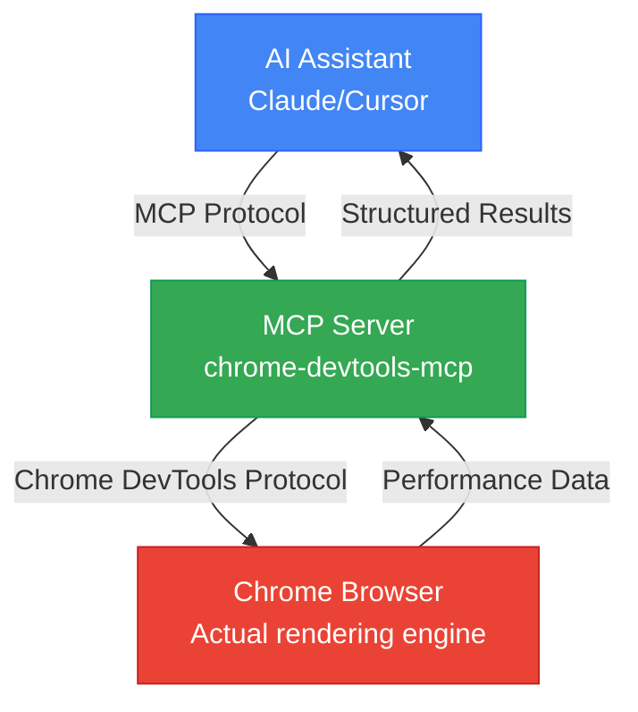

## A New Paradigm for Web Performance Optimization

Web performance optimization has always been critical, but measuring and improving it consistently has been challenging. Manually opening Chrome DevTools, profiling, taking screenshots, and comparing metrics is time-consuming and repetitive. The bigger problem? AI code generators couldn't verify how their code actually performed in real browsers.

On September 22, 2025, Google's Chrome DevTools team released <strong>Chrome DevTools MCP</strong> to solve this problem. Now AI assistants like Claude, Cursor, and Copilot can directly control live Chrome browsers, measure performance, and validate optimizations with data-driven insights.

## What is Chrome DevTools MCP?

Chrome DevTools MCP is an official Model Context Protocol server that gives AI coding assistants the ability to control Chrome browsers. Simply put, AI can now use your developer tools directly.

### Key Features

- <strong>Real-time Performance Measurement</strong>: Automatic Core Web Vitals (LCP, CLS, INP) tracking
- <strong>Network Monitoring</strong>: Analyze timing, headers, and payloads of all HTTP requests
- <strong>Device Emulation</strong>: Simulate mobile environments with CPU throttling and network constraints
- <strong>Automated Debugging</strong>: Collect and analyze console messages and error logs
- <strong>Performance Insights</strong>: Automatically identify render-blocking resources, long tasks, and layout shifts

### How It Works



AI makes a request → MCP server translates to Chrome DevTools Protocol commands → Chrome executes and returns data → AI analyzes and suggests improvements.

## Installation and Setup

### 1. Prerequisites

- Node.js v20.19+ (v22.12.0 recommended)
- Chrome browser (latest stable version)
- Claude Desktop or supported AI IDE

### 2. Claude Desktop Configuration

Edit `~/Library/Application Support/Claude/claude_desktop_config.json`:

```json
{
  "mcpServers": {
    "chrome-devtools": {
      "command": "npx",
      "args": ["-y", "chrome-devtools-mcp@latest"]
    }
  }
}
```

### 3. Advanced Configuration Options

```json
{
  "mcpServers": {
    "chrome-devtools": {
      "command": "npx",
      "args": [
        "chrome-devtools-mcp@latest",
        "--headless=true",           // Headless mode
        "--isolated=true",           // Isolated sessions (security recommended)
        "--viewport=1920x1080",      // Custom viewport
        "--executablePath=/path/to/chrome"  // Specific Chrome binary
      ]
    }
  }
}
```

Restart Claude Desktop to apply the configuration.

## Core Performance Optimization Tools

Chrome DevTools MCP provides 26 tools, but let's focus on those critical for performance optimization.

### 1. Performance Tracing

**`performance_start_trace()`**

Starts recording a performance trace. Captures page load timing, CPU usage, network activity, and rendering metrics.

```typescript
// Example AI request
"Record a performance trace on localhost:4321. Reload the page and auto-stop."

// MCP executes:
performance_start_trace(reload=true, autoStop=true)
```

**`performance_stop_trace()`**

Stops the trace and returns comprehensive performance insights:

- <strong>Core Web Vitals</strong>: LCP, CLS, INP, TBT, TTFB
- <strong>Longest main-thread tasks</strong>
- <strong>Render-blocking resources</strong>
- <strong>JavaScript execution timing</strong>
- <strong>Network waterfall analysis</strong>

**`performance_analyze_insight(insightName)`**

Provides detailed analysis of specific performance issues.

```typescript
// Detailed render-blocking resource analysis
performance_analyze_insight("RenderBlocking")

// Returns:
// - /main.css: 200ms blocking
// - /analytics.js: 150ms blocking
// Recommendation: Apply preload or defer
```

### 2. Automatic Core Web Vitals Measurement

Chrome DevTools MCP automatically measures all Core Web Vitals:

- <strong>LCP (Largest Contentful Paint)</strong>: ≤2.5s = Good
- <strong>CLS (Cumulative Layout Shift)</strong>: ≤0.1 = Good
- <strong>INP (Interaction to Next Paint)</strong>: ≤200ms = Good
- <strong>TBT (Total Blocking Time)</strong>: ≤300ms = Good
- <strong>TTFB (Time to First Byte)</strong>: ≤600ms = Good

AI analyzes these metrics and immediately identifies which ones exceed thresholds.

### 3. Device Emulation

<strong>CPU Throttling</strong>

```typescript
// Simulate 4x slower CPU (low-end mobile)
emulate_cpu(4)

// Re-measure performance
performance_start_trace(reload=true)
```

<strong>Network Throttling</strong>

```typescript
// Simulate Slow 4G network
emulate_network("Slow 4G")

// Options: "Slow 3G", "Fast 3G", "Slow 4G", "Fast 4G", "No emulation"
```

### 4. Network Request Monitoring

<strong>List All Requests</strong>

```typescript
list_network_requests(
  pageSize=50,
  resourceTypes=["script", "stylesheet", "image"]
)

// Returns:
// - URL, HTTP method, status code
// - Request/response headers
// - Timing (DNS, connection, TTFB)
// - File size and compression status
```

<strong>Get Specific Request Details</strong>

```typescript
get_network_request("https://example.com/main.js")

// Returns:
// - Full request/response body
// - Performance timing breakdown
// - Caching information
```

## Practical Workflow: Automating Performance Optimization

Let's walk through a complete workflow for optimizing website performance using Chrome DevTools MCP.

### Step 1: Baseline Measurement

```
Request to Claude:
"Measure performance on my blog at localhost:4321 and show Core Web Vitals"

AI executes:
1. navigate_page("http://localhost:4321")
2. performance_start_trace(reload=true, autoStop=true)
3. [Auto page load and measurement complete]

AI responds:
"Performance measurement complete:
- LCP: 3.2s (Poor - exceeds 2.5s)
- CLS: 0.05 (Good)
- TBT: 450ms (Poor - exceeds 300ms)
- TTFB: 120ms (Good)

Main issues:
1. Slow LCP: Largest image (hero.jpg, 1.2MB) needs optimization
2. High TBT: main.js (350KB) takes 400ms to parse"
```

### Step 2: Bottleneck Analysis

```
Request to Claude:
"Find render-blocking resources"

AI executes:
performance_analyze_insight("RenderBlocking")

AI responds:
"Render-blocking resources:
1. /styles/main.css (200ms blocking)
   - 28KB, uncompressed
   - Recommendation: Inline critical CSS + async load rest

2. /scripts/analytics.js (150ms blocking)
   - Synchronous load in head
   - Recommendation: Add defer or async attribute

3. Google Fonts (100ms blocking)
   - Recommendation: font-display: swap + preconnect"
```

### Step 3: Apply Optimizations

Image optimization:

```bash
# WebP conversion and resizing
npm install sharp
node optimize-images.js
```

JavaScript optimization:

```html
<!-- Before -->
<script src="/scripts/analytics.js"></script>

<!-- After -->
<script src="/scripts/analytics.js" defer></script>
```

CSS optimization:

```html
<head>
  <!-- Inline critical CSS -->
  <style>
    /* Above-the-fold styles only */
  </style>

  <!-- Async load rest of CSS -->
  <link rel="preload" href="/styles/main.css" as="style"
        onload="this.onload=null;this.rel='stylesheet'">
</head>
```

### Step 4: Re-measure and Validate

```
Request to Claude:
"Re-measure performance and compare with previous results"

AI responds:
"Performance measurement complete. Comparison:

Before → After:
- LCP: 3.2s → 1.8s (44% improvement ✓)
- CLS: 0.05 → 0.05 (no change)
- TBT: 450ms → 180ms (60% improvement ✓)
- TTFB: 120ms → 115ms

All Core Web Vitals now in 'Good' range!

Additional improvements:
- Image preload could reduce LCP to 1.5s
- Font preconnect could save additional 50ms"
```

## Advanced Use Cases

### 1. Automated Performance Regression Detection

Detect performance degradation automatically in CI/CD pipelines.

```typescript
// Pre-deployment automated testing
async function performanceCheck() {
  // 1. Measure current production performance
  const prodMetrics = await measurePerformance("https://example.com");

  // 2. Measure staging environment performance
  const stagingMetrics = await measurePerformance("https://staging.example.com");

  // 3. Compare and alert
  if (stagingMetrics.LCP > prodMetrics.LCP * 1.1) {
    throw new Error(`LCP regression detected: ${prodMetrics.LCP}ms → ${stagingMetrics.LCP}ms`);
  }
}
```

Simply request this from Claude and AI will execute the logic automatically and report results.

### 2. Cross-Device Performance Testing

```
Request to Claude:
"Test my site on both desktop and mobile, then compare"

AI executes:
1. [Desktop test]
   - No throttling
   - Result: LCP 1.8s, TBT 200ms

2. [Mobile test]
   - emulate_cpu(4)
   - emulate_network("Slow 4G")
   - Result: LCP 5.2s, TBT 1200ms

AI responds:
"Severe performance degradation on mobile:
- LCP 3.4s slower (insufficient image optimization)
- TBT increased by 1000ms (excessive JavaScript)

Mobile optimization priorities:
1. Add responsive image srcset
2. Implement JavaScript code splitting
3. Lazy load third-party scripts"
```

### 3. Production Issue Debugging

Reproduce and diagnose performance issues reported by real users.

```
User report: "Page loads too slowly on mobile"

Request to Claude:
"Profile https://example.com in mobile environment
and find the cause of slowness"

AI executes:
1. emulate_cpu(4) + emulate_network("Slow 4G")
2. navigate_page("https://example.com")
3. performance_start_trace(reload=true)
4. list_console_messages() (check errors)
5. list_network_requests() (network analysis)

AI responds:
"Issues found:
1. Third-party ad script causing 2s blocking (TBT culprit)
2. Unoptimized high-res images without WebP (LCP culprit)
3. 3 console 404 errors (unnecessary requests)

Solutions:
1. Load ad script with async
2. Convert images to WebP + add srcset
3. Remove or fix 404 resource paths"
```

## Best Practices and Tips

### Iterative Optimization Workflow

```
1. BASELINE
   - Measure initial performance
   - Document Core Web Vitals
   - Identify top 3 bottlenecks

2. PRIORITIZE
   - Focus on metrics failing thresholds
   - LCP > 2.5s = Priority 1
   - TBT > 300ms = Priority 2
   - CLS > 0.1 = Priority 3

3. OPTIMIZE
   - Apply targeted fixes based on insights
   - One optimization at a time (for clear attribution)

4. VALIDATE
   - Re-measure performance
   - Compare before/after
   - Check for regressions in other metrics

5. ITERATE
   - Move to next bottleneck
   - Repeat until all metrics "Good"
```

### Security Considerations

- <strong>Use Isolated Sessions</strong>: `--isolated=true` option for ephemeral browser sessions
- <strong>Sensitive Data Caution</strong>: Never use with browsers containing personal information
- <strong>Production Testing</strong>: Implement access controls, recommend read-only mode
- <strong>Review AI-Generated Scripts</strong>: Always verify before execution

### Combining with Other MCPs

Chrome DevTools MCP becomes even more powerful when combined with other MCP servers:

```
Discover performance issue (Chrome DevTools MCP)
  → Research solutions (Brave Search MCP)
  → Verify official docs (Context7 MCP)
  → Fix code and re-measure (Chrome DevTools MCP)
```

## Real-World Results

A hypothetical but realistic scenario:

### Before: Manual Optimization (Traditional Method)

- Time required: 4 hours
- Process:
  1. Manually run Chrome DevTools (30 min)
  2. Screenshot and record metrics (20 min)
  3. Google search for solutions (1 hour)
  4. Code modifications (1 hour)
  5. Re-measure and compare (30 min)
  6. Documentation (40 min)

### After: Chrome DevTools MCP Integration

- Time required: 1 hour
- Process:
  ```
  "Optimize my site's performance.
   Measure current state, find issues, suggest solutions.
   Re-measure after fixes and compare."
  ```
- AI automates all steps
- Results:
  - LCP: 3.8s → 1.9s (50% improvement)
  - Lighthouse Score: 62 → 94

<strong>Time Saved: 75%</strong>

## Future Outlook

Chrome DevTools MCP is fundamentally transforming web development workflows:

### AI as Active Development Partner

Past: AI generates code → Developer manually tests
Present: AI generates code → AI tests in browser → AI analyzes results → Iterate

### Predictable Evolution

1. <strong>Predictive Optimization</strong>: AI predicts and prevents performance degradation
2. <strong>Automated Fixes</strong>: AI directly fixes simple performance issues (after approval)
3. <strong>Continuous Monitoring</strong>: Real-time performance tracking in production
4. <strong>Performance Budget Automation</strong>: Set thresholds, CI/CD auto-validates

## Get Started

Chrome DevTools MCP transforms web performance optimization from guesswork to data-driven science.

### First Steps

1. <strong>Install</strong>: `npx chrome-devtools-mcp@latest`
2. <strong>Configure Claude Desktop</strong>: Add MCP server
3. <strong>First Measurement</strong>: "Measure my site's performance"
4. <strong>Start Optimizing</strong>: Apply AI suggestions one by one
5. <strong>Validate Results</strong>: Confirm improvements with data

Performance optimization is no longer time-consuming manual work. With AI, it becomes fast, accurate, and repeatable.

## References

- [Chrome DevTools MCP GitHub](https://github.com/ChromeDevTools/chrome-devtools-mcp)
- [Chrome DevTools Protocol Documentation](https://chromedevtools.github.io/devtools-protocol/)
- [Model Context Protocol Specification](https://modelcontextprotocol.io/)
- [Web.dev Core Web Vitals Guide](https://web.dev/vitals/)
- [Vladimir Siedykh's Complete Guide](https://vladimirsiedykh.com/blog/chrome-devtools-mcp-ai-browser-debugging-complete-guide-2025)

---

Hand over your website's performance optimization to AI today. Let data speak, AI analyze, and you focus on what matters most.
