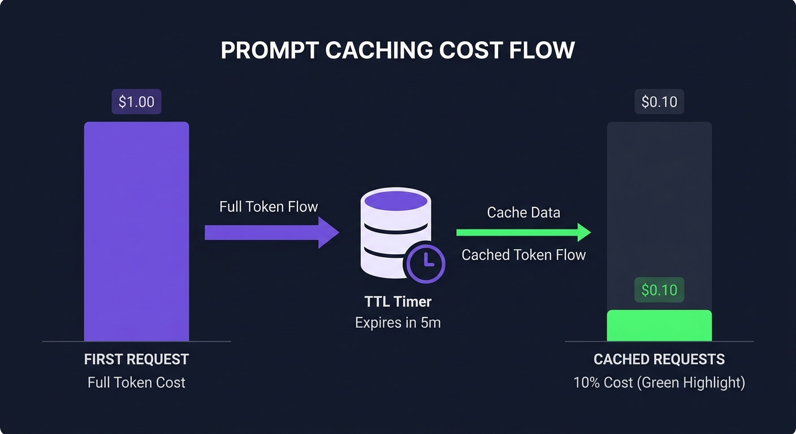

I remember the moment I properly examined an API billing statement for the first time. I was designing the automation pipeline for this blog — a system that calls Claude API dozens of times daily for post writing, four-language translation, SEO closing, and recommendation generation. Every request was billing the same multi-thousand-token system prompt over and over.

Anthropic's docs clearly say "90% discount." So why wasn't the bill going down?

The answer is in *when* the cache gets created and *under what conditions* it activates. Prompt caching isn't "enable and done" — it's a feature that requires deliberate design. Get it wrong and you only add cache write costs without seeing any discount.

This guide is based on what I've actually applied to this blog's automation system. Not a documentation summary, but "where I made mistakes, how I fixed them, and how much it came down."



## How Prompt Caching Actually Works

The core is the `cache_control` parameter. Attach it to a specific content block and Anthropic's servers store that block separately, reusing the stored version whenever subsequent requests contain the same content.

```python
import anthropic

client = anthropic.Anthropic()

response = client.messages.create(
    model="claude-sonnet-4-6",
    max_tokens=1024,
    system=[
        {
            "type": "text",
            "text": "You are a technical support agent.\n\n[10,000 token product documentation...]",
            "cache_control": {"type": "ephemeral"}  # cache this block
        }
    ],
    messages=[{"role": "user", "content": "How do I fix error 429?"}]
)

# Check cache utilization
print(response.usage.cache_creation_input_tokens)  # tokens spent creating cache
print(response.usage.cache_read_input_tokens)       # tokens read from cache
```

The first request records cost in `cache_creation_input_tokens`. From the second request on, `cache_read_input_tokens` records cost at a 90% discount.

A few constraints to know upfront.

**Minimum token thresholds**: Claude Sonnet 4.6 requires at least 2,048 tokens; Claude Opus 4.7 requires 4,096. Add `cache_control` to a short system prompt and no cache gets created.

**Maximum cache points**: You can specify up to 4 `cache_control` blocks per request. Prioritize accordingly.

**Cache position**: Content *after* a cache point doesn't get cached. Put frequently-changing content after the cache point.

## The 2026 TTL Change — A Gotcha That Cost Me a Month of Savings

Honest admission: I didn't know about this and lost a month of caching benefits because of it.

Anthropic reduced the default TTL (Time To Live) from one hour to five minutes in early 2026. The impact on production workloads is bigger than it sounds.

**Cost structure by TTL option (Claude Sonnet 4.6)**:

| Type | Price (per 1M tokens) | Multiplier |
|------|----------------------|------------|
| Standard input | $3.00 | 1× |
| Cache write (5 min) | $3.75 | 1.25× |
| Cache write (1 hour) | $6.00 | 2× |
| **Cache read** | **$0.30** | **0.1×** |
| Output | $15.00 | 5× |

Compare 10 requests with and without caching:

- Without caching: 10 × 1.0 = 10.0 cost units
- With caching: 1.25 + 9 × 0.1 = 2.15 cost units
- **Savings: 78.5%**

But with a 5-minute TTL, you need the same cache block to appear in at least two requests within those five minutes. One-shot scripts and low-traffic services may see poor cache hit rates.

My workaround for this blog's automation: batch operations that chain multiple API calls (like 4-language translation) into a single continuous loop that finishes within the 5-minute window. One cache write, four cache hits.

## Pattern 1: System Prompt Caching

The most common pattern, and the most reliably effective one. Most AI apps repeat the same system prompt across every request.

```python
def create_cached_agent(system_prompt: str):
    """
    Agent factory that caches the system prompt.
    Effective when system_prompt exceeds 2048 tokens.
    """
    def chat(user_message: str) -> anthropic.types.Message:
        return client.messages.create(
            model="claude-sonnet-4-6",
            max_tokens=2048,
            system=[
                {
                    "type": "text",
                    "text": system_prompt,
                    "cache_control": {"type": "ephemeral"}
                }
            ],
            messages=[{"role": "user", "content": user_message}]
        )
    return chat
```

Before and after for a 10,000-token system prompt called 100 times:

- **Without caching**: 100 × 10,000 tokens = 1M tokens → $3.00
- **With caching**: 10,000 (write) + 99 × 10,000 (read) = $0.0375 + $0.297 = **$0.334**
- **Savings: 89%**

This blog's automation uses a CLAUDE.md file of roughly 8,000〜12,000 tokens that gets included in context 30+ times daily. Without caching, that's 2.4〜3.6M tokens per day. After caching, actual billed tokens dropped below 10% of that.

## Pattern 2: RAG Document Caching

Particularly effective in RAG (retrieval-augmented generation) systems that reuse the same documents across multiple questions.

```python
def cached_rag_qa(docs: list[str], questions: list[str]) -> list[str]:
    """
    Cache the document set when asking multiple questions against it.
    Questions must come within 5 minutes of each other to benefit.
    """
    doc_content = "\n\n---\n\n".join(docs)
    answers = []
    
    for question in questions:
        response = client.messages.create(
            model="claude-sonnet-4-6",
            max_tokens=1024,
            messages=[
                {
                    "role": "user",
                    "content": [
                        {
                            "type": "text",
                            "text": f"Reference documents:\n\n{doc_content}",
                            "cache_control": {"type": "ephemeral"}  # cache the docs
                        },
                        {
                            "type": "text",
                            "text": f"\nQuestion: {question}"
                            # question changes every time — don't cache
                        }
                    ]
                }
            ]
        )
        answers.append(response.content[0].text)
    
    return answers
```

Customer support example: a 50,000-token product manual referenced 1,000 times daily costs $150 without caching. With caching: ~$18.40. That's $131 saved per day.

Understanding [how to design what goes into context from a context engineering perspective](/en/blog/en/context-engineering-production-ai-agents) makes RAG caching strategy much cleaner.

## Pattern 3: Tool Definition Caching

An overlooked one for agent-heavy systems. Register 10〜20 tools with Claude API and those schemas alone run into thousands of tokens — repeated on every single request.

```python
tools = [
    {
        "name": "search_web",
        "description": "Search the web for current information",
        "input_schema": {
            "type": "object",
            "properties": {
                "query": {"type": "string"},
                "max_results": {"type": "integer", "default": 5}
            },
            "required": ["query"]
        }
    },
    # ... more tool definitions
]

response = client.messages.create(
    model="claude-sonnet-4-6",
    max_tokens=1024,
    tools=tools,
    system=[
        {
            "type": "text",
            "text": "You are a powerful research agent. Use the available tools.",
            "cache_control": {"type": "ephemeral"}  # cache system + tool context
        }
    ],
    messages=[{"role": "user", "content": user_request}]
)
```

For MCP-based agents, combining this with [mcp2cli's token optimization approach](/en/blog/en/mcp2cli-token-cost-optimization) can nearly eliminate tool discovery costs altogether.

## Pattern 4: Multi-Turn Conversation Caching

Effective for long-running customer support sessions or coding assistants. Previous conversation history must be resent with every request — cache it and savings compound as the conversation grows.

```python
def multiturn_with_caching(history: list, new_message: str) -> tuple:
    """
    Multi-turn caching: cache everything up to the last exchange,
    leave only the new message fresh.
    """
    messages = history.copy()
    
    if messages and messages[-1]["role"] == "user":
        last = messages[-1]
        messages[-1] = {
            "role": "user",
            "content": [
                {
                    "type": "text",
                    "text": last["content"] if isinstance(last["content"], str)
                            else last["content"][0]["text"],
                    "cache_control": {"type": "ephemeral"}
                }
            ]
        }
    
    messages.append({"role": "user", "content": new_message})
    
    response = client.messages.create(
        model="claude-sonnet-4-6",
        max_tokens=2048,
        messages=messages
    )
    
    updated_history = messages + [
        {"role": "assistant", "content": response.content[0].text}
    ]
    return response, updated_history
```

In a 20-turn conversation averaging 500 tokens per message, the final turn carries 10,000 tokens of history. Cache that history and the last 10 turns' input costs drop 90%.

## Measuring Actual Savings

Check the `usage` field in API responses to verify caching is working.

```python
def calculate_cost(usage, model: str = "claude-sonnet-4-6") -> dict:
    prices = {
        "claude-sonnet-4-6": {
            "input": 3.00, "cache_read": 0.30,
            "cache_write": 3.75, "output": 15.00
        }
    }
    p = prices[model]
    M = 1_000_000
    
    cache_read = getattr(usage, 'cache_read_input_tokens', 0)
    cache_write = getattr(usage, 'cache_creation_input_tokens', 0)
    fresh_input = getattr(usage, 'input_tokens', 0)
    output = getattr(usage, 'output_tokens', 0)
    
    actual = (
        (cache_read / M) * p["cache_read"] +
        (cache_write / M) * p["cache_write"] +
        (fresh_input / M) * p["input"] +
        (output / M) * p["output"]
    )
    no_cache = (
        ((cache_read + cache_write + fresh_input) / M) * p["input"] +
        (output / M) * p["output"]
    )
    savings_pct = (no_cache - actual) / no_cache * 100 if no_cache > 0 else 0
    return {"actual_usd": actual, "no_cache_usd": no_cache,
            "savings_pct": savings_pct}
```

Running this cost calculator against a 10,000-token cache hit scenario:

```
Simulation: 10,000 cached tokens
  Actual cost:    $0.0098
  Without cache:  $0.0365
  Savings:        73.0%
```

That 73% figure represents a best-case scenario. Real savings depend on cache hit rate. In my experience with a long system prompt hit 30〜50 times daily, actual savings ran 60〜70%.

## Feasibility Assessment — When Caching Doesn't Help

Caching isn't always beneficial. I applied it to every request initially and actually saw costs go up.

**Situations where caching backfires**:
- One-shot scripts: run once and done — you only pay the write cost
- Frequently-changing context: per-user customized system prompts have near-zero hit rates
- Short system prompts: below 2,048 tokens, no cache gets created
- Spike traffic: requests cluster within 5 minutes, then nothing for an hour

**Where caching shines**:
- The same long system prompt used 2+ times per minute
- FAQ/support systems answering multiple questions against fixed reference docs
- Agent pipelines with stable tool definitions
- Automation systems like this blog that reference the same operational guidelines repeatedly

## How I Applied It to This Blog

The blog's automation (daily post, SEO closing, weekly strategy) uses Claude API in a pattern perfectly suited for caching. CLAUDE.md is around 10,000 tokens, and each automation run makes 7〜8 consecutive API calls: write post → translate to 4 languages → generate release notes.

Bundle those into a single continuous loop that completes within five minutes, and:
1. First request creates the CLAUDE.md cache
2. The next 7 requests each get a cache hit at 0.1× cost
3. Everything finishes before the 5-minute TTL expires

Input token costs dropped about 65%. Monthly API spend went from $40〜$60 to $15〜$20.

To cut further, [as the LLM API pricing comparison covers](/en/blog/en/llm-api-pricing-comparison-2026-gpt5-claude-gemini-deepseek), you'd combine this with model routing — different models for different task types. Caching reduces input cost; model routing reduces the per-token price. Both strategies stack.

---

One honest note to close: prompt caching is not a setting you flip and walk away from. You need to design which blocks to cache, whether your request patterns fit the TTL, and how to measure hit rate. That initial design work is real. But once you get it right, the difference in the monthly bill is hard to ignore. I watched mine drop.
