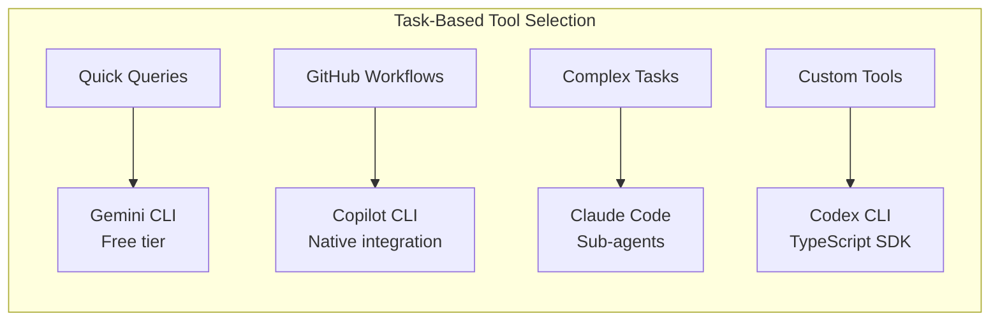

The AI-powered CLI tool landscape has evolved rapidly in 2025, giving developers more choices than ever. Whether you're looking to reduce costs, leverage specific integrations, or explore open-source alternatives, understanding your migration options is essential. This guide provides practical guidance for migrating from Claude Code to GitHub Copilot CLI, Gemini CLI, or OpenAI Codex CLI.

## Overview

### Current CLI AI Tool Landscape

The terminal-based AI coding assistant market has matured significantly:

- <strong>Claude Code</strong>: Anthropic's flagship CLI with advanced agentic capabilities
- <strong>GitHub Copilot CLI</strong>: Microsoft's offering with deep GitHub integration and multi-model support
- <strong>Gemini CLI</strong>: Google's free-tier option with ecosystem integration
- <strong>Codex CLI</strong>: OpenAI's open-source TypeScript-based solution

### Why Consider Migration

<strong>Cost Optimization</strong>
- Claude Code Max: $100〜200/month
- GitHub Copilot: $10/month (Individual) or $19/month (Pro)
- Gemini CLI: Free tier available
- Codex CLI: Pay-per-use API pricing

<strong>Feature Requirements</strong>
- GitHub-native workflows → Copilot CLI
- Google Cloud integration → Gemini CLI
- Open-source customization → Codex CLI
- Advanced agent systems → Claude Code

<strong>Team Considerations</strong>
- Existing GitHub Enterprise → Copilot CLI
- Google Workspace organization → Gemini CLI
- Custom tooling needs → Codex CLI

## Core Comparison: 4 CLI Tools

### Architecture Comparison Table

| Feature | Claude Code | Copilot CLI | Gemini CLI | Codex CLI |
|---------|-------------|-------------|------------|-----------|
| <strong>Base Model</strong> | Claude Sonnet 4.5 | GPT-4o/Claude/Gemini | Gemini 2.5 Pro | GPT-4.1 |
| <strong>Pricing</strong> | $100〜200/mo | $10〜19/mo | Free tier | API-based |
| <strong>MCP Support</strong> | Full | Limited | Partial | Growing |
| <strong>Sub-agents</strong> | Native | No | No | Limited |
| <strong>Custom Commands</strong> | Yes | Yes | Yes | Yes |
| <strong>Context Window</strong> | 200K tokens | 128K tokens | 1M tokens | 128K tokens |
| <strong>IDE Integration</strong> | Terminal | VS Code/Terminal | Terminal | Terminal |
| <strong>Open Source</strong> | No | No | Yes | Yes |
| <strong>Offline Mode</strong> | No | No | No | Partial |

### Configuration Structure Comparison

Each tool uses different configuration approaches:

<strong>Claude Code</strong>
```
.claude/
├── settings.json          # Project settings
├── settings.local.json    # Local overrides
├── commands/              # Custom slash commands
│   └── my-command.md
└── agents/                # Sub-agent definitions
    └── my-agent.md
```

<strong>GitHub Copilot CLI</strong>
```
.github/
├── copilot-instructions.md    # Project context
└── .copilot/
    └── config.yml             # CLI configuration
```

<strong>Gemini CLI</strong>
```
.gemini/
├── settings.json         # Global settings
├── GEMINI.md            # Project instructions
└── commands/            # Custom commands
    └── my-command.md
```

<strong>Codex CLI</strong>
```
.codex/
├── config.json          # Configuration
├── instructions.md      # Project context
└── agents.json          # Agent definitions
```

### Capability Flow Comparison

```mermaid
graph TD
    subgraph "Claude Code"
        CC_Input[User Input] --> CC_Agent[Agent Selection]
        CC_Agent --> CC_MCP[MCP Servers]
        CC_MCP --> CC_Tools[Tool Execution]
        CC_Tools --> CC_Output[Response]
    end

    subgraph "Copilot CLI"
        CP_Input[User Input] --> CP_Model[Model Router]
        CP_Model --> CP_GH[GitHub APIs]
        CP_GH --> CP_Output[Response]
    end

    subgraph "Gemini CLI"
        GE_Input[User Input] --> GE_Context[Context Loading]
        GE_Context --> GE_Model[Gemini Model]
        GE_Model --> GE_Output[Response]
    end

    subgraph "Codex CLI"
        CX_Input[User Input] --> CX_SDK[TypeScript SDK]
        CX_SDK --> CX_API[OpenAI API]
        CX_API --> CX_Output[Response]
    end
```



## Migration Guides

### 1. Migrating to GitHub Copilot CLI

#### Advantages

- <strong>Cost-effective</strong>: $10/month for Individual, $19/month for Pro
- <strong>Multi-vendor models</strong>: Access to GPT-4o, Claude, and Gemini through one subscription
- <strong>GitHub native</strong>: Seamless integration with repositories, issues, and pull requests
- <strong>Enterprise ready</strong>: SOC 2 compliance, SSO, audit logs

#### Key Conversions

<strong>CLAUDE.md → copilot-instructions.md</strong>

```markdown
<!-- .github/copilot-instructions.md -->
# Project Context

## Architecture
This is an Astro-based blog with TypeScript...

## Code Style
- Use TypeScript strict mode
- Follow kebab-case for files

## Commands
- `npm run dev` - Start development server
- `npm run build` - Production build
```

<strong>Custom Commands Migration</strong>

Claude Code commands in `.claude/commands/` convert to Copilot extensions:

```yaml
# .github/.copilot/extensions.yml
extensions:
  - name: write-post
    description: Create a new blog post
    template: |
      Create a blog post with:
      - Title: $TITLE
      - Tags: $TAGS
      Follow the frontmatter schema in content.config.ts
```

<strong>Sub-agents Alternative</strong>

Copilot CLI doesn't support sub-agents natively. Instead, use:
- Copilot Chat with `@workspace` for code context
- GitHub Actions for automated workflows
- Custom extensions for specialized tasks

#### Migration Steps

1. <strong>Install Copilot CLI</strong>
```bash
gh extension install github/gh-copilot
```

2. <strong>Authenticate</strong>
```bash
gh auth login
gh copilot config
```

3. <strong>Convert configuration</strong>
```bash
# Copy and adapt CLAUDE.md content
cp CLAUDE.md .github/copilot-instructions.md
# Edit to match Copilot's format
```

4. <strong>Test basic operations</strong>
```bash
gh copilot explain "What does this function do?"
gh copilot suggest "Add error handling to api.ts"
```

<strong>Estimated Migration Time</strong>: 2〜4 hours for basic setup, 1〜2 days for full workflow adaptation

### 2. Migrating to Gemini CLI

#### Advantages

- <strong>Free tier</strong>: 60 requests/minute, 1M token context
- <strong>Google ecosystem</strong>: Native GCP, Firebase, and Google Workspace integration
- <strong>Large context</strong>: 1M token window for massive codebases
- <strong>Open source</strong>: Apache 2.0 license, community extensions

#### Limitations

- No sub-agent system (use multiple instances instead)
- Limited MCP support compared to Claude Code
- Fewer built-in tools

#### Key Conversions

<strong>CLAUDE.md → GEMINI.md</strong>

```markdown
<!-- GEMINI.md -->
# Project Instructions

## Overview
Astro-based multilingual blog...

## File Structure
- src/content/blog/{lang}/ - Blog posts
- src/components/ - Astro components

## Conventions
- Use TypeScript strict mode
- Follow Astro best practices
```

<strong>MCP Server Configuration</strong>

```json
// .gemini/settings.json
{
  "mcpServers": {
    "context7": {
      "command": "npx",
      "args": ["-y", "@context7/mcp"]
    }
  },
  "extensions": [
    "google.gemini-code-assist"
  ]
}
```

<strong>Custom Commands</strong>

```markdown
<!-- .gemini/commands/analyze-post.md -->
Analyze the blog post at $ARGUMENTS:
1. Check SEO optimization
2. Verify frontmatter schema
3. Suggest improvements
```

#### Migration Steps

1. <strong>Install Gemini CLI</strong>
```bash
npm install -g @anthropic-ai/gemini-cli
# or
brew install gemini-cli
```

2. <strong>Authenticate with Google Cloud</strong>
```bash
gcloud auth application-default login
gemini auth
```

3. <strong>Create configuration</strong>
```bash
mkdir .gemini
# Create GEMINI.md and settings.json
```

4. <strong>Test functionality</strong>
```bash
gemini "Explain the content collection schema"
gemini --command analyze-post src/content/blog/en/my-post.md
```

<strong>Estimated Migration Time</strong>: 1〜2 hours for basic setup, 4〜8 hours for workflow adaptation

### 3. Migrating to Codex CLI

#### Advantages

- <strong>Open source</strong>: Full transparency, community contributions
- <strong>TypeScript SDK</strong>: Extensible with custom TypeScript modules
- <strong>Cost control</strong>: Direct API access, pay only for what you use
- <strong>Customizable</strong>: Build your own tools and integrations

#### Limitations

- Limited project-level MCP configuration
- Smaller community compared to Copilot
- Manual setup for advanced features
- No GUI for configuration

#### Key Conversions

<strong>CLAUDE.md → instructions.md</strong>

```markdown
<!-- .codex/instructions.md -->
# Codex Project Instructions

## Context
This is an Astro 5 blog with Content Collections...

## Important Files
- src/content.config.ts - Schema definitions
- astro.config.mjs - Build configuration

## Style Guide
Follow TypeScript strict mode and Astro conventions.
```

<strong>Agent Configuration</strong>

```json
// .codex/agents.json
{
  "agents": [
    {
      "name": "seo-optimizer",
      "instructions": "Optimize blog posts for SEO...",
      "tools": ["read", "write", "search"]
    },
    {
      "name": "content-writer",
      "instructions": "Create multilingual blog content...",
      "tools": ["read", "write", "web-fetch"]
    }
  ]
}
```

<strong>Custom Tools with TypeScript</strong>

```typescript
// .codex/tools/analyze-frontmatter.ts
import { Tool } from '@openai/codex-sdk';

export const analyzeFrontmatter: Tool = {
  name: 'analyze-frontmatter',
  description: 'Analyze blog post frontmatter',
  parameters: {
    type: 'object',
    properties: {
      filePath: { type: 'string' }
    },
    required: ['filePath']
  },
  execute: async ({ filePath }) => {
    // Custom analysis logic
    const content = await fs.readFile(filePath, 'utf-8');
    // Parse and validate frontmatter
    return { valid: true, suggestions: [] };
  }
};
```

#### Migration Steps

1. <strong>Install Codex CLI</strong>
```bash
npm install -g @openai/codex-cli
```

2. <strong>Configure API access</strong>
```bash
export OPENAI_API_KEY=your-key-here
codex init
```

3. <strong>Set up project configuration</strong>
```bash
mkdir .codex
# Create config.json, instructions.md, agents.json
```

4. <strong>Test with basic tasks</strong>
```bash
codex "Explain the blog structure"
codex --agent seo-optimizer "Analyze latest posts"
```

<strong>Estimated Migration Time</strong>: 2〜4 hours for basic setup, 1〜2 weeks for custom tooling

## Choosing the Right Tool

### When to Choose GitHub Copilot CLI

<strong>Best for teams that:</strong>
- Already use GitHub Enterprise
- Want predictable monthly costs
- Need multi-model flexibility
- Require enterprise compliance features
- Value GitHub-native workflows

<strong>Example use case:</strong> A startup team using GitHub for everything—repositories, issues, actions, and projects—benefits from Copilot's seamless integration and reasonable $10/month pricing.

### When to Choose Gemini CLI

<strong>Best for teams that:</strong>
- Need free-tier access for experimentation
- Work within Google Cloud ecosystem
- Process large codebases (leverage 1M context)
- Want open-source transparency
- Use Google Workspace for collaboration

<strong>Example use case:</strong> A solo developer or small team wanting to experiment with AI coding assistance without upfront costs, especially if they're already using GCP or Firebase.

### When to Choose Codex CLI

<strong>Best for teams that:</strong>
- Require deep customization
- Want direct API cost control
- Build proprietary tools and integrations
- Prefer open-source solutions
- Have TypeScript expertise

<strong>Example use case:</strong> An agency building custom development workflows that need to integrate AI assistance into proprietary toolchains.

### When to Keep Claude Code

<strong>Best for teams that:</strong>
- Rely heavily on sub-agent workflows
- Use extensive MCP server integrations
- Need advanced agentic capabilities
- Work on complex, multi-step tasks
- Value Claude's reasoning abilities

<strong>Example use case:</strong> This blog project uses Claude Code's sub-agents for specialized tasks—SEO optimization, content writing, image generation—that require coordinated autonomous workflows.

## Hybrid Strategy

Rather than full migration, consider a hybrid approach:



### Practical Hybrid Setup

```bash
# ~/.zshrc or ~/.bashrc

# Claude Code for complex agentic tasks
alias cc="claude"

# Copilot for GitHub-related queries
alias cgh="gh copilot"

# Gemini for quick questions (free tier)
alias gem="gemini"

# Codex for custom tooling
alias cdx="codex"

# Task-specific aliases
alias pr-review="gh copilot explain"
alias quick-ask="gemini"
alias deep-analysis="claude"
```

### Cost Optimization with Hybrid

| Task Type | Tool | Monthly Cost Impact |
|-----------|------|---------------------|
| Quick questions | Gemini CLI | Free |
| PR reviews | Copilot CLI | $10〜19/mo |
| Complex refactoring | Claude Code | $100〜200/mo (occasional) |
| Custom automation | Codex CLI | $5〜20/mo (API) |

This approach can reduce monthly costs from $200+ to $50〜100 while maintaining capability coverage.

## Conclusion

Migrating from Claude Code isn't an all-or-nothing decision. Each CLI tool excels in different scenarios:

<strong>GitHub Copilot CLI</strong> offers the best balance of cost and integration for GitHub-centric teams. At $10/month with multi-model support, it's the most economical choice for general development tasks.

<strong>Gemini CLI</strong> provides the lowest barrier to entry with its free tier and massive context window. Ideal for experimentation and Google ecosystem integration.

<strong>Codex CLI</strong> gives maximum control through its open-source TypeScript SDK. Perfect for teams building custom tooling.

<strong>Claude Code</strong> remains the most capable option for complex agentic workflows with its sub-agent system and extensive MCP support.

My recommendation: Start with a hybrid strategy. Use Gemini CLI for quick queries (free), Copilot CLI for GitHub workflows ($10/month), and retain Claude Code for complex tasks that truly need its advanced capabilities. This approach optimizes both cost and productivity while you evaluate which tool best fits your long-term needs.

The AI CLI tool landscape will continue evolving rapidly. Whichever migration path you choose, ensure your configuration files and workflows are well-documented—you may need to migrate again as these tools mature and new options emerge.
