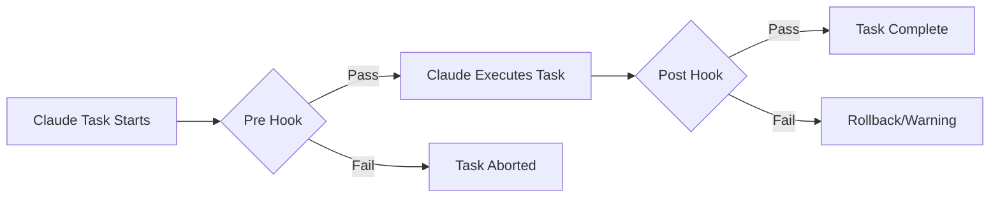
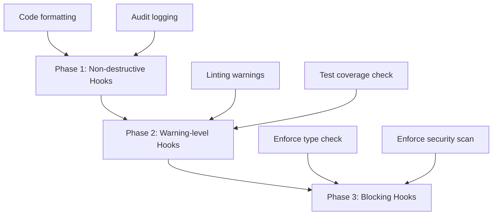
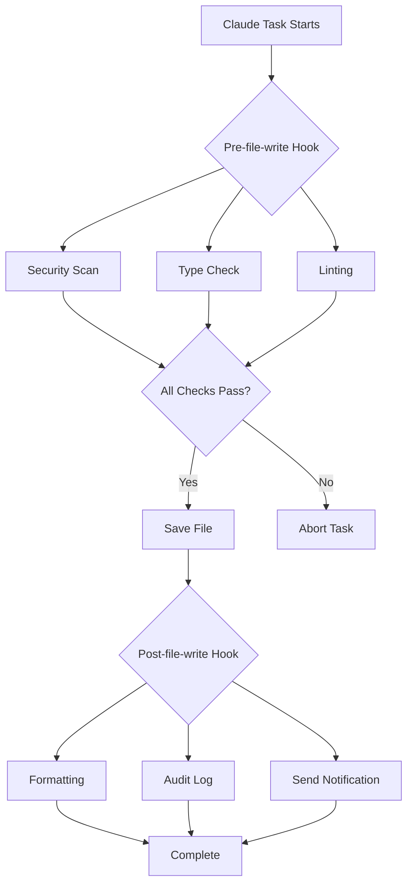

## Overview

AI-powered coding assistants dramatically improve productivity, but ensuring <strong>consistent code quality and rule compliance</strong> remains a challenging task. Claude Code's <strong>Hook System</strong> provides a powerful solution to this problem.

Hooks are scripts that automatically execute at specific workflow stages, allowing you to insert custom validation logic at various points such as code writing, file saving, pre/post-commit, and more. This enables complete automation of code review, testing, security scanning, and compliance checking.

### What This Article Covers

- Core concepts and operating principles of the Hook system
- Various Hook types and use cases
- Implementing automated coding rule validation
- Building automated code review processes
- CI/CD pipeline integration strategies
- Practical examples and best practices

## Understanding the Hook System

### What is a Hook?

Claude Code Hooks are <strong>user-defined scripts that execute at specific points in the workflow</strong>. Similar to Git hooks but specialized for Claude's AI coding workflow.



### Hook Execution Mechanism

Hooks control Claude's behavior through exit codes:

```bash
# Success (continue task)
exit 0

# Failure (abort task)
exit 1

# Warning (continue but show warning)
exit 2
```

### Hook Directory Structure

```
.claude/
└── hooks/
    ├── pre-file-write.sh      # Execute before file save
    ├── post-file-write.py     # Execute after file save
    ├── pre-commit.sh          # Execute before commit
    ├── post-commit.py         # Execute after commit
    └── code-review.js         # Custom review Hook
```

## Hook Configuration and Setup

### 1. Creating a Basic Hook

Let's start with the simplest hook:

````bash
#!/bin/bash
# .claude/hooks/pre-file-write.sh

# Hook input data is passed as JSON
input=$(cat)

# Extract file path
file_path=$(echo "$input" | jq -r '.file_path')

echo "Checking file: $file_path"

# Protect sensitive files
if [[ "$file_path" == *".env"* ]] || [[ "$file_path" == *"credentials"* ]]; then
    echo "Error: Cannot modify sensitive files"
    exit 1
fi

# Success
exit 0
````

### 2. Setting Execution Permissions

Hook scripts must be executable:

```bash
chmod +x .claude/hooks/pre-file-write.sh

# Grant execution permissions to all hooks
chmod +x .claude/hooks/*.sh
chmod +x .claude/hooks/*.py
```

### 3. Hook Data Structure

Claude passes context information to hooks in JSON format:

```json
{
  "file_path": "src/components/Button.tsx",
  "operation": "write",
  "content": "...",
  "metadata": {
    "timestamp": "2025-10-29T10:30:00Z",
    "user": "developer@example.com"
  }
}
```

## Automated Coding Rule Validation

### 1. TypeScript Type Check Hook

```bash
#!/bin/bash
# .claude/hooks/typescript-check.sh

input=$(cat)
file_path=$(echo "$input" | jq -r '.file_path')

# Check TypeScript files only
if [[ "$file_path" != *.ts ]] && [[ "$file_path" != *.tsx ]]; then
    exit 0
fi

echo "Running TypeScript type check..."

# Run type check
npx tsc --noEmit "$file_path" 2>&1 | tee /tmp/tsc-output.txt

if [ ${PIPESTATUS[0]} -ne 0 ]; then
    echo "❌ Type check failed"
    cat /tmp/tsc-output.txt
    exit 1
fi

echo "✅ Type check passed"
exit 0
```

### 2. ESLint Linting Hook

```python
#!/usr/bin/env python3
# .claude/hooks/eslint-check.py

import sys
import json
import subprocess

def main():
    # Read input data
    input_data = json.loads(sys.stdin.read())
    file_path = input_data.get('file_path', '')

    # Check JavaScript/TypeScript files only
    if not (file_path.endswith('.js') or
            file_path.endswith('.ts') or
            file_path.endswith('.jsx') or
            file_path.endswith('.tsx')):
        sys.exit(0)

    print(f"Running ESLint on {file_path}...")

    # Run ESLint
    result = subprocess.run(
        ['npx', 'eslint', file_path, '--format', 'json'],
        capture_output=True,
        text=True
    )

    if result.returncode != 0:
        lint_results = json.loads(result.stdout)

        # Output error summary
        for file_result in lint_results:
            for message in file_result.get('messages', []):
                severity = 'Error' if message['severity'] == 2 else 'Warning'
                print(f"{severity}: {message['message']} "
                      f"(line {message['line']}, col {message['column']})")

        sys.exit(1)

    print("✅ ESLint passed")
    sys.exit(0)

if __name__ == '__main__':
    main()
```

### 3. Automatic Code Formatting

```bash
#!/bin/bash
# .claude/hooks/post-file-write.sh

input=$(cat)
file_path=$(echo "$input" | jq -r '.file_path')

# Supported file extensions
if [[ "$file_path" =~ \.(js|ts|jsx|tsx|json|css|scss)$ ]]; then
    echo "Auto-formatting $file_path with Prettier..."

    npx prettier --write "$file_path"

    if [ $? -eq 0 ]; then
        echo "✅ Formatted successfully"
    else
        echo "⚠️  Formatting failed, but continuing..."
    fi
fi

exit 0
```

## Automated Code Review Process

### 1. Comprehensive Code Review Hook

```bash
#!/bin/bash
# .claude/hooks/comprehensive-review.sh

set -e

input=$(cat)
file_path=$(echo "$input" | jq -r '.file_path')

echo "🔍 Starting comprehensive code review for $file_path"

# Step-by-step validation
declare -a checks=(
    "Security scan"
    "Type checking"
    "Linting"
    "Test coverage"
    "Documentation check"
)

# 1. Security scan
echo "🔒 ${checks[0]}..."
if command -v semgrep &> /dev/null; then
    semgrep --config=auto "$file_path" --quiet
fi

# 2. Type check
echo "📝 ${checks[1]}..."
if [[ "$file_path" =~ \.(ts|tsx)$ ]]; then
    npx tsc --noEmit "$file_path"
fi

# 3. Linting
echo "✨ ${checks[2]}..."
if [[ "$file_path" =~ \.(js|ts|jsx|tsx)$ ]]; then
    npx eslint "$file_path"
fi

# 4. Test coverage check
echo "🧪 ${checks[3]}..."
test_file="${file_path/src/tests}"
test_file="${test_file/.ts/.test.ts}"

if [ ! -f "$test_file" ]; then
    echo "⚠️  Warning: No test file found at $test_file"
    # Just warn and continue
fi

# 5. Documentation check
echo "📚 ${checks[4]}..."
if [[ "$file_path" =~ \.(ts|tsx|js|jsx)$ ]]; then
    # Check JSDoc comments
    if ! grep -q "\/\*\*" "$file_path"; then
        echo "⚠️  Warning: No JSDoc comments found"
    fi
fi

echo "✅ Code review completed successfully"
exit 0
```

### 2. SOX/SOC2 Audit Trail Hook

```python
#!/usr/bin/env python3
# .claude/hooks/audit-trail.py

import sys
import json
import hashlib
from datetime import datetime
import os

AUDIT_LOG = '.claude/audit/trail.jsonl'

def main():
    # Input data
    input_data = json.loads(sys.stdin.read())

    # Create audit log directory
    os.makedirs(os.path.dirname(AUDIT_LOG), exist_ok=True)

    # Create audit entry
    audit_entry = {
        'timestamp': datetime.utcnow().isoformat(),
        'operation': input_data.get('operation', 'unknown'),
        'file_path': input_data.get('file_path', ''),
        'user': os.environ.get('USER', 'unknown'),
        'content_hash': hashlib.sha256(
            input_data.get('content', '').encode()
        ).hexdigest(),
        'metadata': input_data.get('metadata', {})
    }

    # Append log in JSONL format
    with open(AUDIT_LOG, 'a') as f:
        f.write(json.dumps(audit_entry) + '\n')

    print(f"✅ Audit trail recorded: {audit_entry['timestamp']}")
    sys.exit(0)

if __name__ == '__main__':
    main()
```

### 3. Pull Request Auto-Validation

```bash
#!/bin/bash
# .claude/hooks/pr-validation.sh

input=$(cat)
file_path=$(echo "$input" | jq -r '.file_path')

echo "🔍 PR Validation Checks"

# Checklist
declare -A checks=(
    ["Tests"]="npm test"
    ["Build"]="npm run build"
    ["Type Check"]="npm run typecheck"
    ["Lint"]="npm run lint"
)

failed=0

for check_name in "${!checks[@]}"; do
    echo ""
    echo "Running: $check_name"

    if eval "${checks[$check_name]}" > /tmp/check-output.txt 2>&1; then
        echo "✅ $check_name passed"
    else
        echo "❌ $check_name failed"
        cat /tmp/check-output.txt
        failed=1
    fi
done

if [ $failed -eq 1 ]; then
    echo ""
    echo "❌ PR validation failed. Please fix the issues before committing."
    exit 1
fi

echo ""
echo "✅ All PR validation checks passed"
exit 0
```

## CI/CD Integration Strategies

### 1. GitHub Actions Integration

```yaml
# .github/workflows/claude-hooks.yml
name: Claude Code Hooks

on:
  pull_request:
    types: [opened, synchronize]

jobs:
  run-hooks:
    runs-on: ubuntu-latest

    steps:
      - uses: actions/checkout@v4

      - name: Setup Node.js
        uses: actions/setup-node@v4
        with:
          node-version: '20'

      - name: Install dependencies
        run: npm ci

      - name: Make hooks executable
        run: chmod +x .claude/hooks/*.sh

      - name: Run pre-commit hooks
        run: |
          for file in $(git diff --name-only origin/main); do
            if [ -f ".claude/hooks/pre-commit.sh" ]; then
              echo "{\"file_path\": \"$file\"}" | .claude/hooks/pre-commit.sh
            fi
          done

      - name: Run code review hook
        run: |
          for file in $(git diff --name-only origin/main); do
            if [ -f ".claude/hooks/code-review.sh" ]; then
              echo "{\"file_path\": \"$file\"}" | .claude/hooks/code-review.sh
            fi
          done
```

### 2. N8N Workflow Automation

Send hook execution results to N8N for notification automation:

```bash
#!/bin/bash
# .claude/hooks/notify-n8n.sh

input=$(cat)
file_path=$(echo "$input" | jq -r '.file_path')

# N8N webhook URL (from environment variable)
WEBHOOK_URL="${N8N_WEBHOOK_URL}"

if [ -z "$WEBHOOK_URL" ]; then
    echo "Warning: N8N_WEBHOOK_URL not set"
    exit 0
fi

# Create notification payload
payload=$(cat <<EOF
{
  "event": "code_review_completed",
  "file": "$file_path",
  "timestamp": "$(date -u +%Y-%m-%dT%H:%M:%SZ)",
  "status": "success"
}
EOF
)

# Send to N8N
curl -X POST "$WEBHOOK_URL" \
  -H "Content-Type: application/json" \
  -d "$payload" \
  --silent

exit 0
```

### 3. Telegram Notification Integration

```python
#!/usr/bin/env python3
# .claude/hooks/telegram-notify.py

import sys
import json
import os
import requests

def send_telegram_message(message):
    bot_token = os.environ.get('TELEGRAM_BOT_TOKEN')
    chat_id = os.environ.get('TELEGRAM_CHAT_ID')

    if not bot_token or not chat_id:
        print("Warning: Telegram credentials not set")
        return

    url = f"https://api.telegram.org/bot{bot_token}/sendMessage"
    payload = {
        'chat_id': chat_id,
        'text': message,
        'parse_mode': 'Markdown'
    }

    try:
        requests.post(url, json=payload, timeout=5)
    except Exception as e:
        print(f"Warning: Failed to send Telegram notification: {e}")

def main():
    input_data = json.loads(sys.stdin.read())
    file_path = input_data.get('file_path', 'unknown')

    message = f"""
🔍 *Code Review Completed*

📁 File: `{file_path}`
✅ All checks passed
🕐 {input_data.get('metadata', {}).get('timestamp', 'N/A')}
"""

    send_telegram_message(message)
    sys.exit(0)

if __name__ == '__main__':
    main()
```

## Practical Examples and Patterns

### 1. Gradual Hook Adoption Strategy

Applying all hooks at once can slow down your workflow. A gradual adoption strategy:



<strong>Phase 1 Implementation:</strong>

```bash
#!/bin/bash
# .claude/hooks/phase1-gentle.sh

input=$(cat)

# Always succeed but provide information
echo "ℹ️  Code formatting applied"
echo "ℹ️  Audit trail recorded"

exit 0
```

<strong>Phase 2 Implementation:</strong>

```bash
#!/bin/bash
# .claude/hooks/phase2-warnings.sh

input=$(cat)
file_path=$(echo "$input" | jq -r '.file_path')

# Run linting but continue even if it fails
npx eslint "$file_path" || echo "⚠️  Linting issues found"

# Exit with warning code
exit 2
```

<strong>Phase 3 Implementation:</strong>

```bash
#!/bin/bash
# .claude/hooks/phase3-blocking.sh

input=$(cat)
file_path=$(echo "$input" | jq -r '.file_path')

# Abort on type check failure
npx tsc --noEmit "$file_path"

if [ $? -ne 0 ]; then
    echo "❌ Type check failed - blocking operation"
    exit 1
fi

exit 0
```

### 2. Conditional Hook Execution

You don't need to run all hooks on all files:

```bash
#!/bin/bash
# .claude/hooks/conditional-hooks.sh

input=$(cat)
file_path=$(echo "$input" | jq -r '.file_path')

# Conditional hook execution
case "$file_path" in
    *.ts|*.tsx)
        echo "Running TypeScript checks..."
        .claude/hooks/typescript-check.sh <<< "$input"
        ;;
    *.py)
        echo "Running Python checks..."
        .claude/hooks/python-check.sh <<< "$input"
        ;;
    *.md)
        echo "Running Markdown lint..."
        .claude/hooks/markdown-lint.sh <<< "$input"
        ;;
    *)
        echo "No specific checks for this file type"
        ;;
esac

exit 0
```

### 3. Hook Performance Optimization

If hooks are too slow, they impair the development experience:

```bash
#!/bin/bash
# .claude/hooks/optimized-hook.sh

input=$(cat)
file_path=$(echo "$input" | jq -r '.file_path')

# Set timeout (5 seconds)
TIMEOUT=5

# Parallel execution
(
    timeout $TIMEOUT npx eslint "$file_path" &
    timeout $TIMEOUT npx prettier --check "$file_path" &
    wait
) 2>/dev/null

if [ $? -eq 124 ]; then
    echo "⚠️  Hook timeout - skipping detailed checks"
    exit 2
fi

exit 0
```

### 4. Caching for Optimization

```bash
#!/bin/bash
# .claude/hooks/cached-checks.sh

input=$(cat)
file_path=$(echo "$input" | jq -r '.file_path')
content=$(echo "$input" | jq -r '.content')

# Generate content hash
content_hash=$(echo "$content" | sha256sum | cut -d' ' -f1)
cache_dir=".claude/cache"
cache_file="$cache_dir/$content_hash"

mkdir -p "$cache_dir"

# Check cache
if [ -f "$cache_file" ]; then
    cache_result=$(cat "$cache_file")
    echo "✅ Using cached result: $cache_result"
    exit 0
fi

# Perform actual checks
echo "Running checks..."
npx eslint "$file_path"

if [ $? -eq 0 ]; then
    echo "passed" > "$cache_file"
    exit 0
else
    echo "failed" > "$cache_file"
    exit 1
fi
```

## Best Practices and Tips

### 1. Hook Design Principles

<strong>Apply SOLID principles to Hooks:</strong>

- <strong>Single Responsibility</strong>: One hook, one responsibility
- <strong>Open/Closed</strong>: Open for extension, closed for modification
- <strong>Liskov Substitution</strong>: Hooks should be interchangeable
- <strong>Interface Segregation</strong>: Require only necessary data
- <strong>Dependency Inversion</strong>: Depend on abstractions, not concrete implementations

### 2. Error Handling Strategy

```bash
#!/bin/bash
# .claude/hooks/error-handling.sh

set -euo pipefail  # Abort immediately on error

input=$(cat)

# Error log file
ERROR_LOG=".claude/logs/hook-errors.log"
mkdir -p "$(dirname "$ERROR_LOG")"

# Error handler
handle_error() {
    local exit_code=$?
    local line_num=$1

    echo "Error on line $line_num (exit code: $exit_code)" | tee -a "$ERROR_LOG"

    # Log error details
    echo "Input data:" >> "$ERROR_LOG"
    echo "$input" >> "$ERROR_LOG"
    echo "---" >> "$ERROR_LOG"

    exit 1
}

# Set error trap
trap 'handle_error $LINENO' ERR

# Hook logic...
echo "Executing hook logic..."

exit 0
```

### 3. Writing Testable Hooks

```bash
#!/bin/bash
# .claude/hooks/testable-hook.sh

# Support test mode
TEST_MODE=${TEST_MODE:-false}

if [ "$TEST_MODE" = "true" ]; then
    # Test input data
    input='{"file_path": "test.ts", "content": "// test"}'
else
    # Actual input data
    input=$(cat)
fi

# Execute logic
file_path=$(echo "$input" | jq -r '.file_path')
echo "Processing: $file_path"

exit 0
```

Testing hooks:

```bash
# Run test
TEST_MODE=true .claude/hooks/testable-hook.sh

# Test with actual data
echo '{"file_path": "src/app.ts"}' | .claude/hooks/testable-hook.sh
```

### 4. Documentation Template

```bash
#!/bin/bash
# .claude/hooks/example-hook.sh

# Hook Information
# Name: Example Hook
# Purpose: Perform basic validation before file save
# Trigger: pre-file-write
# Exit Codes:
#   0 - Success (continue task)
#   1 - Error (abort task)
#   2 - Warning (continue but show warning)
#
# Input JSON Schema:
# {
#   "file_path": "string",
#   "operation": "string",
#   "content": "string",
#   "metadata": {}
# }
#
# Environment Variables:
#   HOOK_DEBUG - Set to "true" for verbose output
#
# Dependencies:
#   - jq (JSON parser)
#   - bash 4.0+
#
# Author: Your Name
# Last Updated: 2025-10-29

# Debug mode
DEBUG=${HOOK_DEBUG:-false}

if [ "$DEBUG" = "true" ]; then
    set -x
fi

# Hook logic...
input=$(cat)
echo "Hook executed successfully"

exit 0
```

### 5. Security Considerations

```bash
#!/bin/bash
# .claude/hooks/secure-hook.sh

set -euo pipefail

input=$(cat)

# 1. Input validation
if ! echo "$input" | jq empty 2>/dev/null; then
    echo "Error: Invalid JSON input"
    exit 1
fi

# 2. Prevent path injection
file_path=$(echo "$input" | jq -r '.file_path')

# Only allow absolute paths or safely normalize relative paths
if [[ "$file_path" =~ \.\. ]]; then
    echo "Error: Path traversal detected"
    exit 1
fi

# 3. Prevent logging sensitive data
# Don't log content
echo "Processing file: $(basename "$file_path")"

# 4. Validate environment variables
if [ -n "${GITHUB_TOKEN:-}" ]; then
    echo "Warning: Sensitive env var detected, masking in logs"
fi

# 5. Handle temporary files safely
temp_file=$(mktemp)
trap "rm -f $temp_file" EXIT

# Hook logic...

exit 0
```

## Troubleshooting Guide

### Common Issues and Solutions

#### 1. Hook Not Executing

<strong>Symptom:</strong> Hook scripts don't execute at all

<strong>Solution:</strong>

```bash
# Check execution permissions
ls -la .claude/hooks/

# Grant execution permissions
chmod +x .claude/hooks/*.sh

# Check hook directory
cat .claude/settings.json | jq '.hooks'
```

#### 2. Slow Hooks

<strong>Symptom:</strong> Hook execution significantly slows down workflow

<strong>Solution:</strong>

```bash
# Measure hook execution time
time echo '{"file_path": "test.ts"}' | .claude/hooks/slow-hook.sh

# Optimize with parallel execution
# Before: Sequential execution (slow)
check1.sh && check2.sh && check3.sh

# After: Parallel execution (fast)
check1.sh & check2.sh & check3.sh & wait
```

#### 3. Hook Debugging

```bash
#!/bin/bash
# .claude/hooks/debug-hook.sh

# Save debug output to file
DEBUG_LOG=".claude/logs/hook-debug.log"
mkdir -p "$(dirname "$DEBUG_LOG")"

{
    echo "=== Hook Debug Log ==="
    echo "Timestamp: $(date)"
    echo "Input:"
    cat
} | tee -a "$DEBUG_LOG"

# Parse input data
input=$(tail -n 1 "$DEBUG_LOG")

echo "Parsed input: $input" >> "$DEBUG_LOG"

exit 0
```

#### 4. JSON Parsing Errors

```bash
#!/bin/bash
# .claude/hooks/safe-json-parsing.sh

input=$(cat)

# Check if jq is installed
if ! command -v jq &> /dev/null; then
    echo "Error: jq is not installed"
    exit 1
fi

# Validate JSON
if ! echo "$input" | jq empty 2>/dev/null; then
    echo "Error: Invalid JSON input"
    echo "Received: $input"
    exit 1
fi

# Safely extract values
file_path=$(echo "$input" | jq -r '.file_path // "unknown"')

exit 0
```

## Real-World Scenario: Enterprise Environment Setup

### Complete Hook System Architecture



### Integrated Hook Script

```bash
#!/bin/bash
# .claude/hooks/enterprise-review.sh

set -euo pipefail

input=$(cat)
file_path=$(echo "$input" | jq -r '.file_path')

LOG_DIR=".claude/logs/$(date +%Y-%m-%d)"
mkdir -p "$LOG_DIR"

echo "🚀 Enterprise Code Review Pipeline"
echo "━━━━━━━━━━━━━━━━━━━━━━━━━━━━━━━━"

# Step 1: Security scan
echo "🔒 Security Scan..."
if command -v semgrep &> /dev/null; then
    semgrep --config=auto "$file_path" --json > "$LOG_DIR/security.json"
    echo "✅ Security scan completed"
else
    echo "⚠️  Semgrep not installed, skipping"
fi

# Step 2: Static analysis
echo "📊 Static Analysis..."
if [[ "$file_path" =~ \.(ts|tsx)$ ]]; then
    npx tsc --noEmit "$file_path" 2>&1 | tee "$LOG_DIR/typecheck.log"
    echo "✅ Type check completed"
fi

# Step 3: Code quality
echo "✨ Code Quality Check..."
if command -v sonar-scanner &> /dev/null; then
    sonar-scanner -Dsonar.sources="$file_path" > "$LOG_DIR/sonar.log"
    echo "✅ SonarQube analysis completed"
fi

# Step 4: Test coverage
echo "🧪 Test Coverage..."
npm run test:coverage -- "$file_path" > "$LOG_DIR/coverage.log" 2>&1 || true

# Step 5: Audit trail
echo "📝 Audit Trail..."
python3 .claude/hooks/audit-trail.py <<< "$input"

# Step 6: Result summary
echo ""
echo "📋 Review Summary"
echo "━━━━━━━━━━━━━━━━━━━━━━━━━━━━━━━━"
echo "File: $file_path"
echo "Timestamp: $(date -u +%Y-%m-%dT%H:%M:%SZ)"
echo "Logs: $LOG_DIR/"
echo ""
echo "✅ All checks passed"

exit 0
```

## Conclusion

Claude Code Hook system is a powerful tool that ensures <strong>consistency, quality, and security</strong> in AI-powered coding workflows. Here's a summary of what we covered:

### Key Takeaways

1. <strong>Hooks are the core of workflow automation</strong>
   - Insert user-defined logic at specific points
   - Control Claude's behavior with exit codes
   - Support various languages and tools

2. <strong>Gradual adoption is key</strong>
   - Phase 1: Non-destructive hooks (informational)
   - Phase 2: Warning-level hooks (point out issues)
   - Phase 3: Blocking hooks (abort operations)

3. <strong>Performance and security considerations</strong>
   - Improve speed with parallel execution
   - Prevent duplicate work with caching
   - Input validation and safe handling

4. <strong>Practical application patterns</strong>
   - Improve efficiency with conditional execution
   - Extend automation with CI/CD integration
   - Ensure transparency with notification systems

### Next Steps

1. Set up basic hooks in your project
2. Implement automated coding rule validation
3. Integrate with CI/CD pipeline
4. Expand to the entire team and improve

With effective use of the hook system, code quality improves, review time decreases, and compliance is automated. Start with small hooks and gradually expand.

## References

- [Claude Code Hooks Implementation Guide](https://medium.com/@richardhightower/claude-code-hooks-implementation-guide-audit-system-03763748700f)
- [Complete Guide: Creating Claude Code Hooks](https://suiteinsider.com/complete-guide-creating-claude-code-hooks/)
- [6 Easy Ways to Level Up Claude Code](https://blog.logrocket.com/6-easy-ways-to-level-up-claude-code/)
- [Claude Code Documentation Map](https://simonwillison.net/2025/Oct/24/claude-code-docs-map/)
- [GitHub Actions with Claude Code](https://skywork.ai/blog/claude-code-plus-ci-cd-integration-setup/)
