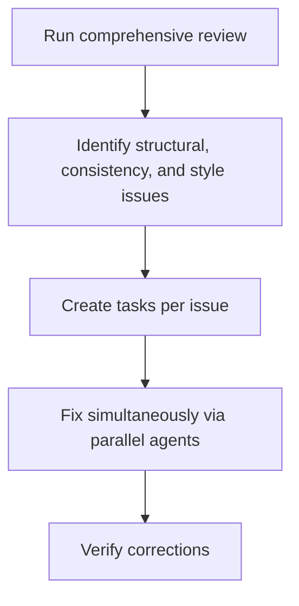
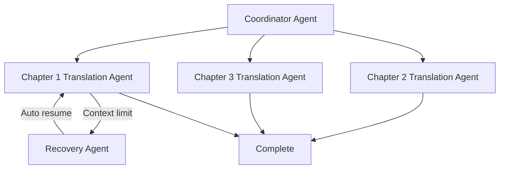

# Claude Code /insights Review: What 4,516 Messages Reveal About My AI Coding Patterns

"Am I really using Claude Code effectively?"

I use these tools daily, and I still couldn't answer that cleanly. Then I stumbled onto `/insights`, a tucked-away Claude Code feature that diagnoses your workflow from your actual usage data.

What follows is the full output from running it on a real project, plus the patterns I noticed and the tips I started using the same week.

## What Is /insights?

`/insights` is a usage pattern analysis feature introduced in Claude Code v2.1. It analyzes locally stored usage data to provide:

- <strong>Usage statistics</strong>: Message counts, session counts, file modification history
- <strong>What's working</strong>: Features and patterns you're using effectively
- <strong>What's hindering</strong>: Bottlenecks reducing your productivity
- <strong>Improvement suggestions</strong>: Practical tips you can apply immediately
- <strong>Project area analysis</strong>: How you're using the tool across different tasks

Think of it as a "health checkup for your AI coding workflow." Running it is simple. Just type `/insights` in Claude Code.

## My Results: Core Metrics

> <strong>Analysis period</strong>: 2025-12-31 to 2026-02-03 (~35 days)
> <strong>Environment</strong>: Claude Code v2.1.31

### Usage at a Glance

| Metric | Value |
|--------|-------|
| Total messages | <strong>4,516</strong> |
| Total sessions | <strong>1,042</strong> |
| Files modified | <strong>6,267</strong> |
| Code changes | <strong>+1,046,046 / -109,155 lines</strong> |
| Active days | <strong>15</strong> |
| Daily average messages | <strong>301.1</strong> |

The numbers alone are impressive. Exchanging an average of 301 messages per day with Claude Code essentially means full-time AI pair programming. The 1M+ lines of code additions include novel projects and blog content generation.

### Top 6 Tools Used

```
Read     ████████████████████████████ 11,798 times
Edit     ████████████████████████   10,068 times
Bash     ████████████████         6,334 times
Write    ████████████             3,465 times
Grep     ██████                   2,059 times
TodoWrite ██████                  1,825 times
```

Read and Edit dominate by a wide margin. Claude reads and comprehends the existing code thoroughly, then makes changes. Understand first, modify second. TodoWrite landing in the Top 6 surprised me, since it points to heavy use of parallel agents and task orchestration.

### Language Distribution

| Language | Usage Count | Share |
|----------|------------|-------|
| Markdown | 5,862 | 39.5% |
| TypeScript | 4,540 | 30.6% |
| Rust | 2,096 | 14.1% |
| JavaScript | 1,406 | 9.5% |
| JSON | 678 | 4.6% |
| YAML | 304 | 2.0% |

Markdown ranks first because blog posts and novel content account for a significant portion of the work. TypeScript and Rust combined make up about 45% of the total, showing that actual development work is also very active.

## "What's Working" Analysis

Here are the three strengths `/insights` identified.

### 1. Parallel Agents and Task Orchestration

```
TodoWrite: 1,825 times
TaskCreate: 1,276 times
Total: 4,751 times (TodoWrite + TaskCreate + TaskUpdate)
```

For large-scale tasks, I always create a task list first, then distribute it to parallel agents. `/insights` evaluated this as a "sophisticated workflow." See AI Agent Collaboration Patterns: Building a Full-Stack App with 5 Specialized Agents for concrete examples of this multi-agent approach in practice.

Real-world examples:
- <strong>Novel project</strong>: Comprehensive review → issue identification → parallel multi-file fixes
- <strong>Blog generation</strong>: Korean writing → parallel translation to Japanese/English/Chinese
- <strong>Code refactoring</strong>: Issue analysis → task distribution → simultaneous fixes

The core principle is "plan first, execute in parallel."

### 2. Custom Slash Commands

Creating custom slash commands like `/write-post` to automate repetitive tasks also received high praise. Writing a single blog post takes 10+ steps: research, Korean drafting, three-language translation, image generation, metadata updates. Encoding all of that into one command was flagged as a strength. [EffiFlow Part 2: Skills Auto-Discovery and 58% Token Savings with Caching](/en/blog/en/effiflow-automation-analysis-part2) shows how this command structure translates to caching efficiency.

> "Converting complex multi-step content generation into a repeatable one-command operation"
> — /insights analysis result

### 3. Two-Phase Pattern for Japanese Novels

The workflow used in the Japanese novel project was also positively evaluated:


```mermaid
graph TD
    A[Run comprehensive review] --> B[Identify structural, consistency, and style issues]
    B --> C[Create tasks per issue]
    C --> D[Fix simultaneously via parallel agents]
    D --> E[Verify corrections]
```

The phrase "one-person AI publishing house" stuck with me. Find the plot holes. Check character names for consistency. Verify the style holds across chapters. Then fix every issue across multiple files in parallel. That's the workflow.

## "What's Hindering" Analysis

It's not all good news. `/insights` also points out problems with clear-eyed objectivity.

### Context Limits Were the Biggest Bottleneck

> "Context limits caused the most ambitious sessions to terminate mid-execution"

This was the biggest issue, occurring frequently in these tasks:

- <strong>Novel reviews</strong>: Interrupted during multi-volume comprehensive reviews
- <strong>Translation work</strong>: Cut off mid-execution during large-scale translations
- <strong>Blog content generation</strong>: Terminated during initial read/setup phases

The root cause was <strong>"assigning too-large tasks to a single session."</strong> The desire to solve everything at once was actually creating inefficiency.

### Error Pattern Analysis

| Error Type | Count |
|------------|-------|
| Command Failed | 533 |
| File Too Large | 293 |
| Other | 151 |
| File Changed | 62 |
| Edit Failed | 37 |
| File Not Found | 32 |

The 293 "File Too Large" errors stem from large text files in the novel project. Seeing this data made the need for file-splitting strategies very clear.

## "Quick Wins" Analysis

The Quick Wins suggested by `/insights` were highly practical.

### 1. Introducing Checkpointing

> "Run translations and content generation with chapter/section checkpointing in headless mode"

To solve the problem of long-running tasks breaking mid-execution, you need to save progress to a file after completing each stage. This way, even if a session terminates, the next one can pick up where it left off.

```markdown
<!-- .claude/task-status.md example -->
## Blog Post Writing Progress
- [x] Research complete
- [x] Korean draft written
- [ ] Japanese translation
- [ ] English translation
- [ ] Chinese translation
- [ ] Metadata update
```

### 2. Structured Checkpoint Files

> "Formalize the TodoWrite/TaskCreate pattern into structured checkpoint files"

I was already using TodoWrite 4,751 times, but the suggestion was to evolve this into more systematic file-based checkpoints. The key is state sharing between sessions.

### 3. Auto-Resume Design

> "Design new sessions to detect and resume incomplete tasks"

The idea is to add a "Long-Running Tasks" section to CLAUDE.md, explicitly specifying rules to always save intermediate progress to files during long tasks. When approaching context limits, record a summary of completed/pending tasks in `.claude/task-status.md`.

## Project Area Analysis

`/insights` also provides detailed analysis by task type.

### Japanese Novel & Quality Review (~3 sessions)

Publication quality assessment, design consistency review, and multi-volume comprehensive reviews were performed. Systematically identifying structural, consistency, and style issues then fixing them in parallel is essentially automating the publishing industry's proofreading process with AI.

### Novel Translation: Japanese to Korean (~1 session)

Translation work leveraging Claude Code's parallel agent capabilities. Processing chapters in parallel increased speed, but context limit issues caused some session interruptions.

### Blog Content Generation (~2 sessions)

Blog post generation through the custom `/write-post` command. An automated pipeline that takes research files as input and generates content in 4 languages, though context was sometimes exhausted during initial setup phases.

### TypeScript & Rust Development

TypeScript at 4,540 times and Rust at 2,096 times were the most active development areas. JavaScript (1,406 times), HTML, CSS, and JSON work were also included. This shows broad utilization from web frontend to systems programming.

### Multi-File Issue Fixing & Maintenance (~48 sessions)

This area saw 51 multi-file changes. Extensive use of TodoWrite and task management tools, with parallel agents performing systematic reviews and bulk fixes. This accounts for the largest share of total sessions.

## Time-of-Day Usage Pattern

```
Morning (06-12)  ████████           419 (9.3%)
Afternoon (12-18) █████████████████████████████████ 1,644 (36.4%)
Evening (18-24)  ██████████████████████████████████ 1,675 (37.1%)
Late night (00-06) ████████████████   778 (17.2%)
```

Work clearly clusters in the afternoon and evening. That 17% in the late-night band leans on something AI is uniquely good at: being a tireless coding partner well past midnight.

The user response time data is also interesting:

| Metric | Value |
|--------|-------|
| Median | 155.0 seconds |
| Mean | 368.1 seconds |
| Most frequent range | 2-5 minutes (621 occurrences) |

The median response time of about 2.5 minutes represents the time spent reviewing Claude's response and issuing the next instruction. This reflects a "human-supervised AI work" pattern rather than full automation.

## Suggestions for the Future

`/insights` also proposed workflows worth trying going forward.

### Self-Healing Parallel Translation Pipeline


```mermaid
graph TD
    A[Coordinator Agent] --> B[Chapter 1 Translation Agent]
    A --> C[Chapter 2 Translation Agent]
    A --> D[Chapter 3 Translation Agent]
    B -->|Context limit| E[Recovery Agent]
    E -->|Auto resume| B
    C --> F[Complete]
    D --> F
    B --> F
```

A "fire-and-forget" pattern where a recovery agent automatically resumes when context limits are reached. Currently, sessions need to be manually restarted, but adopting this pattern would enable complete automation.

### Novel Quality Verification Test Cases

There was also the idea of automatically verifying novel quality like a CI pipeline:

- Character name consistency tests
- Timeline verification tests
- Style guide compliance tests

Just as code has unit tests, introducing automated quality verification for creative writing is a refreshingly innovative concept.

## Practical Tips

Here are the lessons learned through `/insights`.

### What You Can Apply Right Now

1. <strong>Always break large tasks into smaller ones</strong>: Don't cram everything into a single session. Split by chapter, section, or module.

2. <strong>Save checkpoints to files</strong>: Create a file like `task-status.md` to record progress. Even if a session drops, you can continue from where you left off.

3. <strong>Create custom slash commands</strong>: If you have repetitive tasks, encode them as commands like `/write-post`. Build once, reuse forever.

4. <strong>Actively use parallel agents</strong>: The `TodoWrite` → `TaskCreate` pattern for distributing work dramatically improves efficiency.

### Getting the Most Out of /insights

1. <strong>Run it regularly</strong>: Running `/insights` about once a month lets you track changes in your work patterns.

2. <strong>Reflect improvements in CLAUDE.md</strong>: Recording improvements suggested by `/insights` in CLAUDE.md means Claude Code will automatically follow those rules. Claude Code Best Practices covers official recommendations applied to real projects in detail.

3. <strong>Watch for error patterns</strong>: If you see many "File Too Large" or "Command Failed" errors, your workflow needs adjustment.

4. <strong>Use the HTML report</strong>: `/insights` also generates a detailed HTML report. Visualized data enables deeper analysis.

## Why I Recommend This to Other Developers

The biggest takeaway from running `/insights` was realizing that <strong>"I didn't know how I was using AI, yet assumed I was using it well."</strong>

Data-based objective diagnosis delivers these values:

- <strong>Discovering hidden bottlenecks</strong>: Without recognizing the context limit issue, I would have repeated the same mistakes.
- <strong>Reinforcing effective patterns</strong>: Confirmation that parallel agent usage is genuinely effective builds confidence.
- <strong>Concrete improvement directions</strong>: Instead of "use it better," you get specific action items like "introduce checkpointing."

I recommend running `/insights` to every developer using AI coding tools. It takes 5 minutes to run, but the insights you gain can fundamentally transform your future workflows.

## It Turned Out to Be a Coach, Not a Dashboard

Claude Code `/insights` is not just a statistics feature. It works more like an <strong>AI workflow coach</strong>, showing how you collaborate with AI coding tools through data and pointing to concrete improvements.

4,516 messages, 1,042 sessions, 6,267 file modifications. What those numbers tell me isn't simply "I used it a lot." It's "here's how I'm using it, and here's where small changes would make it better."

If you haven't run `/insights` yet, open Claude Code right now and type `/insights`. Objectively confronting your AI coding patterns is the first step to becoming a better developer.

## References

- [Claude Code Official Documentation](https://docs.anthropic.com/en/docs/claude-code)
- [Claude Code Best Practices](https://docs.anthropic.com/en/docs/claude-code/best-practices)
- [Claude Code CLI Migration Guide](/en/blog/claude-code-cli-migration-guide)
