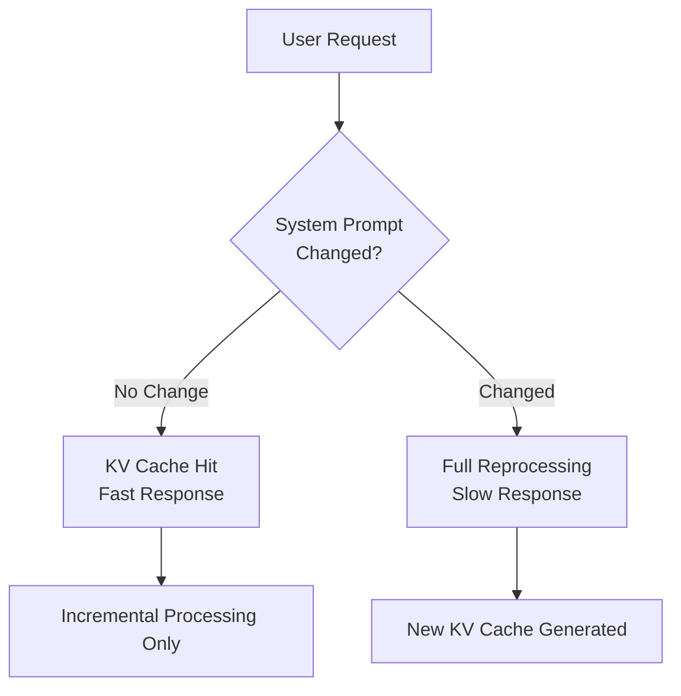
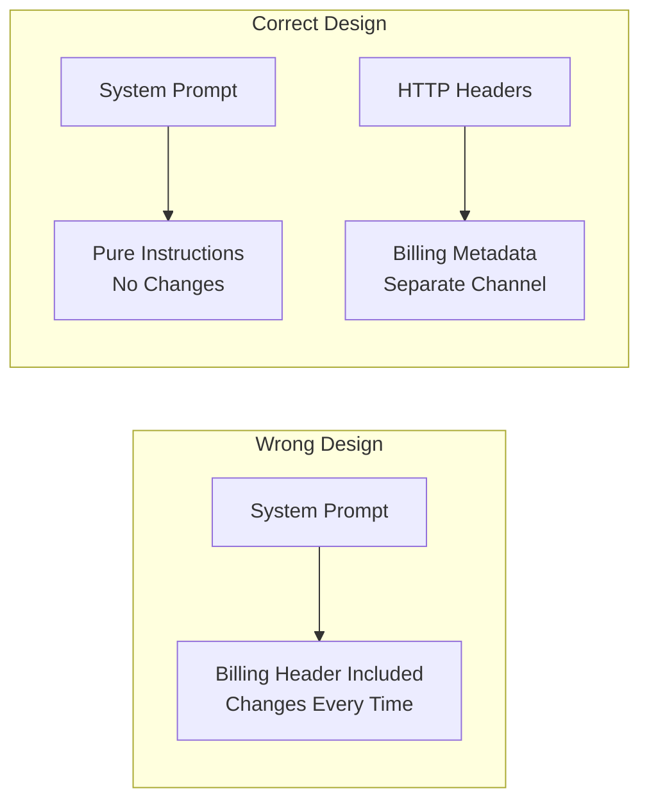

## Overview

Claude Code is Anthropic's CLI-based AI coding assistant. While it works seamlessly through the official API, running it with local LLMs or third-party proxies causes a <strong>full prompt reprocessing on every single request</strong> — a serious inefficiency. This issue was recently reported on the Reddit r/LocalLLaMA community and garnered significant attention.

In this article, we analyze the technical root cause, its performance impact, and the solution.

## The Core Problem: x-anthropic-billing-header

Claude Code internally embeds a billing header in the system prompt:

```
x-anthropic-billing-header: cc_version=2.1.39.c39; cc_entrypoint=cli; cch=56445;
```

The values in this header <strong>change with every request</strong>. While the official Anthropic API handles this header separately, local models and third-party proxies render it as part of the system prompt text.

### KV Cache Invalidation Mechanism

In LLM inference, the <strong>KV (Key-Value) cache</strong> is essential for performance optimization. It stores computation results from previous requests and reuses them for subsequent requests with the same prefix.



When the billing header value changes every time, the entire system prompt is perceived as modified, causing <strong>complete KV cache invalidation</strong>. As a result, thousands to tens of thousands of tokens in the system prompt and conversation history are reprocessed from scratch.

## Performance Impact Analysis

### Cost on Local LLMs

The impact of KV cache invalidation is particularly severe on local model execution:

| Metric | KV Cache Active | KV Cache Invalidated |
|--------|----------------|---------------------|
| System Prompt Processing | First request only | Every request |
| Conversation Context Processing | Incremental only | Full reprocessing |
| VRAM Usage | Stable | Spike-and-release cycles |
| Response Latency | 0.5–2 seconds | 10–30+ seconds |
| GPU Compute Cost | Low | Very high |

Claude Code's system prompt can reach tens of thousands of tokens. Combined with conversation history, each request ends up reprocessing hundreds of thousands of tokens. On local GPUs, this results in <strong>response times increasing by 10x or more</strong>.

### Cost with API Proxies

The same issue occurs when connecting to other models (e.g., GPT-4, Gemini) through third-party API proxies. When caching is invalidated on APIs that support prompt caching, <strong>token costs multiply several times over</strong>.

## Solution

### Environment Variable Configuration

The simplest fix is disabling the billing header. Add the following to your `~/.claude/settings.json`:

```json
{
  "env": {
    "CLAUDE_CODE_ATTRIBUTION_HEADER": "0"
  }
}
```

This removes the billing header from the system prompt, allowing the KV cache to function properly.

### Verifying the Fix

After applying the setting, verify the following:

1. <strong>Improved response speed</strong>: Response times should decrease significantly from the second request onward
2. <strong>Stable VRAM</strong>: GPU memory usage fluctuations should be reduced
3. <strong>Log verification</strong>: Confirm that the billing header no longer appears in the system prompt

## Architecture Design Lessons

This issue goes beyond a simple bug — it provides <strong>important lessons for developer tool design</strong>.

### 1. Separate Metadata from Content

Billing information, telemetry data, and other metadata should be clearly separated from prompt content. HTTP headers, separate API parameters, or out-of-band channels are the correct approach.



### 2. Cache-Friendly Design

When designing LLM-based tools, <strong>prompt cache friendliness</strong> must be a priority:

- Don't place frequently changing elements at the beginning of prompts
- Structurally separate static and dynamic content
- Minimize elements that affect cache keys

### 3. Third-Party Compatibility

Even if something works fine with the official API, designs should account for third-party environment compatibility — especially for tools actively used by the open-source community.

## The Bigger Picture: Future of LLM Developer Tools

This case highlights challenges facing the LLM developer tool ecosystem:

- <strong>Vendor lock-in</strong>: Tools optimized for specific APIs perform inefficiently in other environments
- <strong>Lack of transparency</strong>: Undisclosed internal architectures make debugging difficult
- <strong>Community dependence</strong>: User communities discover and share solutions themselves

Moving forward, developer tools should aim for <strong>model-agnostic design</strong>, increase transparency of internal operations, and officially support diverse execution environments.

## Conclusion

The full prompt reprocessing issue in Claude Code with local models can be resolved by setting the `CLAUDE_CODE_ATTRIBUTION_HEADER` environment variable to `"0"`. However, the implications extend far beyond this fix.

When developing or operating LLM-based tools, <strong>cache efficiency, metadata separation, and third-party compatibility</strong> should be considered from the earliest design stages. The fact that a single small header can dramatically alter an entire system's performance is a powerful reminder of the importance of meticulous architecture design.

## References

- [Reddit r/LocalLLaMA — Claude Code with local models: full prompt reprocessing](https://www.reddit.com/r/LocalLLaMA/comments/1r47fz0/claude_code_with_local_models_full_prompt/)
- [claude-code-router Issue #1161 — x-anthropic-billing-header validation error](https://github.com/musistudio/claude-code-router/issues/1161)
- [Anthropic Prompt Caching Documentation](https://docs.anthropic.com/en/docs/build-with-claude/prompt-caching)
