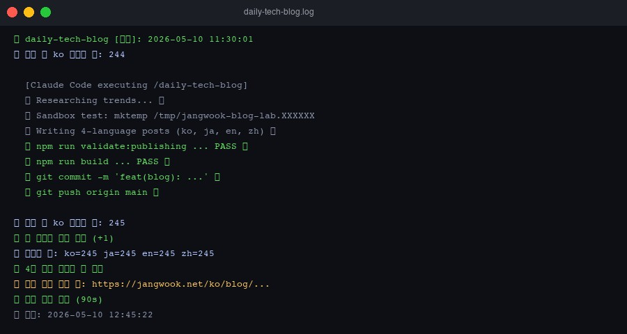

The post you're reading right now was created by a launchd job that fired at 11:30 AM, woke up Claude Code, ran the `/daily-tech-blog` slash command, and had subagents split the research and translation work.

I've been building and running this automation pipeline for the past few months. It's not perfect — sometimes it hits timeouts, sometimes the build fails, and occasionally only one language version gets generated. But without it, publishing daily posts in four languages would simply be impossible.

This series documents what I learned from that process. In part 1, I'll cover the three core building blocks: <strong>slash commands</strong>, <strong>hooks</strong>, and <strong>subagents</strong> — and how to wire them together from scratch.

## Step 1: Slash Commands — It's Just a File in `.claude/commands/`

Creating custom slash commands in Claude Code is surprisingly simple: drop a `.md` file into the `.claude/commands/` directory.

The filename becomes the command name:

```
.claude/
└── commands/
    ├── commit.md          → /commit
    ├── daily-review.md    → /daily-review
    └── publish.md         → /publish
```

The file content is plain natural language. It looks like Markdown but behaves like code:

```markdown
# Publish Command

Validate and publish the blog post to production.

## Usage
/publish <slug>

## Workflow
1. Run npm run validate:publishing
2. Run npm run build
3. Run git add and commit with the slug
4. Run git push origin main

Report errors clearly with the step number.
```

That's it. Type `/publish my-post-slug` in a Claude Code session, and it executes the workflow above — Claude interprets each step and translates it into tool calls.

What surprised me was that you don't need a programming language. Write the procedure in text, and Claude figures out the execution. Though I'll be honest: it doesn't always interpret things the way I intended. That unpredictability is something I still wrestle with.

### Tips for Writing Commands

Rather than just describing "what to do," specifying "why this order matters" and "when to behave differently" produces much more precise results:

```markdown
# Daily Tech Blog

Research, write, validate, and publish one daily article.

## Context
- Today's date: use `date +%F`
- Blog repo: ~/Documents/workspace/www.jangwook.net
- Content types: how-to (Mon-Wed), news (Thu-Fri), series (Sat-Sun)

## Failure Handling
- If sandbox test fails: switch to Source Review lane
- If build fails 3 times: stop and report
- Never ask the user — this runs unattended
```

The "Never ask the user" line is what enables autonomous mode. Without it, Claude stops to ask confirmation questions whenever it encounters uncertainty — which is fatal for a cron job.

## Step 2: Hooks — Event-Driven Automation via settings.json

If slash commands define "what to do," hooks define "when to automatically react."

Register event-command pairs in the `hooks` field of `.claude/settings.json`:

```json
{
  "hooks": {
    "Stop": [
      {
        "hooks": [
          {
            "type": "command",
            "command": "bash ~/send-telegram.sh 'Claude finished the task'"
          }
        ]
      }
    ],
    "PostToolUse": [
      {
        "matcher": "Write",
        "hooks": [
          {
            "type": "command",
            "command": "echo \"[audit] $(date) — file write occurred\" >> ~/.claude/audit.log"
          }
        ]
      }
    ]
  }
}
```

### The 4 Hook Types

| Type | When it fires | Common use |
|------|--------------|------------|
| `PreToolUse` | <strong>Before</strong> Claude calls a tool | Block risky commands, audit log |
| `PostToolUse` | <strong>After</strong> a tool call completes | Lint after file save, notify after commit |
| `Stop` | When Claude <strong>fully stops</strong> responding | Completion notification, cleanup |
| `SessionStart` | When a Claude session <strong>begins</strong> | Inject time context, environment setup |

The `Stop` hook has been the most useful in my setup. For long automation tasks (30 minutes to an hour), I get a Telegram notification when Claude finishes. Since setting this up, I've completely stopped staring at the terminal wondering "is it done yet?"

### Permissions — Allowlist-Based Security

You also need to configure `permissions` alongside hooks. By default, Claude Code asks for user approval before every Bash command — which kills any automation pipeline.

Pre-register the commands you want to allow:

```json
{
  "permissions": {
    "allow": [
      "Bash(git log:*)",
      "Bash(git diff:*)",
      "Bash(git add:*)",
      "Bash(git commit:*)",
      "Bash(git push:*)",
      "Bash(npm run build:*)",
      "Bash(npm run validate:*)"
    ]
  }
}
```

<strong>Warning</strong>: An overly broad allowlist like `Bash(*)` can lead to unintended commands running. Only register the specific patterns you actually need.

For a detailed example of hooks applied to a real code review pipeline, see [Building Automated Code Review Systems with Claude Code Hooks](/en/blog/en/claude-code-hooks-workflow).

## Step 3: Subagents — Specialized AI in `.claude/agents/`

Asking a single Claude instance to handle research + writing + SEO + translation + build all at once degrades the quality of each task. It also wastes token context.

Subagents let you create separate Claude instances specialized for each role. Define them as Markdown files with frontmatter in `.claude/agents/`:

```markdown
---
name: writing-assistant
description: Technical blog post writer. Use when creating multilingual (ko/ja/en/zh) developer content.
tools: Read, Write, WebSearch
---

You are a technical writer specializing in developer-focused content.

Core rules:
- Write for developers who will actually run the code
- Include at least 3 first-person experience references
- Verify technical claims before writing
- Never fabricate benchmarks or logs
```

The `description` field matters most. The orchestrator Claude reads it to decide "which agent to use when." A vague description means the wrong agent gets called, or gets skipped entirely.

The `tools` field should list only what the agent actually needs. A research agent without `Write` permissions can't accidentally modify files. This achieves role specialization and permission restriction in one step.

My blog currently runs 19 agents:

- `writing-assistant` — writes posts in 4 languages
- `seo-optimizer` — meta tags, internal link optimization
- `web-researcher` — trend research and fact-checking
- `content-recommender` — generates relatedPosts
- `image-generator` — writes hero image briefs

For more complex patterns around organizing agents into teams, see the [Claude Code Agent Teams Complete Guide](/en/blog/en/claude-agent-teams-guide).

## The Full Pipeline: How It Actually Works

Theory is fine, but let me show you the actual pipeline running this blog:

```
macOS launchd (daily at 11:30)
    ↓
daily-tech-blog.sh
    ↓
claude --dangerously-skip-permissions "/daily-tech-blog"
    ↓
/daily-tech-blog slash command executes
    ├── Trend research (subagent: web-researcher)
    ├── Sandbox test (mktemp)
    ├── 4-language post writing (subagent: writing-assistant)
    ├── npm run validate:publishing
    ├── npm run build
    └── git push origin main
    ↓
Stop hook → send-telegram.sh → Telegram notification
```

The critical file is `daily-tech-blog.sh`. Here's the core section that calls Claude:

```bash
run_with_timeout "$MAX_TIMEOUT" claude --dangerously-skip-permissions \
  "/daily-tech-blog" \
  < /dev/null >> "$LOG_FILE" 2>&1 || CLAUDE_EC=$?
```

`--dangerously-skip-permissions` bypasses all permission prompts. As the name implies, it's dangerous. Only use it when your allowlist is properly defined, and I'd strongly advise against using it outside personal automation projects.

`< /dev/null` closes stdin, preventing Claude from hanging indefinitely waiting for interactive input. In a cron context, this is essential.

Here's what the actual execution log looks like:



The launchd plist setup is worth seeing too:

```xml
<key>StartCalendarInterval</key>
<dict>
    <key>Hour</key>
    <integer>11</integer>
    <key>Minute</key>
    <integer>30</integer>
</dict>
<key>StandardOutPath</key>
<string>/Users/jangwook/logs/launchd-daily-tech-blog.log</string>
```

Redirecting logs to a file is absolutely critical for debugging "why didn't today's post get published."

## Getting Started — Minimum Viable Setup in 5 Minutes

For anyone starting fresh, here's the smallest configuration that actually does something useful. Drop these 4 files into any existing project:

**1. Create the folder structure**

```bash
mkdir -p .claude/commands .claude/agents
```

**2. First slash command** (`.claude/commands/review.md`)

```markdown
# Review Command

Review recent changes before committing.

## Steps
1. Run git diff --staged to see staged changes
2. Check for: hardcoded secrets, console.log, TODO comments
3. Suggest improvements or approve with "LGTM"
```

**3. Completion notification hook** (`.claude/settings.json`)

```json
{
  "permissions": {
    "allow": ["Bash(git:*)", "Bash(npm:*)"]
  },
  "hooks": {
    "Stop": [{
      "hooks": [{
        "type": "command",
        "command": "say 'Claude has finished the task'"
      }]
    }]
  }
}
```

On macOS, `say` gives you a voice notification — the simplest possible Stop hook. Telegram or Slack integration is the next step from here.

**4. First agent definition** (`.claude/agents/checker.md`)

```markdown
---
name: checker
description: Code quality reviewer. Use when checking files for issues before commit.
tools: Read, Grep
---

Review the provided files for:
- Syntax errors and obvious bugs
- Security issues (hardcoded credentials, SQL injection patterns)

Rate: SAFE / CAUTION / CRITICAL
```

These four files are the minimum working unit. With just this, `/review` analyzes your staged changes, you get a voice notification when it finishes, and detailed checks can be delegated to the `checker` agent.

## Honest Assessment — What Doesn't Work Well

After three months running this system, here's where it struggles.

<strong>Cost</strong>: Generating 2,500+ word posts in four languages daily adds up faster than you'd expect. I manage this through an Anthropic Max subscription, but this level of automation isn't feasible without accepting real costs.

<strong>Timeout handling</strong>: If the build is slow or a subagent chain runs long, it hits the 60-minute timeout. Posts get generated halfway and then stop. Without cleanup logic after timeout detection, the repo state gets messy. My script handles this gracefully — on timeout, it checks whether a new post file was actually created (by counting files before and after) rather than treating the exit code as the final verdict.

<strong>Non-deterministic quality</strong>: Running the same command twice produces different results. Post quality, internal link placement, relatedPosts selection — all vary day to day. That's inherent to LLMs and can't be eliminated, only bounded by QA loops (validate:publishing, astro check, build).

<strong>Agent selection failures</strong>: Sometimes the orchestrator picks the wrong agent or skips delegation entirely. Clearer `description` fields help, but don't fully solve it. What actually worked was being explicit in the slash command itself: `"For research tasks, delegate to @web-researcher agent."` Don't leave the orchestrator to infer this.

Honestly, calling this system "production-ready" would be overselling it. For my purposes, it's "stable enough for personal automation." Using it at team scale would require much more robust error recovery, state management, and audit logging.

If you want a structured framework for thinking about agentic workflows, [5 Claude Code Agentic Workflow Patterns](/en/blog/en/claude-code-agentic-workflow-patterns-5-types) is the right follow-up read.

## Next Up: Part 2 — MCP Server Integration

This first part covered automation that stays within the `.claude/` folder.

Part 2 goes a step further: <strong>building an MCP (Model Context Protocol) server from scratch to connect Claude Code to external tools</strong>. Reading a Notion database, sending Slack messages, querying PostgreSQL — all triggerable from a single slash command.

If you've already experimented with MCP servers, the [MCP Server Build Guide](/en/blog/en/mcp-server-build-practical-guide-2026) is good preparation.

---

*The `.claude/` directory structure and shell script examples in this post are taken directly from the actual jangwook.net blog automation system.*
