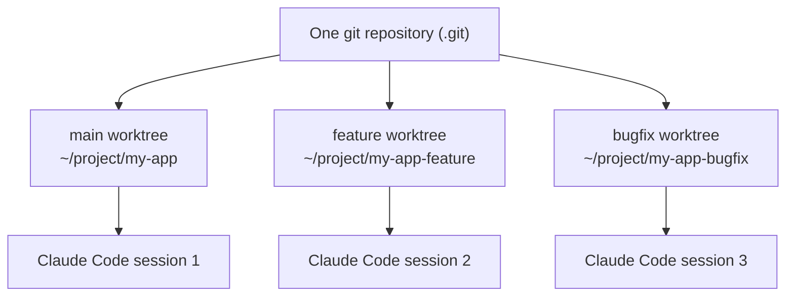

Having multiple Claude Code tabs open feels like parallel work. It isn't.

Run two Claude Code sessions on the same branch simultaneously, and the moment one session modifies a file, the other session's context gets corrupted. Mismatched file states, unexpected merge conflicts, no way to track which session did what. I had to experience this firsthand before I took git worktree seriously.

The short version: **git worktree + Claude Code works far more naturally than you'd expect**. The setup isn't complicated either. Everything here is backed by primary sources: Git's official [git-worktree](https://git-scm.com/docs/git-worktree) reference, the Claude Code docs page on [Run parallel sessions with worktrees](https://code.claude.com/docs/en/worktrees), and the [Common workflows](https://code.claude.com/docs/en/common-workflows) guide that collects everyday recipes.

## What Git Worktree Actually Is

Git worktree lets you check out multiple branches simultaneously into separate directories, all from a single git repository. It's been built into git since 2016, yet it remains surprisingly underused. As the [official documentation](https://git-scm.com/docs/git-worktree) puts it, the command "manages multiple working trees attached to the same repository." Each working tree carries its own `HEAD` and index.

One key distinction: switching branches (`git checkout`) replaces the files in your working directory. With worktrees, each branch lives in its **own separate physical directory**.

```bash
# Old way: switching branches replaces files
git checkout feature/new-login  # your entire working dir gets swapped out

# Worktree way: directories are physically separate
git worktree add ../project-feature feature/new-login  # separate directory
```

Why does this matter for Claude Code? Because **you can run an independent Claude Code session in each worktree directory**. No file conflicts. No context contamination.

A picture makes the structure click.



## Setting It Up

Assume your project lives at `~/project/my-app`.

```bash
# 1. Confirm your starting point
cd ~/project/my-app
git status  # main branch, clean state

# 2. Add worktrees (matching branch names to directory names helps)
git worktree add ../my-app-feature feature/add-oauth
git worktree add ../my-app-bugfix fix/login-redirect

# 3. Verify
git worktree list
```

Output:

```
/Users/jangwook/project/my-app         abc1234 [main]
/Users/jangwook/project/my-app-feature def5678 [feature/add-oauth]
/Users/jangwook/project/my-app-bugfix  ghi9012 [fix/login-redirect]
```

Three directories, **one shared git repository**, each checking out a different branch. The `.git` folder lives in the original; the others have a `.git` file that points to it.

## Launching Parallel Claude Code Sessions

Open a separate terminal for each directory and start Claude Code.

```bash
# Terminal 1: main work
cd ~/project/my-app
claude

# Terminal 2: OAuth feature development
cd ~/project/my-app-feature
claude

# Terminal 3: login bug fix
cd ~/project/my-app-bugfix
claude
```

Each session is fully independent. If Terminal 2 modifies `src/auth/oauth.ts`, Terminal 3's Claude Code doesn't know. It's a different branch's file.

If you've already gone through Claude Code Best Practices, this pattern slots in naturally.

### The `--worktree` flag: do it in one step

Beyond the manual route above (`git worktree add`, then `cd`, then `claude`), Claude Code bundles worktree creation and session startup into a single command. Per the official docs ([Worktrees](https://code.claude.com/docs/en/worktrees)), passing `--worktree` (or `-w`) creates a worktree under `.claude/worktrees/<name>/` at your repo root, on a new `worktree-<name>` branch, and starts Claude inside it.

```bash
# Create the worktree and start a session in one line
claude --worktree feature-auth

# A second isolated session in another terminal, different name
claude --worktree bugfix-123

# Omit the name and Claude generates one like bright-running-fox
claude --worktree
```

By default it branches from the remote's default branch (`origin/HEAD`), so you start from a clean tree. One thing to watch: a worktree is a fresh checkout, so untracked files like `.env` or `.env.local` don't come along. Drop a `.worktreeinclude` file (using `.gitignore` syntax) in your project root and those files get copied into each new worktree automatically. It's also worth adding `.claude/worktrees/` to your `.gitignore`.

On exit, if you made no changes the worktree and its branch are removed automatically; if commits or uncommitted changes remain, Claude asks whether to keep or remove it. Worktrees you create manually are excluded from this auto-cleanup, so you remove those yourself with `git worktree remove`.

## Using Plan Mode for Task Distribution

Effective parallel sessions require **planning first, then distributing**. Opening multiple sessions without a plan doesn't buy you much.

Here's the pattern I use:

**Step 1: Use Plan Mode in the main session to map the work**

In the main directory's Claude Code session, enable Plan Mode (`Shift+Tab` or `/plan`) and analyze the full scope of work.

```
Me: This sprint I need to add OAuth login, fix the login redirect bug,
    and update the API docs. I want to run these in separate worktrees
    in parallel. How should I split them up?

Claude: [analyzes file dependencies across tasks, identifies potential conflict points]
```

**Step 2: Give each worktree specific, bounded context**

Based on the Plan Mode output, give each session clear, scoped instructions. Vague instructions give Claude Code room to touch files you didn't intend.

```bash
# In the my-app-feature session
Me: This is the feature/add-oauth branch. Focus only on src/auth/
    and add Google OAuth support. You don't need to touch anything else.
```

**Step 3: Merge in the main session when done**

```bash
git merge feature/add-oauth
git merge fix/login-redirect
```

## Real Example: Three Concurrent Tasks

Here's a case I actually ran recently. In a blog project:

- `main`: day-to-day content management (keeping the deployed state stable)
- `feature/recommendation-v4`: improving the content recommendation algorithm
- `fix/og-image-path`: fixing an OG image path bug

Without worktrees, hitting the OG image bug mid-feature-development would have meant either switching branches or stashing. With worktrees, I just moved to the other terminal and fixed it immediately.

Setting up Claude Code Hooks for automated review lets you attach hooks that update context automatically on worktree switches — a nice complement to this pattern.

## Gotchas and Real Limitations

### Shared Resources

`package.json`, `package-lock.json`, and `node_modules/` aren't shared between the original and worktrees. You may need to run `npm install` separately in each worktree, especially when a feature branch adds new packages.

### Database Port Conflicts

If multiple worktrees try to spin up dev servers that connect to a local database on the same port, you'll hit conflicts. Either configure different ports in each worktree's `.env.local`, or share the database while running migrations from only one worktree.

### Cleanup

Delete worktrees when you're done, or `.git/worktrees/` grows quietly in the background.

```bash
# After merging the branch
git worktree remove ../my-app-feature

# Force remove (even with uncommitted changes)
git worktree remove --force ../my-app-feature

# Clean up stale references
git worktree prune
```

### Honest Assessment

I like this pattern, but it's not universal. It works best when your tasks touch different files. If two sessions both need to modify the same component, you'll end up with more merge conflicts, not fewer. And once you're managing more than three sessions, tracking what each one has done starts generating its own overhead.

Pairing this with multi-agent PR review lets you automatically review the PR from each worktree branch. For team-scale use, that combination has been the most practical setup I've found. The official docs go a step further and show how to isolate subagents in their own worktrees: add `isolation: worktree` to a custom subagent's frontmatter, and each agent gets a temporary worktree that's removed automatically when it finishes without changes. [If you've built out agent teams before](/en/blog/en/claude-agent-teams-guide), you'll immediately feel how much this isolation cuts down on parallel-work collisions.

## When to Use It, When to Avoid It

I won't pretend this pattern fits everywhere. In practice, some situations clearly benefit and others actively backfire.

**Where parallel worktrees help:**

- When tasks touch **different files and directories**. If OAuth lives in `src/auth/` and the bug fix lives in `src/routes/`, merge conflicts are nearly nonexistent.
- When an **urgent hotfix** lands mid-task. No stash, no branch switch — fix it in another terminal and return to your original work.
- When you want to **try several approaches** to the same code. Spin up two directories and compare which one wins.
- When you want to **isolate** subagents or background jobs and keep your main checkout clean.

**Where you're better off avoiding them:**

- When two tasks both need to edit the **same component or file**. Here a worktree adds conflicts rather than removing them. Do it sequentially instead.
- Once you're past **three sessions**. The overhead of tracking what each one has done starts eating into the time you saved. Start with two.
- For work where **shared state order matters** — database migrations against one local DB, for example. Running them at once tangles your data.
- For a quick one-line fix where the **setup cost outweighs the task** itself.

The whole decision compresses to one question: are the tasks independent at the file level? If yes, worktrees shine. If not, don't split them. Read alongside the prompt-distribution principles from [Claude Code Masterclass Part 1](/en/blog/en/claude-code-masterclass-series-1-prompt-to-agent) and it gets easier to judge which work to break apart and how.

The criteria in one table:

| Situation | Parallel worktrees? |
|---|---|
| Tasks touch different files and directories | Good fit |
| Urgent hotfix alongside a long-running task | Good fit |
| Comparing multiple approaches to the same code | Good fit |
| Two tasks modify the same files | Poor fit — go sequential |
| Four or more sessions | Poor fit — tracking overhead |
| Order-sensitive shared state such as a local DB | Poor fit |
| Tiny fix where isolation costs more than the work | Poor fit |

## Quick Reference

```bash
# Create a worktree
git worktree add <path> <branch>
git worktree add <path> -b <new-branch>  # create branch and check it out

# List all worktrees
git worktree list

# Remove a worktree
git worktree remove <path>
git worktree prune  # clean up references to already-deleted directories
```

## Start With Two, Then Scale Up

Honestly, my first reaction was "is this really worth the setup?" After using it once, I reach for it naturally whenever I need to parallelize work.

The core idea is simple: **independent branch → independent directory → independent Claude Code session**. When those three align, sessions don't interfere with each other.

Start with two worktrees, get comfortable with the pattern, then expand to three. If you want to push further into structured multi-agent patterns, [the Claude Code Agent Teams guide](/en/blog/en/claude-agent-teams-guide) is the natural next step.
