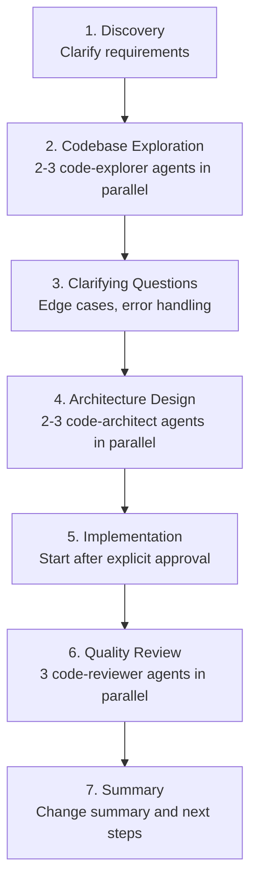

## Overview

Claude Code is an agentic coding tool developed by Anthropic. Through its plugin system, you can **install slash commands, specialized agents, skills, and hooks as a single package**.

This post provides an in-depth analysis of the **13 official plugins**, over **100 community marketplace plugins**, and the **actual plugin structure**.

> **★ Insight**
>
> - 13 Official Plugins: Managed in the anthropics/claude-code repository
> - Community Marketplaces: 100+ plugins across 13 categories
> - Plugin Structure: commands/, agents/, skills/, hooks/, .mcp.json

## Installing Plugins

### Adding Marketplaces

Claude Code uses a Git repository-based marketplace system.

```bash
# Add community marketplaces
/plugin marketplace add ccplugins/awesome-claude-code-plugins
/plugin marketplace add kivilaid/plugin-marketplace
/plugin marketplace add ananddtyagi/cc-marketplace

# List registered marketplaces
/plugin marketplace list
```

### Installing Plugins

```bash
# Basic installation
/plugin install commit-commands

# Install from a specific marketplace
/plugin install ultrathink@cc-marketplace

# List installed plugins
/plugin list

# Interactive installation (menu-driven)
/plugin
```

> **★ Insight**
>
> - Minimum version requirement: Claude Code 1.0.33+
> - Storage location: Project level (.claude/) or user level (~/.claude/)
> - Development mode: Test locally with `cc --plugin-dir /path/to/plugin`

## Deep Dive into 13 Official Plugins

Official plugins from the [anthropics/claude-code](https://github.com/anthropics/claude-code/tree/main/plugins) repository managed by Anthropic.

### 1. commit-commands - Git Workflow Automation

```bash
/plugin install commit-commands
```

**3 Commands Provided**:

| Command             | Function                                                                      |
| ------------------- | ----------------------------------------------------------------------------- |
| `/commit`         | Analyzes changes and auto-generates commit messages matching repository style |
| `/commit-push-pr` | Branch creation → Commit → Push → PR creation in one go                    |
| `/clean_gone`     | Cleans up local branches deleted from remote, including worktrees             |

**How `/commit` Works**:

1. Check changes with `git status`
2. Analyze staged/unstaged changes with `git diff`
3. Understand recent commit style with `git log`
4. Generate commit message matching repository conventions
5. Exclude sensitive files like `.env`, `credentials.json`

**How `/commit-push-pr` Works**:

1. Automatically creates new branch if on main
2. Analyzes **entire commit history** of branch (not just latest commit)
3. Auto-generates PR description (Summary + Test plan)
4. Creates PR via GitHub CLI (`gh`) and returns URL

```bash
# Usage example
git add .
/commit
# → Suggests "feat(auth): add JWT validation middleware"
# → Approve? [Y/n]
```

### 2. feature-dev - 7-Phase Feature Development Workflow

```bash
/plugin install feature-dev
```

**7-Phase Structured Workflow**:



**3 Specialized Agents**:

| Agent              | Role                                                                                  |
| ------------------ | ------------------------------------------------------------------------------------- |
| `code-explorer`  | Traces execution paths, analyzes architecture layers, generates essential file lists  |
| `code-architect` | Designs multiple approaches: minimal changes / clean architecture / pragmatic balance |
| `code-reviewer`  | Focused reviews on simplicity/DRY, bugs/correctness, conventions/abstractions         |

```bash
# Usage example
/feature-dev Add OAuth login with Google
# → Proceeds through 7 phases, user confirmation at each step
```

**When to Use?**

- New features spanning multiple files
- Complex tasks requiring architecture decisions
- Features with unclear requirements

### 3. code-review - Confidence-Based Automated PR Review

```bash
/plugin install code-review
```

**How It Works**:

1. Auto-skips closed/draft/trivial/already-reviewed PRs
2. Collects CLAUDE.md guideline files
3. Runs **4 parallel agents**:
   - Agent #1, #2: CLAUDE.md compliance (duplicate verification)
   - Agent #3: Bug detection (within PR change scope only)
   - Agent #4: Git blame history analysis
4. Assigns **confidence score (0-100)** to each issue
5. **Filters out scores below 80** (removes false positives)

**Confidence Score Criteria**:

| Score | Meaning                                   |
| ----- | ----------------------------------------- |
| 0     | No confidence, likely false positive      |
| 25    | Some confidence, might be real            |
| 50    | Moderate confidence, real but minor       |
| 75    | High confidence, real and important       |
| 100   | Absolute confidence, definitely a problem |

```bash
# Terminal output
/code-review

# Post as PR comment
/code-review --comment
```

**Filtered False Positives**:

- Issues that existed before the PR
- Issues linters can catch
- General quality issues (if not in CLAUDE.md)
- Code with lint ignore comments

### 4. hookify - Create Hooks Without Coding

```bash
/plugin install hookify
```

**4 Commands Provided**:

| Command                    | Function                                                  |
| -------------------------- | --------------------------------------------------------- |
| `/hookify [description]` | Create hooks with natural language                        |
| `/hookify` (no args)     | Analyze conversation to auto-discover patterns to improve |
| `/hookify:list`          | List active rules                                         |
| `/hookify:configure`     | Enable/disable rules                                      |

**Hook File Format** (`.claude/hookify.*.local.md`):

```yaml
---
name: block-dangerous-rm
enabled: true
event: bash
pattern: rm\s+-rf
action: block  # warn or block
---

⚠️ **Dangerous rm command detected!**

This command could delete important files.
- Verify the path is correct
- Make sure you have backups
```

**Event Types**:

- `bash`: On Bash command execution
- `file`: On Edit/Write tool usage
- `stop`: When Claude tries to end work
- `prompt`: On user prompt submission
- `all`: All events

```bash
# Usage example
/hookify Warn me when console.log is used in TypeScript files
# → Creates .claude/hookify.warn-console-log.local.md
```

### 5. plugin-dev - 8-Phase Plugin Development Tool

```bash
/plugin install plugin-dev
```

**8-Phase Plugin Creation Workflow**:

1. **Discovery**: Understand plugin purpose and requirements
2. **Component Planning**: Decide on skills/commands/agents/hooks/MCP needed
3. **Detailed Design**: Detailed design for each component
4. **Structure Creation**: Create directories and manifest
5. **Component Implementation**: AI-assisted implementation
6. **Validation**: plugin-validator and component-specific checks
7. **Testing**: Real-world testing in Claude Code
8. **Documentation**: Finalize README and prepare for distribution

**7 Core Skills**:

| Skill               | Trigger Keywords                   | Content                                      |
| ------------------- | ---------------------------------- | -------------------------------------------- |
| Hook Development    | "create a hook", "PreToolUse hook" | Prompt/command hooks, all event types        |
| MCP Integration     | "add MCP server", ".mcp.json"      | stdio/SSE/HTTP/WebSocket server setup        |
| Plugin Structure    | "plugin.json manifest"             | Standard directory structure, auto-discovery |
| Plugin Settings     | ".local.md files"                  | Per-project settings, YAML frontmatter       |
| Command Development | "create a slash command"           | Command structure, argument handling         |
| Agent Development   | "create an agent"                  | Agent frontmatter, system prompts            |
| Skill Development   | "create a skill"                   | SKILL.md, progressive disclosure             |

```bash
# Usage example
/plugin-dev:create-plugin Database migration management plugin
# → 8-phase guide proceeds
```

### 6. frontend-design - Auto-Activating UI Design Skill

```bash
/plugin install frontend-design
```

A skill that **auto-activates** during frontend work.

**Core Principles**:

- **Bold aesthetic choices**: Avoid generic AI styles
- **Distinctive typography and color palettes**
- **High-impact animations and visual details**
- **Context-aware implementation**

```bash
# Auto-activation examples
"Create a dashboard for a music streaming app"
"Build a landing page for an AI security startup"
# → frontend-design skill auto-applies
```

### 7. pr-review-toolkit - 6 Specialized Review Agents

```bash
/plugin install pr-review-toolkit
```

**6 Specialized Agents**:

- Comment reviewer
- Test reviewer
- Error handling reviewer
- Type reviewer
- Code quality reviewer
- Comprehensive reviewer

```bash
/pr-review-toolkit:review-pr
```

### 8. security-guidance - Security Warning Hook

```bash
/plugin install security-guidance
```

**9 Security Patterns Monitored**:

- Injection attacks
- XSS (Cross-site scripting)
- SQL injection
- Command injection
- Path traversal
- Insecure deserialization
- Sensitive data exposure
- Weak cryptography
- Authentication/authorization flaws

Real-time warnings **before tool execution** via PreToolUse hook.

### Other Official Plugins

| Plugin                        | Description                                           |
| ----------------------------- | ----------------------------------------------------- |
| `agent-sdk-dev`             | Claude Agent SDK development kit (`/new-sdk-app`)   |
| `claude-opus-4-5-migration` | Auto-migration to Opus 4.5                            |
| `explanatory-output-style`  | Educational insights about implementation choices     |
| `learning-output-style`     | Learning mode requesting 5-10 line code contributions |
| `ralph-wiggum`              | Self-referential AI loops for iterative development   |

## Community Marketplace Analysis

### Major Marketplaces

| Marketplace                                                                                    | Plugin Count    | Features                            |
| ---------------------------------------------------------------------------------------------- | --------------- | ----------------------------------- |
| [ccplugins/awesome-claude-code-plugins](https://github.com/ccplugins/awesome-claude-code-plugins) | 100+            | 13 categories, largest scale        |
| [kivilaid/plugin-marketplace](https://github.com/kivilaid/plugin-marketplace)                     | 87+             | Strong in document processing tools |
| [ananddtyagi/cc-marketplace](https://github.com/ananddtyagi/cc-marketplace)                       | Dynamic updates | Live database integration           |
| [ivan-magda/claude-code-marketplace](https://github.com/ivan-magda/claude-code-marketplace)       | Swift-focused   | Swift 6 migration, iOS development  |

### Key Plugins by Category (ccplugins)

**Workflow Orchestration (8)**:

- `ultrathink`: Coordinator directing 4 specialized sub-agents
- `lyra`: Master-level AI prompt optimization expert
- `problem-solver-specialist`: Systematic problem solving

**Code Quality & Testing (16)**:

- `bug-detective`: Step-by-step systematic debugging
- `double-check`: Dual verification of changes
- `test-writer-fixer`: Test writing and fixing
- `unit-test-generator`: Automatic unit test generation
- `database-performance-optimizer`: DB performance optimization

**Git Workflow (14)**:

- `fix-github-issue`: Auto-fix based on GitHub issues
- `create-pr`: PR creation automation
- `update-branch-name`: Branch name convention enforcement
- `husky`: Git hook setup

**Documentation (8)**:

- `analyze-codebase`: Comprehensive codebase analysis
- `changelog-generator`: Auto-generate changelogs
- `update-claudemd`: Auto-update CLAUDE.md
- `openapi-expert`: OpenAPI spec expert

**Security & Compliance (7)**:

- `audit`: Codebase security audit
- `enterprise-security-reviewer`: Enterprise-grade security review
- `legal-compliance-checker`: Legal compliance verification
- `data-privacy-engineer`: Data privacy

**Development Engineering (15)**:

- `ai-engineer`: AI feature development specialist
- `backend-architect`: Backend architecture design
- `flutter-mobile-app-dev`: Flutter mobile apps
- `react-native-dev`: React Native development

### kivilaid Marketplace Specialized Tools

**Document Processing Suite**:

- `xlsx`: Excel generation with formulas and data visualization
- `docx`: Word documents with change tracking and formatting
- `pptx`: PowerPoint with layouts and templates
- `pdf`: PDF extraction, merging, splitting, form processing

**Creative & Design**:

- `algorithmic-art`: p5.js-based generative art
- `canvas-design`: PNG/PDF visual art generation
- `slack-gif-creator`: Animated GIFs for Slack

**davila7 Toolkit (10)**:

- Git workflow, Supabase, Next.js/Vercel
- Testing, security audit, AI/ML, DevOps
- Document generation, performance optimization, project management

## Plugin Structure Details

### Standard Directory Structure

```
my-plugin/
├── .claude-plugin/
│   └── plugin.json              # Plugin metadata (required)
├── commands/                    # Slash commands
│   ├── command-name.md
│   └── another-command.md
├── agents/                      # Autonomous agents
│   ├── agent-name.md
│   └── another-agent.md
├── skills/                      # Reusable skills
│   ├── skill-name/
│   │   ├── SKILL.md
│   │   ├── references/
│   │   ├── examples/
│   │   └── scripts/
├── hooks/                       # Event hooks
│   ├── hooks.json
│   └── my-hook.sh
├── .mcp.json                    # MCP server configuration (optional)
└── README.md
```

### plugin.json Example

```json
{
  "name": "my-team-plugin",
  "version": "1.0.0",
  "description": "Team development workflow plugin",
  "commands": ["commands/"],
  "agents": ["agents/"],
  "skills": ["skills/"],
  "hooks": ["hooks/"]
}
```

### Command File Format (YAML frontmatter + Markdown)

```markdown
---
description: "Performs code review"
argument-hint: "[--comment]"
allowed-tools:
  - Read
  - Grep
  - Bash
---

# Code Review Command

## Instructions
1. Analyze changes in current branch
2. Check CLAUDE.md guidelines
3. Report issues with confidence scores
...
```

### Agent File Format

```markdown
---
name: code-explorer
description: |
  An agent that deeply analyzes codebases.

  <example>
  User: "Trace how authentication flow works"
  → code-explorer is invoked
  </example>
model: sonnet
color: blue
tools:
  - Read
  - Grep
  - Glob
---

# System Prompt

You are a codebase exploration expert...
```

### Skill SKILL.md Format

```markdown
---
description: |
  Frontend UI design skill.

  <trigger_phrases>
  - "create a dashboard"
  - "landing page design"
  - "UI component generation"
  </trigger_phrases>
auto_invoke: true
---

# Frontend Design Skill

## Core Principles
1. Avoid generic AI styles
2. Bold aesthetic choices
...
```

### .mcp.json MCP Server Configuration

```json
{
  "mcpServers": {
    "postgresql": {
      "command": "npx",
      "args": ["-y", "@modelcontextprotocol/server-postgres"],
      "env": {
        "DATABASE_URL": "${DATABASE_URL}"
      }
    },
    "browser": {
      "type": "sse",
      "url": "https://mcp.example.com/browser",
      "headers": {
        "Authorization": "Bearer ${API_KEY}"
      }
    }
  }
}
```

**MCP Server Types**:

- `stdio`: Local process (most common)
- `sse`: Server-Sent Events (hosting/OAuth)
- `http`: REST API
- `websocket`: Real-time bidirectional

## Plugin Management Commands

```bash
# Install
/plugin install <name>
/plugin install <name>@<marketplace>

# Uninstall
/plugin uninstall <name>

# List
/plugin list

# Update
/plugin update <name>
/plugin update --all

# Marketplace management
/plugin marketplace add <owner/repo>
/plugin marketplace remove <name>
/plugin marketplace list

# Interactive menu
/plugin
```

## Recommended Plugin Combinations by Scenario

### Starting a New Project

```bash
/plugin install commit-commands     # Git workflow
/plugin install hookify             # Enforce team conventions
/plugin install security-guidance   # Security warnings
```

### Focused Feature Development

```bash
/plugin install feature-dev         # 7-phase workflow
/plugin install frontend-design     # UI auto-skill (for frontend)
```

### Automating Code Reviews

```bash
/plugin install code-review         # Confidence-based review
/plugin install pr-review-toolkit   # 6 specialized agents
```

### Plugin Development

```bash
/plugin install plugin-dev          # 8-phase development guide
```

## Important Considerations

### Trust Verification

- Official plugins: Managed in `anthropics/claude-code` repository
- Community plugins: Requires direct code review
- Plugins can access local filesystem

### Version Requirements

```bash
# Requires Claude Code 1.0.33+
claude --version
```

### MCP Server Authentication

```bash
# Set API keys via environment variables
export DATABASE_URL="postgresql://..."
export API_KEY="sk-..."
```

## Summary

The Claude Code plugin system provides a rich ecosystem of **13 official plugins** and **100+ community plugins**.

`<strong>`Key Takeaways`</strong>`:

| Purpose                        | Recommended Plugin                       |
| ------------------------------ | ---------------------------------------- |
| Git Workflow Automation        | commit-commands (official)               |
| Feature Development Automation | feature-dev (official, 7-phase)          |
| Code Review Automation         | code-review (official, confidence-based) |
| Custom Rule Creation           | hookify (official, no-coding)            |
| Security Warnings              | security-guidance (official)             |
| Plugin Development             | plugin-dev (official, 8-phase)           |
| UI Design                      | frontend-design (official, auto)         |
| Document Processing            | xlsx, docx, pptx, pdf (kivilaid)         |
| Comprehensive Orchestration    | ultrathink (ccplugins)                   |

## References

- [Claude Code Official Plugins](https://github.com/anthropics/claude-code/tree/main/plugins)
- [Claude Code Plugin Documentation](https://code.claude.com/docs/en/discover-plugins)
- [ccplugins/awesome-claude-code-plugins](https://github.com/ccplugins/awesome-claude-code-plugins)
- [kivilaid/plugin-marketplace](https://github.com/kivilaid/plugin-marketplace)
- [ananddtyagi/cc-marketplace](https://github.com/ananddtyagi/cc-marketplace)
- [claudemarketplaces.com](https://claudemarketplaces.com/)
