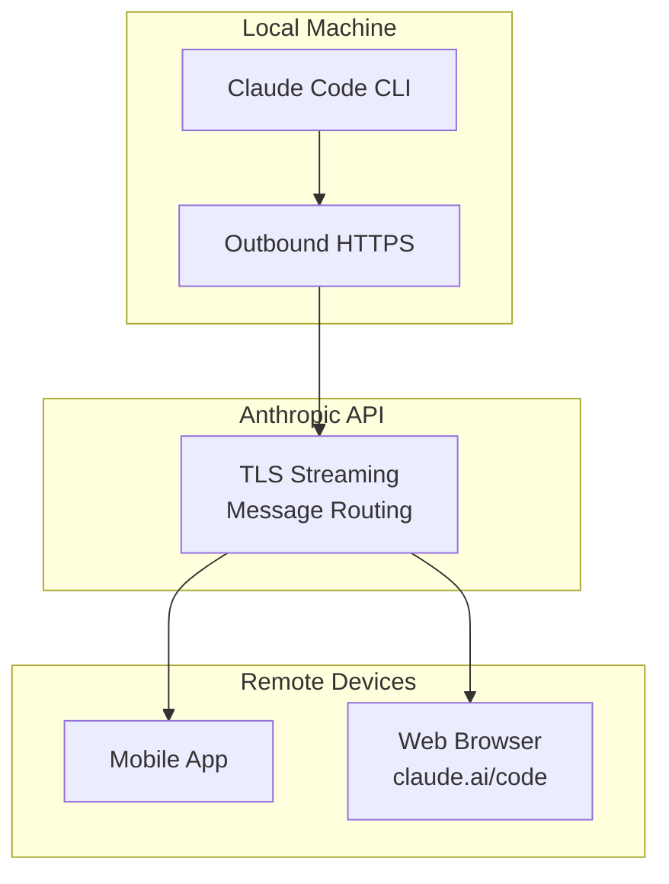
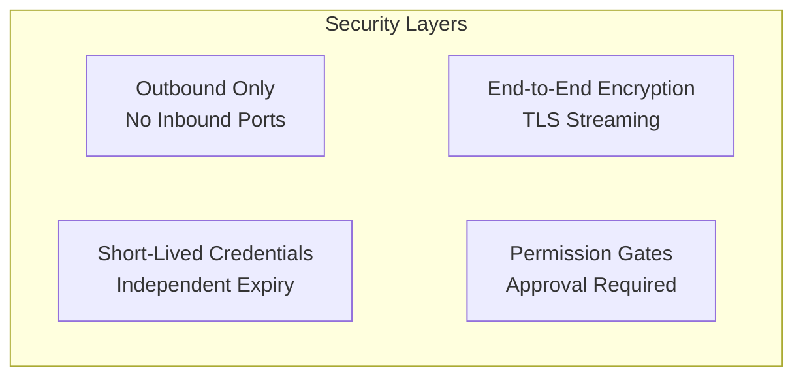

## What Is Remote Control?

Claude Code Remote Control lets you <strong>control a Claude Code session running on your local machine from a mobile app or web browser</strong>. It was released as a research preview on February 25, 2026.

Here are the key points.

- Your code and development environment <strong>stays 100% local</strong>
- Mobile/web acts purely as a <strong>remote controller</strong>
- You can monitor tasks started on your desktop from the couch, or send instructions from a meeting room



## Setup Methods

### Method 1: Global Setting (Recommended)

To automatically enable Remote Control for all sessions, use the `/config` command.

```bash
# Inside a Claude Code session
/config
```

Select <strong>"Enable Remote Control for all sessions"</strong> from the settings menu. All subsequent Claude Code sessions will automatically have Remote Control enabled.

### Method 2: Per-Session Activation

To enable Remote Control only for a specific session:

```bash
# Inside an active session
/remote-control

# Or the shorthand
/rc
```

### Method 3: Start Directly from CLI

```bash
# Start a new Remote Control session
claude remote-control

# With detailed logs
claude remote-control --verbose

# Run in sandbox mode
claude remote-control --sandbox
```

## Connecting from a Remote Device

Once Remote Control is active, you can connect in three ways.

### QR Code Scan (Fastest)

Press the spacebar in the terminal to display a QR code. Scan it with the Claude mobile app for instant connection.

### Copy Session URL

Copy the session URL displayed in the terminal and paste it into a browser on another device. It opens on `claude.ai/code`.

### Select from Session List

Open `claude.ai/code` or the Claude mobile app to see your active sessions with a green status indicator.

> <strong>Tip</strong>: If you run multiple sessions, use `/rename` to give each one a meaningful name. It makes finding the right session much easier on remote devices.

## Network Architecture and Security

Remote Control's security design follows these principles.



### Core Security Features

| Feature | Description |
|---------|-------------|
| <strong>Outbound Only</strong> | Only uses outgoing connections from local machine, no inbound ports opened |
| <strong>End-to-End Encryption</strong> | All traffic encrypted with TLS |
| <strong>Short-Lived Credentials</strong> | Each credential is scoped to a single purpose and expires independently |
| <strong>Anthropic Can't See Your Code</strong> | Code stays local and never passes through Anthropic servers |
| <strong>Permission Gates</strong> | Every tool execution requires explicit approval |

### Session URL Security

Treat session URLs <strong>like passwords</strong>. Anyone with the URL can control your local session. Never share them unintentionally.

## Practical Use Cases

### Scenario 1: Monitoring Long Refactoring Jobs

Start a large refactoring task on your desktop and check progress from your phone while grabbing lunch.

```bash
# On your desktop
/rename "api-refactoring"
/rc

# → Scan QR code with your phone
# → Monitor progress in real time
# → Send additional instructions from mobile if needed
```

### Scenario 2: Code Fixes During Meetings

When a bug report comes in during a meeting, send fix instructions without going back to your desk.

```bash
# On the mobile app, connected to your desktop session:
"The token validation logic in src/api/auth.ts is missing expiry checks. Please fix it."
```

### Scenario 3: Test Suite Monitoring

Run your test suite and check results remotely, like a personal CI pipeline.

```bash
# Start tests on your desktop
"Run the full test suite and report only failures"

# → Move to the couch
# → Check test results on mobile
# → Send fix instructions for failing tests
```

### Scenario 4: Multi-Project Management

Manage multiple project sessions by giving each a descriptive name.

```bash
# Name each project session
/rename "frontend-nextjs"
/rename "backend-api"
/rename "infra-terraform"

# On mobile: browse session list → select project → send instructions
```

## CLI Integration Commands

Useful CLI options that work alongside Remote Control.

```bash
# Create a new web session
claude --remote "Fix the login bug"

# Transfer a web session to local terminal
claude --teleport

# Resume a previous session by name
claude --resume "api-refactoring"

# Show mobile app download QR code
/mobile
```

## Limitations and Considerations

As a research preview, there are some limitations to be aware of.

| Limitation | Details |
|------------|---------|
| <strong>Single Remote Connection</strong> | Only one remote connection per session |
| <strong>Terminal Must Stay Open</strong> | The `claude remote-control` process must keep running |
| <strong>Network Timeout</strong> | Session auto-terminates after ~10 minutes of network disconnection |
| <strong>Plan Restrictions</strong> | Max plan first, Pro plan rollout coming soon |
| <strong>Approval Required</strong> | Cannot be bypassed even with `--dangerously-skip-permissions` |
| <strong>Early Stability</strong> | Occasional API 500 errors may occur |

## Managing Session Defaults with `/config`

The `/config` command manages various settings beyond Remote Control. Here are the Remote Control-related options.

```bash
/config

# Among the displayed settings:
# ✅ Enable Remote Control for all sessions
#    → Auto-enables for every new session
```

Once configured, you no longer need to type `/rc` each time — Remote Control activates automatically when you start a session.

## Community Alternative Solutions

Beyond the official Remote Control, community-built extensions offer additional capabilities.

| Project | Features |
|---------|----------|
| <strong>claude-agent-server</strong> | WebSocket server wrapper, E2B sandbox deployment |
| <strong>claude-code-server</strong> | Web UI for CLI commands, Socket.io real-time streaming |
| <strong>247 Claude Code Remote</strong> | Tailscale VPN + Fly.io VM, access from anywhere |

These projects aren't officially supported but are useful when you need scheduling or programmatic access.

## Conclusion

Claude Code Remote Control removes the constraint that you must be at your desk to code. Your code stays safely on your local machine while you can instruct and monitor your AI agent from anywhere.

Setup takes just one line with `/config`. While some instability is expected during the research preview phase, the core workflow is already practical enough for daily use.

<strong>Get started</strong>: Run `/config` in your terminal right now and enable "Enable Remote Control for all sessions."
