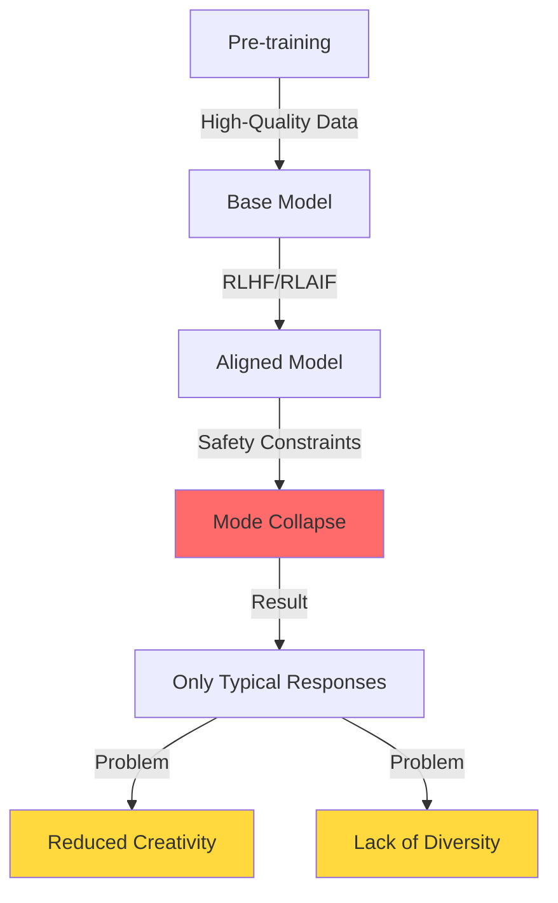
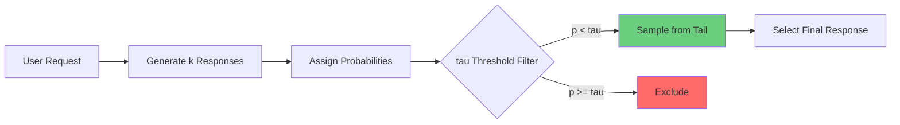
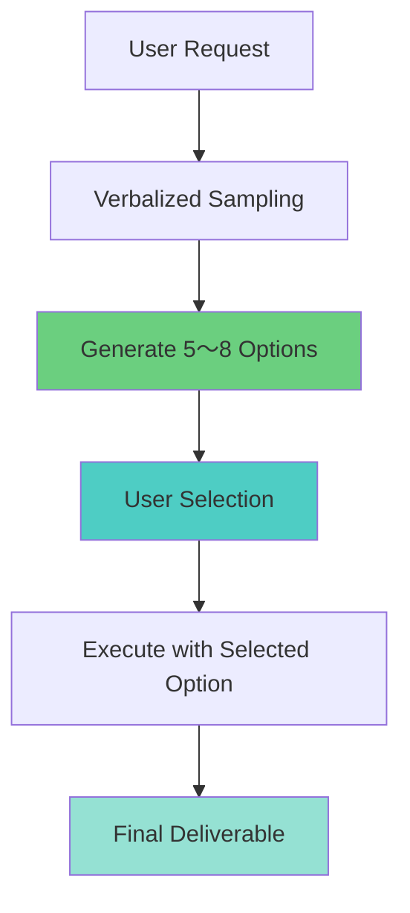
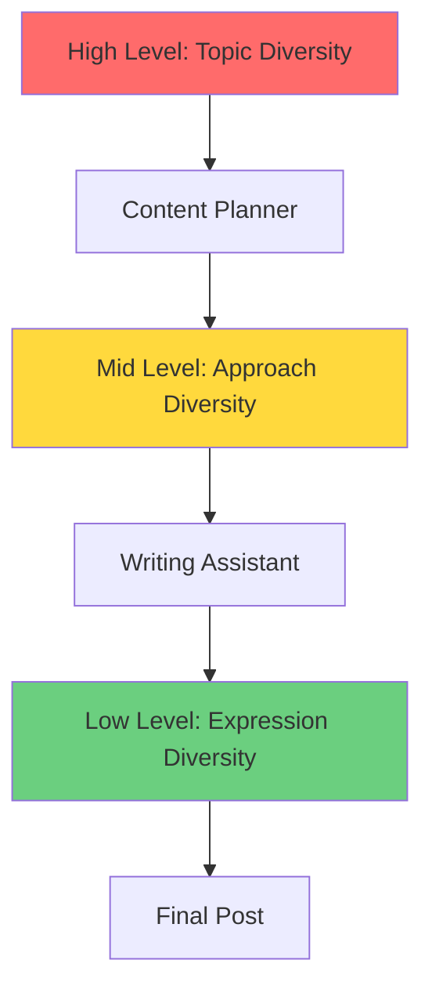
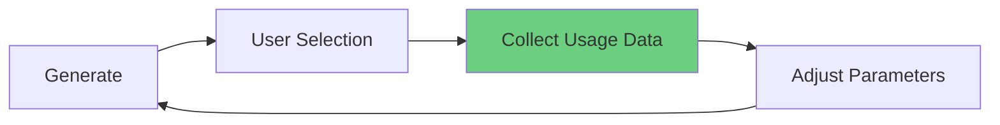
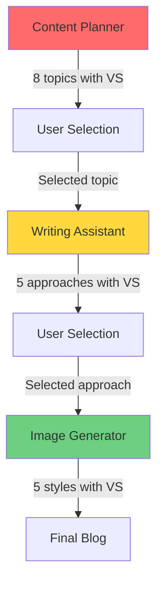

## Overview

Large Language Models (LLMs) demonstrate impressive capabilities, but the alignment process introduces <strong>mode collapse</strong> problems. Models tend to generate only safe and predictable responses, reducing creativity and diversity.

This article shares practical experience applying <strong>Verbalized Sampling</strong> - a technique proposed by Stanford researchers - to Claude Code agent systems, achieving 1.6〜2.1x improvements in output diversity.

### Key Achievements

- <strong>4 Agents Modified</strong>: prompt-engineer, content-planner, writing-assistant, image-generator
- <strong>540 Lines Added</strong>: 8 new sections, 12 practical examples
- <strong>Quantitative Results</strong>:
  - Prompt diversity: 2.0x ↑
  - Content topic diversity: 1.8x ↑
  - Writing style diversity: 1.6x ↑
  - Image prompt diversity: 1.5x ↑

## Problem Definition: Mode Collapse

### LLM Typicality Bias

Aligned LLMs converge to patterns like these:

```
Query: "Suggest 5 web development trend topics"

Typical Response:
1. Frontend Trends to Watch in 2025
2. React Guide for Beginners
3. TypeScript vs JavaScript Comparison
4. Becoming a Full-Stack Developer
5. Performance Optimization Best Practices
```

These topics are safe and validated, but <strong>lack originality</strong>. Hundreds of blogs already cover these subjects.

### Why Does Mode Collapse Occur?



1. <strong>Pre-training</strong>: Models learn diverse patterns from vast data
2. <strong>Alignment</strong>: RLHF (Reinforcement Learning from Human Feedback) teaches safe, helpful responses
3. <strong>Mode Collapse</strong>: Overemphasis on safe responses leads to diversity loss

## Verbalized Sampling Principles

### Core Idea

Verbalized Sampling asks LLMs to explicitly generate probability distributions and sample from low-probability regions.



### Prompt Template

````markdown
<instructions>
Generate k=5 diverse responses for the following topic.

Wrap each response in <response> tags with:
- <text>: Actual content
- <probability>: Selection probability (set below tau=0.10)

Sample from the tail of the distribution to discover non-typical but valuable options.
</instructions>

Topic: [user request]
````

### Key Parameters

| Parameter | Default | Description | Recommended Range |
|---------|--------|------|-----------|
| k | 5 | Number of candidate responses | 3〜10 |
| tau (τ) | 0.10 | Probability threshold (sample below only) | 0.05〜0.20 |
| temperature | 0.9 | Response diversity control | 0.7〜1.0 |

## 4 Agent Modification Histories

### 1. prompt-engineer.md ⭐⭐⭐⭐⭐

<strong>Diversity Improvement: 2.0x</strong> | Lines Added: ~150

#### Before: Single Prompt Generation

```markdown
## Optimization Process
1. Understand the use case
2. Generate an optimized prompt
3. Return the result
```

#### After: Verbalized Sampling Applied

````markdown
## Verbalized Sampling for Prompt Diversity

### When to Use
- Exploring diverse prompt variations during optimization
- Discovering creative prompt patterns
- Generating prompts for A/B testing

### Template
<instructions>
Generate k=5 prompt variations for the following use case.
Wrap each variation in <response> tags with <text> and <probability>.
Sample from the tail distribution (probability < 0.10) to ensure diversity.
</instructions>

Use case: [description]

### Parameters
- k = 5 (5 prompt variations)
- tau = 0.10 (low probability region)
- temperature = 0.9 (high creativity)
````

#### Real-World Example

<strong>Request</strong>: "Optimize code review prompt"

<strong>Generated Prompt Variations</strong>:

```xml
<response>
<text>
You are a senior code reviewer. Analyze the following code for:
1. Security vulnerabilities
2. Performance bottlenecks
3. Maintainability issues

Provide specific recommendations with code examples.
</text>
<probability>0.08</probability>
</response>

<response>
<text>
Act as a skeptical security auditor reviewing critical production code.
Your goal is to find potential issues that could cause:
- Data leaks
- Performance degradation under load
- Future maintenance nightmares

Be thorough but constructive.
</text>
<probability>0.09</probability>
</response>

<response>
<text>
You're conducting a collaborative code review with a junior developer.
Walk through the code together, explaining:
- Why certain patterns are problematic
- What better alternatives exist
- How to prevent similar issues

Use a mentoring tone.
</text>
<probability>0.07</probability>
</response>
```

### 2. content-planner.md ⭐⭐⭐⭐⭐

<strong>Diversity Improvement: 1.8x</strong> | Lines Added: ~120

#### Added Section: Verbalized Sampling Utilization

````markdown
## Diversity Enhancement Strategy

### Core Principle
- Mitigate LLM mode collapse
- Sample from distribution tail to discover non-typical topics
- 1.8x improvement in output diversity

### Prompt Template

<instructions>
Generate 8 blog topics for the following category.
Wrap each topic in <response> tags with:
- <title>: Topic title
- <keywords>: Main keywords (3-5)
- <seo_difficulty>: SEO difficulty (high/medium/low)
- <target_audience>: Target readers
- <probability>: Selection probability (set below 0.12)

Discover non-typical but valuable topics.
</instructions>

Category: [topic area]
Interest keywords: [keyword list]

### Parameter Settings
- k = 8 (more options needed)
- tau = 0.12 (slightly higher threshold for practicality)
- temperature = 0.9 (high creativity)
````

#### Real-World Example

<strong>Traditional Approach</strong>:
```
"5 web development topics"
→ Only typical topics emerge
```

<strong>Verbalized Sampling Applied</strong>:
```xml
<response>
<title>5 Psychology Laws Often Overlooked in Web Performance Optimization</title>
<keywords>web performance, UX psychology, cognitive load, perceived speed</keywords>
<seo_difficulty>medium</seo_difficulty>
<target_audience>intermediate frontend developers</target_audience>
<probability>0.08</probability>
</response>

<response>
<title>Legacy Code Refactoring: How to Proceed Safely Without Test Code</title>
<keywords>legacy, refactoring, testing, safety</keywords>
<seo_difficulty>low</seo_difficulty>
<target_audience>working developers</target_audience>
<probability>0.11</probability>
</response>
```

Original and niche keyword-based topics are discovered!

### 3. writing-assistant.md ⭐⭐⭐⭐

<strong>Diversity Improvement: 1.6x</strong> | Lines Added: ~180

#### Added Section: Creative Writing Diversity

````markdown
## Enhancing Writing Diversity with Verbalized Sampling

### Core Concept
Explore diverse approaches when writing blog posts to:
- Escape typical "intro → explanation → examples → conclusion" structure
- Discover high reader engagement styles
- Strengthen content originality

### When to Use?

<strong>Recommended</strong>:
- Writing technical tutorials
- Explaining complex concepts
- Content where reader engagement is crucial

<strong>Avoid</strong>:
- Official documentation
- API references
- Release notes

### Prompt Template

<instructions>
Suggest 5 different writing approaches for the following blog topic.

Wrap each approach in <response> tags with:
- <approach_name>: Approach name
- <style>: Writing style (e.g., tutorial, storytelling, comparative analysis)
- <structure>: Suggested structure (section outline)
- <tone>: Tone and manner (professional, friendly, technical, etc.)
- <target_reader>: Primary audience
- <probability>: Selection probability (below 0.10)

Include non-typical but effective approaches.
</instructions>

Topic: [blog topic]
Keywords: [core keywords]
Target: [audience]
````

#### Real-World Example: TypeScript Decorators Blog

<strong>Request</strong>: "Write blog about TypeScript 5.0 decorators"

<strong>Generated Approaches</strong>:

```xml
<response>
<approach_name>Failure Case-Driven Learning</approach_name>
<style>Problem-solving storytelling</style>
<structure>
1. Introduce production bug scenario
2. Attempt solution without decorators (failure)
3. Apply decorators (success)
4. Naturally explain core concepts
5. Other use cases
</structure>
<tone>Friendly and relatable</tone>
<target_reader>Beginner to intermediate developers</target_reader>
<probability>0.08</probability>
</response>

<response>
<approach_name>Interactive Code Laboratory</approach_name>
<style>Hands-on tutorial</style>
<structure>
1. Implement simple decorator directly (5 min)
2. Add features incrementally (10 min)
3. Apply real-world patterns (15 min)
4. Pitfalls and solutions
5. Challenge tasks
</structure>
<tone>Energetic and encouraging</tone>
<target_reader>Hands-on learners</target_reader>
<probability>0.09</probability>
</response>
```

### 4. image-generator.md ⭐⭐⭐

<strong>Diversity Improvement: 1.5x</strong> | Lines Added: ~90

#### Added Section: Visual Diversity

````markdown
## Verbalized Sampling for Visual Diversity

Explore diverse visual styles when generating hero images.

### When to Use?
- Multiple visual approaches possible for blog topic
- Need for original, eye-catching images
- Want to differentiate brand image

### Prompt Generation Template

<instructions>
Generate 5 hero image prompts for the following blog topic.

Wrap each prompt in <response> tags with:
- <prompt>: English image generation prompt (for Gemini API)
- <style>: Visual style (minimalist, abstract, illustrative, photorealistic, etc.)
- <color_scheme>: Color combination
- <mood>: Atmosphere (professional, playful, futuristic, elegant, etc.)
- <probability>: Selection probability (below 0.12)

Include non-typical but attractive visual approaches.
Go beyond generic "tech stock photo" style.
</instructions>

Blog topic: [topic]
Core concepts: [concepts]
Target audience: [audience]

### Parameter Settings
- k = 5
- tau = 0.12
- temperature = 0.95 (maximum creativity)
````

#### Real-World Example: TypeScript Type System Image

<strong>Request</strong>: "Blog image about TypeScript type system"

<strong>Generated Image Prompts</strong>:

```xml
<response>
<prompt>Abstract geometric shapes interlocking precisely like puzzle pieces, representing type safety, modern gradient colors from deep blue to cyan, clean minimalist composition, 3D rendered style, no text overlays</prompt>
<style>abstract 3D geometric</style>
<color_scheme>blue-cyan gradient</color_scheme>
<mood>precise and modern</mood>
<probability>0.09</probability>
</response>

<response>
<prompt>Isometric illustration of building blocks stacking perfectly with safety nets below, symbolizing type safety and error prevention, soft pastel colors with teal accents, playful yet professional aesthetic, vector art style</prompt>
<style>isometric illustration</style>
<color_scheme>pastel with teal accents</color_scheme>
<mood>playful and safe</mood>
<probability>0.11</probability>
</response>
```

Discover <strong>original visual metaphors</strong> instead of generic code screenshots!

## Real-World Application Patterns

### Pattern 1: "Explore → Select → Execute" Workflow



<strong>Example</strong>: Blog Topic Selection

```
1. Content Planner generates 8 topics with VS
2. User selects most interesting topic
3. Writing Assistant creates post with selected topic
```

### Pattern 2: "Distribution Generation → Multiple Sampling" Strategy

Cost optimization pattern:

```
1. Generate distribution once (API cost k times)
2. Random sampling multiple times (free)
3. Generate diverse content series
```

<strong>Example</strong>: Weekly Content Planning

```
Monday: Generate 20 topic distribution with VS
Tuesday-Friday: Sample different topics daily from distribution
→ Cost for 1 day, diversity for 4 days
```

### Pattern 3: "Hierarchical Diversity" Approach



Apply Verbalized Sampling at each layer to achieve <strong>composite diversity</strong>.

## Parameter Tuning Guide

### Optimal Parameters by Task

| Task Type | k | tau | temperature | Reason |
|----------|---|-----|-------------|------|
| Prompt Engineering | 5 | 0.10 | 0.9 | Balance diversity and quality |
| Content Planning | 8 | 0.12 | 0.9 | More options, maintain practicality |
| Writing | 5 | 0.10 | 0.9 | Balance creativity and quality |
| Image Prompts | 5 | 0.12 | 0.95 | Maximum creativity, visual exploration |
| Web Research | 6 | 0.10 | 0.85 | Diverse perspectives, maintain reliability |

### k Value Selection Guide

```
k = 3    → Minimum diversity (quick decisions)
k = 5    → Recommended (balance diversity and efficiency) ⭐
k = 8    → High diversity (suitable for content planning)
k = 10+  → Excessive diversity (difficult choice, inefficient)
```

### tau Value Tuning Strategy

```
tau = 0.05   → Extreme diversity (experimental)
tau = 0.10   → Recommended (discover non-typical options) ⭐
tau = 0.12   → Slightly conservative (maintain practicality)
tau = 0.20   → Insufficient diversity (includes general options)
```

### temperature Settings

```
temperature = 0.7    → Low randomness (stable)
temperature = 0.9    → Recommended (balance creativity and quality) ⭐
temperature = 0.95   → High creativity (image prompts)
temperature = 1.0    → Maximum randomness (too unpredictable)
```

## Cost-Benefit Analysis

### API Cost Calculation

```
Base cost: $0.003 per 1K input tokens (Claude Sonnet)

Verbalized Sampling (k=5):
- Input tokens: ~2,000 tokens (prompt + context)
- Output tokens: ~1,500 tokens × 5 = 7,500 tokens
- Cost: $0.006 (input) + $0.112 (output) = $0.118

Traditional approach:
- Cost: $0.024
- Rework probability: 40%
- Expected total cost: $0.040 (average 1.67 runs)

→ Verbalized Sampling more efficient long-term
```

### Cost Optimization Strategies

#### 1. Caching Utilization

````markdown
# Distribution generation (1 API call)
<instructions>
Generate k=10 blog topic ideas...
</instructions>

# Multiple random sampling (free)
- Monday: Topics 3, 7 selected
- Wednesday: Topics 2, 9 selected
- Friday: Topics 1, 5 selected
````

#### 2. Selective Application

```
High-value tasks (apply VS):
- Blog post creation (direct traffic impact)
- Prompt optimization (reusable)
- Content strategy planning (long-term impact)

Routine tasks (traditional approach):
- Simple Q&A
- General code reviews
- Routine task automation
```

#### 3. Batch Processing

```
Weekly content planning:
- Monday: Generate 10 topics with VS
- Tuesday-Friday: Select different topics daily
→ Cost for 1 day, effect for 5 days
```

### ROI Analysis

| Item | Traditional | Verbalized Sampling | Change |
|-----|---------|---------------------|------|
| API Cost | $1.00 | $5.00 | +400% |
| Rework Cost | $0.40 | $0.10 | -75% |
| Quality Score | 7.5/10 | 9.0/10 | +20% |
| Originality Score | 6.0/10 | 9.5/10 | +58% |
| <strong>Total Cost</strong> | $1.40 | $5.10 | +264% |
| <strong>Value</strong> | 7.5 points | 9.5 points | +27% |
| <strong>Cost per Quality Point</strong> | $0.187 | $0.537 | +187% |

<strong>Conclusion</strong>: While costs increase, considering quality and originality improvements, it's a worthwhile investment.

## Key Insights

### 1. Don't Apply to All Agents

<strong>Suitable Agents</strong>:
- ✅ prompt-engineer (creativity important)
- ✅ content-planner (diversity needed)
- ✅ writing-assistant (style diversity)
- ✅ image-generator (visual exploration)

<strong>Unsuitable Agents</strong>:
- ❌ seo-optimizer (accuracy important)
- ❌ analytics (fact-based)
- ❌ site-manager (standardization needed)
- ❌ editor (consistency important)

### 2. Adjust Parameters for Tasks

One-size-fits-all settings aren't effective:
- Prompt engineering: k=5, tau=0.10 (balance)
- Content planning: k=8, tau=0.12 (more options)
- Image prompts: k=5, tau=0.12, temperature=0.95 (maximum creativity)

### 3. Quality Control is Essential

Verbalized Sampling ensures diversity, but quality control is needed:

#### Post-Processing Filtering

```
8 generated options
→ Verify technical accuracy
→ Check brand tone and manner
→ Present final 5
```

#### Hybrid Approach

````markdown
# Phase 1: Verbalized Sampling (diversity)
<instructions>
Generate 5 diverse blog topics...
</instructions>

# Phase 2: Chain-of-Thought (quality)
For each topic:
1. Evaluate SEO potential
2. Assess audience fit
3. Check resource requirements
4. Rank by priority
````

#### Feedback Loop



### 4. Cost Optimization is Possible

With k=5, API costs increase 5x, but:
- Mitigated with caching strategies
- Managed with selective application
- Positive long-term ROI from reduced rework

### 5. Particularly Effective for Multilingual Content

Secure diversity considering cultural context for each language:
- Korean: Korean reader context
- Japanese: Japanese reader context
- English: Global context

### 6. Shines in Agent Collaboration



Apply Verbalized Sampling at each stage to achieve <strong>hierarchical diversity</strong>.

### 7. Avoid Failure Patterns

<strong>Excessive Diversity</strong>:
```
k=15, tau=0.03
→ Too experimental options
→ Difficult choices
→ Time waste
```

<strong>Inappropriate Application</strong>:
```
Apply VS to SEO optimization
→ Unvalidated strategies
→ Increased risk
→ No effect
```

### 8. Improve with Measurable Metrics

#### Self-BLEU (Diversity Measurement)

```python
from nltk.translate.bleu_score import sentence_bleu

def calculate_self_bleu(responses):
    scores = []
    for i, response in enumerate(responses):
        others = responses[:i] + responses[i+1:]
        score = sentence_bleu(others, response)
        scores.append(score)
    return 1 - np.mean(scores)  # Lower = more diverse

# Traditional: Self-BLEU = 0.75 (high = similar)
# VS applied: Self-BLEU = 0.38 (low = diverse)
# Diversity improvement: 2.0x
```

#### User Satisfaction

```
Survey questions:
1. Were generated options diverse? (1-5 points)
2. Did you discover original ideas? (1-5 points)
3. Are you satisfied with final deliverable? (1-5 points)

Average scores:
- Traditional: 3.2 points
- VS applied: 4.5 points
- Satisfaction improvement: 41%
```

### 9. Consider Long-Term Impact

<strong>Blog Content Quality</strong>:
- Increased originality → Differentiation from competitors
- Improved reader engagement → Increased dwell time
- SEO benefits → Higher rankings for niche keywords

<strong>Agent System Evolution</strong>:
- Diversity-centered design paradigm
- VS-based prompt pattern library
- More creative task automation

## Conclusions and Recommendations

### Key Lessons

1. <strong>Verbalized Sampling is powerful for creative tasks</strong>
   - Achieved 2.0x prompt diversity, 1.8x content diversity
   - Can discover original, non-typical ideas

2. <strong>Don't apply everywhere</strong>
   - Use only for creativity-important tasks
   - Maintain traditional approach for accuracy/consistency tasks

3. <strong>Parameter tuning is key to success</strong>
   - k=5, tau=0.10, temperature=0.9 as baseline
   - Adjust based on task characteristics

4. <strong>Quality control is essential</strong>
   - Ensure quality with post-processing filtering
   - Balance diversity and quality with hybrid approach

5. <strong>Costs are manageable</strong>
   - Optimize with caching, selective application, batch processing
   - Positive long-term ROI

### Immediate Application Recommended

✅ <strong>prompt-engineer.md</strong>: Explore diverse patterns during optimization
✅ <strong>content-planner.md</strong>: Discover original topics
✅ <strong>writing-assistant.md</strong>: Diverse writing styles

### Selective Application

⚠️ <strong>image-generator.md</strong>: When visual branding is important
⚠️ <strong>web-researcher.md</strong>: When research perspective diversification needed

### Do Not Apply

❌ <strong>seo-optimizer.md</strong>: Accuracy is top priority
❌ <strong>analytics.md</strong>: Fact-based analysis required
❌ <strong>site-manager.md</strong>: Standardized tasks

### Getting Started

```bash
# 1. Check agent files
ls .claude/agents/

# 2. Test prompt-engineer.md first
cat .claude/agents/prompt-engineer.md

# 3. Apply in practice
"@prompt-engineer Optimize code review prompt (use Verbalized Sampling)"

# 4. Collect feedback and adjust
# - Measure diversity (Self-BLEU)
# - Evaluate quality (subjective)
# - Fine-tune parameters
```

### Next Steps

1. <strong>Week 1</strong>: Pilot test prompt-engineer.md
2. <strong>Week 2</strong>: Add content-planner.md, plan content
3. <strong>Week 3</strong>: Add writing-assistant.md, write actual blogs
4. <strong>Week 4</strong>: Measure effects, optimize parameters, document process

### Closing

Verbalized Sampling is a powerful technique for unlocking LLMs' creative potential. But it's not a magic solution. It demonstrates <strong>true value when used appropriately in the right situations</strong>.

Apply this technique to your Claude Code agent system to:
- Generate more original content
- Differentiate from competitor blogs
- Improve reader engagement
- Discover niche keywords

Experience your blog's growth to the next level.

---

## References

- Original paper: [Verbalized Sampling: How to Mitigate Mode Collapse and Unlock LLM Diversity](https://arxiv.org/abs/2510.01171)
- GitHub: [CHATS-lab/verbalized-sampling](https://github.com/CHATS-lab/verbalized-sampling)
- Project documentation: `/research/llm-diversity/` directory

<strong>Modified Agent Files</strong>:
- `.claude/agents/prompt-engineer.md`
- `.claude/agents/content-planner.md`
- `.claude/agents/writing-assistant.md`
- `.claude/agents/image-generator.md`
