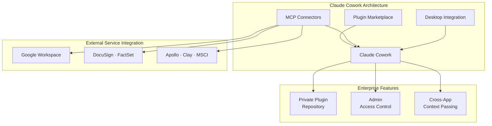
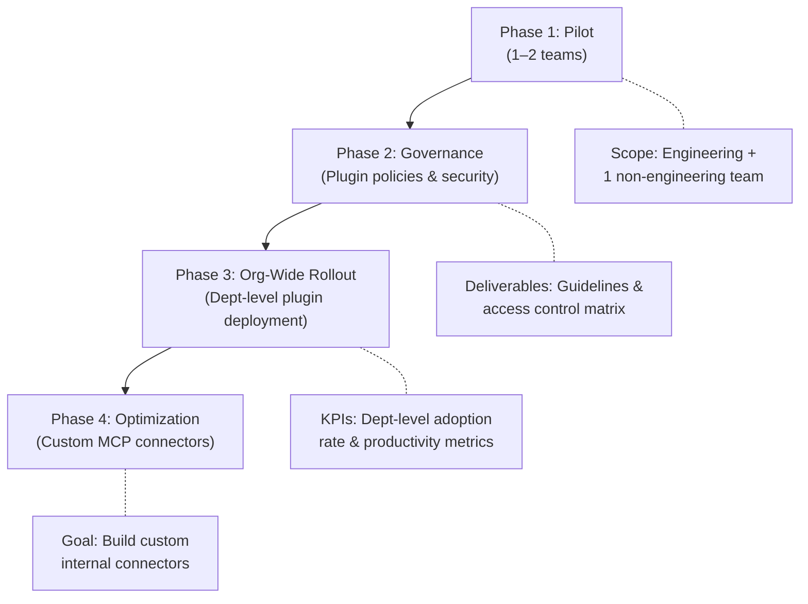

## From Claude Code to Claude Cowork

In January 2026, Anthropic unveiled Claude Cowork as a research preview. On February 24, they announced a full-scale market push with significantly enhanced enterprise features. TechCrunch's headline captured the shift perfectly: <strong>"If Claude Code changed programming, Cowork changes the rest of the enterprise."</strong>

As an Engineering Manager, let me break down what this product launch really means. While Claude Code was a productivity tool confined to engineering teams, Cowork is a platform that extends AI agent capabilities across every department — HR, design, finance, operations, and more.

## Core Architecture of Cowork

Claude Cowork is built on three foundational pillars.

### 1. Plugin Marketplace — A Customizable AI Tool Ecosystem for Your Organization

The most notable change is the <strong>Private Plugin Marketplace</strong>. Enterprise admins can now build organization-specific plugin marketplaces.

<strong>Key features:</strong>

- Connect private GitHub repositories as plugin sources
- Per-employee access control (who can use which plugins)
- Pre-built templates for HR, design, engineering, operations, financial analysis, investment banking, equity research, PE, and asset management

Here is why this matters: instead of individual teams fumbling around trying to figure out the best way to use ChatGPT or Claude on their own, organizations now have the <strong>infrastructure to deploy vetted AI workflows at scale</strong>.

### 2. MCP Connectors — Native Integration with Enterprise Systems

Claude Cowork connects directly to existing enterprise systems through the Model Context Protocol (MCP). Newly added connectors include:

| Category | Services |
|----------|----------|
| <strong>Productivity</strong> | Google Drive, Google Calendar, Gmail |
| <strong>Legal & Contracts</strong> | DocuSign, LegalZoom |
| <strong>Sales & Marketing</strong> | Apollo, Clay, Outreach, SimilarWeb |
| <strong>Finance & Research</strong> | FactSet, MSCI |
| <strong>Content</strong> | WordPress, Harvey |

MCP connectors go far beyond simple API integrations. Claude can understand and interact with these services <strong>bidirectionally</strong>. For example, saying "Review the three contract drafts from last week and summarize the key risks" triggers a workflow where Claude pulls documents from DocuSign, analyzes them, and saves the results to Google Drive.

### 3. Desktop Integration — Including Excel and PowerPoint

Claude Cowork runs inside the Claude desktop app and supports <strong>direct integration with Excel and PowerPoint</strong>. The key enabler here is <strong>Cross-App Context Passing</strong>:

- Continue working in Excel with analysis results from Cowork
- Automatically convert Excel data into PowerPoint presentations
- Context persists across files, so you never have to re-explain everything when switching apps

This feature delivers significant productivity gains for tasks like executive report writing, quarterly business reviews, and investment analysis.

## Strategic Implications for EMs and CTOs

### 1. Shifting from "Engineering AI" to "Organization-Wide AI"

At most organizations, AI adoption started with engineering teams. Tools like Claude Code, GitHub Copilot, and Cursor were the early movers. But the launch of Cowork breaks down that boundary.

<strong>Questions CTOs should be asking:</strong>

- How do we transfer our engineering team's AI adoption experience to non-technical departments?
- Who owns the governance policy for the Plugin Marketplace?
- How do we scope data access through MCP connectors?

### 2. Vendor Lock-In and Platform Strategy

Anthropic's Cowork strategy is clear — <strong>building an open ecosystem through MCP</strong>. With MCP donated to the Linux Foundation as an open standard, Cowork is positioning itself as "the best implementation of the standard."

A comparison:

| Criteria | Claude Cowork | Microsoft Copilot | Google Gemini for Workspace |
|----------|---------------|-------------------|-----------------------------|
| <strong>Protocol</strong> | MCP (open standard) | Proprietary | Proprietary |
| <strong>Plugin customization</strong> | Private Marketplace | Admin Center | AppSheet |
| <strong>Coding agent integration</strong> | Claude Code to Cowork | GitHub Copilot | Jules (limited) |
| <strong>Desktop integration</strong> | Excel, PPT (new) | Office 365 native | Google Workspace |

### 3. Security Considerations

It is worth noting that Check Point Research recently discovered vulnerabilities CVE-2025-59536 and CVE-2026-21852 in Claude Code. These allowed remote code execution and API key exfiltration through hooks, MCP server configurations, and environment variables (now patched).

As Cowork connects to an even broader set of enterprise systems, <strong>security audits of MCP connectors</strong> and <strong>plugin code review processes</strong> are non-negotiable.

## A Practical Adoption Roadmap

Here is a recommended phased approach for adopting Claude Cowork in the enterprise:

<strong>Phase 1: Pilot (2 to 4 weeks)</strong>

- Start with a team already using Claude Code + one non-engineering team (e.g., finance or HR)
- Connect basic MCP connectors (Google Workspace)
- Test pre-built plugin templates

<strong>Phase 2: Governance (2 to 4 weeks)</strong>

- Configure the Private Plugin Marketplace
- Define a plugin approval process
- Set data access scopes per MCP connector
- Establish a security audit checklist

<strong>Phase 3: Org-Wide Rollout (4 to 8 weeks)</strong>

- Deploy department-specific plugins
- Appoint department champions (AI Ambassadors)
- Monitor usage and productivity metrics

<strong>Phase 4: Optimization (ongoing)</strong>

- Develop custom MCP connectors for internal systems
- Advance workflow automation
- Measure ROI and decide on further expansion

## Reading Anthropic's Enterprise Strategy

Zooming out, the Cowork launch reveals a three-stage strategy from Anthropic:

1. <strong>Capture the developer market</strong> (2024 to 2025): Establish a foothold in developer productivity with Claude Code
2. <strong>Enterprise expansion</strong> (early 2026): Extend AI agents to non-developer roles with Cowork
3. <strong>Platform ecosystem</strong> (2026 onward): Build a third-party ecosystem with the MCP open standard and Plugin Marketplace

This strategy mirrors how Slack evolved from an engineering-only tool into an organization-wide communication platform. The difference is that Cowork delivers <strong>agentic AI execution power</strong> — not just passing messages back and forth, but actually performing work on your behalf.

## Conclusion

The enterprise launch of Claude Cowork marks a pivotal turning point in the AI tooling market. It is the first real case of AI agents breaking out of engineering silos and expanding into an organization-wide productivity platform.

What EMs and CTOs should do right now:

1. <strong>Audit your organization's current AI tool usage</strong> (including shadow AI)
2. <strong>Select a pilot team for Cowork</strong>
3. <strong>Establish MCP connector security policies</strong> in advance
4. <strong>Design a plugin governance framework</strong>

We are at the inflection point where AI shifts from being "a developer's tool" to "organizational infrastructure." Whether you manage this transition proactively or follow along reactively will determine your organization's competitive edge in the years ahead.

## References

- [Anthropic Expands Claude Cowork Enterprise Plugins — TechCrunch](https://techcrunch.com/2026/02/24/anthropic-launches-new-push-for-enterprise-agents-with-plugins-for-finance-engineering-and-design/)
- [Claude Cowork: Claude Code Without the Code — TechCrunch](https://techcrunch.com/2026/01/12/anthropics-new-cowork-tool-offers-claude-code-without-the-code/)
- [Anthropic Updates Office Productivity Tools with Claude Cowork — CNBC](https://www.cnbc.com/2026/02/24/anthropic-claude-cowork-office-worker.html)
- [Claude Cowork Revolutionizes Excel and PowerPoint Workflows — Applying AI](https://applyingai.com/2026/03/how-anthropics-claude-is-revolutionizing-excel-and-powerpoint-workflows/)
- [Anthropic vs Pentagon AI Governance — Axios](https://www.axios.com/2026/03/03/ai-race-safety-guardrail)
