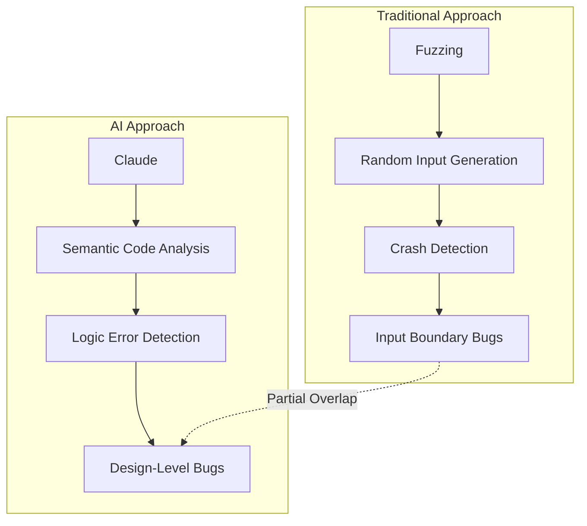
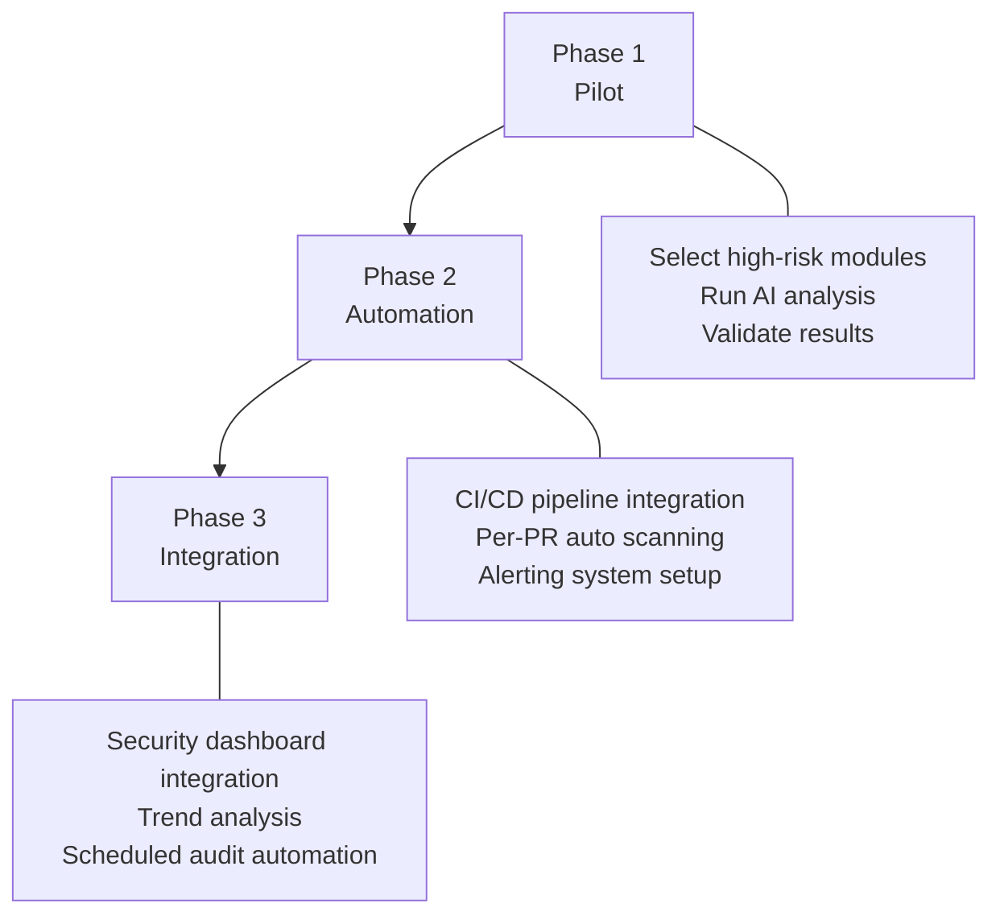

## Two Weeks, 6,000 C++ Files, 22 CVEs

On March 6, 2026, Anthropic and Mozilla jointly announced the results of an AI-driven browser security audit. Claude Opus 4.6 analyzed roughly <strong>6,000 files</strong> in Firefox's C++ codebase, submitting <strong>112 unique bug reports</strong> — of which <strong>22 were registered as official CVEs</strong>.

The severity breakdown:

| Severity | Count | Percentage |
|----------|-------|------------|
| High | 14 | 63.6% |
| Moderate | 7 | 31.8% |
| Low | 1 | 4.5% |

The 14 high-severity vulnerabilities represent roughly <strong>one-fifth</strong> of all high-severity Firefox patches shipped throughout 2025. Every single one has been patched in Firefox 148.

## AI Found What Fuzzing Missed

Firefox has been battle-tested for decades through <strong>fuzzing</strong>, <strong>static analysis</strong>, and regular security reviews. So how did Claude still uncover new vulnerabilities?

The key difference lies in the <strong>nature of what each approach detects</strong>:

- <strong>Fuzzing</strong>: Triggers crashes through random inputs. Excels at catching missing input validation and buffer overflows.
- <strong>AI code analysis</strong>: Understands code semantics and context to detect logical errors. Catches <strong>logic errors</strong> and complex memory vulnerabilities like <strong>Use After Free</strong> that fuzzing tends to miss.

According to Mozilla's official announcement, Claude "found many previously unknown bugs despite decades of fuzzing and static analysis." Notably, one report documented a Use After Free vulnerability discovered just <strong>20 minutes</strong> after Claude began exploring the JavaScript engine.

## Report Quality — Why Mozilla Trusted the Results

More important than the raw count of "N vulnerabilities found" is the <strong>quality of the reports</strong>. Three factors enabled Mozilla's security team to act on Anthropic's findings quickly:

1. <strong>Minimal test cases</strong>: Each bug came with a minimal, reproducible code sample
2. <strong>Detailed proofs of concept (PoC)</strong>: Concrete exploitation scenarios showing how each vulnerability could be abused
3. <strong>Candidate patches</strong>: Self-contained reports that included proposed fixes

This structure allowed Mozilla's security team to complete verification <strong>within hours</strong> of receiving a report and begin working on fixes immediately. The biggest bottleneck in security auditing — report triage — was dramatically shortened.

## Exploit vs. Detection — Where AI Stands Today

One notable detail: Anthropic separately tested Claude's <strong>exploit development capabilities</strong>:

| Metric | Result |
|--------|--------|
| Test attempts | Hundreds |
| API cost | $4,000 |
| Successful exploits | 2 |

There is a significant gap between <strong>vulnerability detection</strong> and <strong>exploit development</strong>. AI excels at reading code and identifying potential issues but still struggles to write working attack code. This asymmetry favors defenders — it means security teams have a <strong>window of opportunity</strong> to deploy AI for defense before attackers can weaponize it effectively.

## Practical Takeaways for EMs and CTOs

Here is what this case means for engineering leaders.

### 1. AI Security Audit Adoption Roadmap

<strong>Phase 1 (Pilot, 1–2 weeks)</strong>:
- Identify security-sensitive modules in legacy code (authentication, payments, data processing)
- Run a one-off audit with an LLM-based code analysis tool
- Have your existing security team validate the results to calibrate trust

<strong>Phase 2 (Automation, 1–2 months)</strong>:
- Add an AI security scan stage to your CI/CD pipeline
- Automatically analyze changed code on every PR
- Set up Slack/email alerting workflows

<strong>Phase 3 (Integration, quarterly)</strong>:
- Integrate AI audit results into your security dashboard
- Analyze vulnerability trends and assign risk scores
- Run automated audits across the full codebase every quarter

### 2. Cost-Effectiveness

Based on Anthropic's published data, here is a rough comparison:

| Factor | Traditional Approach | AI Audit |
|--------|---------------------|----------|
| Timeline | Weeks to months | 2 weeks |
| Staffing | 2–3 senior security engineers | AI + 1 validation engineer |
| Scope | Sample-based | Full codebase (6,000 files) |
| Report quality | Expert-level | Includes test cases + PoC + patches |

AI auditing does not fully replace human experts, of course. The optimal approach is a hybrid model where <strong>AI handles first-pass screening</strong> and <strong>human experts handle validation and prioritization</strong>.

### 3. Organizational Considerations

- <strong>Code confidentiality</strong>: Review your security policies around sending code to external AI APIs. Consider on-premise models or zero-retention API contracts.
- <strong>False positive management</strong>: Of the 112 reports, 22 became actual CVEs (roughly 20%). The rest were lower-severity bugs or false positives. A triage process is essential.
- <strong>Integration with existing tools</strong>: Plan how AI audits will complement your existing AppSec pipeline — SAST (static analysis), DAST (dynamic analysis), and SCA (software composition analysis).
- <strong>Regulatory compliance</strong>: Evaluate how to use AI audit results as evidence within compliance frameworks like SOC 2 and ISO 27001.

## The Bigger Picture — The Future of AI AppSec

This is not an isolated event. It is part of a broader shift toward <strong>AI-driven security auditing</strong> becoming an industry standard:

- <strong>Google Project Zero</strong> is already researching LLM-based vulnerability detection
- <strong>GitHub Copilot</strong> continues to strengthen its security review features
- <strong>NIST</strong>'s AI agent security standards include guidelines for using AI as a security tool

For EMs and CTOs, the real question is no longer "Should we adopt AI security auditing?" but rather <strong>"When and in what order should we roll it out?"</strong> If AI can find new vulnerabilities in a codebase as thoroughly vetted as Firefox, what might it find in yours?

## Key Takeaways

| Item | Details |
|------|---------|
| Who | Anthropic (Claude Opus 4.6) x Mozilla |
| Duration | 2 weeks (February 2026) |
| Scope | 6,000 files in Firefox C++ codebase |
| Results | 112 reports → 22 CVEs (14 high-severity) |
| Key differentiator | Detected logic errors that fuzzing missed |
| Report quality | Minimal repro code + PoC + candidate patches |
| Patch status | All patched in Firefox 148 |

## References

- [Anthropic Official Announcement: Mozilla Firefox Security](https://www.anthropic.com/news/mozilla-firefox-security)
- [Mozilla Blog: Hardening Firefox with Anthropic's Red Team](https://blog.mozilla.org/en/firefox/hardening-firefox-anthropic-red-team/)
- [TechCrunch: Anthropic's Claude found 22 vulnerabilities in Firefox over two weeks](https://techcrunch.com/2026/03/06/anthropics-claude-found-22-vulnerabilities-in-firefox-over-two-weeks/)
- [The Hacker News: Anthropic Finds 22 Firefox Vulnerabilities](https://thehackernews.com/2026/03/anthropic-finds-22-firefox.html)
