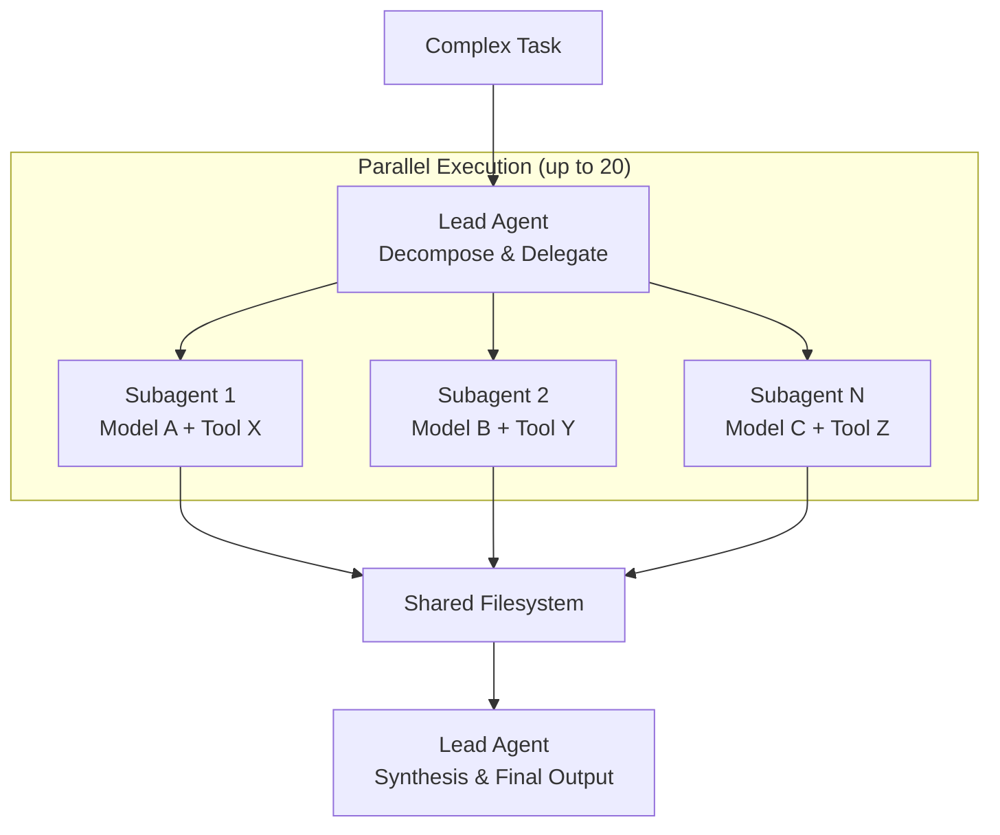
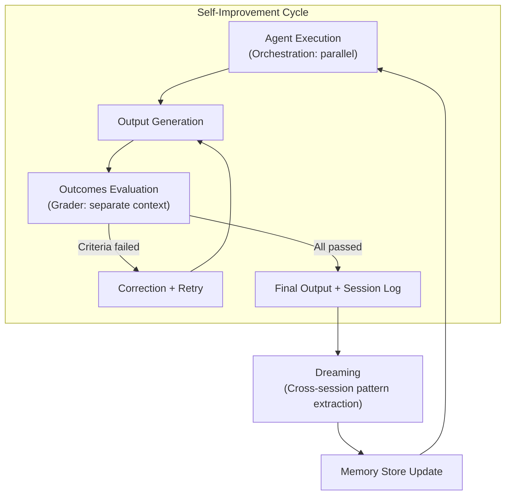

When Anthropic announced three new features at the Code with Claude conference in San Francisco on May 6, my first thought was: "What exactly is this agent learning while I'm away?"

Dreaming. Outcomes. Multiagent Orchestration. The names have a marketing ring to them, but the underlying engineering decisions are concrete. And there's one thing people consistently misread about Dreaming in particular: when Anthropic says "the agent learns," they don't mean the model improves. The memory improves. That distinction matters more than it might seem.

I couldn't test Dreaming directly — no API access, and it's still Research Preview. This analysis is based on official documentation, Anthropic's blog posts, conference materials, and early pilot reports. I won't claim to have run what I didn't run.

## Code with Claude 2026 — No New Model, All Infrastructure

The most telling thing about the May 6 SF keynote was the absence of a model announcement. Instead of competing on benchmark numbers, Anthropic focused on the execution layer for agents.

What was announced:

- **Dreaming**: Automated agent memory refresh (Research Preview)
- **Outcomes**: Success-criteria-based self-evaluation and iteration (Public Beta)
- **Multiagent Orchestration**: Lead-subagent parallel execution (Public Beta)
- Usage limits doubled across Pro, Max, Team, and Enterprise
- Peak-hour throttling removed for Pro and Max
- <strong>Claude Security</strong>: Code vulnerability scanner powered by Opus 4.7 (Enterprise)
- Remote Agents: Control your laptop from your phone
- SpaceX Project Colossus partnership (220,000+ GPUs)

Notion, Rakuten, Sentry, and Harvey are already running these features in production, according to Anthropic. The conference continues in London (May 19) and Tokyo (June 10).

The pattern here is worth noting: Anthropic isn't trying to win the model benchmark race this month. They're building the plumbing that makes large-scale agent deployment tractable.

## Dreaming — A Memory Consolidation System, Not Model Training

Anthropic reaches for the hippocampus metaphor when explaining Dreaming — the way the human brain replays the day's events during sleep and decides what to keep. It's a reasonable analogy. Here's what the system actually does:

1. Reviews up to 100 past agent sessions
2. Extracts patterns: recurring mistakes, converged workflows, team preferences
3. Removes duplicates and stale entries from the existing memory store, adds new ones
4. Preserves original session transcripts untouched

<strong>This is not fine-tuning.</strong> Anthropic is explicit: "Dreaming does not modify the underlying model weights." What changes is the memory store that the next agent session reads on startup. The model itself is unchanged.

Harvey's pilot result gets cited constantly: task completion rates climbed roughly six times after Dreaming was enabled. The mechanism was specific — agents started remembering filetype workarounds and tool-specific behavior across sessions, which is exactly the kind of thing that breaks legal document workflows repeatedly.

I think the six-times number is interesting but requires context. Harvey processes legal documents. Same document structures, same tools, repetitive review workflows — a domain where pattern extraction is tractable and where the same mistakes genuinely recur. Extrapolating "6x completion rate" to a general-purpose agent handling varied requests every session is not supported by this data.

Dreaming is Research Preview. I can describe what the documentation says it does; I can't report what running it feels like.

## Outcomes — Productizing the LLM-as-Judge Pattern

Outcomes isn't a new idea. LLM-as-judge — using a separate model instance to evaluate agent output — is already standard practice in many agent pipelines. What Anthropic is doing is turning it into a managed primitive with a specific architecture.

How Outcomes works:

```
1. Developer writes a rubric defining success
   Example: "The contract clause must satisfy legal requirements A, B, and C"

2. Writer agent generates output

3. Grader runs in a separate context window, evaluates against rubric
   — Independent of the writer's reasoning process
   — Returns per-criterion pass/fail verdict

4. If anything fails → Grader sends specific feedback to writer

5. Writer revises and retries

6. All criteria pass → Return result
```

The critical design choice is that the grader runs in a <strong>completely separate context window</strong>. It can't see the writer's reasoning; it only sees the output and the rubric. This is what distinguishes Outcomes from asking the same agent to "check your own work." Self-review in the same context window is biased — the agent is predisposed to justify what it already produced.

Anthropic's internal benchmark numbers: 8.4% improvement in Word document quality, 10.1% for PowerPoint slides.

In practice, rubric design becomes the core work. Too permissive, and Outcomes adds latency without benefit. Too strict, and you get an infinite retry loop. The API for grader configuration isn't something I could test at this tier, but the Outcomes cookbook example on the Claude platform shows the pattern clearly.

The [Managed Agents deployment walkthrough I wrote in April](/en/blog/en/claude-managed-agents-production-deployment-guide) covered the $0.08/session baseline cost. Outcomes adds grader session cost on top — how much depends on rubric complexity and how many retry cycles each task needs.

## Multiagent Orchestration — Standardizing the Parallel Pattern

Running multiple specialized agents in parallel for complex tasks isn't new either. [Five agentic workflow patterns for Claude Code](/en/blog/en/claude-code-agentic-workflow-patterns-5-types) covered the architecture. What Orchestration adds is a managed version of that pattern:

- Lead agent decomposes the task and delegates to specialists
- Up to 20 subagents run in parallel
- Each subagent has its <strong>own model, prompt, and tool configuration</strong>
- Shared filesystem for output coordination
- Full flow traceable in Claude Console



The per-subagent model configuration is a meaningful addition. A code generation subagent running Opus 4.7 alongside a fast validation subagent running Haiku 4.5 is cost-efficient without sacrificing output quality where it matters. This is the [heterogeneous agent fleet](/en/blog/en/ai-agent-cost-reality) pattern made easier to implement.

## The Self-Improvement Loop All Three Create Together

Viewed individually, these three features look like separate product additions. Viewed together, they form a closed loop:



Observe: Session data accumulates as the agent works.

Evaluate: Outcomes' grader evaluates each task against success criteria. Failure reasons are recorded.

Improve: Dreaming periodically reviews accumulated sessions and updates memory. The next session's agent starts with that enriched context.

Over time, the agent doesn't acquire new skills — it accumulates operational knowledge about "what to watch out for in which situations." The model stays constant; the effective behavior improves.

[Hindsight MCP's approach to experience-based memory refresh](/en/blog/en/hindsight-mcp-agent-memory-learning) covers similar territory from a different angle. Comparing both designs is useful for thinking through agent memory architecture choices.

## Where I'm Skeptical

Several things give me pause.

<strong>First, the Harvey 6x number.</strong> Legal document processing is structured and repetitive. The same contracts, the same tools, the same review workflows. Pattern extraction works well here. Claiming "agents improve 6x with Dreaming" generalizes a domain-specific result in a way that sets unrealistic expectations for varied workloads.

<strong>Second, memory poisoning risk.</strong> If an agent consistently approaches tasks incorrectly, Dreaming could entrench those bad patterns. Anthropic offers a "review changes before they land" option, but how many teams will actually review every memory update in a high-volume production system? This needs better tooling.

<strong>Third, auditability tension.</strong> A system where the agent autonomously changes its own behavioral patterns is hard to audit. "Why did the agent make that decision six months ago?" requires memory store version history — and the tooling for that isn't clearly specified yet.

<strong>Fourth, Research Preview status.</strong> Dreaming is not Production. Unlike Outcomes and Orchestration (Public Beta), Dreaming hasn't been validated at production scale. The [agent cost reality](/en/blog/en/ai-agent-cost-reality) analysis I did earlier applies here too: governance costs, monitoring costs, and debugging costs are real costs even when tokens are cheap.

Fifth, Outcomes grader cost scales with retry depth. A rubric with five criteria and a task that fails on the first three passes could triple the session cost relative to a baseline run. There's no cost estimation tooling for this yet.

## Who Should Use This Now

<strong>Start with Outcomes.</strong> If you're already running Managed Agents and output consistency is your main problem, rubric design is worth the investment. The separate grader context genuinely addresses the self-review bias problem. It's Public Beta and the most straightforward of the three to adopt.

<strong>Orchestration makes sense when tasks are too large or require too many specializations for a single agent.</strong> Large report generation, simultaneous code review and documentation, multi-source data synthesis. Be careful about orchestration overhead — 20 subagents poorly configured can absorb the gains from parallelization.

<strong>Dreaming: proceed carefully.</strong> Research Preview means production stability isn't guaranteed. The agents most likely to benefit are those handling repetitive, structured work over long periods. For varied-request agents, the improvement trajectory is less predictable.

I find the three-feature combination genuinely interesting as a system design. Observe → Evaluate → Improve is a clean loop. But I'd push back on the "self-improving agent" framing that turns this into something magical. Memory can be wrong. Research Preview features aren't production-ready. And the Harvey pilot, while compelling, is a single domain under specific conditions.

## Feasibility Assessment

What I could verify directly: Anthropic SDK installation, basic Messages API connectivity. Dreaming, Outcomes, and Orchestration require Enterprise or Beta plan access — I didn't run them.

Primary sources consulted:
- [New in Claude Managed Agents: dreaming, outcomes, and multiagent orchestration](https://claude.com/blog/new-in-claude-managed-agents) — Anthropic official
- [Outcomes implementation cookbook](https://platform.claude.com/cookbook/managed-agents-cma-verify-with-outcome-grader) — Claude platform
- [Code w/ Claude SF 2026 summary](https://claude.com/blog/code-w-claude-sf-2026-sf) — Anthropic blog
- [VentureBeat coverage of Dreaming](https://venturebeat.com/technology/anthropic-introduces-dreaming-a-system-that-lets-ai-agents-learn-from-their-own-mistakes)
- Simon Willison's live blog from Code with Claude

When more teams share production Dreaming results — especially outside legal tech — I'll update my read. For now: interesting architecture, still needs validation beyond a single pilot.
