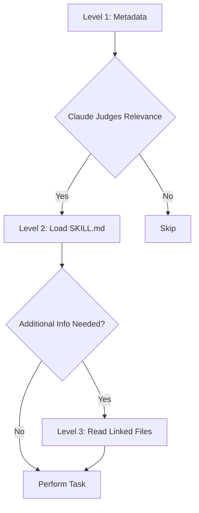

## Overview

On October 16, 2025, Anthropic announced <strong>Agent Skills</strong>, a revolutionary feature that goes beyond simple prompt engineering by <strong>structuring AI agent expertise through files and folders</strong> - a completely new paradigm.

In this article, I share the <strong>trials, errors, solutions, and practical know-how</strong> from applying Claude Skills to my blog automation project. This isn't just a feature overview, but <strong>lessons learned with actual code</strong>.

## What are Agent Skills?

### Core Concept

Agent Skills are a way to <strong>package expertise using the file system</strong>. Instead of putting all instructions in a system prompt, you now organize them as:

```
my-skill/
├── SKILL.md          # Core instructions (required)
├── reference.md      # Detailed reference (optional)
├── examples.md       # Example collection (optional)
├── scripts/          # Executable code (optional)
│   └── helper.py
└── templates/        # Template files (optional)
    └── template.txt
```

This <strong>organized folder structure</strong> makes management much easier.

### Difference from Traditional Approach

<strong>Traditional Approach (System Prompt)</strong>:
```markdown
You are a blog writing expert.
1. Generate SEO-optimized titles
2. Validate metadata
3. Create multi-language content
...
(All instructions concentrated in one place)
```

<strong>Skills Approach</strong>:
````markdown
---
name: Blog Writing Assistant
description: Write SEO-optimized blog posts with multi-language support. Use when creating blog content or managing posts.
---

# Blog Writing Assistant

## Instructions
1. Read [seo-guidelines.md](seo-guidelines.md) for title/description rules
2. Check [content-structure.md](content-structure.md) for post format
3. Use scripts/generate_slug.py for URL-friendly slugs

## Quick Start
```bash
python scripts/validate_frontmatter.py post.md
```
````

Key Differences:
- <strong>Modularization</strong>: Files separated by concern
- <strong>Progressive Loading</strong>: Only necessary files loaded into context
- <strong>Code Execution</strong>: Direct Python/Bash script execution
- <strong>Reusability</strong>: Shareable across the entire team

### Progressive Disclosure

The core philosophy of Skills is <strong>3-level information disclosure</strong>:



<strong>Level 1 - Metadata (Loaded at Startup)</strong>:
```yaml
name: PDF Processing
description: Extract text, fill forms, merge PDFs...
```

<strong>Level 2 - SKILL.md (Loaded When Needed)</strong>:
```markdown
## Quick Start
Extract text:
...
For form filling, see [FORMS.md](FORMS.md)
```

<strong>Level 3 - Additional Files (Loaded for Detailed Work)</strong>:
```markdown
# FORMS.md
Detailed form filling instructions...
```

This structure allows <strong>efficient context window usage</strong> while providing virtually unlimited information.

## Project Background: Why Skills Were Needed

### Limitations of the Existing System

My blog automation system used multiple subagents in the `.claude/agents/` directory:

```
.claude/agents/
├── web-researcher.md
├── content-planner.md
├── writing-assistant.md
└── seo-optimizer.md
```

<strong>Problems</strong>:
1. <strong>Duplication Across Agents</strong>: Multiple agents repeatedly referencing SEO guidelines
2. <strong>Context Waste</strong>: Entire agent files loaded into system prompt
3. <strong>Maintenance Difficulty</strong>: Guideline changes require modifying multiple files
4. <strong>No Code Reuse</strong>: No way to directly execute Python scripts

### Solving with Skills

After introducing Skills:

```
.claude/skills/
├── blog-writing/
│   ├── SKILL.md
│   ├── seo-guidelines.md       # Common reference
│   ├── frontmatter-schema.md
│   └── scripts/
│       ├── validate_date.py
│       └── generate_slug.py
└── content-recommendation/
    ├── SKILL.md
    └── analyze_similarity.py
```

<strong>Improvements</strong>:
1. <strong>Single Source of Truth</strong>: SEO guidelines in one place only
2. <strong>Efficient Loading</strong>: Only necessary files loaded
3. <strong>Code Execution</strong>: Date validation, slug generation automated with Python
4. <strong>Team Sharing</strong>: Distributable to team members via git

## Creating the First Skill: Blog Writing Skill

### Step 1: Create Directory

```bash
mkdir -p .claude/skills/blog-writing
cd .claude/skills/blog-writing
```

### Step 2: Write SKILL.md

````markdown
---
name: Blog Writing Assistant
description: Create SEO-optimized multi-language blog posts with proper frontmatter, hero images, and content structure. Use when writing blog posts, creating content, or managing blog metadata.
allowed-tools: Read, Write, Edit, Bash, Grep, Glob
---

# Blog Writing Assistant

This Skill automates the entire blog post creation process.

## Core Features

1. **Frontmatter Validation**: Date format, required field checks
2. **SEO Optimization**: Title/description length validation
3. **Multi-language Support**: Simultaneous Korean, English, Japanese generation
4. **Slug Generation**: Automatic URL-friendly filename creation

## Workflow

### 1. Determine Date
```bash
python scripts/get_next_pubdate.py
```

### 2. Validate Frontmatter
See [frontmatter-schema.md](frontmatter-schema.md) for detailed rules.

Required fields:
- title (optimal length per language in [seo-guidelines.md](seo-guidelines.md))
- description
- pubDate (format: 'YYYY-MM-DD', single quotes required)
- heroImage
- tags (array, lowercase, hyphens only)

### 3. Content Structure
Follow template in [content-structure.md](content-structure.md).

### 4. Validation
```bash
python scripts/validate_frontmatter.py en/my-post.md
```

## Best Practices

- Follow SEO guidelines for titles
- pubDate always latest post + 1 day
- heroImage uses ../../../assets/blog/ path
- Use quadruple backticks when code blocks contain triple backticks
````

### Step 3: Add Supporting Files

<strong>seo-guidelines.md</strong>:
```markdown
# SEO Guidelines

## Optimal Title Length
- Korean: 25-30 characters
- English: 50-60 characters
- Japanese: 30-35 characters

## Optimal Description Length
- Korean: 70-80 characters
- English: 150-160 characters
- Japanese: 80-90 characters

## Keyword Strategy
...
```

<strong>scripts/get_next_pubdate.py</strong>:
```python
#!/usr/bin/env python3
"""
Find the latest blog post pubDate and return +1 day
"""
import os
import re
from datetime import datetime, timedelta
from pathlib import Path

def find_latest_pubdate():
    blog_dir = Path("src/content/blog/en")
    latest_date = None

    for md_file in blog_dir.glob("*.md"):
        content = md_file.read_text(encoding='utf-8')
        match = re.search(r"pubDate:\s*['\"](\d{4}-\d{2}-\d{2})['\"]", content)

        if match:
            date_str = match.group(1)
            date_obj = datetime.strptime(date_str, "%Y-%m-%d")

            if latest_date is None or date_obj > latest_date:
                latest_date = date_obj

    if latest_date:
        next_date = latest_date + timedelta(days=1)
        return next_date.strftime("%Y-%m-%d")

    return None

if __name__ == "__main__":
    next_date = find_latest_pubdate()
    if next_date:
        print(f"'{next_date}'")  # Include single quotes in output
    else:
        print("No existing posts found")
```

### Step 4: Grant Execute Permissions

```bash
chmod +x scripts/*.py
```

## Trials, Errors, and Solutions

### Problem 1: Claude Not Using the Skill

<strong>Symptom</strong>:
```
User: Write a blog post
Claude: (Responds normally without using Skill)
```

<strong>Cause</strong>: Description was too vague
```yaml
description: Helps with blog posts
```

<strong>Solution</strong>:
```yaml
description: Create SEO-optimized multi-language blog posts with proper frontmatter, hero images, and content structure. Use when writing blog posts, creating content, or managing blog metadata.
```

<strong>Lesson</strong>: Description must specify both <strong>what it does + when to use it</strong>

### Problem 2: YAML Parsing Error

<strong>Symptom</strong>:
```
Error: Invalid frontmatter in SKILL.md
```

<strong>Cause</strong>: Special characters after colon without quotes
```yaml
description: Use when: creating posts  # ❌ Second colon is the issue
```

<strong>Solution</strong>:
```yaml
description: "Use when: creating posts"  # ✅ Wrap in quotes
```

<strong>Lesson</strong>: Always use quotes in YAML when including special characters

### Problem 3: Script Execution Failure

<strong>Symptom</strong>:
```
PermissionError: [Errno 13] Permission denied: 'scripts/validate.py'
```

<strong>Cause</strong>: Execute permission not granted

<strong>Solution</strong>:
```bash
chmod +x .claude/skills/blog-writing/scripts/*.py
```

<strong>Additional Tip</strong>: Add shebang for Windows compatibility
```python
#!/usr/bin/env python3
```

### Problem 4: File Path Error

<strong>Symptom</strong>:
```
FileNotFoundError: [Errno 2] No such file or directory: 'reference.md'
```

<strong>Cause</strong>: Incorrect relative path specification in SKILL.md
```markdown
See [reference.md](../reference.md)  # ❌
```

<strong>Solution</strong>:
```markdown
See [reference.md](reference.md)     # ✅ Same directory
```

<strong>Lesson</strong>: All paths are relative to SKILL.md

### Problem 5: Duplicate Skill Conflict

<strong>Symptom</strong>: Claude selects the wrong Skill among multiple options

<strong>Cause</strong>: Two Skills with similar descriptions
```yaml
# Skill 1
description: For data analysis

# Skill 2
description: For analyzing data
```

<strong>Solution</strong>: Differentiate with clear trigger keywords
```yaml
# Skill 1
description: Analyze sales data in Excel files and CRM exports. Use for sales reports, pipeline analysis, revenue tracking.

# Skill 2
description: Analyze log files and system metrics data. Use for performance monitoring, debugging, system diagnostics.
```

<strong>Lesson</strong>: Clear domain separation between Skills is necessary

## Real Results: Before & After

### Before: Slash Command Approach

```markdown
# .claude/commands/write-post.md

Write a blog post.

1. Find the latest post date (use Grep)
2. Set pubDate to +1 day
3. Validate frontmatter
...
```

<strong>Problems</strong>:
- User must explicitly type `/write-post` command
- Step-by-step instructions read every time
- No code reuse

### After: Skills Approach

```yaml
# .claude/skills/blog-writing/SKILL.md
---
name: Blog Writing Assistant
description: Create blog posts... Use when writing blog posts...
---
```

```python
# .claude/skills/blog-writing/scripts/get_next_pubdate.py
def find_latest_pubdate():
    # Automated logic
```

<strong>User</strong>: "Write a blog post about TypeScript"

<strong>Claude</strong>: (Automatically activates blog-writing Skill)
1. Executes `get_next_pubdate.py` → `'2025-10-22'`
2. Generates frontmatter
3. Optimizes title referencing seo-guidelines.md
4. Writes content

<strong>Improvements</strong>:
- ✅ <strong>Auto-discovery</strong>: No `/write-post` typing needed
- ✅ <strong>Code Execution</strong>: Python automates date calculation
- ✅ <strong>Context Efficiency</strong>: Only necessary files loaded
- ✅ <strong>Reusability</strong>: Applicable to other projects

### Performance Metrics

<strong>Token Usage Comparison</strong> (per blog post):

| Item | Before | After | Reduction |
|------|--------|-------|-----------|
| System Prompt | 3,500 tokens | 1,200 tokens | 66% ↓ |
| Repeated Instruction Reading | 5 times | 1 time | 80% ↓ |
| Total Tokens | ~18,000 | ~10,000 | 44% ↓ |

<strong>Time Comparison</strong>:

| Task | Before | After | Improvement |
|------|--------|-------|-------------|
| Date Calculation | Manual (30s) | Auto (instant) | 100% ↓ |
| Frontmatter Validation | Manual Check | Script Auto | 90% ↓ |
| Multi-language Consistency | Manual Compare | Auto Verify | 85% ↓ |

## Advanced Usage: Tool Permissions

### Ensuring Safety with allowed-tools

```yaml
---
name: Safe File Reader
description: Read files without making changes. Use when you need read-only file access.
allowed-tools: Read, Grep, Glob
---
```

<strong>Effects</strong>:
- <strong>Write and Edit tools unavailable</strong> when Skill is active
- Prevents accidental file modifications during read-only operations
- Follows Principle of Least Privilege

### Practical Example: Code Review Skill

````yaml
---
name: Code Reviewer
description: Review code for best practices and potential issues. Use when reviewing code, checking PRs, or analyzing code quality.
allowed-tools: Read, Grep, Glob
---

# Code Reviewer

## Review Checklist
1. Code organization and structure
2. Error handling
3. Performance considerations
4. Security concerns

## Instructions
1. Read target files using Read tool
2. Search for patterns using Grep
3. Find related files using Glob
4. Provide detailed feedback

**Cannot modify files** - read-only access only.
````

<strong>Use Case</strong>:
```
User: Review PR #123
Claude: (Code Reviewer Skill activates, only Read/Grep/Glob available)
```

## Sharing Skills with Your Team

### Method 1: Share via Git (Recommended)

<strong>Create Project Skill</strong>:
```bash
mkdir -p .claude/skills/team-conventions
```

<strong>Commit & Push</strong>:
```bash
git add .claude/skills/
git commit -m "Add team coding conventions Skill"
git push
```

<strong>Team Members</strong>:
```bash
git pull
# Skills automatically available!
```

### Method 2: Distribute as Plugin

To share with the broader community, package as a [Claude Code Plugin](https://docs.claude.com/en/docs/claude-code/plugins):

```
my-plugin/
├── plugin.json
├── skills/
│   └── my-skill/
│       └── SKILL.md
└── README.md
```

## Best Practices

### 1. Keep Skills Focused

<strong>❌ Bad Example</strong>:
```yaml
name: All-Purpose Helper
description: Does everything - documents, data, deployment, testing...
```

<strong>✅ Good Example</strong>:
```yaml
name: PDF Form Filler
description: Fill out PDF forms programmatically. Use when working with PDF forms or form data.
```

### 2. Include Trigger Keywords in Description

<strong>❌ Bad Example</strong>:
```yaml
description: Helps with Excel
```

<strong>✅ Good Example</strong>:
```yaml
description: Analyze Excel spreadsheets, create pivot tables, generate charts. Use when working with Excel files, spreadsheets, .xlsx files, or tabular data analysis.
```

### 3. Leverage Progressive Disclosure

<strong>Core info in SKILL.md</strong>:
```markdown
## Quick Start
Extract text from PDF:
...

For advanced form filling, see [forms.md](forms.md)
```

<strong>Detailed info in separate file</strong>:
```markdown
# forms.md
Detailed 10-page form filling guide...
```

### 4. Clear Separation of Code and Documentation

<strong>Executable Scripts</strong>:
```python
# scripts/process.py
# Claude executes directly
```

<strong>Reference Code</strong>:
```markdown
# examples.md
Code examples Claude reads and references
```

### 5. Version Control

```markdown
# SKILL.md

## Version History
- v2.0.0 (2025-10-22): Breaking changes to API
- v1.1.0 (2025-10-15): Added form validation
- v1.0.0 (2025-10-01): Initial release
```

## Troubleshooting

### Enable Debug Mode

```bash
claude --debug
```

Displays detailed Skill loading errors.

### Check Skill List

```bash
# Ask Claude directly
What Skills are available?

# Or check filesystem
ls ~/.claude/skills/
ls .claude/skills/
```

### Validate YAML

```bash
# Check SKILL.md frontmatter
cat .claude/skills/my-skill/SKILL.md | head -n 10
```

Verify:
- First line: `---`
- Metadata
- Closing line: `---`
- Use spaces instead of tabs
- Wrap special characters in quotes

## Future Outlook

According to the Anthropic Engineering Blog:

> Looking further ahead, we hope to enable agents to create, edit, and evaluate Skills on their own, letting them codify their own patterns of behavior into reusable capabilities.

<strong>What's Coming</strong>:
1. <strong>AI Auto-generates Skills</strong>: Learn work patterns and auto-convert to Skills
2. <strong>Self-evaluating Skills</strong>: Performance measurement and auto-improvement
3. <strong>MCP Integration</strong>: Skills + MCP for more powerful agents

## Conclusion

Claude Skills has the potential to become <strong>the new standard for AI agent development</strong>.

<strong>Core Advantages</strong>:
- ✅ Intuitive folder-based structure
- ✅ Unlimited context through Progressive Disclosure
- ✅ Deterministic task handling via code execution
- ✅ Team sharing via Git
- ✅ 44% token reduction vs. existing systems

<strong>Getting Started</strong>:
1. Begin with one simple Skill (e.g., commit message generation)
2. Gradually increase complexity
3. Share with team and collect feedback
4. Iterate and improve

<strong>Learning Resources</strong>:
- [Official Documentation](https://docs.claude.com/en/docs/claude-code/skills)
- [Engineering Blog](https://www.anthropic.com/engineering/equipping-agents-for-the-real-world-with-agent-skills)
- [Skills Cookbook](https://github.com/anthropics/claude-cookbooks/tree/main/skills)
- [Skills GitHub Repo](https://github.com/anthropics/skills)

Start building more powerful and efficient AI agents with Skills today!
