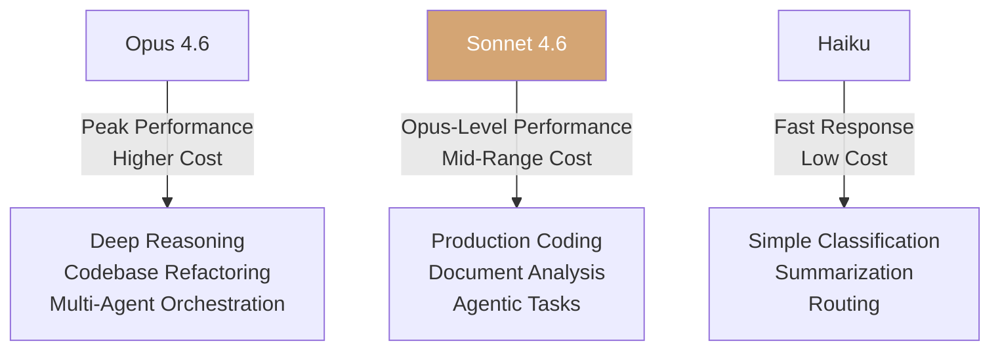

## Overview

Anthropic has released <strong>Claude Sonnet 4.6</strong>. This model delivers a comprehensive upgrade across coding, computer use, long-context reasoning, agent planning, knowledge work, and design, with a <strong>1 million token context window</strong> available in beta. Having garnered 724 points on Hacker News, this announcement deserves a deep dive.

## Sonnet 4 → 4.6: What Changed

### A Leap in Coding Ability

In Claude Code internal testing, users preferred Sonnet 4.6 over Sonnet 4.5 <strong>roughly 70% of the time</strong>. Key improvements reported include:

- <strong>More effective context reading</strong> before modifying code
- <strong>Better consolidation</strong> of shared logic instead of duplicating it
- <strong>Reduced frustration</strong> during long sessions
- <strong>Significantly less</strong> overengineering and "laziness"

Remarkably, users even preferred Sonnet 4.6 over <strong>Opus 4.5, the frontier model from November 2025, 59% of the time</strong>.

### Computer Use Performance

Anthropic was the first to introduce a general-purpose computer-using model in October 2024. On the <strong>OSWorld benchmark</strong>, Sonnet models have shown steady gains over sixteen months, with Sonnet 4.6 demonstrating <strong>human-level capability</strong> in tasks like navigating complex spreadsheets and filling out multi-step web forms.

On the security front, resistance to prompt injection attacks has <strong>improved significantly</strong> over Sonnet 4.5, reaching a level comparable to Opus 4.6.

### 1 Million Token Context Window

The <strong>1M token context window</strong> in beta can hold entire codebases, lengthy contracts, or dozens of research papers in a single request. The key differentiator is that it <strong>reasons effectively across all that context</strong>, not just processes it.

## Model Versioning Strategy Analysis

### Anthropic's Numbering System

Anthropic employs a distinctive versioning strategy:

```
Sonnet 3.5 → Sonnet 4 → Sonnet 4.5 → Sonnet 4.6
Opus 4 → Opus 4.5 → Opus 4.6
```

<strong>Point releases in 0.1 increments</strong> suggest an approach of improving training data and fine-tuning while maintaining the architecture. This signals "non-breaking improvements" to users.

### The Significance of the Mid-Tier Strategy


Sonnet 4.6's core message is <strong>"Opus-level performance at Sonnet pricing."</strong> Tasks that previously required an Opus-class model are now achievable with Sonnet — a revolutionary shift in cost efficiency.

## Benchmark Performance Comparison

### Key Results

| Area | vs Sonnet 4.5 | Notes |
|------|---------------|-------|
| Claude Code Preference | 70% preferred | User evaluation |
| vs Opus 4.5 Preference | 59% preferred | User evaluation |
| OfficeQA | Matches Opus 4.6 | Document comprehension |
| Box Reasoning Q&A | +15pp | Enterprise documents |
| Insurance Benchmark | 94% | Best computer use score |

### Vending-Bench Arena: Strategic Thinking

The <strong>Vending-Bench Arena</strong> evaluation stands out. This benchmark tests how well models can run a simulated business in competition with each other. Sonnet 4.6 developed a distinctive strategy:

1. First 10 months: <strong>Heavy capacity investment</strong> (spending more than competitors)
2. Final stretch: <strong>Sharp pivot to profitability</strong>
3. Result: <strong>Finished well ahead</strong> of the competition

This demonstrates capabilities beyond benchmark scores — <strong>long-horizon planning and strategic thinking</strong>.

## Cost Efficiency Analysis

### Pricing

Sonnet 4.6 maintains the same pricing as Sonnet 4.5:

- <strong>Input</strong>: $3 / million tokens
- <strong>Output</strong>: $15 / million tokens

### Performance Per Dollar



Anthropic described Sonnet 4.6's <strong>performance-to-cost ratio as "extraordinary"</strong>, and customers have confirmed it as a <strong>viable alternative for heavy Opus users</strong>.

## Platform Updates

Notable platform improvements accompany the Sonnet 4.6 release:

- <strong>Adaptive Thinking</strong> and extended thinking support
- <strong>Context Compaction</strong> beta: automatically summarizes older context as conversations approach limits
- <strong>Web search/fetch tools</strong>: now auto-filter search results through code execution
- <strong>Claude in Excel</strong>: MCP connector support for S&P Global, Bloomberg, and other external data
- Code execution, memory, programmatic tool calling now <strong>generally available</strong>

## Implications for Developers

### Migration Recommendations

Anthropic recommends <strong>exploring the full thinking effort spectrum</strong> when migrating from Sonnet 4.5. Sonnet 4.6 delivers strong performance even with extended thinking off, so you can find the optimal speed-performance balance for your use case.

### Model Selection Guide

- <strong>Opus 4.6</strong>: When deepest reasoning is required (codebase refactoring, multi-agent workflows)
- <strong>Sonnet 4.6</strong>: Most production workloads (coding, document analysis, agentic tasks)
- API identifier: `claude-sonnet-4-6`

## Conclusion

Claude Sonnet 4.6 is more than a point release. It marks a <strong>strategic inflection point where the mid-tier model encroaches on frontier territory</strong>. Delivering Opus-level performance at Sonnet pricing while achieving real breakthroughs in computer use and long-context processing, it redefines what's possible at this price point.

Anthropic's model evolution is accelerating, and <strong>the decision criteria is shifting from "the best model" to "the best model for the job."</strong> For developers and enterprises, this signals the need for more sophisticated model strategies.

## References

- [Anthropic Official Announcement: Introducing Sonnet 4.6](https://www.anthropic.com/news/claude-sonnet-4-6)
- [Claude Sonnet 4.6 System Card](https://anthropic.com/claude-sonnet-4-6-system-card)
- [Hacker News Discussion (724pts)](https://news.ycombinator.com/item?id=43083851)
- [OSWorld Benchmark](https://os-world.github.io/)
- [Vending-Bench Arena](https://andonlabs.com/evals/vending-bench-arena)
