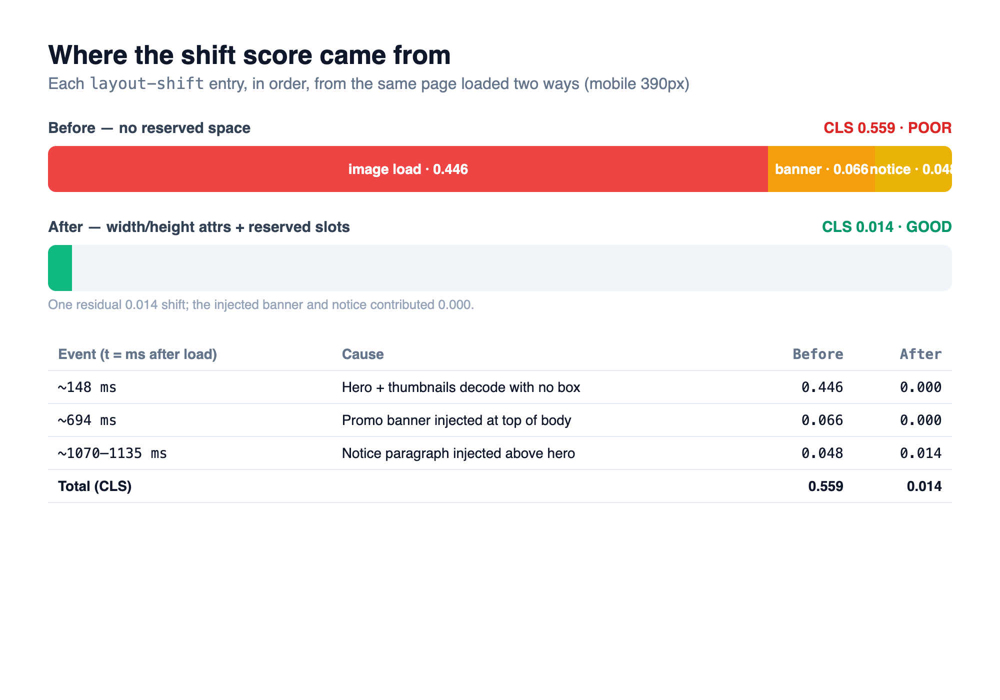

You reach for the checkout button, and right as your thumb lands, the whole page slides down and you hit the wrong link instead. Something above finished loading late, or a banner elbowed its way in. The annoyance passes in a second, but this isn't about feelings. Google measures that "jump" as a number called <strong>Cumulative Layout Shift (CLS)</strong>, and that number helps decide whether your page counts as good or not.

So I built the same HTML page twice. One version carries the mistakes I see most often. The other fixes them. Then I measured both with the exact API the browser uses to compute CLS. The short version: it went from 0.559 to 0.014. Every figure below comes straight out of that sandbox.

## CLS measures total movement, not how many times things moved

Start with the ground floor. Core Web Vitals are three metrics: LCP (when the largest element paints), [INP (how fast the page responds to input)](/en/blog/en/inp-yielding-measure-2026/), and CLS (how much the screen shifts). The first two are measured in time, milliseconds. CLS alone is a unitless score, and that's exactly what makes it easy to misread.

CLS sums up the <strong>unexpected layout shifts</strong> that happen while a page is alive. Each individual shift scores as the product of two fractions: how much of the viewport moved (impact fraction), and how far it traveled (distance fraction). An element covering half the viewport that drops by half the viewport height scores roughly 0.5 × 0.5 = 0.25. A tiny footnote nudging a few pixels and half the screen sinking at once carry completely different weight.

Here's the misconception worth killing. CLS doesn't count how many shifts occurred. One shift that pushes the whole screen can land you in POOR territory by itself. Ten small shifts, each minuscule, might sum to almost nothing. And crucially, any shift within <strong>500 milliseconds of a user click or tap</strong> is excluded. An accordion opening because you pressed "expand" is expected movement. The `hadRecentInput` flag on each `layout-shift` entry draws that line.

The thresholds are set in Google's own docs. <strong>0.1 or below is GOOD, above 0.25 is POOR</strong>, and the band between them needs work ([web.dev, Cumulative Layout Shift](https://web.dev/articles/cls)). That 0.1 figure isn't arbitrary either. Internal testing found that shifts of 0.15 and up were consistently felt as disruptive, while 0.1 and below were noticeable but not jarring ([web.dev, thresholds](https://web.dev/articles/defining-core-web-vitals-thresholds)).

## The same page, built two ways, with the mistakes planted on purpose

No reproduction, no claim. I put two static HTML pages in the sandbox — an ordinary recipe gallery, images mixed with text.

Into `bad.html` I planted the three mistakes I run into most in real code.

```html
<!-- Mistake 1: image has no size info → it shoves content down as it loads -->
<style>.hero img{width:100%}</style>
<div class="hero"></div>

<div class="card"><button>Save recipe</button></div>

<script>
  // Mistake 2: inject a banner at the top after 500ms → everything below drops
  setTimeout(() => {
    const d = document.createElement('div');
    d.textContent = 'Subscribe now';
    document.body.insertBefore(d, document.body.firstChild);
  }, 500);
  // Mistake 3: inject a notice above the hero after 900ms
  setTimeout(() => { /* insert a <p> above the hero */ }, 900);
</script>
```

The point is that these aren't three separate bugs. They're <strong>three faces of the same mistake</strong>: never telling the browser "hold this much room here" ahead of time. The image only learns its size once the download finishes; the banner and notice are conjured later by JavaScript. Until that moment arrives, the browser treats those spots as zero pixels, then suddenly opens up space when the content lands, shoving everything below it down.

`good.html` is identical in content and timing. The banner still arrives at 500ms, the notice at 900ms. The only difference is that it tells the browser about the room in advance. That contrast matters. The thesis isn't "don't insert content late" — it's "insert it late, but leave the room open."

## I measured with the same API the browser counts CLS with

Instead of a rolled-up score like a Lighthouse number, I pulled the raw data. A `PerformanceObserver` collects every `layout-shift` entry one at a time. This is the very event Chrome reads internally when it computes CLS.

```js
new PerformanceObserver((list) => {
  for (const e of list.getEntries()) {
    if (!e.hadRecentInput) {        // exclude shifts right after user input
      cls += e.value;               // value = impact × distance
      shifts.push({ value: e.value, t: Math.round(e.startTime) });
    }
  }
}).observe({ type: 'layout-shift', buffered: true });
```

I launched system Chrome through Playwright, loaded each page at a mobile viewport (390px), waited two seconds for the dynamic inserts to finish, then read the cumulative value. I chose mobile because the narrower the screen, the larger a share any element takes, and the harder CLS bites.



| Event (time after load) | Cause | before | after |
|---|---|---|---|
| ~148ms | Hero and thumbnails decode with no box | 0.446 | 0.000 |
| ~694ms | Promo banner injected at top of body | 0.066 | 0.000 |
| ~1070–1135ms | Notice paragraph injected above the hero | 0.048 | 0.014 |
| <strong>Total (CLS)</strong> | | <strong>0.559 (POOR)</strong> | <strong>0.014 (GOOD)</strong> |

The images were the big culprit. Eighty percent of all movement came from a single image-decode event. The banner and notice trailed at 0.06 and 0.05. What's interesting is that three shifts, scattered across 148ms, 694ms, and 1135ms, still summed into one score. That's no accident.

CLS isn't a plain running total. It uses <strong>session windows</strong>: shifts that fire in quick succession get grouped into one window, and a gap of more than a second opens a new one, with a single window capped at 5 seconds ([web.dev, optimize CLS](https://web.dev/articles/optimize-cls)). My three shifts were 546ms and 441ms apart, both under a second, so they fell into one window, which is why my naive sum (0.559) matched the real session-window CLS. Two-second gaps between them and the story changes. I'll be honest about that difference in a moment.

## The fix fits in three lines — reserve the room first

`good.html` changed three things. In code it's almost anticlimactic.

<strong>1) Give images explicit width and height.</strong>

```html

```

These two attributes no longer force the image to render at those exact pixels, the way they did decades ago. Modern browsers derive an <strong>aspect ratio</strong> from them and reserve a box of that shape before the file arrives. Set `width:100%` in CSS and the height still follows the ratio. For responsive images, pair it with CSS `aspect-ratio` to be safe.

```css
.hero img { width: 100%; height: auto; aspect-ratio: 16 / 9; }
```

<strong>2) Pre-place the slot for content you'll fill later.</strong>

Rather than pushing the banner in with `insertBefore`, put an empty slot in the document from the start and fill only the text.

```html
<div id="promo" style="min-height:64px"></div>
<script>
  // the room already exists, so just drop in the content → zero shift
  setTimeout(() => {
    document.getElementById('promo').textContent = 'Subscribe now';
  }, 500);
</script>
```

Reserve a minimum with `min-height`, hide it with `visibility:hidden` while `:empty`, and the layout won't wobble even when there's nothing there yet. Any slot whose size you can know in advance — ads, embeds, banners — takes this treatment ([Google Publisher Tag, minimize layout shift](https://developers.google.com/publisher-tag/guides/minimize-layout-shift)).

<strong>3) Don't insert anything above existing content.</strong> If you truly must, do it only in response to user interaction. This ties back to the 500ms rule: a shift a user triggered by pressing a button is expected and drops out of CLS, but a shift your script forces with no input counts in full. If your page paints content late via JavaScript, odds are you're also fighting [the fact that crawlers don't render your JavaScript](/en/blog/en/ai-crawlers-dont-render-javascript-csr-2026/). Render timing hits performance and crawlability at the same time.

The result is right there in the table. Fixing images alone erased 80% of the CLS; handling the other two left just 0.014. That residual 0.014 is a small shift from the notice insert, about a seventh of the GOOD threshold, imperceptible in real use.

## Honest limits — this number does not guarantee ranking

Stopping here would be dangerous. Having measured something doesn't mean it translates into search ranking. Three things to nail down.

First, <strong>lab data and field data are different.</strong> What I measured is a synthetic reading in a controlled environment. The CLS Google uses as a ranking signal is the 75th percentile of field data (CrUX), gathered from real users' Chrome. Lab measurement is unbeatable for finding and fixing causes, but "this number is my ranking" it is not. After you ship, you verify again with field data.

Second, <strong>good Core Web Vitals don't lift your ranking on their own.</strong> Google uses page experience as a signal, but content relevance dominates by a wide margin. A CLS of 0.014 signals "this page respects its users" — it isn't a guarantee of a ranking bump. That's Google's own stated position. Bad CLS can hold you back; good CLS won't pull you ahead by itself.

Third, <strong>my measurement method has an approximation baked in.</strong> I summed the `layout-shift` values naively. This time every shift landed in one session window and matched the real CLS, but on long-lived pages where shifts fire seconds apart (infinite scroll, SPAs), the naive sum and the session-window value diverge. When you need the accurate figure, reach for Google's `web-vitals` JavaScript library, which implements the session-window logic for you. This experiment also skipped shifts from web-font swaps (FOUT), another common CLS source.

Once you know those limits, the point of measuring gets sharper, not weaker. Lab measurement isn't a ranking oracle. It's a <strong>debugging tool</strong>: see what moves and by how much, then peel off the causes one by one. That's the whole workflow, and its core. The same posture drove [taking an LCP bottleneck apart with a trace](/en/blog/en/lcp-image-preload-scanner-fetchpriority-2026/) and [measuring content-visibility's render cost](/en/blog/en/content-visibility-auto-render-cost-measure-2026/). Sometimes the instrument itself is what deserves the suspicion. [A prerendered page reporting LCP at 6.2s](/en/blog/en/prerender-activationstart-cwv-measurement-2026/) wasn't slow. The measurement just never subtracted the start point. Don't guess. Measure.

## A checklist you can run today

To apply this to your own site, walk it in this order.

- <strong>Do all your `` and `<video>` elements carry width and height?</strong> If the pixels are fluid because it's responsive, lock the ratio with CSS `aspect-ratio`. This one step usually clears most of the CLS.
- <strong>Have you reserved space with min-height for ad, embed, and banner slots?</strong> If you don't know the size, hold the most common height and handle the fill inside that box.
- <strong>Are you inserting anything above existing content with JavaScript?</strong> Cookie banners, notice bars, lazy-loaded widgets are the usual suspects. Unless it's a response to user input, open the room ahead of time.
- <strong>Does the layout jump when web fonts swap in?</strong> Use `font-display` and `size-adjust` to close the metrics gap between the fallback font and the web font.
- <strong>Did you verify with field data after fixing?</strong> GOOD in the lab can still look different in the real world of slow devices and slow networks. Check real-user values with the `web-vitals` library or CrUX.

CLS isn't a flashy optimization. It's a fundamental you can summarize in one line — tell the browser about the room in advance — and one that pays back reliably when you honor it. And before it's a performance metric, it's a matter of courtesy: keeping the button a user reached for from running away.

---

From getting structured data out server-side reliably to auditing an existing site's Core Web Vitals and accessibility with real measurements, I work on web development hands-on and take on consulting and implementation requests personally. If problems you need to catch with numbers — a shifting layout, a slow LCP — are piling up, feel free to reach out through the contact link on my profile.
