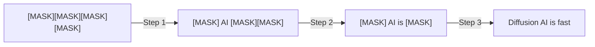
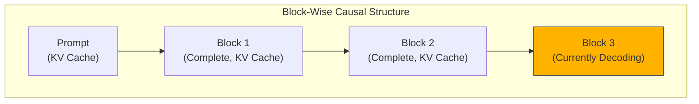

## Overview

Autoregressive (AR) language models generate tokens one at a time, sequentially. While stable, this approach is <strong>inherently non-parallelizable</strong>. Together AI's <strong>Consistency Diffusion Language Models (CDLM)</strong> push diffusion-based language model inference up to 14x faster while virtually eliminating quality loss — a genuinely innovative breakthrough.

## What Are Diffusion Language Models (DLMs)?

Diffusion language models apply the diffusion concept — familiar from image generation — to text. Starting from a fully masked sequence, they <strong>gradually transform it into clean text through multiple iterative refinement steps</strong>.

This approach offers two key advantages:

- <strong>Parallel generation</strong>: Multiple tokens can be finalized in a single iteration
- <strong>Bidirectional context</strong>: Enables text infilling and refinement tasks

## Two Bottlenecks of Standard DLMs

However, standard DLMs suffer from two critical inefficiencies:

1. <strong>No KV caching</strong>: Bidirectional attention requires recomputing attention over the full context at every denoising step
2. <strong>High step counts required</strong>: Maintaining quality demands many denoising steps proportional to generation length; naively reducing steps sharply degrades quality

## CDLM's Core Mechanism

CDLM is a <strong>post-training</strong> recipe that addresses both bottlenecks simultaneously.

### 1. Trajectory Collection

First, a teacher DLM generates decoding trajectories offline. With generation length 256 and block size 32, high-quality trajectory data is collected.

### 2. Block-Causal Student Model

While the teacher uses full bidirectional attention, the student model employs a <strong>block-wise causal mask</strong>. This enables:

- <strong>Exact KV caching</strong> for the prompt and previously completed blocks
- Bidirectional context preserved within the current block

### 3. Three Training Objectives

CDLM jointly optimizes three loss functions:

- <strong>Distillation Loss</strong>: Learns the teacher model's distribution at newly unmasked positions
- <strong>Consistency Loss</strong>: Enforces within-block temporal consistency for stable multi-step transitions
- <strong>Auxiliary DLM Loss</strong>: Standard masked denoising preserves general token prediction and reasoning capabilities

## Performance Results

CDLM-Dream's benchmark results are impressive:

| Benchmark | Step Reduction | Latency Improvement |
|-----------|---------------|-------------------|
| GSM8K-CoT | ~7.7x | <strong>11.2x</strong> |
| MBPP-Instruct | ~4.1x | <strong>14.5x</strong> |
| Overall | 4.1x–7.7x | Up to 14.5x |

The key takeaway is that these speed gains come with <strong>virtually no accuracy degradation</strong>. While naively reducing step counts causes significant quality drops, CDLM's training-based approach enforces trajectory consistency to solve this problem.

## Why Block-Wise DLM Hits the Sweet Spot

Hardware utilization analysis shows block-wise DLMs sit at the <strong>optimal point between AR and vanilla DLMs</strong>:

- <strong>AR decoding</strong>: Memory-bound at small batch sizes (arithmetic intensity ≈ 1)
- <strong>Vanilla DLMs</strong>: Compute-bound even at batch size 1 (saturation from bidirectional attention)
- <strong>Block DLMs (CDLM)</strong>: Intra-block parallelism amortizes memory access while maintaining practical scaling

## Practical Implications

### A Turning Point for the AR-Dominant Era

The current LLM ecosystem is dominated by AR models — GPT, Claude, and Gemini all use this approach. CDLM demonstrates that diffusion models can be <strong>competitive in both speed and quality</strong>.

### Scalability

As a post-training recipe, CDLM can be applied on top of stronger DLM backbones as they emerge. Collecting trajectories from larger teacher models and training mid-scale students is a promising direction.

### New Use Cases

Leveraging bidirectional context, diffusion models excel at tasks that AR models struggle with naturally: text infilling, correction, and rewriting.

## Conclusion

CDLM represents a significant step toward practical diffusion language models. Block-wise causal structure enables KV caching, while consistency training drastically reduces step counts without sacrificing quality. Up to 14.5x latency improvement poses a meaningful challenge to the AR-centric paradigm.

## References

- [Together AI Blog — Consistency Diffusion Language Models](https://www.together.ai/blog/consistency-diffusion-language-models)
- [Block Diffusion: Interpolating Between Autoregressive and Diffusion Language Models](https://arxiv.org/abs/2503.09573)
- [Beyond Next-Token Prediction: A Performance Characterization of Diffusion versus Autoregressive Language Models](https://arxiv.org/abs/2412.00024)
