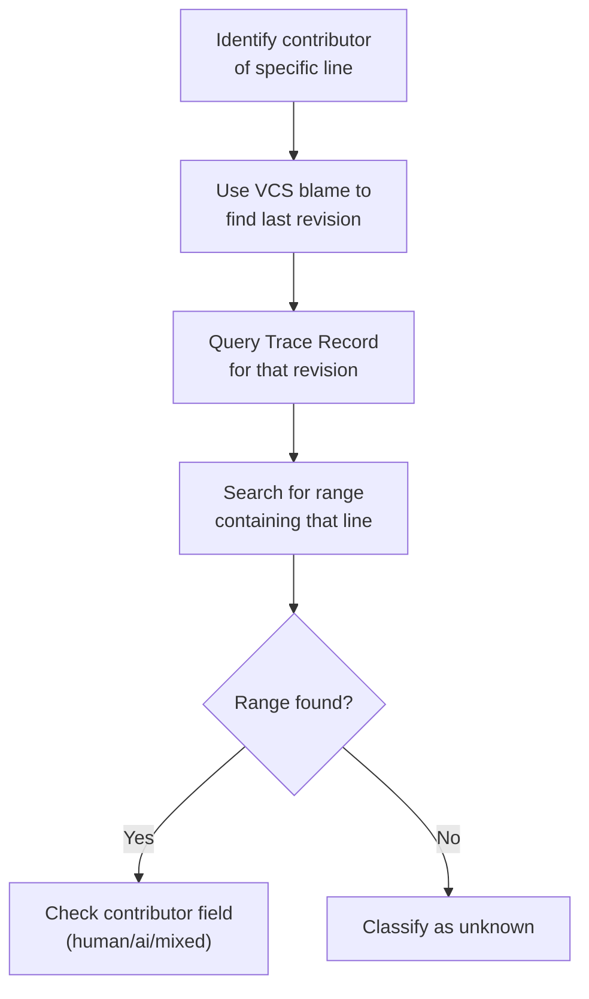
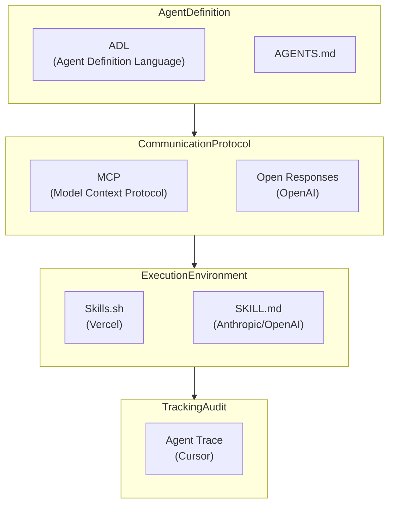

## Overview

In January 2026, Cursor released <strong>Agent Trace</strong>, an open specification (RFC). Starting with version 0.1.0, this specification represents the industry's first systematic answer to the question: "How do we track code written by AI?"

The `git blame` tool that most development teams currently use only answers "who last modified this line?" But now that AI coding tools are ubiquitous, the information we really need is different. <strong>Was this code written by a human, generated by AI, or is it the result of collaboration between both?</strong>

This article analyzes the technical specification of Agent Trace and examines why this standard is important from an Engineering Manager and CTO perspective.

## What is Agent Trace?

Agent Trace is an open specification that <strong>records AI and human contributions in a vendor-neutral JSON format within version-controlled codebases</strong>.

Its key features are:

<strong>File and line-level contribution tracking</strong>: Rather than simply "this commit involved AI," it records exactly which lines of a specific file were generated by AI.

<strong>Four contributor type classifications</strong>: `human` (direct human writing), `ai` (AI-generated), `mixed` (human editing AI output or vice versa), `unknown` (source unknown).

<strong>Vendor-neutral design</strong>: The same format can be used regardless of whether the code came from Cursor, Copilot, Claude Code, or any other tool.

<strong>Repository-agnostic</strong>: Trace records can be stored locally, in git notes, databases, or anywhere else you prefer.

## Structure of Trace Records

The basic unit of Agent Trace is the <strong>Trace Record</strong>. Let's examine the JSON schema:

```json
{
  "version": "0.1.0",
  "id": "550e8400-e29b-41d4-a716-446655440000",
  "timestamp": "2026-01-15T09:30:00Z",
  "vcs": {
    "type": "git",
    "revision": "a1b2c3d4e5f6..."
  },
  "tool": {
    "name": "cursor",
    "version": "0.45.0"
  },
  "files": [
    {
      "path": "src/utils/parser.ts",
      "conversations": [
        {
          "url": "https://cursor.com/conversations/abc123",
          "ranges": [
            {
              "start_line": 15,
              "end_line": 42,
              "contributor": "ai",
              "content_hash": "murmur3:9f2e8a1b"
            },
            {
              "start_line": 43,
              "end_line": 50,
              "contributor": "mixed"
            }
          ]
        }
      ]
    }
  ],
  "metadata": {
    "dev.cursor": {
      "session_id": "xyz789"
    }
  }
}
```

There are several noteworthy aspects of this structure:

<strong>Conversation-based grouping</strong>: Multiple code ranges generated from a single conversation session with AI are grouped together. This is crucial for tracing "why was this code generated this way?"

<strong>Tracking code movement with content_hash</strong>: Even if code is moved to a different file or location through refactoring, the hash value preserves the original contribution information.

<strong>Model identifier</strong>: In the format `provider/model-name` (e.g., `anthropic/claude-opus-4-5-20251101`), it records which AI model generated the code.

## Line Tracking Methodology

The process for identifying the contributor of a specific line in Agent Trace works as follows:



This method works complementarily with existing `git blame`. If `git blame` tells you "who last modified it," Agent Trace additionally tells you "whether that modification was done by AI or human."

## Why It Matters to Engineering Managers and CTOs

### 1. Evolution of Code Review Workflows

Currently, most teams review all code in a PR at the same level of scrutiny. But with Agent Trace, review strategies can be differentiated:

<strong>AI-generated code</strong>: Focused review on logic correctness, edge cases, and security vulnerabilities.

<strong>Human-written code</strong>: Review focused on design intent and architectural fit.

<strong>Mixed code</strong>: Verification of how humans modified AI output and whether those modifications were justified.

This allows review time to be allocated more efficiently.

### 2. New Criteria for Measuring Team Capability

High AI tool adoption doesn't automatically mean high productivity. Analyzing Agent Trace data reveals:

<strong>Code modification rate of AI-generated code</strong>: The percentage of AI-generated code that required human modification in subsequent commits. A high percentage indicates a need to reconsider prompt quality or tool selection.

<strong>Tool-by-tool code quality comparison</strong>: You can compare defect rates of code generated by Cursor, Copilot, Claude Code, and other tools.

<strong>AI usage patterns by team member</strong>: Data-driven insight into who is using AI effectively, and where AI training is needed.

### 3. Compliance and Audit Response

In regulated industries like finance, healthcare, and defense, there's growing demand to clearly identify code origins. Agent Trace helps with:

<strong>Audit trail</strong>: Quantitatively report the percentage of AI contribution in code.

<strong>License risk management</strong>: Identify AI-generated code portions to clarify licensing review targets.

<strong>Security vulnerability response</strong>: When a security issue is found in AI-generated code, other code generated in the same conversation session can be reviewed together.

## Supported VCS and Extensibility

Agent Trace supports several version control systems beyond Git.

| VCS | Revision Format | Notes |
|-----|-----------------|-------|
| git | 40-character hex SHA | Most common |
| jj (Jujutsu) | Change ID | Stable across rebases |
| hg (Mercurial) | Changeset ID | Legacy project support |
| svn | Revision number | Enterprise environments |

Additionally, vendor-specific extension data can be added to the `metadata` field using reverse domain notation (e.g., `dev.cursor`, `com.github`), allowing each tool to store unique information without breaking compatibility.

## What Agent Trace Intentionally Excludes

The areas explicitly excluded from the Agent Trace specification are also important:

<strong>Legal ownership and copyright</strong>: Questions about legal ownership of AI-generated code are outside this specification's scope. These are legal and policy matters.

<strong>Training data source tracking</strong>: It does not track which training data an AI model relied on when generating code.

<strong>Code quality assessment</strong>: It doesn't judge whether AI-generated code is good or bad. That's the domain of code review and testing.

<strong>UI presentation</strong>: How to visualize tracking data is left to individual tool implementations.

This boundary-setting is critical to making the specification practical and adoptable.

## Real-World Implementation Scenarios

### Scenario 1: Measuring AI Coding Tool Adoption Impact

Assume your team adopted Claude Code three months ago. Analyzing Agent Trace data enables reports like:

```
AI Code Contribution Analysis Report (2026 Q1)
===============================================
Total code lines: 45,000
├── human: 28,000 (62.2%)
├── ai: 12,000 (26.7%)
├── mixed: 4,500 (10.0%)
└── unknown: 500 (1.1%)

AI-generated code modification rate: 23%
(2,760 out of 12,000 lines generated by AI were modified in subsequent commits)

Distribution by model:
├── anthropic/claude-opus-4-5: 7,200 lines (18% modification rate)
├── openai/gpt-5.2: 3,800 lines (31% modification rate)
└── cursor/custom: 1,000 lines (15% modification rate)
```

With this data, you can quantitatively report AI tool investment ROI to leadership.

### Scenario 2: Security Incident Response

When a security vulnerability is discovered in production, Agent Trace lets you identify whether that code was AI-generated, and include other code from the same conversation session in your security review.

## The Bigger Picture: AI Agent Standardization

Agent Trace doesn't exist in isolation. Throughout 2025-2026, multiple standards are emerging simultaneously across the AI agent ecosystem:



Agent Trace handles the <strong>"post-execution"</strong> stage in this ecosystem. It tracks the results after agents are defined (ADL/AGENTS.md), communicate (MCP/Open Responses), and execute (Skills).

## Current Limitations and Unresolved Challenges

As an RFC, several challenges remain unresolved:

<strong>Handling merges and rebases</strong>: There's no clear answer yet on how Trace Records should merge when branches are combined.

<strong>Large-scale agent modifications</strong>: Performance and storage strategies are still undefined when AI modifies hundreds of files at once.

<strong>Adoption incentives</strong>: Tool vendors need motivation to adopt this specification. Currently, Cursor leads the effort with partners including Vercel, Cognition, and Cloudflare.

## Conclusion

Agent Trace is the first systematic answer to the fundamental question of the AI coding era: <strong>"Who wrote this code?"</strong> While still in RFC stage, it has the potential to immediately deliver value in three practical areas: code review, team capability measurement, and compliance.

Particularly for Engineering Managers and CTOs, a wise strategy is to monitor this specification's development and prepare measurement infrastructure for AI coding tool usage within your teams. When Agent Trace matures, that data will become crucial evidence for AI tool investment decisions and team operational optimization.

## References

- [Agent Trace Official Site](https://agent-trace.dev/)
- [Cursor Agent Trace GitHub Repository](https://github.com/cursor/agent-trace)
- [InfoQ: Agent Trace Analysis Article](https://www.infoq.com/news/2026/02/agent-trace-cursor/)
- [Cognition: Agent Trace Context Graph](https://cognition.ai/blog/agent-trace)
