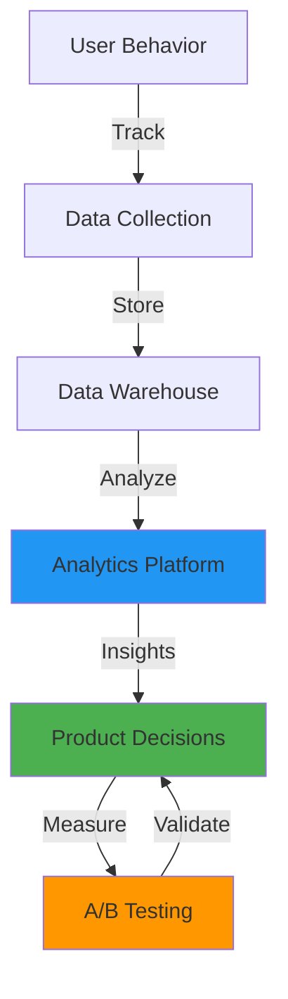
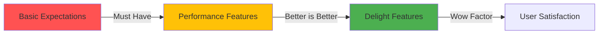
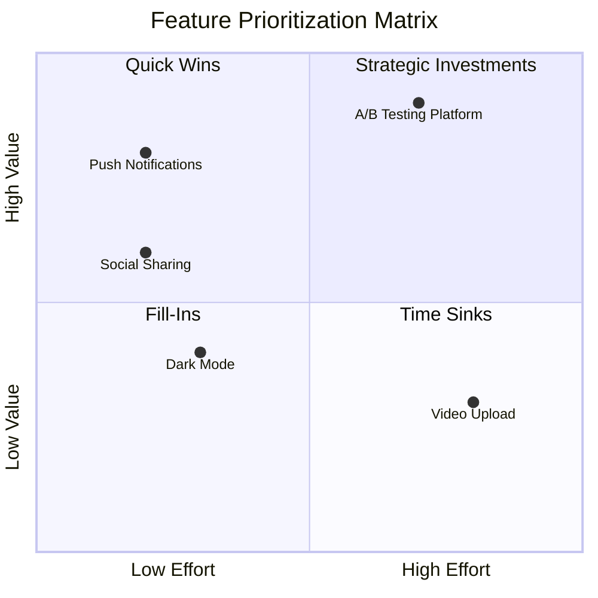
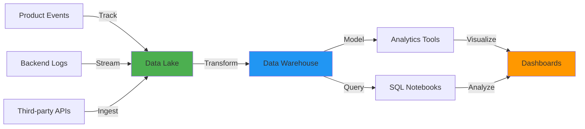

# Data-Driven Product Decisions: Analytics Framework for PMs

In today's competitive landscape, gut feelings no longer cut it. The best product managers combine intuition with data to make decisions that drive measurable impact. This guide provides a complete framework for data-driven product decision-making, with real-world examples from companies like Netflix, Spotify, and Amazon.

Whether you're a PM at a startup or an established company, you'll learn how to <strong>select the right metrics, design effective experiments, and build a data culture</strong> that accelerates product development.

## Why Data-Driven Product Management Matters

### The Cost of Guessing

Traditional product development often relies on:

1. <strong>HiPPO Decisions</strong>: Highest Paid Person's Opinion drives priorities
2. <strong>Feature Factories</strong>: Shipping features without measuring impact
3. <strong>Vanity Metrics</strong>: Tracking numbers that don't drive business value
4. <strong>Analysis Paralysis</strong>: Too much data, not enough insight

The result? <strong>70% of product features go unused</strong> and teams waste months building the wrong things.

### The Data-Driven Advantage

Companies that excel at data-driven product management see:

- <strong>3-5x faster iteration cycles</strong>: Fail fast, learn quickly
- <strong>40-60% higher feature adoption</strong>: Build what users actually need
- <strong>2-3x better retention rates</strong>: Focus on metrics that matter
- <strong>Reduced development waste</strong>: Validate before you build

## The Analytics Stack for Product Managers



### Essential Metrics by Product Type

Different products require different metrics. Here's a breakdown:

| Product Type | North Star Metric | Key Supporting Metrics |
|-------------|-------------------|------------------------|
| <strong>B2B SaaS</strong> | Weekly Active Users (WAU) | Activation Rate, Feature Adoption, NPS, Net Revenue Retention |
| <strong>Consumer App</strong> | Daily Active Users (DAU) | Session Length, D1/D7/D30 Retention, Viral Coefficient |
| <strong>Marketplace</strong> | Gross Merchandise Value (GMV) | Liquidity Ratio, Time to First Transaction, Repeat Purchase Rate |
| <strong>E-commerce</strong> | Revenue Per Visitor (RPV) | Conversion Rate, Average Order Value, Cart Abandonment Rate |
| <strong>Content Platform</strong> | Content Engagement Hours | Content Creation Rate, Creator Retention, Watch Time per Session |

## Framework #1: RICE Prioritization

RICE helps you prioritize features objectively by scoring four factors:

- <strong>Reach</strong>: How many users will this impact?
- <strong>Impact</strong>: How much will it improve their experience?
- <strong>Confidence</strong>: How certain are we about our estimates?
- <strong>Effort</strong>: How much work is required?

### RICE Formula

```
RICE Score = (Reach × Impact × Confidence) / Effort
```

### Real Example: Spotify Playlist Feature

Let's score three potential features for Spotify:

| Feature | Reach | Impact | Confidence | Effort | RICE Score |
|---------|-------|--------|------------|--------|------------|
| AI Playlist Generator | 50M users | 3 (High) | 80% | 6 months | 20.0 |
| Collaborative Playlists | 10M users | 2 (Medium) | 90% | 2 months | 9.0 |
| Playlist Export | 2M users | 1 (Low) | 100% | 1 month | 2.0 |

<strong>Result</strong>: AI Playlist Generator wins despite higher effort because of massive reach and impact.

### When to Use RICE

✅ <strong>Best for</strong>:
- Comparing features with similar goals
- Breaking ties between high-priority items
- Creating transparency in roadmap decisions

❌ <strong>Not ideal for</strong>:
- Strategic bets with uncertain outcomes
- Features requiring deep user research
- Technical debt or infrastructure work

## Framework #2: ICE Prioritization

ICE is a simpler, faster alternative to RICE:

- <strong>Impact</strong>: How much value will this create?
- <strong>Confidence</strong>: How certain are we?
- <strong>Ease</strong>: How easy is it to implement?

### ICE Formula

```
ICE Score = (Impact × Confidence × Ease) / 3
```

Score each factor from 1-10. Use ICE for rapid prioritization in sprint planning.

## Framework #3: Kano Model

The Kano Model categorizes features based on user satisfaction:



### Kano Categories

1. <strong>Basic Expectations</strong>: Must-haves (search, login, checkout)
   - If missing → Users leave immediately
   - If present → Neutral satisfaction

2. <strong>Performance Features</strong>: Linear satisfaction
   - Better performance → Higher satisfaction
   - Example: Page load speed, search relevance

3. <strong>Delight Features</strong>: Unexpected bonuses
   - Create wow moments
   - Example: Netflix auto-play next episode, Amazon 1-click ordering

### Amazon Example: Product Page Features

| Feature | Kano Category | Priority |
|---------|---------------|----------|
| Product images | Basic | P0 |
| Reviews & ratings | Performance | P0 |
| Fast shipping | Performance | P0 |
| Price comparison | Performance | P1 |
| AR try-before-buy | Delight | P2 |
| Gift wrapping | Delight | P3 |

## Framework #4: Value vs Effort Matrix

Visualize feature prioritization in a 2x2 matrix:



### Prioritization Strategy

1. <strong>Quick Wins</strong> (High Value, Low Effort): Ship immediately
2. <strong>Strategic Investments</strong> (High Value, High Effort): Plan carefully
3. <strong>Fill-Ins</strong> (Low Value, Low Effort): Nice to have
4. <strong>Time Sinks</strong> (Low Value, High Effort): Avoid

## Key Metrics Every PM Should Track

### 1. Activation Metrics

<strong>Definition</strong>: Percentage of users who experience core product value

```sql
-- Example: Calculate activation rate for a note-taking app
-- Activated users = Created 3+ notes within 7 days

SELECT
  DATE_TRUNC('week', signup_date) AS cohort_week,
  COUNT(DISTINCT user_id) AS total_signups,
  COUNT(DISTINCT CASE
    WHEN notes_created >= 3
    AND first_note_date <= signup_date + INTERVAL '7 days'
    THEN user_id
  END) AS activated_users,
  ROUND(100.0 * activated_users / total_signups, 2) AS activation_rate
FROM users
LEFT JOIN user_actions USING (user_id)
WHERE signup_date >= '2025-01-01'
GROUP BY cohort_week
ORDER BY cohort_week DESC;
```

<strong>Benchmarks</strong>:
- B2B SaaS: 30-40% activation in first week
- Consumer apps: 20-30% activation in first day
- Marketplaces: 10-15% complete first transaction

### 2. Retention Metrics

Track cohort retention to measure product stickiness:

```sql
-- Day 1, Day 7, Day 30 retention analysis

WITH cohorts AS (
  SELECT
    user_id,
    DATE(MIN(event_timestamp)) AS cohort_date
  FROM events
  WHERE event_name = 'app_open'
  GROUP BY user_id
),

retention AS (
  SELECT
    c.cohort_date,
    COUNT(DISTINCT c.user_id) AS cohort_size,
    COUNT(DISTINCT CASE
      WHEN DATE(e.event_timestamp) = c.cohort_date + INTERVAL '1 day'
      THEN e.user_id
    END) AS d1_retained,
    COUNT(DISTINCT CASE
      WHEN DATE(e.event_timestamp) = c.cohort_date + INTERVAL '7 days'
      THEN e.user_id
    END) AS d7_retained,
    COUNT(DISTINCT CASE
      WHEN DATE(e.event_timestamp) = c.cohort_date + INTERVAL '30 days'
      THEN e.user_id
    END) AS d30_retained
  FROM cohorts c
  LEFT JOIN events e ON c.user_id = e.user_id
  WHERE c.cohort_date >= '2025-01-01'
  GROUP BY c.cohort_date
)

SELECT
  cohort_date,
  cohort_size,
  ROUND(100.0 * d1_retained / cohort_size, 2) AS d1_retention_pct,
  ROUND(100.0 * d7_retained / cohort_size, 2) AS d7_retention_pct,
  ROUND(100.0 * d30_retained / cohort_size, 2) AS d30_retention_pct
FROM retention
ORDER BY cohort_date DESC;
```

<strong>Good retention benchmarks</strong>:
- D1: 40%+ (excellent), 20-30% (good)
- D7: 20%+ (excellent), 10-15% (good)
- D30: 10%+ (excellent), 5-8% (good)

### 3. Net Promoter Score (NPS)

<strong>Question</strong>: "On a scale of 0-10, how likely are you to recommend our product?"

```
NPS = % Promoters (9-10) - % Detractors (0-6)
```

<strong>Industry benchmarks</strong>:
- World-class: 70+
- Great: 50-70
- Good: 30-50
- Needs improvement: <30

### 4. Engagement Metrics

Track how actively users engage with your product:

```sql
-- Calculate DAU/MAU ratio (stickiness)

SELECT
  DATE_TRUNC('month', event_date) AS month,
  COUNT(DISTINCT CASE
    WHEN event_date = CURRENT_DATE
    THEN user_id
  END) AS dau,
  COUNT(DISTINCT user_id) AS mau,
  ROUND(100.0 * dau / NULLIF(mau, 0), 2) AS dau_mau_ratio
FROM daily_active_users
WHERE event_date >= DATE_TRUNC('month', CURRENT_DATE - INTERVAL '6 months')
GROUP BY month
ORDER BY month DESC;
```

<strong>DAU/MAU benchmarks</strong>:
- Social networks: 50-60%+
- Communication apps: 50-70%+
- Productivity tools: 20-30%
- E-commerce: 5-10%

## A/B Testing Best Practices

### Designing Valid Experiments

A proper A/B test requires:

1. <strong>Clear hypothesis</strong>: "Changing X will improve Y by Z%"
2. <strong>Success metrics</strong>: Primary and guardrail metrics
3. <strong>Sample size calculation</strong>: Ensure statistical power
4. <strong>Runtime estimation</strong>: Don't stop tests early

### Sample Size Calculator

```javascript
// Calculate required sample size for A/B test
function calculateSampleSize(
  baselineRate,     // Current conversion rate (e.g., 0.10 for 10%)
  minDetectableEffect, // Minimum effect to detect (e.g., 0.02 for 2pp lift)
  alpha = 0.05,     // Significance level (95% confidence)
  power = 0.80      // Statistical power (80% is standard)
) {
  const z_alpha = 1.96;  // Z-score for 95% confidence
  const z_beta = 0.84;   // Z-score for 80% power

  const p1 = baselineRate;
  const p2 = baselineRate + minDetectableEffect;
  const p_avg = (p1 + p2) / 2;

  const n = Math.ceil(
    2 * Math.pow(z_alpha + z_beta, 2) * p_avg * (1 - p_avg)
    / Math.pow(minDetectableEffect, 2)
  );

  return {
    sampleSizePerVariant: n,
    totalSampleSize: n * 2,
    estimatedDays: Math.ceil(n / dailyTraffic)
  };
}

// Example: Testing checkout flow optimization
const result = calculateSampleSize(
  0.10,    // 10% current conversion rate
  0.02,    // Want to detect 2pp improvement (12% new rate)
  0.05,    // 95% confidence
  0.80     // 80% power
);

console.log(`
Sample size needed per variant: ${result.sampleSizePerVariant}
Total sample size: ${result.totalSampleSize}
Estimated test duration: ${result.estimatedDays} days
`);
```

### Statistical Significance Check

```sql
-- Calculate statistical significance of A/B test
-- Using two-proportion z-test

WITH test_results AS (
  SELECT
    variant,
    COUNT(DISTINCT user_id) AS users,
    COUNT(DISTINCT CASE WHEN converted = TRUE THEN user_id END) AS conversions,
    COUNT(DISTINCT CASE WHEN converted = TRUE THEN user_id END)::FLOAT
      / NULLIF(COUNT(DISTINCT user_id), 0) AS conversion_rate
  FROM experiment_results
  WHERE experiment_id = 'checkout_v2'
  GROUP BY variant
),

pooled_stats AS (
  SELECT
    SUM(conversions)::FLOAT / SUM(users) AS pooled_rate,
    SUM(users) AS total_users
  FROM test_results
)

SELECT
  tr.variant,
  tr.users,
  tr.conversions,
  ROUND(100.0 * tr.conversion_rate, 2) AS conversion_rate_pct,
  -- Calculate z-score
  ROUND(
    (tr.conversion_rate - ps.pooled_rate) /
    SQRT(ps.pooled_rate * (1 - ps.pooled_rate) * (1.0/tr.users)),
    3
  ) AS z_score,
  -- Calculate p-value (approximate)
  CASE
    WHEN ABS(z_score) >= 1.96 THEN 'SIGNIFICANT (p < 0.05)'
    WHEN ABS(z_score) >= 1.645 THEN 'MARGINAL (p < 0.10)'
    ELSE 'NOT SIGNIFICANT (p >= 0.10)'
  END AS significance
FROM test_results tr
CROSS JOIN pooled_stats ps
ORDER BY tr.variant;
```

### Common A/B Testing Mistakes

❌ <strong>Stopping tests too early</strong>
- Solution: Calculate sample size upfront, commit to runtime

❌ <strong>Multiple testing without correction</strong>
- Solution: Use Bonferroni correction or focus on primary metric

❌ <strong>Ignoring seasonality</strong>
- Solution: Run tests for full business cycles (week, month)

❌ <strong>Not checking for sample ratio mismatch</strong>
- Solution: Verify 50/50 split is actually 50/50

❌ <strong>Shipping winners with small effect sizes</strong>
- Solution: Consider implementation cost vs. marginal gain

## Analytics Tools Comparison

| Tool | Best For | Pricing | Key Features |
|------|----------|---------|--------------|
| <strong>Amplitude</strong> | Product analytics, behavioral cohorts | Free tier, $995+/mo | Behavioral cohorts, retention analysis, user journeys |
| <strong>Mixpanel</strong> | Event tracking, funnel analysis | Free tier, $25+/mo | Real-time analytics, A/B testing, advanced funnels |
| <strong>Heap</strong> | Retroactive analysis, no code tracking | Custom pricing | Auto-capture all events, retroactive analysis |
| <strong>Google Analytics 4</strong> | Website analytics, acquisition tracking | Free, 360 is custom | Free tier, great for content sites, GA audience |
| <strong>PostHog</strong> | Open-source, self-hosted | Free self-hosted, $0.00045/event cloud | Session recording, feature flags, open source |
| <strong>Statsig</strong> | A/B testing, feature flags | Free tier, $200+/mo | Experimentation platform, warehouse-native |

### Tool Selection Framework

Choose based on your needs:

1. <strong>Early-stage startup</strong>: Mixpanel or PostHog (generous free tiers)
2. <strong>Product-led growth</strong>: Amplitude or Heap (deep user behavior)
3. <strong>Content/marketing focus</strong>: Google Analytics 4 (SEO, acquisition)
4. <strong>Experimentation-heavy</strong>: Statsig or Optimizely (built for testing)
5. <strong>Privacy-focused</strong>: PostHog self-hosted or Plausible

## Real-World Case Studies

### Netflix: Data-Driven Content Personalization

<strong>Challenge</strong>: With 10,000+ titles, how do we help users find what to watch?

<strong>Approach</strong>:
- <strong>Metric</strong>: Hours watched per user (not just sign-ups)
- <strong>Hypothesis</strong>: Better recommendations → more engagement → lower churn
- <strong>Method</strong>: A/B test every algorithm change with 1-5% of users

<strong>Results</strong>:
- 80%+ of watched content comes from recommendations
- Saved $1B+ annually in retention by reducing churn
- Personalized thumbnails increased engagement by 30%

<strong>Key Insight</strong>: Focus on usage metrics, not vanity metrics. Netflix doesn't optimize for "titles in catalog" but for "hours engaged."

### Spotify: Discover Weekly Success

<strong>Challenge</strong>: How do we introduce users to new music they'll love?

<strong>Approach</strong>:
- <strong>Metric</strong>: Percentage of Discover Weekly songs saved or added to playlists
- <strong>Hypothesis</strong>: Personalized discovery → more listening hours → premium conversions
- <strong>Method</strong>: ML model trained on 200+ million listening sessions

<strong>Results</strong>:
- 40+ million users engage with Discover Weekly
- 5+ billion tracks discovered through the feature
- Became #1 driver of premium subscriptions

<strong>Key Insight</strong>: Build features that create habit loops. Discover Weekly arrives every Monday, creating anticipation and routine.

### Airbnb: One Metric That Matters

<strong>Challenge</strong>: Too many metrics, team losing focus

<strong>Approach</strong>:
- <strong>Metric</strong>: Number of nights booked (not just listings or users)
- <strong>Hypothesis</strong>: Focusing entire company on one metric → aligned efforts → faster growth
- <strong>Method</strong>: Every team must show how their work impacts nights booked

<strong>Results</strong>:
- Grew from 10M nights booked (2012) to 300M+ (2019)
- Teams stopped building vanity features
- Product development velocity increased 40%

<strong>Key Insight</strong>: One North Star metric aligns the organization. Secondary metrics exist, but one rules them all.

### Amazon: Continuous Experimentation Culture

<strong>Challenge</strong>: How do we innovate at scale across thousands of teams?

<strong>Approach</strong>:
- <strong>Metric</strong>: Revenue Per Visitor (RPV) as North Star
- <strong>Hypothesis</strong>: More experiments → more learning → better products
- <strong>Method</strong>: Run thousands of A/B tests simultaneously

<strong>Results</strong>:
- Runs 10,000+ A/B tests per year
- 1-Click ordering increased conversions by 240%
- Prime delivery promise reduced cart abandonment by 30%

<strong>Key Insight</strong>: Build experimentation infrastructure early. Amazon can test ideas in hours, not weeks.

## Building a Data-Driven Culture

### 1. Data Literacy Training

Invest in team education:

- <strong>Analytics 101</strong>: SQL basics, metrics definitions
- <strong>Statistical Thinking</strong>: P-values, confidence intervals, correlation vs causation
- <strong>Tool Training</strong>: Hands-on with Amplitude, Mixpanel, etc.
- <strong>A/B Testing Workshop</strong>: Design, run, analyze experiments

### 2. Data Infrastructure

Build the right foundation:



<strong>Key components</strong>:
- <strong>Event tracking</strong>: Segment, Rudderstack, or custom
- <strong>Data warehouse</strong>: Snowflake, BigQuery, or Redshift
- <strong>Transformation layer</strong>: dbt for data modeling
- <strong>Analytics tools</strong>: Amplitude, Looker, Tableau

### 3. Collaboration Rituals

Establish regular data reviews:

| Ritual | Frequency | Attendees | Agenda |
|--------|-----------|-----------|--------|
| <strong>Metrics Review</strong> | Weekly | PM, Eng, Design | Review North Star metric, key drivers, anomalies |
| <strong>Experiment Readout</strong> | Bi-weekly | Cross-functional | Share A/B test results, learnings, next steps |
| <strong>User Research Sync</strong> | Monthly | PM, Research, Design | Combine qual + quant insights |
| <strong>Data Quality Review</strong> | Monthly | PM, Eng, Analytics | Check tracking accuracy, fix issues |

### 4. Decision-Making Framework

Use this template for data-informed decisions:

```markdown
## Decision: [Title]

### Context
- What problem are we solving?
- Who is impacted?

### Data Analysis
- Current state metrics
- User research findings
- Competitive analysis

### Options Considered
1. Option A: [Description]
   - Pros: ...
   - Cons: ...
   - RICE Score: ...

2. Option B: [Description]
   - Pros: ...
   - Cons: ...
   - RICE Score: ...

### Recommendation
- Chosen option: [X]
- Rationale: [Based on data]
- Success metrics: [How we'll measure]

### Risks & Mitigation
- Risk 1: [Description] → Mitigation: [Plan]
- Risk 2: [Description] → Mitigation: [Plan]
```

## Common Pitfalls to Avoid

### 1. Correlation vs. Causation

<strong>Example pitfall</strong>: "Users who upgrade to premium have 50% higher engagement, so let's push everyone to upgrade!"

<strong>Problem</strong>: Engaged users naturally upgrade. Forcing upgrades won't increase engagement.

<strong>Solution</strong>: Run controlled experiments. Only A/B tests prove causation.

### 2. Vanity Metrics

<strong>Avoid tracking</strong>:
- ❌ Total users (includes inactive)
- ❌ Page views (doesn't measure value)
- ❌ Downloads (doesn't mean usage)
- ❌ Social media followers (weak proxy for customers)

<strong>Focus on</strong>:
- ✅ Active users (DAU, WAU, MAU)
- ✅ Engagement rate (time spent, features used)
- ✅ Retention (users returning)
- ✅ Revenue or conversion rate

### 3. Analysis Paralysis

<strong>Symptoms</strong>:
- Every decision requires 3+ weeks of analysis
- Teams build dashboards instead of products
- "We need more data" delays action indefinitely

<strong>Solution</strong>:
- Set analysis time boxes (e.g., 3-5 days max)
- Use 80/20 rule: 80% certainty with 20% effort
- Ship MVPs to learn faster than analyzing

### 4. Ignoring Qualitative Data

<strong>Problem</strong>: Numbers tell you what, not why.

<strong>Solution</strong>: Combine quantitative + qualitative

| Quantitative | Qualitative |
|-------------|-------------|
| What users do | Why they do it |
| Conversion rate dropped 15% | Users confused by new checkout flow |
| D7 retention is 12% | New users don't understand core value |
| Feature adoption is 5% | Feature is hard to discover |

<strong>Best practices</strong>:
- Run user interviews for every major feature
- Watch session recordings to see real behavior
- Read support tickets to understand pain points
- Survey users about satisfaction and needs

## Actionable Steps for PMs

### Week 1: Audit Your Current State

- [ ] List all metrics you currently track
- [ ] Identify your North Star metric (if you don't have one)
- [ ] Review last 5 product decisions: Were they data-informed?
- [ ] Check data quality: Are events tracking correctly?

### Week 2: Set Up Core Metrics

- [ ] Define activation, engagement, retention for your product
- [ ] Create a dashboard with key metrics
- [ ] Set up automated weekly metric reports
- [ ] Establish baseline numbers for benchmarking

### Week 3: Improve Team Skills

- [ ] Schedule SQL workshop for PMs
- [ ] Share this guide with your team
- [ ] Define experimentation standards
- [ ] Create a metrics glossary

### Week 4: Run Your First Experiment

- [ ] Pick a high-impact hypothesis to test
- [ ] Calculate required sample size
- [ ] Set up A/B test in your tool
- [ ] Define success criteria upfront
- [ ] Share results with the team

### Ongoing: Build the Culture

- [ ] Make data accessible to everyone
- [ ] Share experiment results publicly
- [ ] Celebrate learning, not just wins
- [ ] Question decisions without data backing

## Recommended Resources

### Books

- <strong>Lean Analytics</strong> by Alistair Croll & Benjamin Yoskovitz
- <strong>Trustworthy Online Controlled Experiments</strong> by Ron Kohavi et al.
- <strong>The Lean Startup</strong> by Eric Ries
- <strong>Measure What Matters</strong> by John Doerr

### Online Courses

- [A/B Testing by Google (Udacity)](https://www.udacity.com/course/ab-testing--ud257)
- [Product Analytics by Reforge](https://www.reforge.com/courses/product-analytics)
- [SQL for Data Analysis (Mode)](https://mode.com/sql-tutorial/)

### Tools & Platforms

- [Amplitude Academy](https://academy.amplitude.com/) - Free product analytics courses
- [GrowthBook](https://www.growthbook.io/) - Open-source A/B testing platform
- [PostHog](https://posthog.com/) - Open-source product analytics

### Communities

- [Lenny's Newsletter](https://www.lennysnewsletter.com/) - PM best practices
- [r/ProductManagement](https://www.reddit.com/r/ProductManagement/) - PM community
- [Product School](https://productschool.com/) - PM education and events

## Conclusion: From Data to Decisions

The best product managers don't choose between intuition and data—they combine both. Data provides the compass, but human judgment steers the ship.

Remember:

1. <strong>Start with the "why"</strong>: Define clear goals before collecting data
2. <strong>Focus on actionable metrics</strong>: Ignore vanity metrics
3. <strong>Experiment constantly</strong>: A/B test your assumptions
4. <strong>Build for learning</strong>: Small bets, fast feedback, rapid iteration
5. <strong>Make data accessible</strong>: Democratize insights across your team

Data-driven product management isn't about having perfect information. It's about making progressively better decisions as you learn more about your users, your product, and your market.

Start small. Pick one metric to improve this quarter. Design one experiment to run this month. Build one dashboard for your team. The compounding effects of better decision-making will transform your product over time.

Now go turn data into impact.

---

<strong>Questions? Discussion?</strong>

I'd love to hear how you're implementing data-driven practices at your company. What frameworks work for you? What challenges have you faced? Share your experiences in the comments below.

If you found this guide helpful, consider sharing it with fellow PMs who could benefit from a structured approach to analytics and experimentation.
